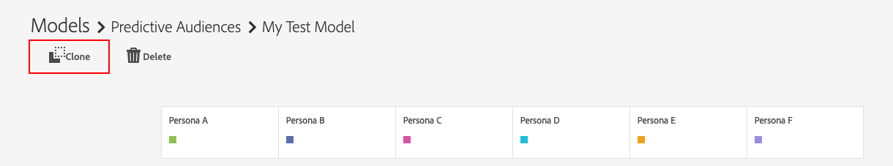

# Predictive Audiences 시작 {#predictive-audiences-getting-started}

>[!IMPORTANT]
>이 문서에는 이 기능의 설정 및 사용을 안내하는 제품 설명서가 포함되어 있습니다. 여기에 들어 있는 어떠한 것도 법적 권고사항이다. 법률 자문을 위해 법률 자문을 구할 수 있습니다.

## 예측 대상 모델 {#create-predictive-audiences} 만들기

[!UICONTROL Predictive Audiences] 모델을 만들기 전에 [!UICONTROL Predictive Audiences] 트레이트와 세그먼트를 할당할 자사 데이터 소스를 결정해야 합니다. 기존 자사 데이터 소스를 사용하거나 새 데이터 소스를 만들 수 있습니다. 새 퍼스트 파티 데이터 소스를 만드는 방법에 대한 자세한 내용은 [데이터 소스 관리](https://docs.adobe.com/content/help/en/audience-manager/user-guide/features/data-sources/manage-datasources.html)를 참조하십시오.

사용할 데이터 소스를 알게 되면 아래 단계를 따르십시오.

1. **[!UICONTROL Audience Data]** > **[!UICONTROL Models]**&#x200B;로 이동합니다.
1. [!UICONTROL Predictive Audiences] 섹션에서 **[!UICONTROL Add New]**&#x200B;을 클릭합니다.

   

1. 그런 다음 대상을 분류할 개인성을 정의합니다. 이를 위해서는 트레이트 또는 세그먼트를 선택하여 개인화를 만들 수 있습니다. 트레이트와 세그먼트 카탈로그 간을 전환하려면 화면의 왼쪽 위 모서리에 있는 [!UICONTROL Traits] 및 [!UICONTROL Segments] 탭을 사용하십시오. 개인으로 사용할 트레이트 또는 세그먼트를 식별했으면 [!UICONTROL Action] 열에서 해당 **[!UICONTROL Add]** 아이콘을 클릭합니다.
   
   >[!NOTE]
   >기준선 성향에 대해 최소한 두 개의 특성이나 두 개의 세그먼트를 선택해야 합니다. 트레이트와 세그먼트 조합을 사용할 수 없습니다.
1. 페르소나를 정의한 후 **[!UICONTROL Next]**&#x200B;을 클릭합니다.
1. 그런 다음 이 대상에 대한 자사 특성 또는 세그먼트를 선택하여 분류할 자사 대상자를 선택합니다. 화면의 왼쪽 위 모서리에 있는 [!UICONTROL Traits] 및 [!UICONTROL Segments] 탭을 사용하여 트레이트와 세그먼트 카탈로그 간을 전환합니다. 대상으로 사용할 자사 특성 또는 세그먼트를 선택하여 모델에 추가합니다.
   
1. 대상자를 선택한 후 **[!UICONTROL Next]**&#x200B;을 클릭합니다.
1. 모델 세부 사항을 입력합니다.
   * **[!UICONTROL Model Name]**:나중에 식별할 수 있도록 모델에 대해 설명형 이름을 입력합니다. 모델에서 생성된 세그먼트의 이름은 모델 이름으로 시작됩니다.
   * **[!UICONTROL Description]**:사용 사례를 식별하는 데 도움이 되는 모델의 설명을 입력합니다.
   * **[!UICONTROL Data Source]**:이 모델의  [!UICONTROL Predictive Audiences] 세그먼트를 할당할 퍼스트 파티 데이터 소스를 선택합니다.
   * **[!UICONTROL Profile Merge Rule]**:이 모델 [!UICONTROL Profile Merge Rule] 에 의해  [!UICONTROL segments] 생성된 모든 예측에 대해 지정할 항목을 선택합니다. 선택한 대상 대상이 [!UICONTROL segment]인 경우 대상 대상의 동일한 [!UICONTROL Profile Merge Rule]을 선택하는 것이 좋습니다.
      
1. 클릭 **[!UICONTROL Save]**.

## 예측 대상 모델 복제 및 편집 {#clone-predictive-audiences}

Audience Manager은 기존 [!UICONTROL Predictive Audiences] 모델 편집을 지원하지 않습니다. 모델의 구성을 변경하려면 기존 모델의 클론을 생성하고 편집할 수 있습니다. 이를 위한 방법:

1. **[!UICONTROL Audience Data]** > **[!UICONTROL Models]**&#x200B;로 이동합니다.
2. 복제할 [!UICONTROL Predictive Audiences] 모델의 이름을 클릭합니다.
3. 화면의 왼쪽 위에 있는 **[!UICONTROL Clone]** 단추를 클릭합니다.
   
4. 모델을 복제하면 복제된 모델의 [!DNL Save & Configure] 페이지로 이동합니다. 이 페이지에서 모델의 [!UICONTROL data source] 및 할당된[!UICONTROL Profile Merge Rule]을 변경할 수 있습니다. 복제된 모델의 개인 및 대상 대상을 편집하려면 [!UICONTROL Back] 및 [!UICONTROL Next] 단추를 사용하여 세 개의 탭 사이를 이동하거나 세 개의 탭 이름을 클릭합니다

   

5. 모델 편집이 끝나면 **[!UICONTROL Save]**&#x200B;을 클릭합니다.

## 예측 대상 삭제 {#delete-predictive-audiences}

[!UICONTROL Predictive Audiences] 모델을 삭제하려면 **[!UICONTROL Audience Data]** > **[!UICONTROL Models]**&#x200B;로 이동하여 삭제할 모델을 찾은 다음 **[!UICONTROL Delete]** 아이콘을 클릭합니다.
