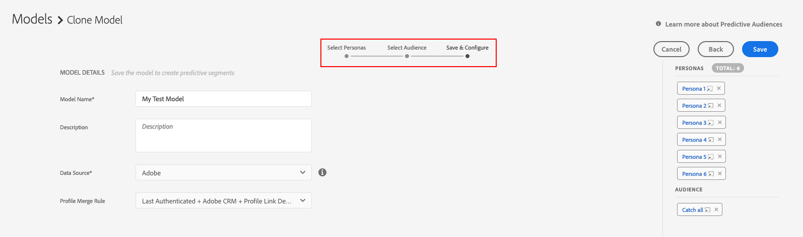

# Predictive Audiences 시작 {#predictive-audiences-getting-started}

>[!IMPORTANT]
>이 문서에는 이 기능의 설정 및 사용 방법을 안내하는 제품 설명서가 포함되어 있습니다. 여기에는 법률적인 조언이 들어 있지 않습니다. 법률 지도가 필요한 경우 법률 자문을 구하십시오.

## 예측 대상 모델 만들기 {#create-predictive-audiences}

만들기 전에 [!UICONTROL Predictive Audiences] 모델 을 만드는 동안 할당할 자사 데이터 소스를 [!UICONTROL Predictive Audiences] 트레이트 및 세그먼트 기존 자사 데이터 소스를 사용하거나 새 데이터 소스를 만들 수 있습니다. 다음을 참조하십시오 [데이터 소스 관리](https://experienceleague.adobe.com/docs/audience-manager/user-guide/features/data-sources/manage-datasources.html) 새 자사 데이터 소스를 만드는 방법에 대한 자세한 내용.

사용할 데이터 소스를 알게 되면 아래 단계를 수행합니다.

1. 다음으로 이동 **[!UICONTROL Audience Data]** > **[!UICONTROL Models]**.
1. 다음에서 [!UICONTROL Predictive Audiences] 섹션, 클릭 **[!UICONTROL Add New]**.

   

1. 다음으로 대상자를 분류할 가상 사용자를 정의합니다. 이렇게 하려면 트레이트 또는 세그먼트를 선택하여 가상 사용자를 빌드할 수 있습니다. 사용 [!UICONTROL Traits] 및 [!UICONTROL Segments] 트레이트 및 세그먼트 카탈로그 간을 전환하려면 화면 왼쪽 상단 모서리에 있는 탭을 탭으로 전환하십시오. 성향으로 사용할 트레이트나 세그먼트를 식별했으면 해당하는 을 클릭합니다 **[!UICONTROL Add]** 아이콘 [!UICONTROL Action] 열.
   
   >[!NOTE]
   >기준선 성향에 대해 최소한 두 개의 트레이트 또는 두 개의 세그먼트를 선택해야 합니다. 트레이트와 세그먼트를 모두 함께 사용할 수는 없습니다.
1. 클릭 **[!UICONTROL Next]** 성향을 정의한 후에.
1. 그런 다음 이 대상에 대한 자사 트레이트 또는 세그먼트를 선택하여 분류할 자사 대상을 선택합니다. 사용 [!UICONTROL Traits] 및 [!UICONTROL Segments] 트레이트 및 세그먼트 카탈로그 간을 전환하려면 화면 왼쪽 상단 모서리에 있는 탭을 탭으로 전환하십시오. 대상자로 사용할 자사 트레이트 또는 세그먼트를 선택하여 모델에 추가합니다.
   
1. 클릭 **[!UICONTROL Next]** 대상을 선택한 후.
1. 모델 세부 사항을 입력합니다.
   * **[!UICONTROL Model Name]**: 나중에 식별하는 데 도움이 되도록 모델의 수사적 이름을 입력합니다. 모델에서 생성된 세그먼트의 이름은 모델 이름으로 시작됩니다.
   * **[!UICONTROL Description]**: 사용 사례를 식별하는 데 도움이 되는 모델의 설명을 입력합니다.
   * **[!UICONTROL Data Source]**: 원하는 자사 데이터 소스 선택 [!UICONTROL Predictive Audiences] 할당할 이 모델의 세그먼트.
   * **[!UICONTROL Profile Merge Rule]**: 다음을 선택합니다. [!UICONTROL Profile Merge Rule] 모든 예측에 할당됨 [!UICONTROL segments] 이 모델에서 생성되었습니다. 선택한 타겟 대상이 [!UICONTROL segment], 동일한 을 선택하는 것이 좋습니다 [!UICONTROL Profile Merge Rule] 타겟 대상자
      
1. 클릭 **[!UICONTROL Save]**.

## 예측 대상 모델 복제 및 편집 {#clone-predictive-audiences}

Audience Manager이 기존 편집을 지원하지 않음 [!UICONTROL Predictive Audiences] 모델. 모델의 구성을 변경하려면 기존 모델의 클론을 생성하여 편집할 수 있습니다. 이 작업을 수행하는 방법은 다음과 같습니다.

1. 다음으로 이동 **[!UICONTROL Audience Data]** > **[!UICONTROL Models]**.
2. 이름 클릭 [!UICONTROL Predictive Audiences] 복제할 모델입니다.
3. 다음을 클릭합니다. **[!UICONTROL Clone]** 화면의 왼쪽 상단에 있는 단추.
   
4. 모델을 복제하면 [!DNL Save & Configure] 복제된 모델의 페이지. 이 페이지에서 [!UICONTROL data source] 및 할당됨[!UICONTROL Profile Merge Rule] 모델. 복제된 모델의 가상 사용자 및 대상 사용자를 편집하려면 다음을 사용합니다. [!UICONTROL Back] 및 [!UICONTROL Next] 세 개의 탭 사이를 이동하거나 세 개의 탭 이름을 클릭하는 단추

   

5. 모델 편집이 끝나면 **[!UICONTROL Save]**.

## 예측 대상 삭제 {#delete-predictive-audiences}

삭제 방법 [!UICONTROL Predictive Audiences] 모델, 이동 **[!UICONTROL Audience Data]** > **[!UICONTROL Models]**&#x200B;을 클릭하고 삭제할 모델을 찾은 다음 **[!UICONTROL Delete]** 아이콘.
