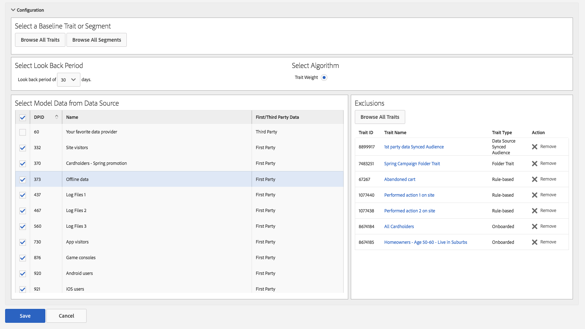

# 유사 모델링: 트레이트 제외 {#algorithmic-models-trait-exclusion}

[!UICONTROL Trait Exclusion]은(는) 모델링 워크플로에서 추가 제어 기능을 제공하므로, 도메인 전문 지식 및 규제 요구 사항에 따라 모델에 필요한 보호 레일을 추가할 수 있습니다. 하나 이상의 데이터 원본에서 모델을 만들 때 무시할 특성을 선택하려면 [!UICONTROL Exclusions] 옵션을 사용하십시오.

## 사용 사례 {#use-cases}

[!UICONTROL Trait Exclusion]에서 해결할 수 있는 사용 사례는 다음과 같습니다.

* [!UICONTROL Trait Exclusion]을(를) 사용하면 사이트 방문자 트레이트와 같은 특정 다목적 트레이트를 제외할 수 있으므로 모델을 왜곡하지 않으므로 결과가 평평해집니다.
* 영향력 있는 트레이트를 더 잘 이해하려면 데이터 소스에서 알 수 없거나 신뢰할 수 없는 트레이트를 제거할 수 있습니다.
* 준수 의무를 준수하도록 지원하기 위해 인구 통계학적 트레이트와 같은 특정 트레이트를 제외할 수 있습니다.

>[!IMPORTANT]
>
>세 번째 사용 사례에 대한 중요한 참고 사항. *모델을 만든 후 타사 데이터 공급자가 데이터 피드*&#x200B;에 새 인구 통계학적 특성을 추가하는 경우 모델이 특성을 자동으로 선택합니다. 모델을 생성한 후에는 모델링에서 트레이트를 제외할 수 없습니다. [중요한 측면 및 제한 사항](../../features/algorithmic-models/trait-exclusion-algo-models.md#important-aspects-and-limitations)을 참조하세요. 이 기능을 사용할 때는 주의하고 데이터 공급자와 협력하여 피드 구조의 변경 사항에 대해 알려 주십시오.

## 트레이트 제외 사용 방법 {#how-to-use}

[모델 빌드](../../features/algorithmic-models/create-model.md#build-model) 워크플로우를 사용하여 새 알고리즘 모델을 빌드합니다.

1. 모델링할 데이터 원본을 하나 이상 선택할 때까지 [!UICONTROL Exclusions] 선택 항목이 회색으로 표시됩니다.
2. 모델링할 데이터 원본을 하나 이상 선택한 후 **[!UICONTROL Browse All Traits]**&#x200B;을(를) 누릅니다.
3. **[!UICONTROL Select Traits to Exclude]** 창에서는 이전에 선택한 데이터 원본과 관련된 모든 특성을 볼 수 있습니다. 제외할 트레이트를 선택합니다.
4. 트레이트 유형, 트레이트 채우기 유형([장치 ID](../../reference/ids-in-aam.md) 및 [교차 장치 ID](../../reference/ids-in-aam.md))별로 트레이트를 필터링하거나 트레이트 폴더를 검색할 수 있습니다. 트레이트 폴더에는 선택한 데이터 소스와 연관된 트레이트만 표시됩니다.
5. **[!UICONTROL Exclude Selected Traits]**&#x200B;을 누릅니다.

>[!TIP]
>
>폴더의 특성을 하나씩 제외하는 대신 폴더 특성을 제외하여 전체 폴더를 제외할 수 있습니다. 예를 들어 트레이트가 20개인 폴더의 경우 모든 트레이트를 하나씩 제외하는 대신 폴더 트레이트를 제외하기만 하면 됩니다.

비디오 튜토리얼을 선호하는 경우 트레이트 제외에 대한 비디오 데모를 시청하십시오.

>[!VIDEO](https://video.tv.adobe.com/v/34823/?quality=12&captions=kor)

또한 장치 간 지표가 작동하는 방식에 대한 자세한 내용은 아래 비디오를 시청하십시오.

>[!VIDEO](https://video.tv.adobe.com/v/36875/?quality=12&captions=kor)

## 중요한 측면 및 제한 사항 {#important-aspects-and-limitations}

[!UICONTROL Trait Exclusion]과(와) 관련된 다음 측면 및 제한 사항에 유의하십시오.

<table id="table_BA5C3545BC9E4717BD567B00C803AA53"> 
 <thead> 
  <tr> 
   <th colname="col1" class="entry"> 항목 </th> 
   <th colname="col2" class="entry"> 설명 </th>
  </tr> 
 </thead>
 <tbody> 
  <tr> 
   <td colname="col1"> 
모델 요약 보기에서 제외된 트레이트 
 </td>
   <td colname="col2"> 
모델 요약 보기에 제외된 특성이 <i>표시되지 않습니다</i>. <b> 모델 편집</b> 워크플로우에서만 제외된 특성을 볼 수 있습니다. 
 </td>
  </tr> 
  <tr> 
   <td colname="col1"> 
RBAC(역할 기반 액세스 제어) 
 </td>
   <td colname="col2"> 
<a href="../../features/administration/administration-overview.md#administration"> RBAC</a>을(를) 사용하는 회사에 대한 다음 제한 사항을 참고하십시오. 
 

     <ul id="ul_38A4056C235B428C822EA4A353893786"> 
      <li id="li_2624FB35581F4807B8530910D63FFDBF">특성을 볼 수 있는 액세스 권한이 없는 경우 모델에서 제외할 특성을 <i>선택할 수 없습니다</i>. </li>
      <li id="li_3FD7A12AAAA8462EA84A760C05F20379">특성을 볼 수 있는 액세스 권한이 없는 경우 제외된 특성 목록에서 해당 특성을 <i>볼 수 없습니다</i>. </li>
     </ul> 
 </td>
  </tr> 
  <tr> 
   <td colname="col1"> 
모델을 저장한 후 제외된 트레이트 수정 
 </td>
   <td colname="col2"> 
모델을 생성하고 저장한 후에는 제외된 특성을 수정할 수 없습니다. 결과를 조정하려면 모델을 복제하고 제외된 트레이트를 변경할 수 있습니다. 
 </td>
  </tr> 
  <tr> 
   <td colname="col1"> 
제외할 수 있는 최대 트레이트 수 
 </td>
   <td colname="col2"> 
모델에서 제외할 수 있는 최대 트레이트 수는 500개입니다. 폴더 트레이트를 사용하여 제외를 극대화합니다. 
 </td>
  </tr> 
  <tr> 
   <td colname="col1"> 
기준선 트레이트 제외 
 </td>
   <td colname="col2"> 
기준선 트레이트는 기본적으로 제외되므로 모델을 만들 때 <b> 제외</b> 목록에 표시되지 않습니다. 
 </td>
  </tr>
 </tbody>
</table>

[!UICONTROL Look-Alike Model]에서 특정 특성을 제외하는 방법 및 이유를 알아보려면 아래 비디오를 시청하십시오.

>[!VIDEO](https://video.tv.adobe.com/v/34823?captions=kor)

## 관련 링크

* [알고리즘 트레이트 정보](/help/using/features/algorithmic-models/understanding-models.md)
* [트레이트 제외 - 자습서](https://helpx.adobe.com/audience-manager/kt/using/excluding-traits-look-alike-model-feature-video-use.html)
