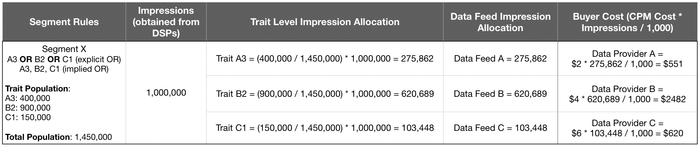

# 데이터 피드 구매자에 대한 청구 {#billing-for-data-feed-buyers}

Audience Marketplace 데이터 구매자는 천 광고 노출([!DNL CPM]) 기준으로 가격이 책정된 데이터 피드에 포함된 특성을 사용하여 제공되는 모든 광고 노출 횟수를 보고하는 데 동의합니다. [!DNL CPM] 사용량은 각 달력의 5일에 만료되며 이전 달에 대한 데이터를 포함합니다. 정액 요금 가입자는 사용을 보고할 필요가 없습니다.

  

## CPM 사용을 보고하는 방법 {#report-cpm-usage}

<!-- t_marketplace_report_cpm_usage.xml -->

[!UICONTROL Audience Marketplace] 데이터 구매자는 천 개의 광고 노출 횟수([!DNL CPM]) 기준으로 가격이 책정된 데이터 피드에 포함된 특성을 사용하여 제공되는 모든 광고 노출 횟수를 보고하는 데 동의합니다. [!DNL CPM] 사용량은 각 달력의 5일에 만료되며 이전 달에 대한 데이터를 포함합니다. 정액 요금 가입자는 사용을 보고할 필요가 없습니다.

[!UICONTROL Audience Marketplace] 두 가지 방법으로  [!DNL CPM] 사용량을 보고합니다.

* **세그먼트 수준 보고**:권장되는  [!DNL CPM] 사용 보고 방법입니다. 세그먼트 수준에서 [!DNL CPM] 사용을 보고할 때 데이터 피드 수준 보고 섹션은 [CPM 데이터 피드에 대한 비용 속성](#cost-attribution)에 설명된 알고리즘을 기반으로 해당 사용량 섹션으로 자동 채워집니다.
* **데이터 피드 수준 보고**:이 방법을 사용하려면 CPM 데이터 피드에 대한  [!DNL CPM] 비용 속성에 설명된 알고리즘에 따라 각 데이터 피드의  [사용을 개별적으로 보고해야 ](#cost-attribution)합니다. 하지만 이 방법은 세그먼트 수준 보고보다 더 지루하고 오류가 발생하기 쉽습니다.

  

## 세그먼트 수준 {#segment-level-report}의 CPM 사용량 보고

[!UICONTROL Segment Usage] 탭에서는 세그먼트 수준 사용을 보고할 수 있으며, 이 탭에서는 매핑된 대상으로 그룹화된 세그먼트를 표시할 수 있습니다.

세그먼트 수준에서 [!DNL CPM] 사용을 보고한 후 [!UICONTROL Audience Marketplace]은 CPM 데이터 피드](#cost-attribution)에 대한 비용 속성을 기준으로 해당 데이터 피드에 올바른 사용을 자동으로 할당합니다.[

세그먼트 수준에서 [!DNL CPM] 사용을 보고하려면:

1. **[!UICONTROL Audience Marketplace > Payables]**&#x200B;으로 이동합니다.
1. **[!UICONTROL Segment Usage]** 탭을 선택합니다.
1. 세그먼트의 사용 방법을 입력합니다. 일부 세그먼트의 사용량만 보고해야 하는 경우 [!UICONTROL Search] 상자를 사용하여 세그먼트를 필터링할 수 있습니다.
1. 클릭 **[!UICONTROL Edit Segments Usage]**.
1. [!UICONTROL Usage] 열에 [!DNL CPM] 사용 금액을 입력합니다.
1. 완료되면 **[!UICONTROL Save]**&#x200B;을 클릭하고 확인 대화 상자를 확인합니다.

   

1. 클릭 **[!UICONTROL Confirm]**.

세그먼트 수준 사용을 보고하는 방법에 대한 비디오 데모도 참조하십시오.

>[!VIDEO](https://video.tv.adobe.com/v/25522/)

 

## 데이터 피드 수준에서 CPM 사용량 보고서 {#feed-level-report}

데이터 피드 수준 보고는 각 데이터 피드에 대해 [!DNL CPM] 사용을 개별적으로 계산해야 하므로 보다 지루하고 오류가 발생하기 쉽습니다. 대신 [세그먼트 수준에서 CPM 사용 보고](#segment-level-report)를 하는 것이 좋습니다.

세그먼트 수준에서 [!DNL CPM] 사용을 보고하려면:

1. **[!UICONTROL Audience Marketplace > Payables]**&#x200B;으로 이동합니다.
2. **[!UICONTROL Feed Usage]** 탭을 선택합니다.
3. [!UICONTROL Search] 상자를 사용하여 데이터 피드를 필터링하고 사용량을 보고해야 하는 피드를 식별합니다.
4. 클릭 **[!UICONTROL Edit Feeds Usage]**.
5. [CPM 데이터 피드](#cost-attribution)에 대한 비용 속성을 기반으로 각 데이터 피드에 대한 [!DNL CPM] 사용을 계산한 다음 [!UICONTROL Usage] 열에 입력합니다.
6. 완료되면 **[!UICONTROL Save]**&#x200B;을 클릭하고 확인 대화 상자를 확인합니다.

   

7. 클릭 **[!UICONTROL Confirm]**.

  

## 벌크 보고

[!DNL CPM] 사용을 보고하는 동안 오류 및 오버헤드를 줄이려면 벌크 보고 옵션을 사용하여 데이터 피드 및 세그먼트가 포함된 [!DNL CSV] 파일을 다운로드하고 사용량을 채운 후 다시 [!DNL Audience Manager]에 업로드할 수 있습니다. 벌크 보고를 사용하여 피드 및 세그먼트 사용을 모두 보고할 수 있습니다.

[!DNL CPM] 사용량을 일괄 업데이트하려면:

1. **[!UICONTROL Audience Marketplace > Payables]**&#x200B;으로 이동합니다.
1. 업데이트할 보고 유형에 따라 **[!UICONTROL Feed Usage]** 또는 **[!UICONTROL Segment Usage]** 탭을 선택합니다.
1. **[!UICONTROL Edit Feeds Usage]** 또는 **[!UICONTROL Edit Segments Usage]**&#x200B;을 클릭합니다.
1. **[!UICONTROL download the current usage]**&#x200B;을 클릭하여 유효한 CSV 파일을 사용하십시오.
1. 컴퓨터에서 파일을 열고 사용 보고서를 채웁니다.
1. **[!UICONTROL Choose a CSV file]**&#x200B;을 클릭하여 업데이트된 사용 보고서를 업로드합니다.

   

1. [!DNL Audience Manager] 파일을 업로드하는 즉시 파일의 유효성을 확인하고 파일의 오류를 감지하는지 여부를 묻는 메시지가 표시됩니다.

  

### 벌크 보고 검증 오류

| 오류 메시지 | 설명 | 변수 이름이 아니라, 필터링된 보고서의 머리글로 잘못 표시하는 |
| ------------- | -------------| -----|
| 잘못된 입력 | [!DNL Audience Manager] 열 누락 또는 열 제목 변경 등과 같은  [!DNL CSV] 파일 스키마의 변경 사항이 검색되었습니다. | 표 구조를 변경하지 마십시오. |
| 발견되지 않음 | [!UICONTROL Segment Level Reporting]의 경우 [!DNL Audience Manager]이(가) [!UICONTROL Segment ID] 및 [!UICONTROL Destination ID] 조합을 식별할 수 없습니다. [!UICONTROL Feed Level Reporting]의 경우 [!DNL Audience Manager]이(가) [!UICONTROL Data Provider Name], [!UICONTROL Feed Name] 및 [!UICONTROL Use Case] 조합을 식별할 수 없습니다. | [!UICONTROL Segment Level Reporting]의 경우 [!UICONTROL Segment ID] 및 [!UICONTROL Destination ID] 조합의 유효성을 확인합니다. [!UICONTROL Feed Level Reporting]의 경우 [!UICONTROL Data Provider Name], [!UICONTROL Feed Name] 및 [!UICONTROL Use Case] 조합의 유효성을 확인합니다. |
| 중복 레코드 찾음 | [!DNL Audience Manager] 노출 값이 다른 중복 레코드가 검색되었습니다. | 보고서를 검토하고 동일한 데이터 피드 또는 세그먼트에 대해 다른 사용 값을 보고하지 않도록 하십시오. |
| 지원되지 않는 값 | [!DNL Audience Manager] 열에서 숫자가 아닌 값이  [!DNL Audience Manager] 검색되었습니다. | 보고서를 검토하고 [!DNL Audience Manager] 열에 숫자 값만 입력해야 합니다. |
| 필수 필드에 대한 머리글이 없음 | [!DNL Audience Manager] 필수 필드에 대한 테이블 헤더가 없습니다. [!UICONTROL Segment Level Reporting]의 경우 필수 필드는 다음과 같습니다.[!UICONTROL Segment ID], [!UICONTROL Destination ID]. [!UICONTROL Feed Level Reporting]의 경우 필수 필드는 다음과 같습니다.[!UICONTROL Data Provider Name], [!UICONTROL Data Feed Name], [!UICONTROL Use Case] | 보고서를 검토하고 표 헤더가 변경되지 않았는지 확인합니다. |

>[!NOTE]
>[!DNL CSV] 사용량 보고서에서 행을 제거해도 기존 사용량 보고서에는 아무런 영향이 없습니다. [!DNL Audience Manager] 보고서에 포함된 필드만 처리합니다.

  

## [!DNL CPM] 보고 우수 사례

<table id="table_E68FA2130D1C495FAB8982DFB6A31FD9"> 
 <thead> 
  <tr> 
   <th colname="col1" class="entry"> Recommendations </th> 
   <th colname="col2" class="entry"> 설명 </th> 
  </tr>
 </thead>
 <tbody> 
  <tr> 
   <td colname="col1"> 
<b>항상 총 노출 수를 보고합니다.</b> 
 </td> 
   <td colname="col2"> 
CPM 노출 합계: 

   
 소수를 사용하지 않고 총 노출 횟수를 보고합니다. Audience Manager은 사용자가 보고하는 총 수를 기반으로 CPM을 자동으로 계산합니다.

1,234,567개의 노출 횟수를 보고해야 하는 경우, 이와 같이 정확히 보고합니다. CPM을 계산하기 위해 총 노출 수를 1,000으로 나눌 필요는 없습니다.

Adobe Target 또는 Analytics 대상과 같은 도구를 사용하여 웹 또는 앱 콘텐츠(콘텐츠 최적화)를 최적화하는 데 사용되는 트레이트는 CPM 계획에 대한 사용 총계에 영향을 주지 않습니다. 일반적으로 데이터 제공업체는 정액 요금제를 사용하여 컨텐츠 최적화에 대한 보상을 받습니다.

자세한 내용은 <a href="#cost-attribution">CPM 데이터 피드</a>에 대한 비용 속성을 참조하십시오. 
 </td>
  </tr>
  <tr> 
   <td colname="col1"> 
<b>월별 보고 간격 유지</b> 
 </td> 
   <td colname="col2"> 
보고서 시스템은 매달 5일 이후에 닫힙니다. 그때까지 CPM 사용량을 보고하지 않을 경우 다음 달 동안 해당 금액을 보고서에 추가해야 합니다. 예를 들어 10월에 1000개의 노출 횟수를 사용하고, 10월 보고 마감일을 놓치고, 11월에 1000개의 노출 횟수를 사용한다고 가정해 봅시다. 이 경우 1일과 5일 사이에 10월 및 11월 합계(2000년)를 12월에 보고합니다.

<b>팁</b>:항상 다음 달의 1일과 5일 사이에 이전 달에 대한 CPM 사용량을 보고하려고 시도합니다.

새 달력의 5일 이후로 CPM 사용량을 보고할 수 있지만 이는 권장되지 않습니다. 매월 5일 이전의 CPM 사용량을 보고하면 데이터를 확인하고 처리할 수 있는 Audience Manager 시간이 주어집니다.
 </td>
  </tr> 
 </tbody> 
</table>

  

## CPM 데이터 피드 {#cost-attribution}에 대한 비용 속성

[!UICONTROL Audience Marketplace]에서는 각 세그먼트에 대해 매월 자체 노출 금액을 보고해야 합니다. 비용 속성이 자동으로 수행되도록 세그먼트 수준에서 [!DNL CPM] 사용을 보고하는 것이 좋습니다.

<!-- marketplace_cpm_billing.xml -->

### 청구 요약 {#billing-summary}

각 달력의 1일과 5일 사이에 [!DNL CPM] 데이터 피드 노출 금액을 제출해야 합니다. 이를 올바로 수행하려면 [세그먼트 수준에서 CPM 사용량 보고](#segment-level-report)를 하는 것이 좋습니다.

>[!TIP]
>세그먼트 수준에서 [!DNL CPM] 사용을 보고하면 데이터 피드 수준 보고 섹션이 해당 사용량 금액으로 자동으로 채워집니다.

[!UICONTROL Report CPM Usage at Data Feed Level]이 필요한 경우 이전 달력의 각 피드에 대해 배달된 모든 노출 횟수를 개별적으로 컴파일하고 이 문서에 설명된 청구 할당에 따라 보고해야 합니다.

이전 달력 월의 [!DNL CPM] 수를 보고하고 [!DNL Adobe]은 다음을 수행합니다.

* 가입된 각 데이터 피드에 대해 [!DNL CPM] 비율을 기반으로 송장 및 청구서를 생성합니다.
* 보고된 [!DNL CPM] 사용에 따라 지불해야 하는 데이터 제공업체(판매자) 비용을 지불합니다.

>[!IMPORTANT]
>
>구매자로서 보고된 모든 노출 합계는 정확하고 사실이어야 합니다. 매달 5일까지 노출 합계를 보고하지 않은 경우 다음 달의 미보고 월에 대한 합계를 포함해야 합니다.

  

## 트레이트 자격 규칙에 따라 피드 수준에서 노출 횟수 지정 {#assign-impressions}

[!UICONTROL Activation] 사용 사례에서는 해당 데이터 피드에서 트레이트를 사용하여 [세그먼트 빌더](../../../features/segments/segment-builder.md)에서 세그먼트를 만들고 해당 세그먼트를 대상에 매핑할 수 있습니다. 부울 연산자 [!UICONTROL AND], [!UICONTROL OR] 및 [!UICONTROL NOT]에서는 특성 및 세그먼트 자격에 대한 조건을 설정할 수 있습니다.

[데이터 피드 수준에서 CPM 사용량 보고](#feed-level-report)할 때 트레이트 자격 규칙에 사용된 [!DNL Boolean] 연산자에 따라 각 데이터 피드에 대해 비례적으로 노출 횟수를 할당해야 합니다. 다음 표에는 부울 규칙 또는 트레이트 유형별로 노출 횟수를 적절히 할당하는 방법이 나와 있습니다.

>[!TIP]
>[세그먼트 수준](#segment-level-report)의 CPM 사용을 보고하여 Audience Manager에 의해 자동으로 데이터 피드 수준 보고를 수행합니다.

<table id="table_BF00FE6740D2459DAFA62F2478492586"> 
 <thead> 
  <tr> 
   <th colname="col1" class="entry"> 규칙 자격 논리 또는 유형 </th> 
   <th colname="col2" class="entry"> 청구 배포 </th> 
  </tr> 
 </thead>
 <tbody> 
  <tr> 
   <td colname="col1"> 
 그리고 
 </td> 
   <td colname="col2"> 
제공된 노출 수의 100%를 부울  AND 조건을 사용하는 규칙 기반 세그먼트의 모든 공급자 트레이트에 적용합니다. 
 </td> 
  </tr> 
  <tr> 
   <td colname="col1"> 
 또는 
 </td> 
   <td colname="col2"> 
부울 OR 조건을 사용하는 규칙 기반 세그먼트의 모든 공급자 트레이트에 전달된 노출 총계의 가중 할당을 적용합니다. 가중치 할당은 다음 공식을 사용하여 계산됩니다.

<code>(Trait Population / Segment Population) * Number of Impressions * Cost of CPM</code>
 </td> 
  </tr>
  <tr> 
   <td colname="col1"> 
 NOT 
 </td> 
   <td colname="col2"> 
제공된 노출 수의 100%를 부울  NOT 조건을 사용하는 규칙 기반 세그먼트의 모든 공급자 트레이트에 적용합니다. 
 </td> 
  </tr> 
  <tr> 
   <td colname="col1"> 
알고리즘 세그먼트 
 </td> 
   <td colname="col2"> 
전달된 노출 수의 100%를 알고리즘 트레이트가 포함된 세그먼트의 모든 공급자 피드에 적용합니다. 
 </td> 
  </tr>
 </tbody>
</table>

  

## 청구 예 {#billing-examples}

아래의 예는 데이터 피드 수준에서 [!DNL CPM] 사용 할당이 수행되는 방법을 설명하기 위한 것입니다.

>[!IMPORTANT]
>대신 [세그먼트 수준에서 CPM 사용 보고](#segment-level-report)를 사용하여 이 프로세스를 자동으로 수행하는 것이 좋습니다.

다음 시나리오를 생각해 보겠습니다.

  

### 사례 1:AND 자격 규칙이 있는 세그먼트

이 세그먼트에는 별도의 데이터 공급자로부터 얻은 3개의 트레이트가 포함되어 있습니다. 세그먼트 자격 조건은 [!UICONTROL AND] 조건을 기반으로 하므로 방문자는 세 피드 모두에서 세그먼트를 인식하고 세그먼트를 적격화할 수 있습니다.

[!UICONTROL AND] 조건이 있는 경우 해당 달 동안 받은 노출 횟수의 100%를 모든 3개의 데이터 공급자에 할당해야 합니다. [!UICONTROL Audience Marketplace > Payables] 섹션에서 각 제공자에 1,000,000개의 노출 횟수를 크레딧합니다.

이 예는 [!DNL Boolean] [!UICONTROL NOT] 연산자를 사용하는 세그먼트 또는 알고리즘 트레이트가 포함된 세그먼트에 적용됩니다.

  

### 사례 2:OR 자격 규칙이 있는 세그먼트

이 세그먼트에는 별도의 데이터 공급자로부터 얻은 3개의 트레이트가 포함되어 있습니다. 세그먼트 자격 조건은 [!UICONTROL OR] 조건을 기반으로 하므로 방문자는 세 가지 특성 중 하나 이상을 구현해야 세그먼트를 사용할 수 있습니다.

자격 조건은 [!UICONTROL OR] 조건에 기반하기 때문에 어떤 트레이트가 임프레션에 영향을 주는지 알 수 없습니다. 따라서 [!UICONTROL Audience Marketplace > Payables] 섹션에서 특성 인구를 기준으로 총 노출 횟수에 대한 가중치가 적용된 각 제공자에게 크레딧을 부여합니다.

  

### 사례 3:모델링 및 활성화 사용 사례를 포함하는 세그먼트

이 예에서는 두 개의 데이터 피드 사용 사례(모델링 및 활성화)를 기반으로 하는 속성에 대해 설명합니다. 이 예에서는 다음 정보가 포함된 두 개의 데이터 제공자를 살펴보겠습니다.

아래 표에서 세그먼트 X에는 세그먼트 규칙 T1 OR T2가 있는 두 가지 트레이트인 T1과 T2가 포함되어 있습니다. 여기서

* T1은 데이터 피드 A의 특성입니다.
* T2는 데이터 피드 A 및 데이터 피드 B의 타사 트레이트를 모델로 한 알고리즘 특성입니다.

세그먼트는 대상에 매핑되고, [세그먼트 수준 보고](#segment-level-report)를 사용하여 한 달에 이 세그먼트에 대해 1,000,000개의 노출 수가 입력됩니다.

이 1,000,000개의 노출 중:

* T1은 세그먼트 모집단 중 40%를 차지하며 피드 A의 노출 수가 400,000개로 변환됩니다.
* T2는 세그먼트 모집단에서 60%를 차지하며 피드 A 및 피드 B에 대해 600,000개의 노출 횟수를 나타냅니다.

데이터 피드 수준에서 노출 횟수가 할당되는 방법은 다음과 같습니다.

* 데이터 피드 A는 트레이트 T2의 노출 횟수(데이터 피드 A 및 데이터 피드 B의 트레이트를 모델링하여 모두 노출 횟수를 수신함)와 트레이트 T1의 노출 횟수 400,000회, 데이터 피드 A의 트레이트인 총 1,00,000개의 노출 횟수를 수신합니다.
* 데이터 피드 B는 특성 T2에서 600,000개의 노출(위 설명 참조)을 받고 특성 T1에서 노출 수 0개를 받습니다.

데이터 피드 및 사용 사례별로 한 눈에 표시되는 분류는 다음과 같습니다.

  

## 고정 요금 데이터 피드 청구 및 노출 할당 {#billing-flat-fee}

정액 요금 데이터 피드는 구독이 시작되는 시기 또는 사용하는 노출 횟수에 관계없이 매월 고정 금액을 청구합니다. 비용은 월 일부 사용이나 간격에 대해 비례 배분됩니다. CPM 청구와 마찬가지로, Adobe은 청구서를 생성하여 가입된 데이터 피드에 대한 월별 정액 요금 청구로 청구합니다.

예를 들어 이달 중에 피드에서 특정 트레이트를 활성화한다고 가정해 봅시다. 사용료 지불 옵션을 시작하거나 특정 트레이트를 활성화한 시기와 상관없이 매월 전체 요금이 청구됩니다.