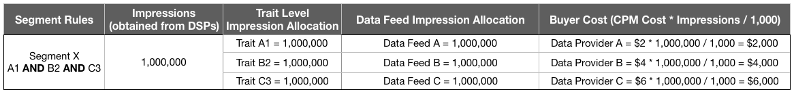

# 데이터 피드 구매자에 대한 대금 청구 {#billing-for-data-feed-buyers}

Audience Marketplace 데이터 구매자는 천 개의 광고 노출 횟수 ([!DNL CPM]) 당 비용으로 데이터 피드에 포함된 트레이트를 사용하여 제공되는 모든 광고 임프레션을 보고하는 것에 동의합니다. [!DNL CPM] 사용량은 각 달력의 5 일에 해당되며 이전 달의 데이터를 포함합니다. 가입자는 사용료를 보고할 필요가 없습니다.

  

## CPM 사용을 보고하는 방법 {#report-cpm-usage}

<!-- t_marketplace_report_cpm_usage.xml -->

[!UICONTROL Audience Marketplace] 데이터 구매자는 천 개의 광고 노출 횟수 ([!DNL CPM]) 당 비용으로 데이터 피드에 포함된 트레이트를 사용하여 제공되는 모든 광고 임프레션을 보고하는 것에 동의합니다. [!DNL CPM] 사용량은 각 달력의 5 일에 해당되며 이전 달의 데이터를 포함합니다. 가입자는 사용료를 보고할 필요가 없습니다.

[!UICONTROL Audience Marketplace] 에서는 다음 두 가지 방법으로 사용량을 보고할 [!DNL CPM] 수 있습니다.

* **세그먼트 수준 보고**: 권장 [!DNL CPM] 사용량 보고 방법입니다. 세그먼트 수준에서 [!DNL CPM] 사용량을 보고할 때 CPM 데이터 피드의 [비용 기여도에 설명된 알고리즘에 따라 데이터 피드 수준 보고 섹션이 해당 사용 금액으로 자동 채워집니다](#cost-attribution).
* **데이터 피드 수준 보고**: 이 방법을 사용하려면 CPM 데이터 피드에 대한 비용 [!DNL CPM] 기여도에 [설명된 알고리즘에 따라 각 데이터 피드에 대한 사용량을 개별적으로 보고해야](#cost-attribution)합니다. 하지만 이 방법은 세그먼트 수준 보고보다 더 단조롭고 오류가 발생하기 쉽습니다.

  

## 세그먼트 수준에서 CPM 사용량 보고 {#segment-level-report}

[!UICONTROL Segment Usage] 이 탭에서는 세그먼트가 매핑되는 대상을 기준으로 그룹화된 세그먼트를 표시하는 동안 세그먼트 수준 사용량을 보고할 수 있습니다.

세그먼트 수준에서 [!DNL CPM] 사용량을 보고 [!UICONTROL Audience Marketplace] 후, CPM 데이터 피드에 대한 [비용 기여도에 따라 해당 데이터가 올바른 사용량에 따라 자동으로 할당됩니다](#cost-attribution).

세그먼트 수준에서 [!DNL CPM] 사용량을 보고하려면:

1. **[!UICONTROL Audience Marketplace > Payables]**&#x200B;이동.
2. **[!UICONTROL Segment Usage]** 탭을 선택합니다.
3. 세그먼트에 대한 사용을 채웁니다. 일부 세그먼트만 보고할 경우 [!UICONTROL Search] 이 상자를 사용하여 세그먼트를 필터링할 수 있습니다.
4. 클릭 **[!UICONTROL Edit Segments Usage]**.
5. 열에 [!DNL CPM] 사용 금액을 [!UICONTROL Usage] 입력합니다.
6. 완료되면을 클릭하고 **[!UICONTROL Save]** 확인 대화 상자를 검토합니다.
   
7. 클릭 **[!UICONTROL Confirm]**.

  

## 데이터 피드 수준에서 CPM 사용량 보고 {#feed-level-report}

각 데이터 피드에 대한 사용량을 개별적으로 계산해야 [!DNL CPM] 하므로 데이터 피드 수준 보고는 오류 프로세스에 더 오래 걸리고 오류가 발생하기 쉽습니다. 세그먼트 수준에서 CPM 사용을 [보고하는](#segment-level-report) 것이 좋습니다.

세그먼트 수준에서 [!DNL CPM] 사용량을 보고하려면:

1. **[!UICONTROL Audience Marketplace > Payables]**&#x200B;이동.
2. **[!UICONTROL Feed Usage]** 탭을 선택합니다.
3. [!UICONTROL Search] 이 상자를 사용하여 데이터 피드를 필터링하고 사용량을 보고하는 데 필요한 데이터 피드를 식별합니다.
4. 클릭 **[!UICONTROL Edit Feeds Usage]**.
5. CPM 데이터 [!DNL CPM] 피드에 대한 [비용 기여도를 기반으로 각 데이터 피드에 대한 사용량을](#cost-attribution)계산하여 [!UICONTROL Usage] 열에 입력합니다.
6. 완료되면을 클릭하고 **[!UICONTROL Save]** 확인 대화 상자를 검토합니다.

   

7. 클릭 **[!UICONTROL Confirm]**.

  

## Bulk reporting

사용량 보고 [!DNL CPM] 중에 오류 및 오버헤드를 줄이려면 일괄 보고 옵션을 사용하여 데이터 피드와 세그먼트가 들어 있는 파일을 [!DNL CSV] 다운로드하고, 사용량을 채운 후 다시 업로드할 [!DNL Audience Manager]수 있습니다. 일괄 보고를 사용하여 피드 및 세그먼트 사용량을 둘 다 보고할 수 있습니다.

[!DNL CPM] 사용량을 일괄 업데이트하려면:

1. **[!UICONTROL Audience Marketplace > Payables]**&#x200B;이동.
1. 업데이트할 보고 유형에 따라 **[!UICONTROL Feed Usage]** 또는 **[!UICONTROL Segment Usage]** 탭을 선택합니다.
1. **[!UICONTROL Edit Feeds Usage]** OR **[!UICONTROL Edit Segments Usage]**&#x200B;를 클릭합니다.
1. 올바른 CSV 파일을 사용하려면을 **[!UICONTROL download the current usage]** (를) 클릭합니다.
1. 컴퓨터에서 파일을 열고 사용량 보고서를 입력합니다.
1. 을 클릭하여 **[!UICONTROL Choose a CSV file]** 업데이트된 사용량 보고서를 업로드합니다.

   

1. [!DNL Audience Manager] 파일을 업로드하는 즉시 유효성을 검사하고 파일에 오류가 있는지 여부를 묻는 메시지가 나타납니다.

  

### 벌크 보고 유효성 검사 오류

| 오류 메시지 | 설명 | 변수 이름이 아니라, 필터링된 보고서의 머리글로 잘못 표시하는 |
| ------------- | -------------| -----|
| 잘못된 입력 | [!DNL Audience Manager] 열 누락 또는 열 제목의 변경 등 [!DNL CSV] 파일 스키마의 변경 사항이 발견되었습니다. | 표 구조를 변경하지 마십시오. |
| 발견되지 않음 | 의 경우 [!UICONTROL Segment Level Reporting][!DNL Audience Manager][!UICONTROL Segment ID] AND [!UICONTROL Destination ID] 조합을 식별할 수 없습니다. for [!UICONTROL Feed Level Reporting], [!DNL Audience Manager] and could not identify the [!UICONTROL Data Provider Name], [!UICONTROL Feed Name]and [!UICONTROL Use Case] combination. | 의 경우 [!UICONTROL Segment Level Reporting][!UICONTROL Segment ID] 및 [!UICONTROL Destination ID] 조합의 유효성을 확인합니다. 의 경우 [!UICONTROL Feed Level Reporting][!UICONTROL Data Provider Name], [!UICONTROL Feed Name]및 [!UICONTROL Use Case] 조합의 유효성을 확인합니다. |
| 중복된 레코드 발견 | [!DNL Audience Manager] 노출 값이 다른 중복 레코드가 발견되었습니다. | 보고서를 검토하고 동일한 데이터 피드 또는 세그먼트에 대해 다른 사용 값을 보고하지 않도록 합니다. |
| 지원되지 않는 값 | [!DNL Audience Manager] 열에서 숫자가 아닌 값을 [!DNL Audience Manager] 감지했습니다. | 보고서를 검토하고 [!DNL Audience Manager] 열에 숫자 값만 입력해야 합니다. |
| 필수 필드용 헤더 누락 | [!DNL Audience Manager] 필수 필드에 대한 누락된 테이블 헤더가 발견되었습니다. 의 경우 [!UICONTROL Segment Level Reporting]필수 필드는 다음과 같습니다. [!UICONTROL Segment ID][!UICONTROL Destination ID]. 의 경우 [!UICONTROL Feed Level Reporting]필수 필드는 다음과 같습니다. [!UICONTROL Data Provider Name][!UICONTROL Data Feed Name], [!UICONTROL Use Case] | 보고서를 검토하고 테이블 헤더가 변경되지 않았는지 확인합니다. |

>[!NOTE]
>[!DNL CSV] 사용량 보고서에서 행을 제거하면 기존 사용량 보고서에 영향을 주지 않습니다. [!DNL Audience Manager] 보고서에 포함된 필드만 처리합니다.

  

## [!DNL CPM] 보고 우수 사례

<table id="table_E68FA2130D1C495FAB8982DFB6A31FD9"> 
 <thead> 
  <tr> 
   <th colname="col1" class="entry"> Recommendations </th> 
   <th colname="col2" class="entry"> 설명 </th> 
  </tr>
 </thead>
 <tbody> 
  <tr> 
   <td colname="col1"> 
<b>항상 총 노출 횟수 보고</b> 
 </td> 
   <td colname="col2"> 
CPM 노출 합계에 대해: 

   
 소수를 사용하지 않고 총 노출 횟수를 보고합니다. Audience Manager는 사용자가 보고하는 총 수를 기반으로 CPM를 자동으로 계산합니다.

1,234,567 개의 노출 횟수를 보고해야 하는 경우 이와 정확히 동일하게 보고합니다. CPM를 계산하기 위해 총 노출 횟수를 1,000로 나눌 필요는 없습니다.

Adobe Target 또는 Analytics 대상과 같은 도구를 사용하여 웹 또는 앱 컨텐츠 (컨텐츠 최적화) 를 최적화하는 데 사용되는 트레이트는 CPM 플랜의 사용량 합계에 기여하지 않습니다. 일반적으로 데이터 공급자는 정액 요금제를 사용하여 컨텐츠 최적화에 대해 보상을 받습니다.

자세한 <a href="#cost-attribution">내용은 CPM 데이터 피드에</a> 대한 비용 기여도 분석을 참조하십시오. 
 </td>
  </tr>
  <tr> 
   <td colname="col1"> 
<b>월별 보고 간격 준수</b> 
 </td> 
   <td colname="col2"> 
보고서 시스템은 매월 5 일이 지나면 닫힙니다. 그때까지 CPM 사용량을 보고하지 않을 경우 다음 달의 보고서에 해당 금액을 추가해야 합니다. 예를 들어 10 월에 1000 개의 임프레션을 사용하고 10 월의 보고 마감일을 놓치고 11 월에 1000 개의 임프레션을 사용하는 경우를 예로 들 수 있습니다. 이 경우 10 월과 5 월 사이에 10 월 및 11 월 합계 (2000) 를 보고합니다.

<b>팁</b>: 다음 달의 첫 번째 일과 5 번째 날 사이에 이전 달에 대한 CPM 사용을 항상 보고해야 합니다.

CPM 사용량을 새 달력의 5 번째 달까지 보고할 수 있지만 권장되지 않습니다. 매월 5 일 전에 CPM 사용량을 보고하면 Audience Manager가 데이터를 확인하고 처리할 수 있습니다.
 </td>
  </tr> 
 </tbody> 
</table>

  

## CPM 데이터 피드에 대한 비용 기여도 분석 {#cost-attribution}

In [!UICONTROL Audience Marketplace] you must self-report amount-report amount to self-report amount of your segment. 비용 기여도 분석이 자동으로 수행되도록 세그먼트 수준에서 [!DNL CPM] 사용량을 보고하는 것이 좋습니다.

<!-- marketplace_cpm_billing.xml -->

### 청구 요약 {#billing-summary}

각 달력 월의 첫째 일과 5 일 사이에 [!DNL CPM] 데이터 피드 노출 금액을 제출해야 합니다. 이렇게 하려면 세그먼트 수준에서 CPM 사용량을 [보고하는](#segment-level-report)것이 좋습니다.

>[!TIP]
>세그먼트 수준에서 [!DNL CPM] 사용량을 보고할 때 데이터 피드 수준 보고 섹션은 해당 사용 금액으로 자동으로 채워집니다.

필요한 경우, 이전 [!UICONTROL Report CPM Usage at Data Feed Level]달력의 각 피드에 대해 전달된 모든 노출 횟수를 개별적으로 컴파일한 다음 이 문서에 설명된 청구 할당에 따라 보고서를 보고해야 합니다.

이전 달력의 [!DNL CPM] 수를 보고 후 다음을 [!DNL Adobe] 수행합니다.

* 구독한 각 데이터 피드의 [!DNL CPM] 비율에 따라 청구서를 작성하고 청구서를 청구합니다.
* 데이터 공급자 (판매자) 가 보고한 [!DNL CPM] 사용에 따라 지불해야 하는 요금.

>[!IMPORTANT]
>
>구매자는 보고된 모든 노출 합계는 반드시 유효하고 정확해야 합니다. 노출 합계를 매달 5 일까지 보고하지 못한 경우 다음 달에 보고되지 않은 월의 총계를 포함해야 합니다.

  

## 트레이트 자격 규칙에 따라 피드 수준에서 노출 횟수 지정 {#assign-impressions}

사용 사례에서는 [!UICONTROL Activation] 해당 데이터 피드에 트레이트를 사용하여 [세그먼트 빌더에서](../../../features/segments/segment-builder.md#topic_E166819D26B94A868376BA54E10E4B74) 세그먼트를 만들고 해당 세그먼트를 대상에 매핑할 수 있습니다. 부울 연산자 [!UICONTROL AND], [!UICONTROL OR]트레이트 및 [!UICONTROL NOT] 세그먼트 자격 조건에 대한 조건을 설정할 수 있습니다.

데이터 [피드 수준에서](#feed-level-report)CPM 사용을 보고할 때 트레이트 자격 규칙에 사용된 [!DNL Boolean] 연산자에 따라 각 데이터 피드에 대해 비례적으로 노출 횟수를 할당해야 합니다. 다음 표에는 부울 규칙이나 트레이트 유형별로 노출 수를 적절히 할당하는 방법이 나와 있습니다.

>[!TIP]
>[Audience Manager에서 데이터 피드 수준 보고를 자동으로 수행하도록 세그먼트 수준에서](#segment-level-report) CPM 사용을 보고합니다.

<table id="table_BF00FE6740D2459DAFA62F2478492586"> 
 <thead> 
  <tr> 
   <th colname="col1" class="entry"> 규칙 자격 로직 또는 유형 </th> 
   <th colname="col2" class="entry"> 청구 배포 </th> 
  </tr> 
 </thead>
 <tbody> 
  <tr> 
   <td colname="col1"> 
 and 
 </td> 
   <td colname="col2"> 
부울  AND 조건을 사용하는 규칙 기반 세그먼트의 모든 제공자에게 전달된 노출 수의 100%를 적용합니다. 
 </td> 
  </tr> 
  <tr> 
   <td colname="col1"> 
 또는 
 </td> 
   <td colname="col2"> 
부울 또는 조건을 사용하는 규칙 기반 세그먼트의 모든 공급자에게 전달된 노출 수의 가중 할당을 적용할 수 있습니다. 가중 할당은 다음 공식을 사용하여 계산됩니다.

<code>(트레이트 인구/세그먼트 인구) * 노출 횟수 * CPM 비용</code>
 </td> 
  </tr>
  <tr> 
   <td colname="col1"> 
 NOT 
 </td> 
   <td colname="col2"> 
불부울  조건을 사용하는 규칙 기반 세그먼트의 모든 제공자에게 전달된 노출 수의 100% 를 적용합니다. 
 </td> 
  </tr> 
  <tr> 
   <td colname="col1"> 
알고리즘 세그먼트 
 </td> 
   <td colname="col2"> 
알고리즘 트레이트가 들어 있는 세그먼트의 모든 공급자 피드에 전달된 노출 수의 100%를 적용합니다. 
 </td> 
  </tr>
 </tbody>
</table>

  

## 청구 예 {#billing-examples}

아래 예는 데이터 피드 수준에서 [!DNL CPM] 사용 할당이 수행되는 방식을 설명하기 위한 것입니다.

>[!IMPORTANT]
>이 프로세스가 자동으로 [수행되도록 하려면 세그먼트 수준에서](#segment-level-report) CPM 사용을 보고하는 것이 좋습니다.

다음 시나리오를 고려해 보겠습니다.

  

### 사례 1: 세그먼트 및 자격 규칙이 있는 세그먼트

이 세그먼트에는 별도의 데이터 공급자의 세 가지 특성이 들어 있습니다. 세그먼트 자격 조건은 [!UICONTROL AND] 조건을 기반으로 하므로 방문자는 세 가지 피드의 트레이트 중에서 해당 세그먼트에 대한 자격을 부여해야 합니다.

[!UICONTROL AND] 조건으로, 해당 월의 노출 수를 3 개의 데이터 제공자에게 모두 할당해야 합니다. [!UICONTROL Audience Marketplace > Payables] 이 섹션에서는 1,000,000 개의 노출 횟수가 있는 각 공급자를 크레디트합니다.

이 예는 연산자를 사용하는 [!DNL Boolean][!UICONTROL NOT] 세그먼트나 알고리즘 트레이트가 포함된 세그먼트에 적용됩니다.

  

### 사례 2: 세그먼트 규칙이 있는 세그먼트

이 세그먼트에는 별도의 데이터 공급자의 세 가지 특성이 들어 있습니다. 세그먼트 자격 조건은 [!UICONTROL OR] 조건을 기반으로 하므로 방문자는 세그먼트를 사용할 수 있는 세 가지 특성 중 적어도 하나를 구현해야 합니다.

자격 조건은 [!UICONTROL OR] 조건을 기반으로 하므로 임프레션에 어떤 특징이 있는지 알 수 없습니다. 그 결과 [!UICONTROL Audience Marketplace > Payables] , 섹션에서는 트레이트 모집단을 기반으로 총 노출 수의 가중치가 가중치가 할당된 각 공급자를 크레디트합니다.

  

### 사례 3: 모델링 및 활성화 사용 사례가 있는 세그먼트

이 예는 모델링 및 활성화 두 가지 데이터 피드 사용 사례를 기반으로 한 기여도를 설명합니다. 예제에서는 다음 정보가 포함된 두 개의 데이터 공급자를 확인합니다.

아래 표에서 세그먼트 X 에는 T 1와 T 2 라는 두 개의 트레이트, 즉 세그먼트 규칙 T 1 또는 T 2가 포함되어 있습니다. 여기서

* t 1는 데이터 피드 A의 트레이트
* T 2는 데이터 피드 A와 데이터 피드 B의 서드 파티 트레이트가 만들어진 알고리즘 트레이트 모델입니다.

세그먼트는 대상에 매핑되고, 세그먼트 수준 보고를 사용하여 [한 달에 이 세그먼트에 대해 1,000,000 개의 노출 횟수가 입력됩니다](#segment-level-report).

1,000,000 개의 노출 횟수 중에서

* T 1는 세그먼트 인구의 40%를 차지하므로 피드 A에 대한 노출 횟수는 400,000 개로 변환됩니다.
* T 2는 세그먼트 인구의 60%를 차지하므로 피드 A와 피드 B의 노출 수는 600,000 개로 변환됩니다.

데이터 피드 수준에서 노출 횟수가 할당되는 방법은 다음과 같습니다.

* 데이터 피드 A는 트레이트 T 2 (데이터 피드 A 및 데이터 피드 B의 트레이트 모델로 모델링됨) 에서 600,000 개의 노출 횟수, 트레이트 T 1 (데이터 피드 A의 트레이트) 에서 400,000 개의 노출 횟수, 1,000,000 개의 노출 횟수를 받게 됩니다.
* 데이터 피드 B는 트레이트 T 2 (위의 설명 참조) 에서 600,000 개의 노출 횟수 및 트레이트 T 1의 노출 수를 받습니다.

데이터 피드와 사용 사례별 한 눈에 볼 수 있는 분류는 다음과 같습니다.

  

## 정액 요금 데이터 피드에 대한 요금 청구 및 노출 수 할당 {#billing-flat-fee}

정액 요금 데이터 피드는 구독의 시작 시기 또는 사용 횟수에 관계 없이 매월 고정된 금액을 청구합니다. 요금은 일부 월 사용량 또는 간격에 대해 비례 배분되지 않습니다. CPM 청구와 마찬가지로 Adobe는 송장을 생성하여 구독한 데이터 피드에 대한 월정액 요금제로 청구하게 됩니다.

예를 들어, 한 달 동안 피드에서 특정 트레이트를 켜기로 결정한 경우 사용료 지불 플랜을 시작하거나 특정 트레이트를 활성화한 시기에 상관없이 매월 전체 요금으로 청구됩니다.