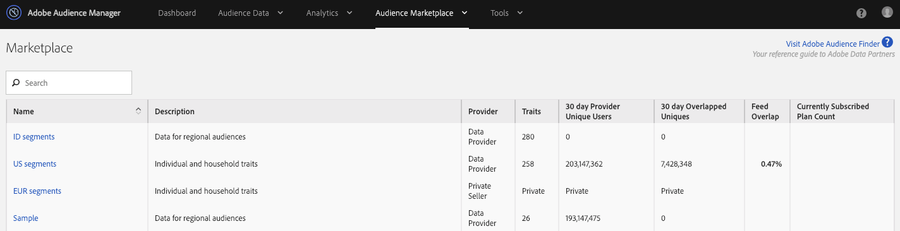
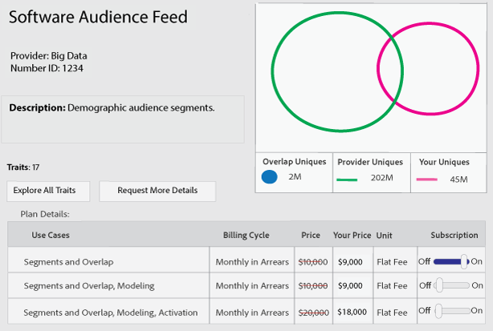

# 데이터 피드 가입 관리 {#manage-data-feed-subscriptions}

[!UICONTROL Marketplace]은 데이터 구매자가 리서치에 가서 공개 및 비공개 데이터 피드를 구독하는 곳입니다. 공개 데이터 피드에 가입하려면 다음 단계를 수행합니다.

## 공개 데이터 피드 구독 {#subscript-public-data-feed}

[!UICONTROL Marketplace]은 데이터 구매자가 리서치에 가서 공개 및 비공개 데이터 피드를 구독하는 곳입니다. 공개 데이터 피드에 가입하려면 다음 단계를 수행합니다.

<!-- t_subscribe_feed.xml -->

공개 데이터 피드에 가입하려면:

1. **[!UICONTROL Audience Marketplace > Marketplace]**&#x200B;으로 이동합니다. 검색 기능을 사용하거나 목록을 검색하여 데이터 피드를 찾습니다.

   

1. 사용할 데이터 피드의 이름을 클릭합니다. 선택한 피드에 대한 [플랜 세부 정보 페이지](../../../features/audience-marketplace/marketplace-data-buyers/marketplace-manage-subscriptions.md#marketplace-buyer-details)가 열립니다.

   

1. 가입 테이블에서 사용 사례를 선택하고 다음을 수행합니다.
   * **[!UICONTROL Subscription]** 슬라이더를 **[!UICONTROL On]**(으)로 이동합니다.
   * 클릭 **[!UICONTROL Review & Subscribe]**. [!UICONTROL Terms and Conditions] 창이 열립니다.

   

1. [!UICONTROL Terms and Conditions] 창에서:

   * **중요:** 확인란을  **[!UICONTROL ID sync]** 선택된 상태로 두십시오. 이 설정은 데이터 제공자와의 일치 비율을 개선하는 데 도움이 됩니다.
   * 약관 상자를 선택하고 **[!UICONTROL Accept]**&#x200B;을 클릭하여 구독 프로세스를 완료합니다.

   

### 다음 단계

데이터 피드에 가입한 후:

* [!UICONTROL Traits] 폴더를 확인하여 구독을 확인합니다. [가입된 데이터 피드 저장](../../../features/audience-marketplace/marketplace-data-buyers/marketplace-manage-subscriptions.md#find-subscribed-data-fee)을 참조하십시오.

* 청구 및 결제 설명서를 검토합니다. 아래 관련 링크를 참조하십시오.

### 우수 사례 {#best-practices}

다음은 [!UICONTROL Audience Marketplace] 작업 시 따라야 할 우수 사례 집합입니다.

[!UICONTROL Audience Marketplace]을 통해 새로운 제3자 데이터 세트와 제2자 데이터 세트를 탐색할 때 권장되는 첫 번째 단계는 [!UICONTROL Segments & Overlap]에 대한 데이터 피드를 활성화하는 것입니다. 이를 통해 세그먼트를 만들어 고객 규모를 평가하고 중복 보고서를 실행함으로써 데이터를 분석하여 초기 고객 인사이트를 얻을 수 있습니다. 대부분의 데이터 공급자는 이 사용 사례를 무료로 제공하므로 추가 비용 없이 이 분석을 수행할 수 있습니다.

중복 보고서를 실행할 때 다음의 모범 사례에 따라 유용한 결과를 얻으십시오.

1. 겹치는 데이터 세트가 다음과 같은 데이터 유형 및 수집 방법론과 비슷한지 확인합니다.
   * 방문자 지역
   * 쿠키와 모바일 ID 비교
   * 전환 확인 기간
   * 오프라인 활동과 온라인 활동 비교
   * 데이터 공급자가 데이터를 새로 고치는 빈도

1. 겹치는 시간이 지남에 따라 약간 늘어날 수 있으므로 오버랩 보고서를 실행하기 전에 최대 30일 동안 데이터를 동기화하도록 허용해야 합니다.
1. 여러 마케팅 캠페인에서 데이터 공급자의 데이터를 사용하는 경우 오버랩이 증가할 수 있습니다.
및 이니셔티브를 참조하십시오. 따라서 두 데이터 세트의 사용자가 동기화할 수 있는 기회가 더 많아집니다.
1. 데이터 세트 간에 중복될 것이라는 보장은 없습니다. 겹침이 유효하려면 고객 데이터 세트의 사용자가 데이터와 연결되어 있어야 합니다
공급자 데이터 세트 고객의 미디어 데이터가 데이터 공급자 데이터 세트에서 사용자에게 제공되지 않으면 겹치지 않습니다.
1. 낮은 겹치는 것을 나쁜 것으로 생각하지 마라. 낮은 오버랩을 활용하여 잠재 고객을 확보하고 신규 사용자의 참여를 유도할 수 있습니다.

## 개인 데이터 피드 구독 {#subscript-private-data-feed}

구매자는 **[!UICONTROL Audience Marketplace > Marketplace]**&#x200B;에서 개인 데이터 피드 및 플랜을 구독합니다.

<!-- t_private_feed.xml -->

>[!TIP]
>
>경우에 따라 데이터 제공자는 개인 데이터 피드에 대해 할인 혜택을 제공할 수 있습니다. 구독 요청을 제출할 때 가능한 할인 혜택을 요청해야 할 수 있습니다.

비공개 데이터 피드에 가입하려면:

1. [!UICONTROL Marketplace]에서 데이터 피드 이름을 클릭합니다.
1. 클릭 **[!UICONTROL Request Access]**. 그러면 요청 대화 상자가 열립니다.
1. 요청 대화 상자에서 공급자에게 데이터 피드에 대한 관심사를 나타내는 메모를 쓰고 **[!UICONTROL Send]**&#x200B;을 클릭합니다. 판매자는 메시지를 검토하고 요청을 승인하거나 거부합니다. 승인을 기다리는 동안 해당 데이터 피드에 대한 [!UICONTROL Marketplace] 목록에 &quot;요청됨&quot;이 나타납니다.

   * **[!UICONTROL Request approved]**:목록의  [!UICONTROL Marketplace] 상태가 &quot;액세스 권한&quot;으로 변경되며 자동 알림을 받게 됩니다. 이 시점에서 피드에 가입할 수 있습니다. 지침은 [공개 데이터 피드 구독](../../../features/audience-marketplace/marketplace-data-buyers/marketplace-manage-subscriptions.md#subscript-public-data-feed)을 참조하십시오.
   * **[!UICONTROL Request denied]**:&quot;요청된&quot; 텍스트가 피드의  [!UICONTROL Marketplace] 목록에서 제거됩니다. 다시 구독하거나 다른 피드를 선택할 수 있습니다.

## 구매자에 대한 데이터 피드 할인 {#buyer-discount}

[!UICONTROL Audience Marketplace]에서 제공업체는 [!DNL CPM] 게시된 가격 또는 정액 요금 데이터 피드의 가격을 구매자에게 할인 혜택을 제공할 수 있습니다. 하지만 할인 금액은 구매자에게 [!DNL Marketplace] 피드 목록에 표시되지 않습니다. 그러나 개인 데이터 피드에 가입하거나 특정 피드에 대한 자세한 정보를 요청할 때 할인을 요청할 수도 있습니다.

## 할인 요청 {#request-discount}

<!-- marketplace-buyer-discounts.xml -->

<table id="table_3C6E58F593BA48EC89ACBD9A26E4E74F"> 
 <thead> 
  <tr> 
   <th colname="col1" class="entry"> 구매자 상태 </th> 
   <th colname="col2" class="entry"> 설명 </th> 
  </tr> 
 </thead>
 <tbody> 
  <tr> 
   <td colname="col1"> 
 <b>현재 구독자</b> 
 </td> 
   <td colname="col2"> 
이미 개인 데이터 피드에 가입되어 있고 할인을 요청하려는 경우: 
 
    <ol id="ol_A58D419EBB9349E9B1225202535130F6"> 
     <li id="li_D0DDC8AC6E9C4675AA4630D63FE8F071"> <a href="../../../features/audience-marketplace/marketplace-data-buyers/marketplace-manage-subscriptions.md#unsubscribe"> 데이터 피드</a> 에서 가입을 취소합니다. </li> 
     <li id="li_05A5379F2A944FB28AB39C196DDE3A1D">데이터 제공업체에 문의하여 할인된 가격으로 요청하십시오. </li> 
     <li id="li_B1B5AA6F6CC64512A02D5E8861A5F266">공급자가 할인 혜택을 제공하는 경우 다음 달 1일st일에 피드에 다시 가입합니다. </li> 
    </ol> </td> 
  </tr> 
  <tr> 
   <td colname="col1"> 
 <b>새 개인 데이터 피드 구독자</b> 
 </td> 
   <td colname="col2"> 
구독 신청 시 할인 혜택을 요청하십시오. <a href="../../../features/audience-marketplace/marketplace-data-buyers/marketplace-manage-subscriptions.md#subscript-private-data-feed"> 개인 데이터 피드 구독</a>을 참조하십시오. 
 </td>
  </tr> 
  <tr> 
   <td colname="col1"> 
 <b>잠재적인 가입자</b> 
 </td> 
   <td colname="col2"> 
<a href="../../../features/audience-marketplace/marketplace-private-feeds.md"> 잠재적인 가입자</a>는 개인 데이터 피드에 대한 액세스를 요청했지만 판매자 승인을 받았지만 피드에 가입하지 않은 데이터 구매자입니다. 잠재적인 가입자로 할인을 요청하려면: 
 
    <ol id="ol_9CECDA92E7894B20AC8A777D78962188"> 
     <li id="li_618B64160CF24549AFCA73E006DCA35A"><b> Audience Marketplace &gt; Marketplace</b>로 이동합니다. </li> 
     <li id="li_FE52A06B30FC4858B48AF81954365FE9">승인된 피드의 이름을 클릭합니다. </li> 
     <li id="li_763C050AC9464BE380D00F6085B6E540"><b> 추가 정보 요청</b>을 클릭합니다. 자세한 내용은 판매자에게 할인 혜택을 요청하십시오. </li> 
    </ol> </td> 
  </tr> 
 </tbody> 
</table>

## 할인 피드 검토 {#review-discounted-feeds}

할인된 피드를 검토하려면

1. **[!UICONTROL Audience Marketplace > Marketplace]**&#x200B;으로 이동합니다.
1. 이미 가입한 피드의 이름을 클릭합니다.
1. [!UICONTROL Plan Details] 테이블의 [!UICONTROL Price] 및 [!UICONTROL Your Price] 열을 확인합니다. 피드가 할인되는 경우:

   * 원래 가격은 빨간 선으로 표시되어 있다.
   * [!UICONTROL Your Price] 열의 수수료는 [!UICONTROL Price] 열의 비용보다 낮습니다.

이 예에서 구매자는 **[!UICONTROL Software Audience Feed]**&#x200B;의 [!UICONTROL Segments and Overlap] 플랜에 대해 10% 할인 혜택을 받습니다.

## 구독한 피드 데이터 찾기 {#find-subscribed-data-fee}

데이터 피드에 대한 데이터(트레이트)는 고유한 트레이트 저장소 폴더에 나타납니다. **[!UICONTROL Audience Data > Traits]**&#x200B;으로 이동하여 **[!UICONTROL 3rd-Party Data]** 폴더를 확장하여 가입된 피드의 트레이트를 보고 사용합니다. 데이터 공급자 이름을 따서 명명된 하위 폴더를 찾습니다. 여기에는 개별 데이터 피드에서 이름이 지정된 폴더와 피드에서 제공하는 목록 트레이트가 포함됩니다.

<!-- marketplace-feed-storage.xml -->

## 데이터 피드 구독 취소 {#unsubscribe}

데이터 구매자는 **[!UICONTROL Audience Marketplace > Marketplace]**&#x200B;의 데이터 피드 및 플랜에서 가입을 해지합니다.

<!-- t_unsubscribe_feed.xml -->

데이터 피드에서 가입 해지하려면:

1. [!UICONTROL Marketplace]에서 데이터 피드 이름을 클릭합니다.
1. [!UICONTROL Use Case] 섹션에서 사용할 계획을 찾아 **[!UICONTROL Subscription]** 슬라이더를 **[!UICONTROL Off]**&#x200B;로 이동합니다.

## 데이터 피드 비활성화:발생한 이유 및 응답 방법 {#data-feed-deactivation-reasons}

[!UICONTROL Audience Marketplace]에서 데이터 공급자는 가입한 데이터 피드에 대한 액세스를 취소할 수 있습니다. 이런 일이 일어나면 놀라지 마라. 우리는 당신을 엄호합니다. 데이터 피드 비활성화와 관련된 프로세스 및 절차는 이 섹션을 검토하십시오.

## 데이터 피드 비활성화를 위한 일반적인 이유 {#reasons-for-deactivation}

<!-- marketplace-subscriber-deactivated.xml -->

가입한 피드가 중단되는 경우 문제가 발생하거나 불쾌할 수도 있습니다. 하지만 데이터 공급자는 다양한 이유로 데이터 피드를 비활성화할 수 있습니다. 몇 가지 일반적인 이유는 다음과 같습니다.

* **청구:** 요금 지불 시 일관되게 지연되거나 수수료를 지불하지 못하는 경우 데이터 공급자가 피드를 비활성화합니다.
* **피드 업데이트:** 데이터 공급자가 피드 분류법 또는 비용 구조를 업데이트할 때 피드를 비활성화해야 합니다.
* **비활성 구매자:** 데이터 제공업체는 가입자에게 연장된 기간 동안 지출이 표시되지 않는 경우 피드를 비활성화할 수 있는 권리를 보유합니다.
* **비활성 판매자:** 떠나는 데이터  [!UICONTROL Audience Marketplace] 공급자는 모든 데이터 피드를 비활성화하고 삭제합니다.

>[!TIP]
>
>데이터 피드가 실수로 비활성화되었다고 생각되면 데이터 공급자에게 직접 문의하십시오. [!DNL Adobe] 컨설턴트가 연락처 정보 또는 추가 지원을 받을 수 있습니다.

## 비활성화 이메일 {#deactivation-email}

데이터 공급자가 데이터 피드 중 하나를 비활성화하면 [!DNL Audience Manager]은(는) [!UICONTROL Administrator] 권한을 가진 회사의 사용자에게 이메일을 보냅니다. 이메일 필터는 이 메시지를 스팸으로 분류하는 경우가 있습니다. 따라서 이 중요한 알림을 놓칠 수 있습니다. 비활성화 메시지를 식별하는 데 도움이 되는 이 이메일에는 다음 요소가 포함되어 있습니다.

* **보낸 사람:** 비활성화 이메일이 발송됩니다 `aam-noreply@adobe.com`. 팁:이 이메일에 회신하지 마십시오.

* **제목:** 여기에서 데이터 피드  *이름에 대한* 구독이 취소됨.

* **첨부 파일:** 이메일에는 &quot;.&quot;라는 이름의 첨부 파일이  `list-of-affected-entities-by-feed-revocation.csv`포함됩니다. 이는 취소된 피드에 포함된 모든 트레이트가 첨부 파일에 나열된다는 의미입니다. 데이터 구매자는 이 첨부 파일을 검토해야 합니다. 세그먼트와 [알고리즘 모델](../../../features/algorithmic-models/understanding-models.md)에서 비활성화된 트레이트를 찾아 제거하는 데 도움이 됩니다.

## 비활성화된 트레이트 목록 {#deactivation-trait-list}

비활성화 이메일에 동봉된 목록에는 아래와 같은 필드가 포함되어 있습니다.

<table id="table_5C3800F9D8AA43EFAB4690959A721F63"> 
 <thead> 
  <tr> 
   <th colname="col1" class="entry"> 필드 </th> 
   <th colname="col2" class="entry"> 설명 </th> 
  </tr> 
 </thead>
 <tbody> 
  <tr> 
   <td colname="col1"> 
<b> 데이터 피드 ID</b> 
 </td> 
   <td colname="col2"> 
비활성화된 데이터 피드의 ID. 
 </td> 
  </tr> 
  <tr> 
   <td colname="col1"> 
<b> 데이터 피드 이름</b> 
 </td> 
   <td colname="col2"> 
비활성화된 데이터 피드의 이름입니다. 
 </td> 
  </tr> 
  <tr> 
   <td colname="col1"> 
<b> 특성 SID</b> 
 </td> 
   <td colname="col2"> 
트레이트 ID가 비활성화되었습니다. 
 </td> 
  </tr> 
  <tr> 
   <td colname="col1"> 
<b> 특성 이름</b> 
 </td> 
   <td colname="col2"> 
특성 이름이 비활성화되었습니다. 
 </td> 
  </tr> 
  <tr> 
   <td colname="col1"> 
<b> 세그먼트 SID</b> 
 </td> 
   <td colname="col2"> 
비활성화된 트레이트가 포함된 세그먼트의 ID. 
 </td> 
  </tr> 
  <tr> 
   <td colname="col1"> 
<b> 세그먼트 이름</b> 
 </td> 
   <td colname="col2"> 
비활성화된 트레이트가 포함된 세그먼트의 이름입니다. 
 </td> 
  </tr> 
  <tr> 
   <td colname="col1"> 
<b> Algo 모델 ID</b> 
 </td> 
   <td colname="col2"> 
비활성화된 트레이트가 포함된 알고리즘 모델의 ID. 
 </td> 
  </tr> 
  <tr> 
   <td colname="col1"> 
<b> Algo 모델 이름</b> 
 </td> 
   <td colname="col2"> 
비활성화된 트레이트가 포함된 알고리즘 모델의 이름. 
 </td> 
  </tr> 
 </tbody> 
</table>

## 비활성화된 트레이트 제거 {#remove-deactivated-traits}

데이터 구매자는 모든 활성/사용 중 또는 비활성 세그먼트에서 취소된 피드의 트레이트를 제거할 책임이 있습니다. 제거 옵션은 다음과 같습니다.

* [REST API](../../../api/rest-api-main/rest-api-main.md) 또는 [벌크 관리 도구](../../../reference/bulk-management-tools/bulk-management-intro.md)로 벌크 제거

* 영향을 받는 세그먼트를 수동으로 검색하고 [!UICONTROL Segment Builder]을(를) 사용하여 비활성화된 트레이트를 제거합니다. 세그먼트](../../../features/segments/segment-builder.md#segment-builder-controls-traits)에서 트레이트 제거를 참조하십시오.[

>[!NOTE]
>
>활성 알고리즘 모델 또는 대상에서 트레이트를 제거하면 비율 및 타깃팅 정확성에 영향을 줍니다. 가능한 경우 취소된 트레이트를 새로운 활성 트레이트로 바꾸십시오.

[계정에서 해지된 트레이트를 모두 ](../../../features/audience-marketplace/marketplace-data-buyers/marketplace-manage-subscriptions.md#unsubscribe) 제거한 후 비활성화된 데이터 피드의 가입을 해지합니다. 임시 비정품 인증인 경우 데이터 공급자가 필요한 변경 작업을 완료하고 피드를 다시 활성화하면 다시 가입할 수 있습니다. 대부분의 경우와 마찬가지로 파트너(데이터 제공자와 [!DNL Adobe])와의 효과적인 커뮤니케이션은 이 프로세스를 진행하는 데 도움이 됩니다.

## Audience Marketplace의 계획 세부 정보 페이지 이해 {#marketplace-buyer-details}

[!UICONTROL Marketplace]에서 데이터 플랜 이름을 클릭하면 데이터 피드 가입에 대한 정보를 선택할 수 있도록 도움이 되는 정보가 [!DNL Audience Manager] 제공됩니다.

<!-- marketplace-buyer-details.xml -->

이 페이지에서는 다음 정보를 제공합니다.

1. **기본 플랜 정보**. 여기에는 다음과 같은 피드 정보가 포함됩니다.
   * 데이터 피드 이름입니다. 예를 들어, 위에 표시된 것처럼 이 피드의 이름은 &quot;샘플 데이터 피드&quot;입니다.
   * 데이터 공급자의 이름
   * 데이터 피드 ID;
   * 설명;
   * 피드의 트레이트 수;

1. 계획 정보 단추를 참조하십시오.
   * 선택한 데이터 피드의 모든 트레이트에 대한 세부 사항을 보려면 **[!UICONTROL Explore All Traits]**&#x200B;을 클릭합니다.
   * 데이터 공급자에게 선택한 데이터 피드에 대해 질문하거나 할인 혜택을 요청하려면 **[!UICONTROL Request More Details]**&#x200B;을 클릭합니다. 이 기능은 주석과 질문을 데이터 제공자에게 직접 전송합니다.

1. 데이터 피드 보고서 지표를 참조하십시오. 벤 다이어그램(및 관련 지표)은 지난 30일 동안의 트레이트 오버랩 데이터를 보여줍니다. [The Marketplace:자세한 내용은 ](marketplace-data-buyers.md#about-marketplace) 정보를 참조하십시오.
   * **[!UICONTROL 30 Day Overlapped Uniques]**:공급자 계정의 사용자와 겹치는 계정의 고유 사용자 수입니다. 고유 사용자에 대한 정의는 Audience Manager](/help/using/reference/ids-in-aam.md)의 [ID 인덱스에서 AAM UUID를 참조하십시오.
   * **[!UICONTROL 30 Day Provider Unique Users]**:공급자 계정에서 들어오는 고유 사용자 수입니다.
   * **[!UICONTROL Your Unique Users]**:계정에서 들어오는 고유 사용자 수입니다.

1. **[!UICONTROL Plan Details]** 표. 이 테이블은 가격 모델과 함께 데이터 피드에 가입할 수 있는 사용 사례를 보여줍니다. [데이터 피드 사용 사례 이해](#use-cases)를 참조하십시오.

1. 계획 작업 단추를 참조하십시오.
   * **[!UICONTROL Cancel]**&#x200B;을 클릭하여 변경하지 않고 페이지를 나갑니다.
   * 데이터 피드에 가입하려면 **[!UICONTROL Review & Subscribe]**&#x200B;을 클릭합니다. [!UICONTROL Subscription] 전환을 [!UICONTROL On]으로 전환할 때까지 이 단추가 회색으로 표시됩니다. [공개 데이터 피드 구독](#subscript-public-data-feed) 및 [개인 데이터 피드 구독](#subscript-private-data-feed)도 참조하십시오.

## 데이터 피드 사용 사례 이해 {#use-cases}

[!UICONTROL Audience Marketplace] 데이터 구매자는 중복, 모델링 및 활성화 사용 사례를 위한 데이터를 구입할 수 있습니다. 각 사용 사례는 특정 목적에 맞게 설계되었으며 데이터로 수행할 수 있는 작업을 제한합니다. 이러한 사용 사례 설명을 통해 구매할 데이터 플랜 유형을 정확하게 결정할 수 있습니다.

## 세그먼트 및 중복 플랜과 비교 {#comparisons}

<!-- c_use_cases_for_buyers.xml -->

### 세그먼트 및 겹치기

이 사용 사례를 사용하면 [트레이트와 트레이트-투-트레이트 오버랩 보고서에서 트레이트를 공급자 트레이트와 비교할 수 있습니다.](../../../reporting/dynamic-reports/trait-trait-overlap-report.md#trait-to-trait-overlap-report) 또한 세그먼트에 공급자 트레이트를 만들거나 추가할 수 있으며 세그먼트 간  [순회 및 ](../../../reporting/dynamic-reports/segment-trait-overlap-report.md) 세그먼트 간  [세그먼트화 보고서와 추가적인 비교를 수행할 ](../../../reporting/dynamic-reports/segment-segment-overlap-report.md) 수 있습니다. 겹치는 비교를 통해 다음을 수행할 수 있습니다.

* **고객 도달 범위 확대:** 겹치기 정도가 낮으면 트레이트에 이전에 보지 못한 사용자가 포함되어 있음을 나타냅니다. 이러한 트레이트가 새로운 사용자에게 도달하도록 할 수 있습니다.
* **기존 고객 향상:** 중복 증가율이 높으면 데이터 공급자가 소유한 트레이트와 비슷한 트레이트가 표시됩니다. 이러한 트레이트를 통해 이미 개발된 대상에 대한 증가분 목표를 달성할 수 있습니다.

### 알고리즘 모델

이 사용 사례에서는 [알고리즘 모델링](../../../features/algorithmic-models/understanding-models.md#understanding-models)을 사용하여 사용자의 트레이트에 대해 공급업체 트레이트를 평가할 수 있습니다. 예를 들어, Adobe의 알고리즘 모델링 시스템은 공급자 트레이트와 비교하기 위한 기준으로 사용자의 트레이트 중 하나를 사용합니다. 모델이 실행되면 공급업체 트레이트의 대상이 트레이트와 유사한 전환 속성을 공유하는지 여부를 표시할 수 있습니다.

### 활성화

이 사용 사례에서는 데이터를 [대상](../../../features/destinations/destinations.md)으로 보낼 수 있습니다. [!DNL Audience Manager]에서 대상은 제3자 시스템(광고 서버, [!DNL DSP], [!DNL DMP], 교환 등)입니다. 입니다. 그러나 [!UICONTROL Activation] 사용 사례에서는 중복 보고서를 실행하거나 알고리즘 모델에서 데이터를 테스트할 수 없습니다.

>[!MORELIKETHIS]
>
>* [CPM 데이터 피드에 대한 청구 및 노출 할당](../../../features/audience-marketplace/marketplace-data-buyers/marketplace-buyer-billing.md#cost-attribution)
>* [정액 요금 데이터 피드에 대한 청구 및 노출 할당](../../../features/audience-marketplace/marketplace-data-buyers/marketplace-buyer-billing.md)
>* [CPM 사용을 보고하는 방법](../../../features/audience-marketplace/marketplace-data-buyers/marketplace-buyer-billing.md#report-cpm-usage)
>* [공개 데이터 피드 구독](../../../features/audience-marketplace/marketplace-data-buyers/marketplace-manage-subscriptions.md#subscript-public-data-feed)
>* [데이터 구매자를 위한 할인 혜택](../../../features/audience-marketplace/marketplace-data-buyers/marketplace-manage-subscriptions.md#buyer-discount)
>* [Marketplace:정보](../../../features/audience-marketplace/marketplace-data-buyers/marketplace-data-buyers.md#about-marketplace)

