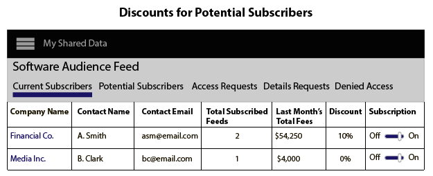

# 데이터 피드 만들기, 가격 및 관리 {#create-price-and-manage-data-feeds}

## 공개 또는 비공개 데이터 피드 만들기 {#create-public-private-data-feed}

데이터 피드에는 이름, 설명, 데이터 소스 및 계획 유형이 필요합니다. 피드는 피드를 저장하고 활성화할 때까지 비활성화됩니다. **[!UICONTROL Audience Marketplace > My Shared Data]**&#x200B;에서 공개 또는 비공개 데이터 피드를 설정합니다. 데이터 판매자만 사용할 수 있습니다.

<!-- t_data_feed.xml -->

공개 또는 개인 데이터 피드를 만들려면 관리자 권한이 있어야 합니다.
데이터 피드를 만들려면:

1. 클릭 **[!UICONTROL New Data Feed]**.
1. 데이터 피드의 이름을 지정합니다. 데이터 구매자는 이름을 기준으로 피드를 검색할 수 있습니다.
1. 간단한 설명(최대 255자)을 제공합니다.

   피드를 설명하는 좋은 설명이 필요합니다. 예를 들어 마케팅 카테고리, 인구 통계학적 특성 및 지리적 범위(예: [!DNL US] 또는 북미)에 대한 텍스트를 포함할 수 있습니다. 설명 텍스트는 검색할 수 있고 구매자가 피드를 찾거나 평가하는 데 도움이 됩니다. 적절한 설명은 데이터 피드 가입자를 유도하는 데 중요한 부분입니다.
1. **[!UICONTROL Data Source]** 옵션에서 데이터 소스를 선택합니다. 데이터 피드는 단일 데이터 소스로 제한됩니다. 동일한 데이터 피드에 여러 데이터 소스를 할당할 수 없습니다.

   >[!IMPORTANT]
   >
   >이 데이터 소스에 속하는 현재 및 향후 트레이트는 이 피드의 일부로 데이터 구매자와 공유됩니다.

1. [!UICONTROL Plan Types]에서 사용할 옵션을 선택하고 **[!UICONTROL Add Plan]**&#x200B;을 클릭합니다.

   피드에는 여러 계획이 포함될 수 있습니다. 계획에는 여러 사용 사례가 포함될 수 있습니다. 자세한 내용은 [데이터 피드에 대한 계획 유형](../../../features/audience-marketplace/marketplace-data-providers/marketplace-create-manage-feeds.md#plan-types)을 참조하십시오.

1. **[!UICONTROL Save]** 을 클릭하여 *활성화하지 않고 데이터 피드*&#x200B;를 저장합니다.
1. 데이터 피드를 저장하고 활성화하려면:
   1. **[!UICONTROL Availability]** 슬라이더를 **[!UICONTROL Active]**(으)로 이동합니다.
   1. 클릭 **[!UICONTROL Save]**.

   >[!NOTE]
   >
   >* 저장 및 활성화된 데이터 피드는 삭제할 수 없습니다.
   >* 구매자는 활성 피드만 봅니다.

### 선택 사항:비공개 데이터 피드 만들기

[!UICONTROL Settings] 섹션에서 슬라이더를 다음 위치로 이동합니다.

* **[!UICONTROL Private]** 및  **[!UICONTROL Branded]**:구매자의 목록 [!UICONTROL Marketplace] 은 공급자 열에 판매자의 이름을 표시하며 다른 모든 데이터는 숨겨집니다.

* **[!UICONTROL Private]** 및  **[!UICONTROL Unbranded]**:구매자 목록에는  [!UICONTROL Marketplace] 데이터 피드명과 설명만 표시됩니다. 데이터 공급자 이름이 [!UICONTROL Private Seller](으)로 나타납니다.

비공개 피드의 구매자 모습을 보려면 [개인 데이터 피드](../../../features/audience-marketplace/marketplace-private-feeds.md)에서 구매자 섹션을 참조하십시오.

## 가입자의 데이터 피드 비활성화 {#deactivate-data-feed}

[!UICONTROL Audience Marketplace] 데이터 제공업체는 가입된 데이터 피드에 대한 구매자 액세스를 취소할 수 있습니다. 연체료/비지불 등의 이유로 또는 트레이트 데이터를 잘못 사용하는 구매자를 피드에서 제거할 수 있습니다.

<!-- marketplace-deactiva4te-subscribers.xml -->

가입자를 취소하려면

1. [!UICONTROL My Shared Data]에서 가입자가 사용 중인 피드를 찾습니다.

   >[!NOTE]
   >
   >연체 계정이 있는 데이터 피드는 삼각형/느낌표 아이콘으로 플래그가 지정됩니다.

1. [!UICONTROL Subscribers] 열에서 해당 피드의 구독자를 계산하는 파란색 숫자를 클릭합니다. 구독 세부 사항 페이지가 열립니다.
1. **[!UICONTROL Subscription]** 슬라이더를 **[!UICONTROL Off]**(으)로 이동합니다. 확인 대화 상자 창이 열립니다.
1. [!UICONTROL Confirmation] 팝업에서 **[!UICONTROL Yes]** 을 클릭하여 구독을 비활성화하거나 **[!UICONTROL Cancel]** 를 클릭하여 구독을 변경하지 않고 종료합니다.

### 가입자를 비활성화한 후 발생하는 작업

데이터 피드에 대한 액세스를 취소하면 데이터 구매자 계정의 모든 관리자 사용자에게 알림 이메일을 보냅니다. 전자 메일에는 해지된 트레이트를 나열하는 첨부 파일이 포함되어 있습니다. 이 목록은 구독자가 세그먼트 및 모델에서 비활성화된 트레이트를 찾고 제거하는 데 도움이 됩니다.

### 청구 및 피드 비활성화

데이터 피드에 대한 액세스를 제거한 후에는 피드를 비활성화한 시기에 따라 구독자가 이전 또는 현재 달에 대한 비용을 책임집니다.

## 데이터 피드에 대한 계획 유형 {#plan-types}

[!DNL Plan types] 는  [!UICONTROL Audience Marketplace] 데이터 피드에서 중요한 구성 요소입니다. 데이터 제공업체에서는 피드에 대한 여러 사용 사례와 가격 옵션을 만들 수 있습니다. 또한 각 데이터 피드에 대해 몇 가지 계획을 만드는 것이 좋은 전략일 수 있습니다. 이를 통해 구매자는 모델링하거나 대상으로 전송할 데이터를 찾을 때 선택할 수 있는 다양한 옵션을 제공합니다.

[선택할 데이터 ](../../../features/audience-marketplace/marketplace-data-providers/marketplace-create-manage-feeds.md#create-public-private-data-feed) 피드를 만듭니다  [!UICONTROL Plan Types].

## 계획 유형 및 사용 사례 옵션 {#plan-types-use-cases}

<!-- c_feed_options.xml -->

[!UICONTROL Use Case] 설정을 통해 판매자는 구매자가 데이터를 사용할 수 있는 방법을 제어할 수 있습니다.

### 세그먼트 및 겹치기

**[!UICONTROL Segments and Overlap]** 사용 사례에서는 구매자가 [특성-특성 중복 보고서](../../../reporting/dynamic-reports/trait-trait-overlap-report.md#trait-to-trait-overlap-report)에서 트레이트 데이터를 비교할 수 있도록 해주는 계획을 만듭니다. 또한 구매자는 세그먼트에 데이터를 추가하고 [세그먼트-특성](../../../reporting/dynamic-reports/segment-trait-overlap-report.md) 및 [세그먼트-세그먼트](../../../reporting/dynamic-reports/segment-segment-overlap-report.md) 보고서와 비교할 수 있습니다.

각 데이터 피드는 하나 이상의 [!UICONTROL Segments and Overlap] 사용 사례를 포함해야 합니다. 피드에 자체적으로 또는 다른 사용 사례와 함께 [!UICONTROL Segments and Overlap] 사용 사례가 없는 경우 구매자는 데이터 피드의 다른 계획에 가입할 수 없습니다.

겹치기 비교를 통해 구매자는 다음을 수행할 수 있습니다.

* **대상 도달 범위 확장:**  겹치는 부분이 낮으면 트레이트에 구매자가 이전에 보지 않은 사용자가 포함됩니다. 따라서 구매자는 이러한 트레이트를 통해 새로운 사용자를 대상 세그먼트에 추가할 수 있습니다.
* **기존 대상자 향상:**  겹치는 부분이 있으면 트레이트에 구매자가 이미 알고 있는 사용자와 유사한 사용자가 포함되어 있는 것으로 간주됩니다. 그 결과, 구매자는 이러한 트레이트를 통해 개발된 대상에 타겟팅되고 증분 개선할 수 있습니다.

이 사용 사례의 가격:

* UOM:정액 요금
* 가격:무료($0.00)

### 모델링

**[!UICONTROL Modeling]** 사용 사례에서는 구매자가 트레이트를 [알고리즘 모델링](../../../features/algorithmic-models/understanding-models.md#understanding-models)과 비교할 수 있는 계획을 만듭니다. 구매자는 모델 결과를 보고 데이터와 유사한 전환 속성을 공유하는 새로운 대상을 데이터에 있습니다. 이 사용 사례의 가격:

* UOM:정액 요금
* 가격:할인된 가격 또는 시장 가격

### 활성화

**[!UICONTROL Activation]** 사용 사례를 사용하면 구매자가 [대상](../../../features/destinations/destinations.md)에 데이터를 보낼 수 있습니다. 이 사용 사례에서는 구매자가 중복 보고서 또는 알고리즘 모델의 데이터를 비교할 수 없습니다. 이 사용 사례의 가격:

* UOM:[!DNL CPM]
* 가격:[!DNL CPM] 시율

## 청구 및 가격 옵션 {#billing}

청구 및 가격 옵션은 구매자가 데이터에 대해 지불하는 방법을 제어합니다.

<table id="table_CCEAAF24295942EA82F20753827D1A23"> 
 <thead> 
  <tr> 
   <th colname="col1" class="entry"> 옵션 </th> 
   <th colname="col2" class="entry"> 설명 </th>
  </tr> 
 </thead>
 <tbody> 
  <tr> 
   <td colname="col1"> <b> 청구 주기</b> </td> 
   <td colname="col2"> <b> 연체금</b> 이 유일한 선택 사항이다. 청구 주기는 매월 10일에 종료됩니다. </td> 
  </tr> 
  <tr> 
   <td colname="col1"> <b> UOM</b> </td> 
   <td colname="col2">CPM 요금 또는 정액 요금으로 데이터 구매자에게 비용을 청구합니다. 
    <ul id="ul_D5F125E0F7364C568D9F3107E090059D"> 
     <li id="li_A79F47FFC1DC4B9DADC014621A9C12A1"> CPM 가격을 사용하려면 데이터 구매자가 직접 보고서를 사용해야 합니다. </li> 
     <li id="li_DFED3194854A492F9DD0E7BA1A655E96">정액 요금 청구로 인해 데이터 구매자는 고정 요금을 청구하므로 사용량을 보고하지 않습니다. </li> 
    </ul> </td>
  </tr> 
  <tr> 
   <td colname="col1"> <b> 가격</b> </td>
   <td colname="col2"> 판매자가 구매자에게 CPM 요금 또는 정액 요금(달러)으로 청구하는 금액입니다. </td>
  </tr> 
 </tbody> 
</table>

## 계획 노트 {#plan-notes}

**[!UICONTROL Additional Notes]** 필드에서 시간을 내어 피드에 각 데이터 계획을 설명합니다. 구매자는 데이터 피드에 있는 각 계획의 컨텐츠나 목적을 이해하는 데 도움이 되는 간략한 설명을 제공합니다. 구매자는 새로운 데이터 소스를 검색하거나 평가할 때 데이터 피드 및 계획 설명을 읽을 수 있습니다.

## 비공개 데이터 피드 요청 관리 {#manage-private-requests}

구매자의 비공개 피드 요청을 관리하는 공급자 워크플로우입니다.

구매자 요청을 검토, 승인 또는 거부하려면 [!UICONTROL My Shared Data] 로 이동하여 다음을 수행합니다.

<!-- t_private_feed_workflows.xml -->

1. 비공개 데이터 피드의 이름을 클릭합니다.
2. 데이터 피드에 액세스하려는 모든 구매자를 검토하려면 **[!UICONTROL Access Requests]** 을 클릭하십시오.
3. 각 요청 상자의 [!UICONTROL Allow Access] 섹션에서 확인 표시를 클릭하여 요청을 승인하거나 액세스를 거부할 X를 클릭합니다.
4. 확인 팝업에서 선택한 작업을 확인하거나 취소합니다.

## 데이터 제공업체를 위한 할인 {#discounts}

[!UICONTROL Audience Marketplace]에서 할인은 개별 구독자에 대해 게시된 데이터 피드 가격을 낮출 수 있도록 해줍니다. 구독 요청을 제출한 구독자나 데이터 피드에 대한 세부 정보를 요청한 구독자에게 할인을 제공할 수 있습니다. 할인은 [!DNL CPM] 및 정액 요금 피드에 적용됩니다. 할인은 신규 고객을 위한 구독 인센티브를 제공하거나 고객 충성도를 보상하려는 경우 유용합니다.

## 데이터 피드 {#apply-discounts}에 할인 적용

<!-- marketplace-seller-discounts.xml -->

피드를 할인하려면 할인 필드에 할인 금액을 %로 추가하고 변경 사항을 확인합니다. 데이터 공급자는 다음 중 하나에서 [!UICONTROL Audience Marketplace]의 데이터 피드를 할인할 수 있습니다.

* **[!UICONTROL My Shared Data > Potential Subscribers]**
* **[!UICONTROL My Shared Data > Details Requests]**

이러한 예에서 판매자는 [!UICONTROL Software Audience] 데이터 피드에 10% 할인을 추가했습니다.

## 할인된 피드 검토 {#review-discounted-feeds}

데이터 공급자는 **[!UICONTROL Audience Marketplace > My Shared Data > Current Subscribers]**&#x200B;에서 모든 구독자와 할인된 피드를 볼 수 있습니다.

>[!MORELIKETHIS]
>
>* [비공개 데이터 피드](../../../features/audience-marketplace/marketplace-private-feeds.md)

