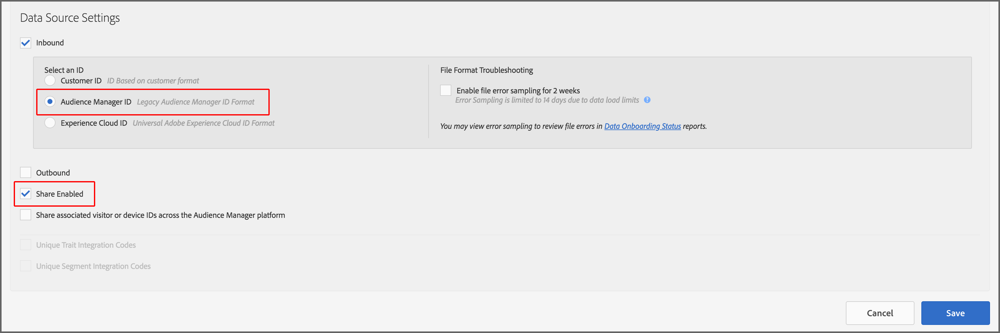
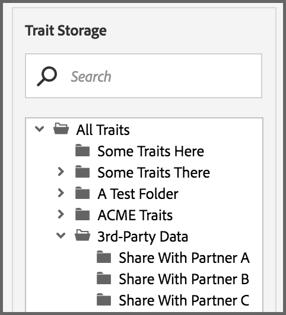

# 비공개 데이터 피드 {#private-data-feeds}

비공개 데이터 피드는 제공업체가 구매자의 데이터 액세스를 제한할 수 있는 옵션입니다. 데이터 공급자 및 구매자는 비공개 데이터 피드를 만들고 구독하기 전에 이 정보를 검토해야 합니다.

<!-- c_marketplace_privatefeed.xml -->

## 공급자에 대한 비공개 데이터 피드 {#private-data-feeds-providers}

공급자는 데이터 피드를 공개 또는 비공개로 설정할 수 있습니다. 비공개 데이터 피드를 사용하면 데이터 판매자 이름을 포함하여 데이터에 대한 구매자 액세스를 제한할 수 있습니다. 특별 할인, 할인 또는 개인 정보 보호 및 액세스 제어가 중요한 경우 개인 데이터 피드를 만들어 제공할 수 있습니다. 비공개 데이터 피드를 사용하면 구매자 요청을 검토하고 승인할 수 있습니다. 요청을 승인하면 피드가 구매자에게 공개 데이터 피드와 같은 모양으로 표시됩니다. **[!UICONTROL Audience Marketplace > My Shared Data]**&#x200B;에서 모든 피드를 보고 관리할 수 있습니다. 아래 표시된 대로 이 유형의 피드는 상태 열에 &quot;비공개&quot;로 표시됩니다.

### 피드 요청 관리

[!UICONTROL My Shared Data]에서 개인 데이터 피드의 이름을 클릭하면 여러 탭이 포함된 페이지로 이동합니다. 탭을 클릭하여 개인 데이터 피드 요청을 관리합니다.

다음 표는 각 작업 탭에서 제공하는 역할 또는 기능을 정의합니다.

<table id="table_AFB429CA52A34658859448D9A5215F9F"> 
 <thead> 
  <tr> 
   <th colname="col1" class="entry"> 탭 </th> 
   <th colname="col2" class="entry"> 설명 </th> 
  </tr> 
 </thead>
 <tbody> 
  <tr> 
   <td colname="col1"> 
 현재 구독자 <b>명</b> 
 </td> 
   <td colname="col2"> 
비공개 데이터 피드를 구독한 승인된 구매자를 나열합니다. 
 </td> 
  </tr> 
  <tr> 
   <td colname="col1"> 
 잠재적 구독자 <b>명</b> 
 </td> 
   <td colname="col2"> 
비공개 데이터 피드에 가입하지 않은 승인된 구매자를 나열합니다. 
 
승인을 통해 구매자는 데이터 피드를 공개인 것처럼 볼 수 있습니다. 따라서 구독하기 전에 피드를 검토하고 평가할 수 있습니다. 잠재 구독자로 나열된 구매자에게 데이터 피드에 대한 할인을 제공할 수도 있습니다. 구매자가 구독하면 프로필이 <b>명의 현재 구독자</b>(으)로 이동합니다. 
 </td>
  </tr> 
  <tr> 
   <td colname="col1"> 
 <b>개의 액세스 요청</b> 
 </td>
   <td colname="col2"> 
비공개 데이터 피드에 대한 새 구독 요청을 나열합니다. 이 탭을 눌러 구매자 요청을 검토, 승인 또는 거부합니다. 

    <ul id="ul_BE0A835A90B14C05B3F63226B79D052D"> 
     <li id="li_2C5686CEB6F4430BA18AED5AD75C330A">승인된 구매자가 <b>개의 잠재적 구독자</b>(으)로 이동합니다. </li>
     <li id="li_929591FCF81E43A3881813BDBD3AC278">거부된 구매자가 <b> 액세스 거부됨</b>(으)로 이동합니다. </li>
    </ul> </td>
  </tr>
  <tr> 
   <td colname="col1"> 
 <b>개의 세부 정보 요청</b> 
 </td>
   <td colname="col2"> 
데이터 피드를 아직 구독하지 않았으며 피드에 대한 자세한 정보를 요청한 승인된 구매자를 나열합니다. 
 
승인을 통해 구매자는 데이터 피드를 공개인 것처럼 볼 수 있습니다. 따라서 구독하기 전에 피드를 검토하고 평가할 수 있습니다. 액세스를 요청하는 구매자에게 데이터 피드에 대한 할인을 제공할 수도 있습니다. 상세내역 요청에 응답하면 이 탭에서 구매자 프로파일이 제거됩니다. 아직 구독하지 않은 구매자 프로필은 <b>명의 잠재적 구독자</b>에 있습니다. 
 </td>
  </tr>
  <tr> 
   <td colname="col1"> 
 <b> 액세스 거부됨</b> 
 </td> 
   <td colname="col2"> 
비공개 데이터 피드에 대해 거부된 구독 요청을 나열합니다. 
 
거부된 구매자를 다시 승인하려면  거부 상태을(를) <b> 허용</b>(으)로 변경하십시오. 구매자를 <b>명의 잠재적 구독자</b>(으)로 이동합니다. 
 </td> 
  </tr> 
 </tbody> 
</table>

### 다음 단계

다음 설명서는 비공개 데이터 피드를 시작하는 데 도움이 될 수 있습니다.

* [공개 또는 비공개 데이터 피드 만들기](../../features/audience-marketplace/marketplace-data-providers/marketplace-create-manage-feeds.md#create-public-private-data-feed)
* [개인 피드 요청 검토, 승인 또는 거부](../../features/audience-marketplace/marketplace-data-providers/marketplace-create-manage-feeds.md#manage-private-requests)
* [구매자를 위한 비공개 데이터 피드](../../features/audience-marketplace/marketplace-private-feeds.md#private-data-feeds-for-buyers)

## 구매자를 위한 비공개 데이터 피드 {#private-data-feeds-for-buyers}

구매자는 다른 오퍼와 마찬가지로 [Marketplace](../../features/audience-marketplace/marketplace-data-buyers/marketplace-data-buyers.md#about-marketplace)에 비공개 데이터 피드가 표시됩니다. 단, 이 경우 피드 목록에는 트레이트, 고유 사용자 및 사용자 겹침에 대한 요약 정보가 표시되지 않습니다. 또한 데이터 판매자는 [!UICONTROL Marketplace] 목록의 [!UICONTROL Provider] 열에 이름을 표시하거나 숨길 수 있습니다. 판매자가 구독 요청을 승인하면 비공개 피드의 모든 데이터를 사용할 수 있게 됩니다(공개 피드와 동일하게 작동). 아래의 [!UICONTROL Marketplace] 예제에서는 구매자가 사용할 수 있는 3가지 피드 유형을 나열합니다.

피드 유형은 다음과 같습니다.

이 표에서는 이러한 다양한 피드 유형이 데이터를 표시하거나 숨기는 방법을 설명합니다.

<table id="table_41D4A798ACF548A3A03ACB427CA4652D"> 
 <thead> 
  <tr> 
   <th colname="col1" class="entry"> 피드 유형 </th> 
   <th colname="col2" class="entry"> 설명 </th> 
  </tr> 
 </thead>
 <tbody> 
  <tr> 
   <td colname="col1"> 
<b> 공개</b> 
 </td> 
   <td colname="col2"> 
공급자의 이름, 트레이트 및 고유 데이터가 목록에 나타납니다. 
 </td> 
  </tr> 
  <tr> 
   <td colname="col1"> 
<b> 브랜딩이 없는 비공개</b> 
 </td> 
   <td colname="col2"> 
제공자의 이름이 "개인 판매자"로 설정되고 트레이트 카운트, 고유 데이터 및 트레이트 겹치기 데이터를 볼 수 없습니다. 
 </td> 
  </tr> 
  <tr> 
   <td colname="col1"> 
<b> 브랜딩이 있는 비공개</b> 
 </td> 
   <td colname="col2"> 
공급자의 이름이 목록에 표시되지만 트레이트 카운트, 고유 데이터 및 트레이트 겹치기 데이터를 볼 수 없습니다. 
 </td> 
  </tr> 
 </tbody> 
</table>

### 다음 단계

액세스 권한을 요청하려면 [개인 데이터 피드 구독](../../features/audience-marketplace/marketplace-data-buyers/marketplace-manage-subscriptions.md#subscript-private-data-feed)을 참조하세요.

## 데이터 제공자와 데이터 구매자 간의 공유 관계를 설정하는 방법 {#set-up-sharing-relationship}

### 1단계 - 지원 - 데이터 제공업체 및 데이터 구매자

프로세스의 첫 번째 단계에는 Adobe Consulting 또는 고객 지원 센터의 개입이 필요합니다. 데이터 제공업체 및 데이터 구매자는 Adobe Consulting 또는 고객 지원 센터에 문의하여 활성화를 요청해야 합니다.

### 2단계 - 데이터 공급자 - 새 데이터 Source 만들기

Audience Manager 계정에서 다음을 사용하여 새 쿠키 데이터 소스를 만듭니다.

* 인바운드 키로 **Audience Manager ID**;
* **공유 사용** 옵션이 선택되었습니다.

**저장**&#x200B;을 클릭하면 **트레이트 저장소 > 타사 데이터**&#x200B;에서 새 하위 폴더가 자동으로 만들어집니다.

### 3단계 - 데이터 공급자 - 공유할 트레이트 식별

이 단계에서는 파트너와 공유할 트레이트를 식별합니다. 새 트레이트를 만들거나 기존 트레이트를 편집할 수 있습니다. 어떤 경우든 트레이트가 필요합니다.

* 2단계의 일부로 만든 데이터 소스와 연결
* 타사 데이터 아래의 새로 생성된 하위 폴더에 저장됩니다.

[특성 만들기](/help/using/features/traits/create-onboarded-rule-based-traits.md) 및 [특성 편집](/help/using/features/traits/manage-trait-rules.md#edit-trait)에 대해 자세히 알아보세요.

### 4단계 - 데이터 공급자 - 데이터 피드 만들기

그런 다음 데이터 피드를 만들어 데이터 구매자와 트레이트를 공유합니다. 데이터 피드를 만드는 방법에 대한 지침은 [공개 또는 개인 데이터 피드 만들기](/help/using/features/audience-marketplace/marketplace-data-providers/marketplace-create-manage-feeds.md)를 참조하세요.

>[!IMPORTANT]
>
>설정에서 개인 옵션을 선택합니다. 이 필드를 공개로 설정하면 모든 Audience Marketplace 고객이 피드에 가입할 수 있습니다.

### 5단계 - 데이터 구매자 - 액세스 요청

**Audience Marketplace > 마켓플레이스**(으)로 이동합니다. 이전 단계에서 데이터 공급자가 만든 데이터 피드를 검색합니다. **액세스 요청**&#x200B;을 클릭합니다. 이제 데이터 공급자 측의 지정된 연락처에 전자 메일 알림이 전송됩니다. [개인 데이터 피드 구독](/help/using/features/audience-marketplace/marketplace-data-buyers/marketplace-manage-subscriptions.md#subscript-private-data-feed)도 참조하세요.

### 6단계 - 데이터 공급자 - 액세스 권한 부여

**Audience Marketplace > 내 공유 데이터**(으)로 이동하여 4단계에서 만든 피드를 검색합니다. 새 액세스 요청을 클릭하고 **액세스 허용**&#x200B;을 클릭하여 요청을 승인합니다. [비공개 피드 요청 검토, 승인 또는 거부](/help/using/features/audience-marketplace/marketplace-data-providers/marketplace-create-manage-feeds.md#manage-private-requests)도 참조하세요.

### 7단계 - 데이터 구매자 - 구독 켜기

데이터 공급자가 데이터 피드에 대한 액세스 권한을 부여하면 **Audience Marketplace > 마켓플레이스**&#x200B;에서 계정의 피드를 볼 수 있습니다. 세부 정보를 검토하고 구독 단추를 설정한 다음 **검토 및 구독**&#x200B;을 클릭합니다. 타사 특성을 찾을 수 있는 위치에 대한 자세한 내용은 [구독한 데이터 피드에 대한 저장소](/help/using/features/audience-marketplace/marketplace-data-buyers/marketplace-manage-subscriptions.md#find-subscribed-data-fee)를 참조하십시오.

이러한 트레이트는 데이터 공급자의 계정에서만 편집할 수 있습니다.
