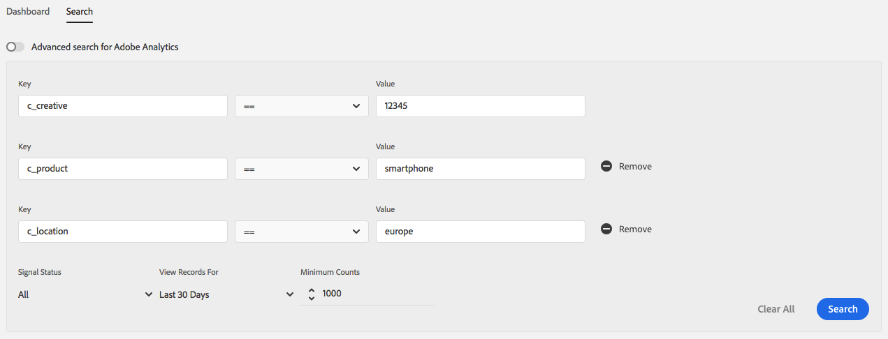

# Search Signals by Key-Value Pairs {#search-signals-by-key-value-pairs}

각 키-값 쌍을 기준으로 하나 또는 여러 개의 신호를 검색합니다.
To search for more than one signal, click the  button. 검색할 키-값 쌍을 입력한 다음 다음 필터를 사용하여 결과를 좁힙니다.

* **신호 상태**: 트레이트, 사용하지 않은 신호 또는 두 가지 모두에 포함된 신호를 검색할 수 있습니다.
* **레코드 보기**: 수신된 신호를 검색할 시간 간격을 선택합니다.
* **최소 카운트**: 선택한 간격에는 지정된 최소 합계 수를 가진 신호만 표시합니다.

>[!IMPORTANT]
>
>사용자 경험을 간소화하기 위해 키-값 쌍 검색 결과는 데이터 샘플링을 기반으로 합니다. See [Data Sampling and Error Rates](/help/using/reporting/report-sampling.md) for details on how [!DNL Audience Manager] uses data sampling and why slight result variations may appear when comparing key-value search to general searches.

When searching for signals using multiple key-value pairs, [!DNL Audience Manager] links the pairs using the logical **AND** operator. 예를 들어, 다음 키-값 쌍으로 검색을 수행한다고 가정합니다.

* [!DNL c_creative == "12345"]
* [!DNL c_product == "smartphone"]
* [!DNL c_location == "europe"]

This search will return only results that qualify for all three filters on the same call: `c_creative == "12345"` `AND` `c_product == "smartphone"` `AND` `c_location == "europe"`.

## Case Insensitivity and Search Auto-Completion {#case-insensitivity}

키와 값 검색 필드는 대/소문자를 구분하지 않습니다. 주요 검색 필드에는 자동 완성 제안이 포함됩니다.

Let's say [!DNL Audience Manager] received the following signals:

* `productCategory == smartphone`
* `newProduct == iPhone`
* `PRODUCT == phone`
* `product == PHONE`

When you enter `product` in the key search field, you receive auto-completed suggestions for `productCategory`, `newProduct`, `PRODUCT`, and `product`.

Similarly, when you search for `product == phone`, [!UICONTROL Data Explorer] returns results for both `PRODUCT == phone` and `product == PHONE`.
채워진 특성 구현은 대소문자를 구분하지 않습니다. A trait containing the signal with the key-value pair `PRODUCT == SMARTPHONE` also qualifies the signal with the key-value pair `product == smartphone`.