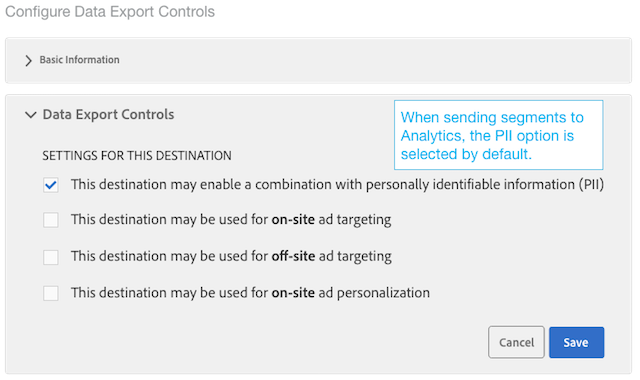
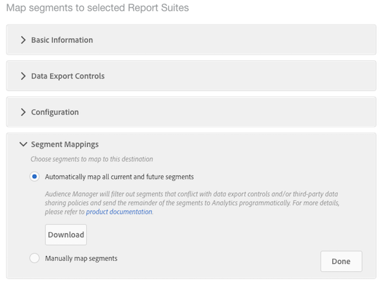

# Analytics 대상 구성

## 요구 사항 {#requirements}

Analytics 대상을 구성하려면 Audience Manager 사용자에게 관리자 권한이 있어야 합니다. 다음을 참조하십시오 [사용자 만들기](/help/using/features/administration/administration-overview.md#create-users) 관리 안내서에서 참조하십시오. 이 있는 경우 `CREATE_DESTINATIONS` [와일드카드 권한](/help/using/features/administration/administration-overview.md#wild-card-permissions) 가 Analytics 대상을 만들기에 충분하지 않습니다.
추가 요구 사항은 의 전제 조건 을 참조하십시오. [Audience Analytics](https://experienceleague.adobe.com/docs/analytics/integration/audience-analytics/mc-audiences-aam.html).

## 기본 Analytics 대상 및 새 Analytics 대상

| Analytics 대상 유형 | 설명 |
|---|---|
| 기본값 | 이 기본 대상의 이름은 편집할 수 있는 &quot;Adobe Analytics&quot;입니다. 매핑된 보고서 세트 ID는 Audience Manager 트레이트 및 세그먼트의 폴더 저장소에 표시됩니다.    Audience Manager은 계정에 다음이 있는 경우 하나의 대상을 자동으로 만듭니다.    <ul><li>에 설명된 요구 사항 충족 [Audience Analytics](https://experienceleague.adobe.com/docs/analytics/integration/audience-analytics/mc-audiences-aam.html) 설명서를 참조하십시오.</li><li>A [보고서 세트](https://experienceleague.adobe.com/docs/analytics/admin/manage-report-suites/report-suites-admin.html) Analytics에서.</li></ul> |
| 신규 | 새 Analytics 대상을 만들려면 대상 데이터 > 대상 > 새 대상 만들기 로 이동하여 아래에 설명된 각 섹션의 단계를 따르십시오. |

## Adobe Analytics에서 세그먼트 자격 Audience Manager {#segment-qualifications}

세그먼트 정보를 Analytics 대상에 보낼 때 Audience Manager은 방문자가 자격을 갖춘 세그먼트만 보냅니다. 방문자가 세그먼트 자격을 정지하는 경우 이 정보는 다음과 같습니다. _아님_ Adobe Analytics으로 전달됩니다.

예를 들어 아래 세그먼트 규칙을 고려하십시오.

* 세그먼트 A: 트레이트 1 및 트레이트 2
* 세그먼트 B: 트레이트 1이고 트레이트 2가 아님

Analytics 보고서에서 프로필이 세그먼트 B에 대한 자격을 중지한 경우에도 두 세그먼트에 대해 적격 프로필로 표시될 수 있습니다.

## 1단계: 기본 정보 제공

이 섹션에는 Analytics 대상 생성 프로세스를 시작하는 필드와 옵션이 포함되어 있습니다. 이 섹션을 완료하려면

1. 클릭 **기본 정보** 컨트롤을 노출합니다.
2. 대상 이름을 지정합니다. 약어 및 특수 문자를 사용하지 마십시오.
3. *(선택 사항)* 대상을 설명합니다. 간결한 설명은 대상에 대한 자세한 정보를 정의하거나 제공하는 효과적인 방법입니다.
4. *(선택 사항)* 다음에서 **플랫폼** list, default set을 **모두**. 현재 이러한 옵션은 아무 작업도 하지 않습니다. 나중에 추가될 수 있는 기능을 지원하도록 설계되었습니다.
5. 다음에서 **범주** 목록, 선택 **Adobe Experience Cloud**.
6. 다음에서 **유형** 목록, 선택 **Adobe Analytics**.
7. 클릭 **저장** 구성 설정으로 이동하거나 을 클릭합니다. **데이터 내보내기 레이블** 대상에 내보내기 컨트롤을 적용합니다.

>[!NOTE]
>
>Analytics 대상의 경우 **대상 매핑 자동 채우기** 확인란 및 **세그먼트 ID** 기본적으로 옵션이 선택되어 있습니다. 이러한 설정은 변경할 수 없습니다.

## 2단계: 데이터 내보내기 제어 구성

이 섹션에는 적용되는 옵션이 포함되어 있습니다. [데이터 내보내기 제어](/help/using/features/data-export-controls.md) 를 클릭하여 Analytics 대상에 추가합니다. 데이터 내보내기 컨트롤을 사용하지 않는 경우 이 단계를 건너뜁니다. 이 섹션을 완료하려면

1. 클릭 **데이터 내보내기 제어** 컨트롤을 노출합니다.
1. 대상에 적용된 데이터 내보내기 제어에 해당하는 레이블을 선택합니다(참조) [대상에 데이터 내보내기 레이블 추가](/help/using/features/destinations/add-data-export-labels.md) ). Analytics 대상의 경우 기본적으로 PII 확인란이 선택됩니다.
1. **저장**&#x200B;을 클릭합니다.

## 3단계: 보고서 세트 매핑

구성 섹션에는 서버 측 전달이 활성화된 Analytics 보고서 세트가 나열됩니다. Analytics 대상이 여러 개 있는 경우 이러한 대상에 지정된 보고서 세트는 상호 배타적이 되며 Audience Manager에 의해 강제 적용됩니다. 이 섹션을 완료하려면

1. 클릭 **구성** 컨트롤을 노출합니다.
1. 세그먼트를 보낼 보고서 세트를 한 개 이상 선택합니다.
1. **저장**&#x200B;을 클릭합니다.

## 4단계: 세그먼트 매핑

이 섹션에서는 세그먼트를 자동 또는 수동으로 매핑할 수 있는 옵션을 제공합니다.

| 매핑 옵션 | 설명 |
|---|---|
| 현재 및 향후 모든 세그먼트 자동 매핑 | 기본적으로 이 기능은 방문자가 적격한 모든 세그먼트를 히트별로 Analytics에 보냅니다.    방문자가 단일 히트에서 150개가 넘는 Audience Manager 세그먼트에 속하는 경우 가장 최근에 자격이 있는 150개 세그먼트만 Analytics로 전송되고, 나머지 목록은 잘립니다. 세그먼트 목록이 잘렸음을 나타내는 추가 플래그가 Analytics에 전송됩니다. 이 작업은 대상자 이름 차원에 &quot;대상자 제한에 도달했습니다.&quot;로 표시되고 대상자 ID 차원에 &quot;1&quot;로 표시됩니다. 다음을 참조하십시오. [FAQ](https://experienceleague.adobe.com/docs/analytics/integration/audience-analytics/audience-analytics-workflow/mc-audiences-faqs.html) 을 참조하십시오.    또한 이 옵션은 의 대상 가용성에도 영향을 줍니다. [세그먼트 빌더](/help/using/features/segments/segment-builder.md). 예를 들어 세그먼트가 Analytics 대상에 자동으로 매핑되면에서 해당 대상을 선택할 수 없습니다. [대상 매핑](/help/using/features/segments/segment-builder.md#segment-builder-controls-destinations) 세그먼트 빌더의 섹션입니다. Analytics 대상이 회색으로 표시되고 대상 브라우저의 유형 열에 &quot;Analytics&quot;가 표시됩니다. |
| 수동으로 세그먼트 매핑 | 이 옵션은 Analytics에 전송할 세그먼트를 선택할 수 있는 검색 및 검색 컨트롤을 표시합니다.    세그먼트를 검색하려면 다음과 같이 하십시오.    <ol><li>검색 필드에 세그먼트 이름 또는 ID를 입력합니다.</li><li>클릭 <b>추가.</b></li><li>계속 검색하여 세그먼트를 추가하거나 <b>완료</b>.</li></ol>   세그먼트를 찾아보려면 다음을 수행하십시오. <ol><li>클릭 <b>모든 세그먼트 찾아보기</b>. 사용 가능한 세그먼트 목록을 표시합니다.</li><li>목록에서 사용할 세그먼트의 확인란을 선택하고 을 클릭합니다 <b>선택한 세그먼트 추가</b>.</li><li>클릭 <b>저장</b> 매핑 추가 창에서 실행하십시오. 베타 릴리스 도중에는 매핑, 시작 또는 종료 날짜를 변경할 수 없습니다.</li><li>계속 탐색하여 세그먼트를 추가하거나 <b>완료</b>.</li></ol>  |

## 다음 단계

대상을 만들고 저장한 후 Analytics에서 해당 데이터로 작업할 수 있습니다. 하지만 선택한 보고서 세트에서 데이터를 사용할 수 있으려면 몇 시간이 걸릴 수 있습니다. 다음을 참조하십시오 [Analytics에서 대상 데이터 사용](https://experienceleague.adobe.com/docs/analytics/integration/audience-analytics/audience-analytics-workflow/use-audience-data-analytics.html).
