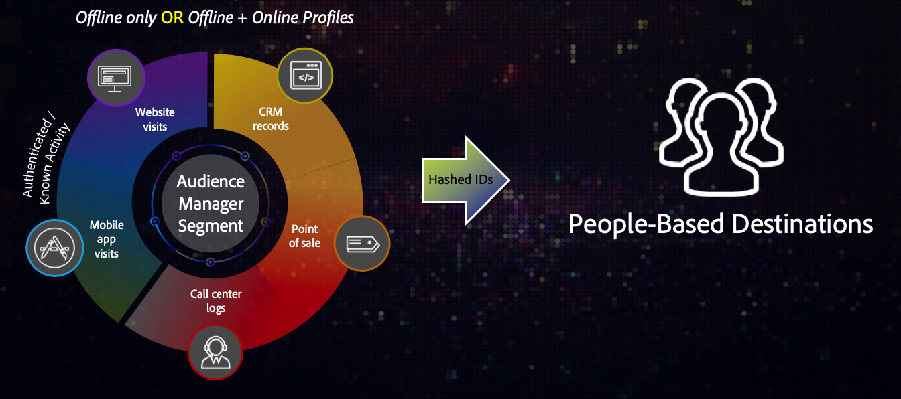

# 개요 및 사용 사례 {#overview-use-cases}

자사 대상 세그먼트를 사용자 기반 환경에 보내려면 [!DNL People-Based Destinations] 을 사용하십시오. 이러한 환경은 표시 중인 컨텐츠를 제어하는 하나의 엔티티에 속한 닫힌 에코시스템입니다. 여기에는 [!DNL Facebook] 등의 소셜 플랫폼과 고객 계정을 사용하여 표시된 콘텐츠를 개인화하는 다른 플랫폼이 포함됩니다.

>[!IMPORTANT]
>이 문서에는 이 기능의 설정 및 사용을 안내하는 제품 설명서가 포함되어 있습니다. 여기에 포함된 어떤 것도 법률적인 조언이 아닙니다. 법률 자문을 구하시려면 법률 자문을 구하십시오.

## 개요 {#overview}

[!DNL People-Based Destinations] 이메일 주소와 같이 해시된 식별자를 기반으로 대상 세그먼트를 만들기 위해 온라인 및 오프라인 데이터에  [세그멘테이션을 적용할](people-based-destinations-prerequisites.md#hashing-requirements) 수 있습니다. 그런 다음 이러한 세그먼트를 [!DNL Facebook] 등의 &quot;벽으로 둘러싸인 정원&quot;으로 보내어 소셜 플랫폼에서 대상을 타깃팅할 수 있습니다. [!DNL People-Based Destinations] 도움이 될 수 있습니다.

* 해시된 이메일 주소를 기반으로 [!DNL Facebook] 과 같은 플랫폼에 있는 오프라인 및 온라인 대상 Target;
* Audience Manager의 기존 장치 및 쿠키 타깃팅 기능을 보완합니다.
* 타사 데이터 온보딩 솔루션과 관련된 비용을 제거합니다.
* 사용자 정의 데이터 온보딩 워크플로우 개발과 관련된 비용을 제거합니다.
* 쿠키가 없는 환경에서 대상 Target
* 고객 ID에 일치하는 해시된 이메일 주소를 중복 제거하여 대상을 Target 합니다.

[!DNL People-Based Destinations] 을 사용하여 웹 사이트를 방문하지 않을 수 있는 고부가가치 고객을 세그먼트화하고 타깃팅하거나 이미 오프라인 상태로 전환한 고객 타깃팅을 중지할 수 있습니다. 또한 [!DNL Profile Merge Rules]을(를) 활용하여 오프라인 자사 데이터와 다른 Adobe Experience Cloud 솔루션의 고객 데이터를 비롯한 온라인 자사 데이터를 결합하여 소셜 미디어 광고 노력을 최적화할 수 있습니다.

## 가용성 {#availability}

[!DNL People-Based Destinations] 은 프리미엄 Audience Manager 통합입니다. 이 프리미엄 기능을 활용하려면 Adobe 담당자에게 문의하십시오.

## [!UICONTROL People-Based Destinations]을 사용해야 하는 이유 {#why-use}

**Audience Manager 내에서 전체 대상 세그먼테이션을 관리하여 고객에게 일관된 크로스 채널 경험을 제공합니다.**

Audience Manager을 통해 사용자 기반 채널에서 대상 세그먼트를 활성화하지 않으면 고객이 웹 사이트를 방문할 때 보게 되는 내용과 예를 들어 [!DNL Facebook] 피드에서 보게 되는 내용 간에 끊어진 경험이 발생합니다. 여러 채널에서 일관된 타깃팅을 사용하면 광고 비용을 최적화하면서 광고 매출을 높일 수 있습니다.

**대상을 보낼 전용 데이터 온보딩 솔루션이나 사용자 지정 워크플로우가 필요 없이 사용자 기반 채널에서 대상에게 도달합니다.**

사용자 기반 채널에서 대상을 타깃팅하는 보다 &quot;기존&quot; 방법은 광고할 플랫폼에서 수락한 형식으로 고객 데이터를 내보낸 다음 플랫폼의 전용 데이터 온보딩 방법을 사용하여 고객 데이터를 광고주 계정에 가져와야 합니다. 이 작업은 광고하려는 각 플랫폼에 대해 수행해야 하는 모든 수동 작업입니다. 또한 플랫폼마다 서로 다른 데이터 형식 요구 사항이 있으므로 프로세스가 더 지루해질 수 있습니다.

[!DNL People-Based Destinations]을 통해 Audience Manager은 고객 데이터를 중앙에서 관리하고, 대상 세그먼트를 작성하고, 여러 사용자 기반 채널에서 활성화하는 데 도움이 됩니다. Audience Manager 사용자 인터페이스 내에서 이러한 작업을 수행할 수 있으므로 각 플랫폼에 데이터를 수동으로 업로드하는 추가 작업을 방지할 수 있으므로 프로세스에서 중요한 시간을 절약할 수 있습니다.

**순전히 오프라인 프로필에서 대상 세그먼트를 만들고 활성화합니다.**

[!DNL People-Based Destinations] 이전에는 장치 활동을 기반으로 대상 세그먼트만 활성화할 수 있었던 문제를 해결했습니다. [!DNL People-Based Destinations]을(를) 사용하면 자신의 [!DNL CRM]에서 순전히 오프라인 데이터에서 세그먼트를 만들고, 사용자 기반 플랫폼에서 활성화할 수 있습니다. 또한 오프라인 데이터를 이미 Audience Manager에 있는 장치 데이터와 상호 연관시킬 수 있습니다.

**Audience Manager의 데이터 거버넌스 및 개인 정보 제어 기능을 활용하여 고객 데이터를 안전하게 처리합니다.**

[!DNL People-Based Destinations] 에는 되돌릴 수 없는 해시된 식별자만 사용해야 합니다. 따라서 각 대상 플랫폼에 고객 데이터를 수동으로 업로드하는 것과 관련된 위험이 줄어듭니다.

[!UICONTROL People-Based Destinations] 사용 시 데이터 흐름에 대한 개요를 보려면 아래 비디오를 시청하십시오.

>[!VIDEO](https://video.tv.adobe.com/v/28968/)

## 사용 사례 {#use-cases}

[!DNL People-Based Destinations] 사용 방법과 시기를 더 잘 이해할 수 있도록 Audience Manager 고객이 이 기능을 사용하여 해결할 수 있는 두 가지 샘플 사용 사례가 있습니다.

### 사용 사례 #1 {#use-case-1}

온라인 소매업체는 소셜 플랫폼을 통해 기존 고객에게 도달하고 이전 주문에 따라 개인화된 오퍼를 제공하려고 합니다. [!DNL People-Based Destinations]을(를) 사용하여 온라인 소매업체는 해시된 이메일 주소를 자체 [!DNL CRM]에서 Audience Manager으로 수집하고, 자체 오프라인 데이터에서 세그먼트를 작성하고, 이러한 세그먼트를 광고할 소셜 플랫폼으로 전송하여 광고 비용을 최적화할 수 있습니다.

### 사용 사례 #2 {#use-case-2}

항공사에는 다양한 고객 계층(청동, 실버, 골드)이 있으며, 소셜 플랫폼을 통해 각 계층에 개인화된 오퍼를 제공하려고 합니다. 이 회사는 Audience Manager을 사용하여 웹 사이트에서 고객 활동을 분석합니다. 그러나 모든 고객이 항공사의 모바일 앱을 사용하는 것은 아니며, 일부 고객은 회사의 웹 사이트에 로그인하지 않았습니다. 이 고객에 대해 회사가 가지고 있는 유일한 식별자는 멤버십 ID 및 이메일 주소입니다.

소셜 미디어 및 유사한 사용자 기반 채널에서 타깃팅하기 위해 해시된 이메일 주소를 식별자로 사용하여 [!DNL CRM]에서 Audience Manager으로 고객 데이터를 온보딩할 수 있습니다.

다음으로, 오프라인 데이터를 기존의 온라인 활동 트레이트와 결합하여 [!DNL People-Based Destinations]을 통해 타깃팅할 수 있는 새로운 대상 세그먼트를 만들 수 있습니다.
