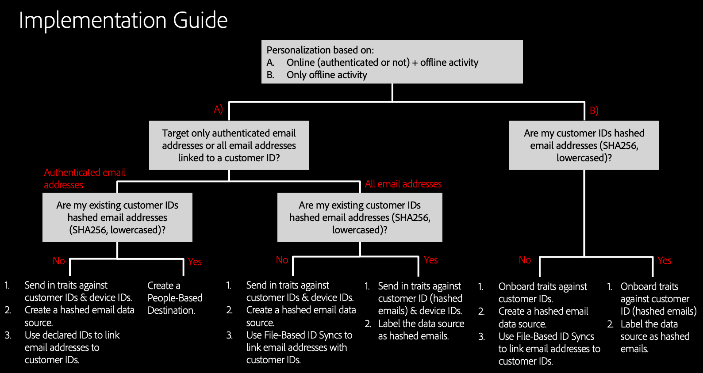

# 구현 지침 {#implementation-guidance}

>[!IMPORTANT]
>이 문서에는 이 기능의 설정 및 사용을 안내하기 위한 제품 설명서가 포함되어 있습니다. 여기에 들어 있는 어떠한 것도 법적 충고이다. 법률 자문을 위해 법률 자문을 구할 수 있는 법률 자문을 구할 수 있다.

[!DNL People-Based Destinations] 고객 데이터의 구성 방식에 따라 다양한 구현 전략을 제공합니다. 이 문서에서는 시나리오에 따라 [!DNL People-Based Destinations]에 대해 수행해야 하는 구현 단계에 대한 개요를 제공합니다.

## 개요 {#overview}

[!DNL People-Based Destinations]의 구성은 Audience Manager의 여러 섹션을 안내합니다. Audience Manager에 이미 있는 고객 데이터의 종류, 수행하려는 대상 유형 등에 따라 다양한 설정 및 데이터 온보딩 방법이 필요합니다.

>[!IMPORTANT]
> [!DNL People-Based Destinations]을(를) 구성하기 전에 이 집필을 주의깊게 읽으십시오. 이 안내서를 읽고 나면 [!DNL People-Based Destinations]을 통해 활성화할 시나리오에 대해 명확하게 이해해야 합니다.

[!DNL People-Based Destinations]을(를) 사용하기 전에 분명히 해야 하는 6가지 구현 측면이 있습니다. 이 문서는 시나리오에 대한 구현 단계를 정확하게 따를 수 있도록 현재 구성을 이해하는 데 도움이 됩니다.

## 1. 사용 사례 정의 {#defining-your-use-case}

[!DNL People-Based Destinations] 구현을 시작하기 전에 이 기능을 사용할 사용 사례를 명확히 정의해야 합니다. 대상 활동을 기준으로 [!DNL People-Based Destinations]을 사용하여 두 가지 방법으로 대상을 타깃팅할 수 있습니다.

**A) 통합된 온라인 및 오프라인 사용자 활동을 기반으로 하는 대상 타깃팅입니다**. 이 시나리오에서는 Audience Manager의 기존 대상 데이터를 내부 [!DNL CRM] 시스템의 데이터와 결합하고 결과 대상 세그먼트를 [!DNL People-Based Destinations]으로 보내려고 합니다. 다음은 이 시나리오를 보여주는 예입니다.

항공사 Monarch는 고객 계층(Bronze, Silver 및 Gold)이 다르므로 소셜 플랫폼을 통해 각 계층에 맞춤형 제안을 제공할 수 있습니다. Audience Manager을 사용하여 웹 사이트에서 고객 활동을 분석합니다. 그러나 모든 고객이 항공사의 모바일 앱을 사용하는 것은 아니며, 일부 고객은 회사의 웹사이트에 로그인하지 않았습니다. 고객 데이터는 대부분 멤버십 ID 및 이메일 주소로 제한됩니다.

소셜 미디어 및 유사한 사용자 기반 채널에서 타깃팅하기 위해, [해시된 이메일 주소](people-based-destinations-prerequisites.md)를 Audience Manager에 가져오고 기존 온라인 활동 트레이트와 결합하여 새로운 대상 세그먼트를 만들 수 있습니다. 그런 다음 해당 세그먼트를 사용하여 [!DNL People-Based Destinations]을 통해 고객을 타깃팅할 수 있습니다.

**B) 오프라인 사용자 활동만을 기반으로 하는 고객 타깃팅**. 이 시나리오에서는 [!DNL CRM] 시스템에 고객 이메일 주소와 기타 고객 속성이 포함되어 있지만 고객은 웹 사이트와 전혀 상호 작용하지 않으므로 Audience Manager에서 고객 활동이 없습니다. 다음은 이 시나리오를 보여주는 예입니다.

텔레콤 서비스 제공업체인 Your company, a0/>은(는) 이메일 주소와 같은 고객 데이터를 보관하고 통신 계획을 내부 [!DNL CRM]에 구입했습니다. 소셜 플랫폼의 기존 고객을 타깃팅하여 기존 구독을 기반으로 업그레이드 패키지를 제공하고자 합니다. 이렇게 하려면 해시된 고객 이메일 주소를 Audience Manager으로 인제스트하고 기존 고객 가입을 기반으로 세그먼트를 만들 수 있습니다. 그런 다음 이러한 세그먼트를 [!DNL People-Based Destinations]으로 보내 개인화된 오퍼로 고객을 타깃팅할 수 있습니다.

## 2. 타깃팅된 이메일 주소 유형을 정의합니다. {#define-target-email}

구현 전략을 정의하는 두 번째 단계는 타깃팅할 고객 이메일 주소 유형을 결정하는 것입니다.

**A) 인증된 이메일 주소를 기반으로 하는 대상 타깃팅입니다**. 이 시나리오에서는 사용자가 여러 이메일 주소와 연관된 여러 개의 계정을 가지고 있으며 웹 사이트에서 인증하는 이메일 주소를 기반으로 개인화된 오퍼로 타깃팅하고자 할 수 있습니다.

**B) 관련된 모든 이메일 주소를 기반으로 하는 대상 타깃팅입니다**. 이 시나리오에서는 사용자가 여러 이메일 주소와 연결된 계정을 여러 개 가지고 있으며 인증된 활동과 관계없이 모든 연결된 이메일 주소에 대해 계정을 타깃팅하려고 합니다.

## 3. {#identify-customer-id}이(가) 있는 고객 ID 유형(CRM ID)을 식별합니다.

[!DNL People-Based Destinations]에서 대상을 타깃팅하려면 [SHA256 해시된 고객 이메일 주소](people-based-destinations-prerequisites.md) 버전을 보내야 합니다. 기존 Audience Manager 구성에 따라 다음 2가지 시나리오 중 하나에 자신을 나타낼 수 있습니다.

**A) Audience Manager 고객 ID([DPUUID](../../reference/ids-in-aam.md))가 이미 소문자이고 해시된 이메일 주소입니다**. 이 시나리오에서는 이러한 기존 ID를 사용하여 [!DNL People-Based Destinations]에서 대상을 타깃팅할 수 있습니다.

**B) Audience Manager 고객 ID([DPUUID](../../reference/ids-in-aam.md))가 소문자가 아닌 해시된 이메일 주소입니다**. 이 시나리오에서는 기존 고객 ID를 [!DNL People-Based Destinations]으로 보낼 수 없습니다. [!DNL People-Based Destinations]을(를) 사용하려면 기존 고객 ID와 고객 이메일 주소의 해시 버전을 모두 포함하는 소문자 간에 ID 동기화를 수행해야 합니다. 이 작업은 [파일 기반 ID 동기화](../../integration/sending-audience-data/batch-data-transfer-explained/id-sync-file-based.md)를 사용하거나 [선언된 ID](../declared-ids.md)를 사용하여 수행할 수 있습니다.

## 4. 특성 자격 {#trait-qualification}

[!DNL People-Based Destinations]에서 고객을 정확하게 타깃팅하려면 수행하려는 대상 타깃팅 유형에 따라 사용자가 규칙 기반 트레이트나 온보드 트레이트를 자격이 있어야 합니다.

**A) 규칙 기반의 트레이트를 위해 고객 ID와 디바이스 ID를 실시간으로 검증합니다**. 이 옵션은 [1의 사용 사례 A에 적용됩니다. 사용 사례 정의](people-based-destinations-workflow.md#defining-your-use-case). 온라인 및 오프라인 활동을 기반으로 고객을 타깃팅하려는 계획인 경우, 이미 [규칙 기반 트레이트](../traits/trait-and-segment-qualification-reference.md)에 대한 대상을 정합니다.

**B) 인바운드 데이터 파일을 통해 고객 ID에 대한 트레이트를 게시합니다**. 이 옵션은 [1의 사용 사례 B에 적용됩니다. 사용 사례 정의](people-based-destinations-workflow.md#defining-your-use-case). 순전히 오프라인 활동을 기반으로 고객을 타깃팅할 때 [인바운드 데이터 파일](../../integration/sending-audience-data/batch-data-transfer-explained/inbound-file-contents.md)을 통해 온보드 트레이트에 대한 고객 ID의 자격을 부여해야 합니다.

## 5. 데이터 소스 및 해시된 이메일 주소 {#create-label-data-sources} 만들기 또는 레이블 지정

Audience Manager에 있는 고객 ID의 유형에 따라 달라집니다([3 참조). 고객 ID 유형(CRM ID)을 식별합니다. ](people-based-destinations-workflow.md#identify-customer-id)이(가) 있는 경우 다음 시나리오 중 하나에 자신을 찾을 수 있습니다.

**A) 기존 데이터 소스에 레이블을 지정합니다**. 이 옵션은 Audience Manager 고객 ID([DPUUID](../../reference/ids-in-aam.md))가 이미 소문자이고 해시된 이메일 주소가 있는 시나리오에 적용됩니다. 이 경우 ID를 [!DNL PII] 데이터 소스로 저장하는 데이터 소스에 레이블을 지정해야 합니다. 데이터 소스 설정에 대한 자세한 내용은 [데이터 소스 설정](../datasources-list-and-settings.md)을 참조하십시오. 해야 할 일은 개인 식별 정보에 연결할 수 없음 옵션을 선택 취소해야 합니다.

**B) 새 데이터 소스를 만듭니다**. 이 옵션은 Audience Manager 고객 ID([DPUUID](../../reference/ids-in-aam.md))가 해시된 이메일 주소가 아닌 시나리오에 적용됩니다. 이 경우 새로운 크로스 디바이스 데이터 소스를 만들고 해시 처리된 이메일 주소를 이에 대해 게시해야 합니다. 다음 두 가지 방법으로 이 작업을 수행할 수 있습니다.

* 파일 기반 ID 동기화를 사용하십시오. ID 동기화 파일의 모습에 대한 자세한 내용은 [ID 동기화 파일 이름 및 컨텐츠 요구 사항](../../integration/sending-audience-data/batch-data-transfer-explained/id-sync-file-based.md)을 참조하십시오. 이 방법을 사용할 때 [!DNL CRM] 데이터베이스에서 해시된 모든 이메일 주소를 타깃팅할 수 있습니다.
* 인증된 고객 ID를 전달할 때 [선언된 ID](../declared-ids.md)를 사용하여 해시된 이메일 주소를 선언합니다. 이 방법을 사용할 때 Audience Manager은 사용자를 대신하여 온라인에서 인증된 사용자의 해시 이메일 주소만 타깃팅합니다. 사람 기반 채널에서 타깃팅된 이메일 주소는 선언된 ID 이벤트 호출에 있는 이메일 주소만 해당됩니다. 고객 ID와 연결된 다른 이메일 주소는 실시간으로 활성화되지 않습니다.

## 6. 세그먼테이션에 프로필 병합 규칙 사용 {#use-profile-merge-rules}

사용 사례에 따라([1 참조). 사용 사례 정의](people-based-destinations-workflow.md#defining-your-use-case))에는 세그먼테이션에 [!DNL Profile Merge Rules]을 사용하는 두 가지 방법이 있습니다.

**A) 기존[!DNL Profile Merge Rules]**&#x200B;을 사용합니다. 이 옵션은 첫 번째 사용 사례(결합된 온라인 및 오프라인 사용자 활동을 기반으로 대상 타깃팅)에 적용됩니다. 이 시나리오에서는 Audience Manager에 기존 고객 활동이 있으며 세그멘테이션에 사용한 하나 이상의 프로필 병합 규칙을 이미 정의했습니다. 이 경우 새 [!DNL Profile Merge Rules]을(를) 만들 필요가 없습니다.

**B) 병합 규칙을 새로  [!DNL All Cross-Device Profiles] 만듭니다**. 이 옵션은 두 번째 사용 사례(오프라인 사용자 활동에만 기반한 대상 타깃팅)에 적용됩니다. 이 시나리오에서는 오프라인 고객 데이터를 [!DNL CRM]의 Audience Manager으로 가져오고 해당 데이터에서 세그먼트를 만듭니다. 이를 위해 [!DNL People-Based Destinations]은(는) **[!DNL All Cross-Device Profiles]**&#x200B;이라는 새로운 네 번째 프로필 병합 규칙을 도입합니다. 이것은 순전히 오프라인 데이터를 세그먼트화할 때 사용해야 하는 규칙입니다.
