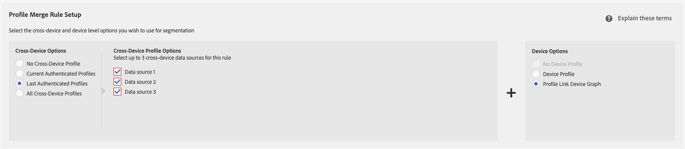
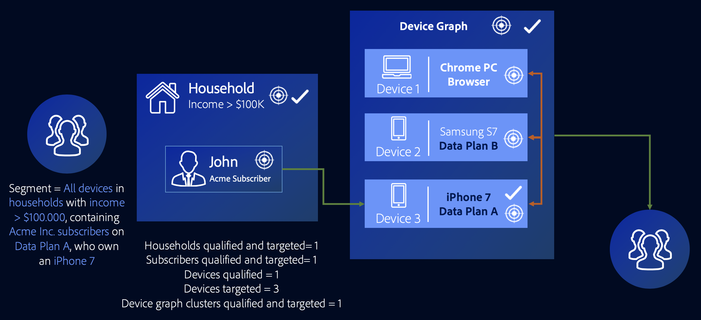

# 외부 장치 그래프 사용 사례 {#external-device-graph-use-cases}

외부 장치 그래프를 통해 알 수 없는 사용자에 대한 전망, 재타겟팅 및 개인화에 대한 Recommendations 및 사용 사례. 외부 장치 그래프는 Audience Manager과 별개인 장치 그래프로 정의된다. 여기에는 Adobe과 타사 결정론적 또는 확률론적 장치 그래프 회사의 통합이 포함됩니다.

## 권장 사항 {#recommendations}

다음과 같은 캠페인에 대한 타사 장치 그래프 옵션을 고려하십시오.

* 디지털 속성에서 낮은 수준의 인증을 갖습니다. 사용 [!UICONTROL Profile Link Device Graph option] 인증된 사용자가 많은 경우.
* 큰 대상을 Target 합니다. 타사 장치 그래프는 인증된 데이터와 인증되지 않은 데이터를 포함합니다.
* 개인 및 가구 수준에서 인증된 방문자 및/또는 인증되지 않은 방문자를 세그먼트화합니다.

<!-- 
## Prospecting/Branding Use Case {#prospecting-branding-use-cases}

A branding campaign is designed to reach as many people as possible. It places few limits on segment qualification. But, these campaigns can waste budget and impressions by constantly targeting people who see your content multiple times and don't convert. A [!UICONTROL Profile Merge] rule that uses the [!DNL Device Co-op] or third-party option can help you create an efficient branding campaign. For example, you can add these unknown users to a "not in-market" segment after seeing them across multiple devices for your set frequency cap.

<table id="table_00F6EED172574E80A38CADA8A92A23B1"> 
 <thead> 
  <tr> 
   <th colname="col1" class="entry"> Use Case </th> 
   <th colname="col2" class="entry"> Description </th> 
  </tr> 
 </thead>
 <tbody> 
  <tr> 
   <td colname="col1"> 
 <b>Conditions</b> 
 </td> 
   <td colname="col2">This use case assumes these conditions: 
 
     <ul id="ul_F5CA7EE525774F7EBA5FBB5F94E4EDC8"> 
      <li id="li_81AE304924724146A24FAB5B6533AD8E">You want to deliver a maximum of 10 impressions to an anonymous user for a specific ad campaign. </li> 
      <li id="li_E371F989735245B0B82433DE240D56D0">A user has 4 devices and may or may not have authenticated on your site. </li> 
      <li id="li_9231ABE15CA249E6B79D8BF0E511FD33">An anonymous user sees the ad a total of 10 times while browsing in an unauthenticated state on their current device and 3 devices linked to the current device by an external device graph. </li> 
      <li id="li_8C276C07019C49EFA3A0D0D54CF73C31">You have defined an  Audience Manager segment to qualify anonymous users after they have seen 10 impressions. </li> 
     </ul> 
 </td> 
  </tr> 
  <tr> 
   <td colname="col1"> 
 <b>Results</b> 
 </td> 
   <td colname="col2"> 
Given these conditions,  Audience Manager: 
 
 
     <ul id="ul_8E988B1005324526BC6DC6637BBACCFB"> 
      <li id="li_C9DD546754914BACB8F4C92C7D4ED70E">Merges the anonymous, unauthenticated activity collected from the current device and the 3 devices linked by the external device graph (the ad impressions from each device). </li> 
      <li id="li_FB55CB9116074525BA30FF062D1136AE">Evaluates the unauthenticated user for segment qualification based on a combination of anonymous activity across all 3 devices linked by the external device graph and the current device. </li> 
      <li id="li_B28EB32F718145A7ABBDAC0AF75E2AFC">Sends the segment to any real-time destination for use as a suppression segment on the current device and all 3 devices linked by the external device graph. </li> 
     </ul> 
 </td> 
  </tr> 
 </tbody> 
</table>

## Retargeting or Site Personalization Use Case {#retargeting-use-case}

These strategies are designed to bring an unauthenticated or unknown user back to your site or personalize their browsing experience while they're on-site.

<table id="table_0EE2052AA3E744B3B76036FC06B5A453"> 
 <thead> 
  <tr> 
   <th colname="col1" class="entry"> Use Case </th> 
   <th colname="col2" class="entry"> Description </th> 
  </tr> 
 </thead>
 <tbody> 
  <tr> 
   <td colname="col1"> 
 <b>Conditions</b> 
 </td> 
   <td colname="col2">This use case assumes these conditions: 
 
     <ul id="ul_FD0B869B4AF3453FAEC9BA3A45ABF039"> 
      <li id="li_8E30BAED42E94AB3B81FCB1C7464E5FC">You want to deliver a personalized on-site and/or off-site experience to an anonymous user based on their activity on your site while in an unauthenticated state. </li> 
      <li id="li_3DBE53BA94324F1BA1C52A37AD4E426C">A user has multiple devices and may or may not have authenticated to your site. </li> 
      <li id="li_F867AFBDC1A54CD6A68AB0EC196E27C9">A user views multiple pages on your site while browsing in an unauthenticated state on their current device and 3 other devices linked by an external device graph. </li> 
      <li id="li_7E35D77949CE4E69BD51655AA4C40BEE">You have defined an  Audience Manager segment to qualify users after they have viewed multiple pages on your site while browsing in an unauthenticated state.</li>
     </ul> 
 </td> 
  </tr> 
  <tr> 
   <td colname="col1"> 
 <b>Results</b> 
 </td> 
   <td colname="col2"> 
Given these conditions,  Audience Manager: 
 
 
     <ul id="ul_301339426B0643B295DC5B17E1939CFB"> 
      <li id="li_7E8BC3B179804F4A929497DE81E76911">Merges the anonymous, unauthenticated activity collected from the current devices and the 3 devices linked by the external device graph (the multiple page views from each device). </li> 
      <li id="li_803EFD58AA124A5BBC8279C4DC695544">Evaluates the unauthenticated user for segment qualification based on a combination of anonymous activity across all 3 devices linked by the external device graph and the current device. </li> 
      <li id="li_98D749268CC5456CBC9CF3BF5EB91BA8">Sends the segment to any real-time destination to deliver a personalized on-site and/or off-site experience across the current device and all 3 devices linked by the external device graph. </li>
     </ul> 
 </td>
  </tr>
 </tbody>
</table> -->

<!-- ## Expanded Device Targeting {#audience-expansion}

This use case exemplifies how you can expand the size of your addressable audience with accurate cross-device personalization, through [!DNL External Device Graphs].

Let's say Jane owns three devices that she uses regularly to search for holiday package deals: her laptop ([!DNL Device 1]), her smartphone ([!DNL Device 2]), and her tablet ([!DNL Device 3]). While using the laptop, Jane searched for flights, hotels, and guided tours. While using the smartphone and tablet, she only visited the homepage of the travel agency.

By using the [!UICONTROL No Cross-Device Profile] + [!DNL External Device Graphs] rule, the travel agency can merge all three devices profiles, since they are linked to the same owner through the [!DNL External Device Graphs].

In our example, the traits required to qualify for the segment have all been collected on [!DNL Device 1]. Since Audience Manager qualifies every device profile that took part in the profile merge for a segment, all of Jane's three device profiles are now segmented.

Through this rule, the device graph has expanded the number of device profiles which qualify for the segment from one to three and has enabled the travel agency to deliver a consistent message to all three devices owned by Jane.

 -->

## 고급 크로스 디바이스 타기팅 {#advanced-graph-expansion}

이 사용 사례에서는 외부 장치 그래프의 장치를 사용하여 인증된 방문자에 대한 대상 타깃팅을 확장하는 방법을 보여 줍니다. **[!UICONTROL Last Authenticated Profiles]** + **[!UICONTROL Profile Link Device Graph]** 규칙.

아래 예에서, Acme Inc. 회사는 연간 소득이 100.000 달러 이상인 모든 가구를 대상으로 합니다. [!DNL Acme Inc.] 구독자 [!DNL Data Plan A], 를 사용하는 [!DNL iPhone 7] 디바이스.

John은 데이터 계획 A에서 iPhone 7을 사용하여 Acme Inc. 웹 사이트에서 인증합니다. 동시에, John은 [!DNL Profile Link Device Graph] 클러스터에는 그가 정기적으로 사용하는 두 개의 추가 장치, 즉 랩톱([!DNL Device 1]), 그리고 그의 보조 스마트폰, [!DNL Device 2] (a) [!DNL Samsung S7] 날짜 [!DNL Data Plan B]).

를 사용하여 **[!UICONTROL Last Authenticated Profiles]** + **[!UICONTROL Profile Link Device Graph]**, [!DNL Acme Inc.] 은 John의 device graph 클러스터에서 세 장치 모두에 개인화된 메시지를 전달할 수 있으며, 이 세 장치 중 하나만 처음에 세그먼트에 적합하더라도 가능합니다.

>[!MORELIKETHIS]
>
>* [프로필 링크 장치 그래프 사용 사례](profile-link-use-case.md)
>* [프로필 병합 규칙에 대한 일반 사용 사례](merge-rule-targeting-options.md)
>* [프로필 병합 규칙 FAQ](../../faq/faq-profile-merge.md)

