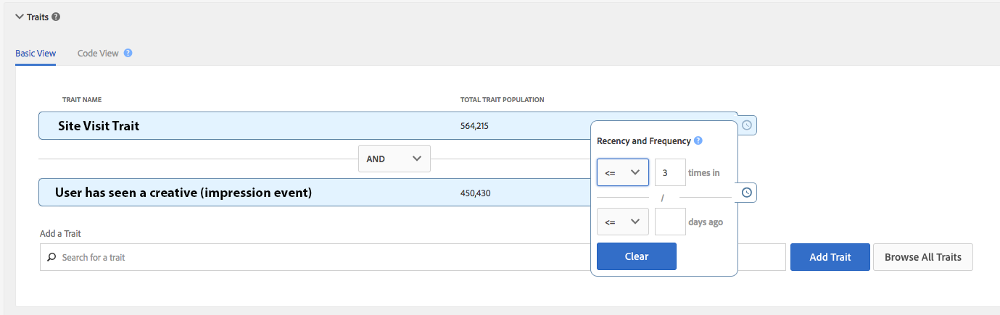

# 즉각적인 장치 간 억제 {#instant-cross-device-suppression}

[!UICONTROL Instant Cross-Device Suppression] 는 특정 경험이 이러한 장치에서 발생할 때 연결된 여러 장치에서 사용자를 차단하는 기능입니다. Use the [!UICONTROL Instant Cross-Device Suppression] capability to deliver a consistent experience across devices to your users. 이 경험은 Audience Manager의 실시간 세그먼트 해제 기능으로 가능해집니다.

## 개요 {#overview}

[!UICONTROL Instant Cross-Device Suppression] 두 가지 주요 활용 사례를 소개합니다. 향상된 사용자 경험 및 미디어 효율성

* **향상된 사용자 경험**: 이미 제품 또는 서비스를 구매한 사용자는 구매 전과 동일한 크리에이티브를 볼 수 없습니다. 그 대신, 구매하지 않은 제품 또는 서비스의 업셀링 또는 크로스셀링 메시지를 표시할 수 있습니다.
* **미디어 효율성**: 모든 채널에 글로벌 주파수 한도를 적용하여 캠페인 지출을 [!DNL DSP]최적화합니다. 한 사용자에 속하는 여러 장치에 대해 주파수 대수에 실시간으로 액세스할 수 있습니다.

실시간 세분화에 대한 기술 세부 사항은 [프로필 병합 규칙 및 장치 분리 세그멘테이션 프로세스의 길이에 설명되어 있습니다](merge-rule-unsegment.md). 위에서 설명한 사용 사례를 실제적으로 구현하려면 을 읽어 보십시오.

## 한 번 변환된 Target 안 함 {#do-not-target-once}

이미 전환(제품 구매, 구독 획득 등)한 사용자 확인 전환 전과 동일한 메시지가 표시되지 않습니다. 다음과 같이 [!UICONTROL AND NOT] 논리를 사용하여 얻을 수 있습니다.

1. 두 가지 트레이트를 사용하여 세그먼트를 만들고 아래 이미지에 표시된 것처럼 [!UICONTROL AND NOT] 논리를 사용합니다. 실시간으로 세그먼트화되지 않은 이벤트를 트리거할 전환 이벤트를 정의하려면 규칙 기반 트레이트를 사용해야 합니다. 규칙 기반 트레이트를 [만드는 방법에 대한 자세한 내용을 살펴보십시오](../traits/create-onboarded-rule-based-traits.md).
2. 원하는 수의 서버 간 실시간 대상에 세그먼트를 매핑합니다. 서버 간 대상에 세그먼트를 추가하는 방법에 대한 [자세한 내용을 살펴보십시오](../destinations/add-edit-segments.md).

방문자가 전환하지 않은 경우 세그먼트에 자격을 얻게 됩니다. 전환 트레이트를 적용받을 자격이 부여되면 세그먼트 규칙을 따르지 않고 세그먼트에서 즉시 제거됩니다.

## x 노출 후 Target 안 함 {#do-not-target-after-x}

최근 및 빈도 컨트롤을 설정하여 사용자가 동일한 크리에이티브한 방식으로 넘치는 것을 방지할 수 있습니다. 이 시나리오에서 아래 단계에 설명된 것처럼 두 가지 트레이트로 세그먼트를 만듭니다.

1. 두 가지 트레이트를 사용하여 세그먼트를 만들고 아래 이미지에 표시된 것처럼 [!UICONTROL AND] 논리를 사용합니다. 실시간으로 세그먼트화되지 않은 이벤트를 트리거하기 위해 규칙 기반 트레이트를 사용해야 합니다. 규칙 기반 트레이트를 [만드는 방법에 대한 자세한 내용을 살펴보십시오](../traits/create-onboarded-rule-based-traits.md).
   >[!NOTE]
   >
   >사용자 노출 횟수 [!UICONTROL Actionable Log Files] 를 기반으로 트레이트를 만들거나 [!UICONTROL Pixel Calls] 만들 수 있습니다. 실행 가능한 로그 파일 [및 픽셀 호출에 대한 자세한](../../integration/media-data-integration/actionable-log-files.md) 내용을 [참조하십시오](../../integration/media-data-integration/impression-data-pixels.md).
2. 두 번째 트레이트에 주파수 컨트롤을 적용합니다. 원할 경우 최근 컨트롤도 추가할 수 있습니다. 최근 및 빈도 컨트롤 [을 적용하는 방법에 대한 자세한 내용을 살펴보십시오](../segments/recency-and-frequency.md).
3. 원하는 수의 서버 간 실시간 대상에 세그먼트를 매핑합니다. 서버 간 대상에 세그먼트를 추가하는 방법에 대한 [자세한 내용을 살펴보십시오](../destinations/add-edit-segments.md).

이 시나리오에서는 사용자가 3개 이상의 노출 횟수를 누적하면 이 세그먼트에서 해당 노출 수가 제거되고 이 특정 크리에이티브가 더 이상 표시되지 않습니다.

## 메모할 중요한 측면 - 처리 {#processing-notes}

처리 관련 측면들을 염두에 두십시오.

* 실시간 세그먼트 해제 기능이 작동하려면 원하는 세그먼트를 실시간 서버 간 대상에 매핑해야 합니다.
* 장치 그래프로 장치에 연결된 장치의 경우, Adobe는 평가 및 세그멘테이션에 대해 4개의 장치 제한을 적용합니다. 이 제한 사항은 장치 그래프 옵션 및 장치 [세그멘테이션에 설명되어 있습니다](merge-rule-unsegment.md#device-graph-options-unsegmentation).
* 장치 그래프로 연결된 여러 장치에 대해 24시간마다 대상으로 전송되는 일괄 처리 파일에 unsegment 명령이 포함됩니다.
* 실시간(세그먼트 평가를 실시간으로 묻는 메시지가 [Edge](../../reference/system-components/components-edge.md) 에서 표시) 방식으로 디바이스를 확인해야 합니다. 트레이트가 충족될 [!UICONTROL time-to-live (TTL)] 때 [!DNL TTL] 있는 트레이트의 경우, 배치 파일을 통해 장치가 24시간 이내에 자동으로 분할되지 않습니다&#x200B;. 특성 만료 간격 [을 설정하는 방법에 대한 자세한 내용을 참조하십시오](../traits/create-onboarded-rule-based-traits.md#set-expiration-interval).
* 온보드 규칙 기반 트레이트를 실시간 [!UICONTROL DCS API] 으로 사용하는 경우 [!UICONTROL AND NOT] 로직을 사용하여 세그먼트 제거를 트리거할 수 있습니다. DCS API로 데이터 전송에 대한 자세한 내용을 &#x200B; 참조하십시오.

## 중요한 참고 사항 - 타이밍 {#timing-notes}

타이밍과 관련된 이러한 측면을 염두에 두십시오.

* 세그먼트는 [Edge](../../reference/system-components/components-edge.md) 에 저장되고 장치 프로필이 [!UICONTROL Edge]저장된 것과 같은 시간 동안(즉, 마지막 실시간 상호 작용 이후 14일)에 저장됩니다. 데이터 유지 FAQ에서 데이터 유지에 대한 [자세한 내용을 살펴보십시오](../../faq/faq-privacy.md#data-retention-faq).
* 세그먼트 해제 작업이 여러 지역에 걸쳐 전파되는 데 약 24시간이 [!DNL DCS] 소요됩니다. 지역 [!DNL DCS] 에 대한 자세한 내용 [을](../..//reference/system-components/components-data-collection.md) 여기 [와](../../api/dcs-intro/dcs-api-reference/dcs-regions.md)여기에서 확인하십시오.
