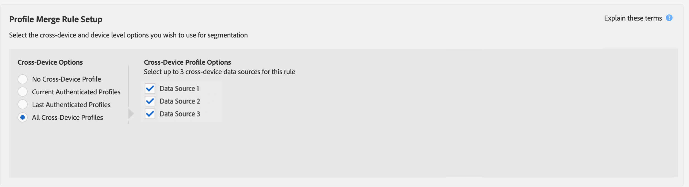

# 프로필 병합 규칙에 대한 일반 사용 사례 {#general-use-cases-for-profile-merge-rules}

[!UICONTROL Profile Merge Rules] 옵션을 사용하면 비즈니스 요구 사항이나 목표에 따라 특정 대상에 대한 대상 집중도를 확장하거나 강화할 수 있습니다. 이러한 일반적인 사용 사례에서는 사용 가능한 옵션을 사용하고 개별, 세대 및 크로스 디바이스 타깃팅에 대한 병합 규칙을 만드는 방법을 알아봅니다. [!UICONTROL Profile Merge Rules]은(는) 실시간 및 일괄 처리 대상으로 작업합니다.

>[!TIP]
>
>이러한 [!UICONTROL Merge Rule] 설정에 대한 정의 및 설명은 [정의된 프로필 병합 규칙 옵션](merge-rule-definitions.md)을 참조하십시오.

## 장치 타기팅 {#device-personalization}

이 시나리오는 Audience Manager 인증을 고려하지 않고 장치 ID를 지원하는 타겟팅 플랫폼(DSP, 온사이트 개인화 플랫폼 및 기타 장치 기반 타겟팅 플랫폼)을 사용하여 장치에 일관된 경험을 전달하기 위해 사용자 정의에 정의된 대상 세그먼트에 대해 단일 장치 프로필을 평가하려는 마케터에게 적용됩니다.

장치 프로필만 대상으로 하는 규칙을 만들려면 **[!UICONTROL No Cross-Device Profile]** + **[!UICONTROL Device Profile]**&#x200B;을(를) 선택합니다.

존이 스마트폰을 세 대 갖고 있다고 가정해 보자. 데이터 플랜 A에 있는 iPhone 7은 2개이고 데이터 플랜 B에 있는 Samsung은 1개입니다. John의 이동통신사는 세 가지 장치에서 인증된 상태를 고려하지 않고 데이터 계획 A에서 실행되는 iPhone 7 장치에 대해서만 데이터 계획 업그레이드를 제공하려고 합니다.

**[!UICONTROL No Cross-Device Profile]** + **[!UICONTROL Device Profile]** 규칙을 사용하면 [!DNL Device 1]과(와) [!DNL Device 3]이(가) 모두 세그먼트에 적합하지만 장치 2는 무시됩니다.

## 공유 장치 타깃팅 {#target-shared-devices}

존과 그의 아내 제인이 같은 노트북을 사용해서 온라인 상점을 방문해서 다양한 물건을 주문한다고 하자.

존은 여행 티켓과 특가 상품을 예약하기 위해 자신의 계정을 사용하는 반면, 제인은 음악과 영화를 쇼핑하기 위해 자신의 계정을 사용합니다.

스토어의 마케팅 팀은 **[!UICONTROL Current Authenticated Profiles]** + **[!UICONTROL No Device Profile]** 규칙을 사용하여 John과 Jane의 인증된 활동에 따라 특정 거래를 타깃팅할 수 있습니다.

이 규칙을 사용하면 Audience Manager은 장치 프로필을 완전히 무시하고 세그먼트에 대한 John의 CRM ID를 확인하고 Jane의 CRM ID를 확인하지 않습니다.

## 온라인/오프라인 타기팅 {#device-household-targeting}

이 사용 사례에서는 가구 ID 관리를 다룹니다. 회사는 **[!UICONTROL Last Authenticated Profiles]** + **[!UICONTROL Device Profile]** 규칙을 사용하여 단일 장치 프로필을 해당 장치에서 인증된 마지막 프로필과 병합할 수 있습니다.

[!DNL Data Plan B]의 [!DNL iPhone 7]인 장치를 하나 이상 포함하고 연간 소득이 100.000달러 이상인 가구로 구성된 세그먼트를 생각해 보겠습니다. 두 개의 가정용 프로필(교차 장치 프로필)이 있으며, 각각은 두 개의 서로 다른 장치 프로필에 연결됩니다. 세그먼트 자격에 필요한 트레이트는 장치 및 교차 장치 프로필에 배포됩니다.

Audience Manager은 모든 장치 + 교차 장치 프로필 쌍을 병합하여 병합된 트레이트 세트가 세그먼트에 적합한지 확인합니다. Audience Manager은 병합에 포함된 모든 프로필을 평가하므로 장치 프로필과 가구 프로필을 모두 세그먼트화할 수 있습니다.

장치와 세대 프로필 간의 연결을 통해 Audience Manager은 [!DNL Household 2]을(를) 세그먼트에 적합하게 만들 수 있지만 [!DNL Household 1]은(는) 그렇지 않습니다. [!DNL Household 2]부터 [!DNL Device 3]만 세그먼트에 사용할 수 있습니다. 이 [!UICONTROL Profile Merge Rule]을(를) 통해 마케터는 개별 장치([!DNL Device 3]) 및 더 넓은 세대([!DNL Household 2])에 일관된 마케팅 메시지를 전달할 수 있습니다.

## 사용자 기반 대상에 대한 타깃팅 {#all-cross-device}

>[!IMPORTANT]
>
>이 문서에는 이 기능의 설정 및 사용 방법을 안내하는 제품 설명서가 포함되어 있습니다. 여기에는 법률적인 조언이 들어 있지 않습니다. 법률 지도가 필요한 경우 법률 자문을 구하십시오.

이 타깃팅 시나리오는 [!DNL People-Based Destinations] 추가 기능을 구입한 고객에게만 제공됩니다. 이 규칙을 사용하면 마케터가 자신의 인증된 데이터를 기반으로 고객에게 도달할 수 있습니다.

온라인 소매업체가 소셜 플랫폼을 통해 기존 고객에게 도달하고 이전 주문을 기반으로 개인화된 오퍼를 표시하려고 한다고 가정해 보겠습니다. [!UICONTROL People-Based Destinations]을(를) 사용하면 해시된 이메일 주소를 자체 [!DNL CRM]에서 Audience Manager으로 수집하고, 오프라인 데이터에서 세그먼트를 작성하고, 해시된 식별자를 사용하여 광고하려는 소셜 플랫폼으로 이러한 세그먼트를 전송하여 광고 비용을 최적화할 수 있습니다.

이 옵션에 대한 자세한 내용은 [사람 기반 대상](../destinations/people-based-destinations-overview.md)을 참조하세요.

## 장치 그래프 옵션 {#device-graph-options}

[!UICONTROL Profile Merge] 규칙에 대한 [!UICONTROL device graph] 옵션을 선택하는 방법은 디지털 속성 및 비즈니스 목표에 고유한 조건에 따라 다릅니다. 이러한 일반 지침은 한 가지 유형의 그래프와 다른 그래프를 사용해야 하는 경우를 이해하는 데 도움이 될 수 있습니다. 이러한 옵션을 사용하려면 외부 장치 그래프와 계약 관계가 있어야 합니다. 장치 그래프 옵션을 선택할 시기에 대한 일반적인 지침은 아래 표를 참조하십시오. 특정 사용 사례에 대해서는 [프로필 링크 장치 그래프 사용 사례](profile-link-use-case.md) 및 [외부 장치 그래프 사용 사례](external-graph-use-cases.md)를 참조하십시오.

<table id="table_66D9152D4FF040A186003272D456625D"> 
 <thead> 
  <tr> 
   <th colname="col1" class="entry"> 장치 그래프 유형 </th> 
   <th colname="col2" class="entry"> 설명 </th> 
  </tr>
 </thead>
 <tbody> 
  <tr> 
   <td colname="col1"> 
 프로필 링크 장치 그래프 
 </td> 
   <td colname="col2"> 
 프로필 링크 옵션으로 만들어진  프로필 병합 규칙은 다음 경우에 이상적입니다. 
 
 
     <ul id="ul_FF44FA894BB2448887C8EDA9C8407EF9"> 
      <li id="li_E22505210C664FE6A9AA7C61244B36DA">높은 수준의 고객 인증이 있는 디지털 속성입니다. </li> 
      <li id="li_BE7112EE611E4DEB95B5C0A2852BFA97">집중적이고, 범위가 낮은 캠페인.  프로필 링크 장치 그래프는 결정론적 데이터만 기반으로 만들어집니다. 이 장치 프로필 풀은 인증되지 않은 사용자 및 장치 풀에 비해 항상 더 작습니다. </li> 
      <li id="li_5FD9E936A72A4EFE80E694FA2E08E385">고객이 세그멘테이션 자격을 얻기 위해 인증된 상태여야 하는 사용 사례입니다. </li> 
     </ul> 
 </td> 
  </tr> 
  <tr> 
   <td colname="col1"> 
외부 장치 그래프 옵션 
 </td> 
   <td colname="col2"> 
 Audience Manager과(와) 통합된 외부 장치 그래프로 만들어진  프로필 병합 규칙은 다음 경우에 이상적입니다. 
 
 
     <ul id="ul_D76D773988604A619FA4A3BF37F910F0"> 
      <li id="li_969A0755A9E34CBEB2F7331C137B9A26">낮은 수준의 고객 인증이 있는 디지털 속성입니다. </li> 
      <li id="li_AC78C8B4AD5340FFAC44FE851096C6A6">광범위하고 도달 범위가 높은 브랜드 캠페인. </li> 
      <li id="li_14AEC54CE34440889A3A36324EC6F497">고객이 세그멘테이션 자격을 부여하기 위해 인증된 상태에 있을 필요가 없는 사용 사례입니다. </li> 
     </ul> 
 </td> 
  </tr> 
 </tbody> 
</table>

[!UICONTROL Profile Merge Rules]의 가능한 사용 사례에 대한 개요를 보려면 아래 비디오를 시청하십시오.

>[!VIDEO](https://video.tv.adobe.com/v/31963?captions=kor)

>[!MORELIKETHIS]
>
>* [프로필 링크 장치 그래프 사용 사례](profile-link-use-case.md)
>* [외부 장치 그래프 사용 사례](external-graph-use-cases.md)
>* [프로필 병합 규칙 FAQ](../../faq/faq-profile-merge.md)
