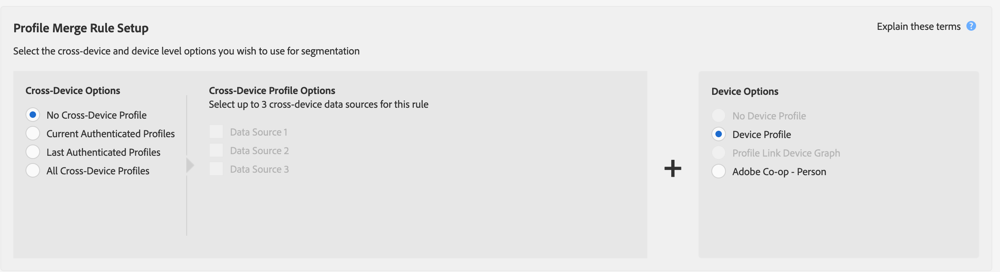

# 프로필 병합 규칙에 대한 일반 사용 사례 {#general-use-cases-for-profile-merge-rules}

[!UICONTROL Profile Merge Rules] 옵션을 사용하면 비즈니스 요구 사항이나 목표를 기반으로 특정 대상에 집중하도록 대상을 확대하거나 축소할 수 있습니다. 이러한 일반적인 사용 사례에서는 사용 가능한 옵션을 사용하고 개별, 가구 및 교차 장치 타깃팅을 위한 병합 규칙을 만드는 방법을 알아봅니다. [!UICONTROL Profile Merge Rules] 실시간 및 배치 대상 작업

>[!TIP]
>
>이러한 [!UICONTROL Merge Rule] 설정에 대한 정의 및 설명은 [정의된 프로필 병합 규칙 옵션](merge-rule-definitions.md)을 참조하십시오.

## 장치 타깃팅 {#device-personalization}

이 시나리오는 사용자 인증을 고려하지 않고 장치 ID(DSP, 온사이트 개인화 플랫폼 및 기타 장치 기반 타깃팅 플랫폼)를 지원하는 타깃팅 플랫폼을 사용하여 장치에 일관된 경험을 제공하기 위해 Audience Manager에 정의된 대상 세그먼트에 대해 단일 장치 프로필을 평가하려는 마케터에게 적용됩니다.

장치 프로필만 대상으로 하는 규칙을 만들려면 **[!UICONTROL No Cross-Device Profile]** + **[!UICONTROL Device Profile]** 을 선택합니다.

예를 들어, 존이 3대의 스마트폰을 소유하고 있다고 가정해 보겠습니다. 그 중 2개는 데이터계획 A에 관한 아이폰 7s이고, 그 중 하나는 데이터계획 B에 관한 삼성Same이다. 3가지 장치 중 어느 하나에서 그의 인증상태를 고려하지 않고, 존의 이동통신사는 데이터 계획 업그레이드를 그에게 제공하려고 하지만, 데이터 계획 A에서 실행되는 iPhone 7 장치만을 위한 것이다.

**[!UICONTROL No Cross-Device Profile]** + **[!UICONTROL Device Profile]** 규칙, [!DNL Device 1] 및 [!DNL Device 3]을 사용하면 둘 다 세그먼트에 적합하고, 장치 2는 무시됩니다.

## 공유 장치 타깃팅 {#target-shared-devices}

존과 그의 아내 제인이 같은 노트북을 이용해 온라인 상점을 방문해서 다양한 상품을 주문한다고 가정해 보겠습니다.

존은 자신의 계정을 사용하여 여행표와 특별 할인을 예약하고, 제인은 음악과 영화를 사기 위해 자신의 계정을 사용한다.

스토어의 마케팅 팀은 **[!UICONTROL Current Authenticated Profiles]** + **[!UICONTROL No Device Profile]** 규칙을 사용하여 John과 Jane을 인증된 활동에 따라 특정 거래를 타깃팅할 수 있습니다.

이 규칙을 사용하면 Audience Manager이 장치 프로필을 완전히 무시하고, 세그먼트에 대한 John의 CRM ID에 자격을 부여하고, Jane의 CRM ID에 자격을 부여할 수 없습니다.

## 온라인/오프라인 타깃팅 {#device-household-targeting}

이 사용 사례에서는 가계 ID 관리를 다룹니다. 회사는 **[!UICONTROL Last Authenticated Profiles]** + **[!UICONTROL Device Profile]** 규칙을 사용하여 단일 장치 프로필을 해당 장치에서 인증된 마지막 프로필과 병합할 수 있습니다.

100.000달러/연도 이상의 소득을 가진 가정으로 이루어진 세그먼트를 하나 고려해 보겠습니다. 이러한 세그먼트는 [!DNL Data Plan B]에 [!DNL iPhone 7]인 하나 이상의 장치를 포함하고 있습니다. 두 개의 가구 프로필(교차 장치 프로필)이 있으며, 각각 두 개의 서로 다른 장치 프로필에 연결됩니다. 세그먼트에 대한 자격을 부여하는 데 필요한 트레이트는 장치 및 장치 간 프로필에 배포됩니다.

Audience Manager은 모든 장치 + 교차 장치 프로필 쌍을 병합하여 병합된 트레이트 세트가 세그먼트에 적격한지 확인합니다. Audience Manager은 병합에 포함된 모든 프로필을 평가하므로 장치 프로필과 가구 프로필 모두를 세그먼트화할 수 있습니다.

장치와 세대 프로필 간의 링크를 통해 Audience Manager은 [!DNL Household 2] 세그먼트에 대한 자격을 부여할 수 있지만 [!DNL Household 1] 에는 적합하지 않습니다. [!DNL Household 2]에서 [!DNL Device 3]만 세그먼트에 사용할 수 있습니다. 이 [!UICONTROL Profile Merge Rule] 기능을 통해 마케터는 개별 장치([!DNL Device 3])와 더 넓은 가구([!DNL Household 2])에 일관된 마케팅 메시지를 전달할 수 있습니다.

## 사용자 기반 대상 타깃팅 {#all-cross-device}

>[!IMPORTANT]
>
>이 문서에는 이 기능의 설정 및 사용을 안내하는 제품 설명서가 포함되어 있습니다. 여기에 포함된 어떤 것도 법률적인 조언이 아닙니다. 법률 자문을 구하시려면 법률 자문을 구하십시오.

이 타겟팅 시나리오는 [!DNL People-Based Destinations] 추가 기능을 구입한 고객에게만 제공됩니다. 이 규칙을 사용하면 마케터가 인증된 데이터를 기반으로 고객에 도달하도록 할 수 있습니다.

온라인 소매업체에서 소셜 플랫폼을 통해 기존 고객에게 접근하고 이전 주문에 따라 개인화된 오퍼를 제공한다고 가정해 보겠습니다. [!UICONTROL People-Based Destinations] 을 사용하면 해시된 이메일 주소를 자체 [!DNL CRM]에서 Audience Manager으로 수집하고, 오프라인 데이터에서 세그먼트를 작성하고, 해시된 식별자를 사용하여 이러한 세그먼트를 광고하고 광고 비용을 최적화할 수 있습니다.

이 옵션에 대한 자세한 내용은 [사용자 기반 대상](../destinations/people-based-destinations-overview.md)을 참조하십시오.

## 장치 그래프 옵션 {#device-graph-options}

[!UICONTROL Profile Merge] 규칙에 대해 [!UICONTROL device graph] 옵션을 선택하는 것은 디지털 속성 및 비즈니스 목표에 고유한 조건에 따라 다릅니다. 이러한 일반 지침은 한 가지 유형의 그래프를 사용하는지 다른 유형을 사용해야 하는 경우를 이해하는 데 도움이 됩니다. 참고 이러한 옵션을 사용하려면 [Adobe Experience Cloud Device Co-op](https://docs.adobe.com/content/help/ko-KR/device-co-op/using/home.html)의 구성원이거나 외부 장치 그래프와 계약 관계가 있어야 합니다. 장치 그래프 옵션을 선택할 시기에 대한 일반적인 지침은 아래 표를 참조하십시오. 특정 사용 사례에 대해서는 [프로필 링크 장치 그래프 사용 사례](profile-link-use-case.md) 및 [외부 장치 그래프 사용 사례](external-graph-use-cases.md)를 참조하십시오.

<table id="table_66D9152D4FF040A186003272D456625D"> 
 <thead> 
  <tr> 
   <th colname="col1" class="entry"> 장치 그래프 유형 </th> 
   <th colname="col2" class="entry"> 설명 </th> 
  </tr>
 </thead>
 <tbody> 
  <tr> 
   <td colname="col1"> 
 프로필 링크 장치 그래프 
 </td> 
   <td colname="col2"> 
 프로필  링크 옵션  으로 빌드된 프로필 병합 은 다음 경우에 이상적입니다. 
 
 
     <ul id="ul_FF44FA894BB2448887C8EDA9C8407EF9"> 
      <li id="li_E22505210C664FE6A9AA7C61244B36DA">높은 수준의 고객 인증이 있는 디지털 속성. </li> 
      <li id="li_BE7112EE611E4DEB95B5C0A2852BFA97">집중적이고 도달 가능성이 낮은 캠페인.  프로필 링크 장치 그래프는 결정론적 데이터만을 기반으로 합니다. 이 장치 프로필 풀은 인증되지 않은 사용자 및 장치 풀에 대해 항상 더 작습니다. </li> 
      <li id="li_5FD9E936A72A4EFE80E694FA2E08E385">고객이 세그먼테이션을 사용할 자격이 있는 인증된 상태여야 하는 사용 사례입니다. </li> 
     </ul> 
 </td> 
  </tr> 
  <tr> 
   <td colname="col1"> 
외부 장치 그래프 옵션 
 </td> 
   <td colname="col2"> 
 Experience Cloud  장치 Co- <a href="https://docs.adobe.com/content/help/en/device-co-op/using/about/overview.html" format="https" scope="external"> op로 빌드된 프로필 병합 </a> 또는 Audience Manager와 통합된 외부 장치   그래프 는 다음 경우에 이상적입니다. 
 
 
     <ul id="ul_D76D773988604A619FA4A3BF37F910F0"> 
      <li id="li_969A0755A9E34CBEB2F7331C137B9A26">낮은 수준의 고객 인증이 있는 디지털 속성. </li> 
      <li id="li_AC78C8B4AD5340FFAC44FE851096C6A6">광범위하게 활용 가능한 브랜드 캠페인 </li> 
      <li id="li_14AEC54CE34440889A3A36324EC6F497">고객이 세그멘테이션의 자격이 되도록 인증된 상태에 있을 필요가 없는 사용 사례 </li> 
     </ul> 
 
 
팁: Device Co-op 는 인증이 낮고 Device Graph 공급자와의 관계가 없는  Experience Cloud 고객인 경우 가장 적합한 옵션입니다. 
 
 </td> 
  </tr> 
 </tbody> 
</table>

[!UICONTROL Profile Merge Rules]에 대한 사용 가능한 사례에 대한 개요를 보려면 아래 비디오를 시청하십시오.

>[!VIDEO](https://video.tv.adobe.com/v/28975/)

>[!MORELIKETHIS]
>
>* [프로필 링크 장치 그래프 사용 사례](profile-link-use-case.md)
* [외부 장치 그래프 사용 사례](external-graph-use-cases.md)
* [프로필 병합 규칙 FAQ](../../faq/faq-profile-merge.md)

