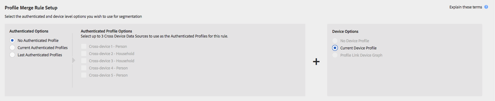
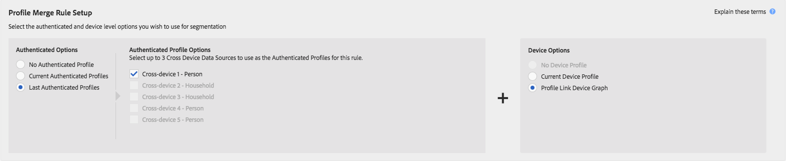

# 프로필 병합 규칙 및 장치 분리 프로세스 {#profile-merge-rules-and-device-un-segmentation-processes}

세그먼테이션은 세그먼트에서 장치 프로파일을 분류하고 제거하는 프로세스에 대해 설명합니다. 세그먼트에서 장치 프로파일을 제거하는 기능은 장치 옵션을 만드는 데 사용되는 장치에 따라 달라집니다 [!UICONTROL Profile Merge Rule].

## 사용 가능한 장치 옵션 {#device-options}

를 만들거나 편집할 [!UICONTROL Device Options] 때 [!UICONTROL Profile Merge Rules Setup] 섹션에서 미리 볼 수 [!UICONTROL Profile Merge Rule]있습니다.

## 현재 장치 프로파일 옵션 및 장치 분리 {#current-device-profile-options}

**[!UICONTROL Current Device Profile]** 은 에 대한 기본 장치 프로파일 [!UICONTROL Profile Merge Rule]옵션입니다. [!DNL Audience Manager] 옵션을 사용할 때 세그먼트에서 장치 프로파일을 제거할 [!UICONTROL Profile Merge Rule] 수 **[!UICONTROL Current Device Profile]** 있습니다. 이러한 조건에서 세그먼테이션은 다음과 같은 경우에 발생합니다.

* 장치 프로필이 120일 동안 비활성화되었습니다. 주간 데이터 정리 프로세스는 세그먼트에서 비활성 장치 프로파일을 제거합니다.
* 장치 프로파일을 업데이트하거나 변경하면 해당 장치의 자격이 상실되므로 더 이상 장치에 세그먼트에 적합하지 않습니다. 이 문제는 세그먼트 자격 기준이 변경되거나, 세그먼트 규칙에 [!DNL AND NOT] 연산자를 적용하거나, 보다 작거나 같은 설정을 사용하는 [최근 및 빈도](../../features/segments/recency-and-frequency.md) 조건을 지정할 때 발생합니다. 사용 사례는 즉시 장치 간 [억제 문서에 설명되어](../../features/profile-merge-rules/instant-cross-device-suppression.md) 있습니다.

<!-- 

  Audience Manager can remove a device profile from a segment when your  Profile Merge Rule uses the <b> Current Device Profile</b> option. Under these conditions, unsegmentation happens when: 
 

 
 <ul id="ul_596501272A224228BD330DD56E01D973"> 
  <li id="li_E4FA1A5C722748CD82AE3A49FCBE86F6">The device profile has been inactive for 120-days. A weekly data cleanup process removes inactive device profiles from your segments. </li> 
  <li id="li_DB0CCD28425048D5B35309B8C2C384F9">The device no longer qualifies for a segment because updates or changes to the device profile disqualify it. This happens when segment qualification criteria change, or you apply an AND NOT operator to a segment rule, or specify <a href="../../features/segments/recency-and-frequency.md"> recency and frequency</a> conditions that use the less than/equal to settings. </li> 
 </ul> 
 

  

 -->

## 장치 옵션 및 장치 분리 없음 {#no-device-option}

[!DNL Audience Manager] 에서 [!UICONTROL Profile Merge Rule] + **[!UICONTROL No Device Profile]** **[!UICONTROL Current Authenticated]** 옵션을 사용할 때 세그먼트에서 장치 간 ID를 제거할 수 있습니다. 이러한 조건에서, 장치 간 ID가 더 이상 세그먼트에 적합하지 않을 때 세그먼테이션은 장치 간 프로파일을 업데이트하거나 변경하면 자격이 상실됩니다. 이 문제는 세그먼트 자격 기준이 변경되거나, 세그먼트 규칙에 [!UICONTROL AND NOT] 연산자를 적용하거나, 보다 작거나 같은 설정을 사용하는 [최근 및 빈도](../../features/segments/recency-and-frequency.md) 조건을 지정할 때 발생합니다. 사용 사례는 즉시 장치 간 [억제 문서에 설명되어](../../features/profile-merge-rules/instant-cross-device-suppression.md) 있습니다.

## 장치 그래프 옵션 및 장치 분리 {#device-graph-options-unsegmentation}

[!DNL Audience Manager] 장치 그래프 옵션을 사용할 때 세그먼트에서 여러 장치 프로파일을 제거할 [!UICONTROL Profile Merge Rule] 수 있습니다. 장치 그래프에서 장치의 병합된 프로필이 더 이상 세그먼트에 적합하지 않을 때 세그먼테이션 취소가 발생합니다. 병합된 프로필의 업데이트나 변경 사항이 세그먼트에서 해당 프로필의 자격을 잃게 됩니다. 이 문제는 세그먼트 자격 기준이 변경되거나, 세그먼트 규칙에 [!UICONTROL AND NOT] 연산자를 적용하거나, 보다 작거나 같은 설정을 사용하는 [최근 및 빈도](../../features/segments/recency-and-frequency.md) 조건을 지정할 때 발생합니다. 사용 사례는 즉시 장치 간 [억제 문서에 설명되어](../../features/profile-merge-rules/instant-cross-device-suppression.md) 있습니다.

>[!NOTE]
>
>**세그먼트 평가 및 결격에** 대한 4가지 장치 제한은 장치 그래프를 사용하는 세그먼트로 평가할 때 최대 4개의 장치를 [!DNL Audience Manager] [!UICONTROL Profile Merge Rule] 병합합니다. [!DNL Audience Manager] 실시간으로 *마지막으로 표시된*&#x200B;현재 장치와 세 개의 추가 장치를 평가합니다. 세그먼트 해제 신호가 발급되면 현재 장치 및 실시간으로 표시되는 세 개의 추가 장치가 대상의 세그먼트에서 제거됩니다. 예를 들어 6개 장치 클러스터에서 최대 4개의 장치가 병합되고 평가되며 세그먼트에 대한 자격이 부여됩니다. 마찬가지로 최대 4개의 디바이스가 병합되고 평가되고 분할되지 않습니다.

<!-- 

Currently,  Audience Manager <i>cannot </i> remove a device profile from a segment when your  Profile Merge Rule uses a device graph option. This applies to rules created with these  Device Options settings: 
 

 
 <ul id="ul_0923834C984F464E9AB12FF5A8773214"> 
  <li id="li_731F67B7A07342988B13D7F91ECA5A9E">Profile Link Device Graph. </li> 
  <li id="li_D1EFC6F124124E64A0732DD060F788BE">The  Adobe device graph. </li> 
  <li id="li_CFD4189D4488432D92732532D23B30C7">Other third-party device graph options available that are available to you. </li> 
 </ul> 
 

 Unlike the previous case above, using the AND NOT operator or less than/equal to settings won't remove all of the devices from a segment profile. However, you can unsegment device profiles if you create simple segment rules and apply unsegment logic in the destination that receives your data. The following sections walks you through different unsegmentation use cases. 

 -->

<!-- 

This workaround shows you how to unsegment with Boolean  AND NOT logic when your  Profile Merge Rule uses a device graph option. This procedure uses separate, simple segments mapped to the same destination. In this case, you apply AND NOT logic on the destination rather than creating rules in Segment Builder. To set up unsegment rules for this use case: 
 

 
 <ol id="ol_677F0F9E6CB640079D9021DE66819916"> 
  <li id="li_95F898FDFB2D4F5395201FEA2E60A3AF">Create separate, single-trait segments as shown in the following example. 
 
 </li> 
  <li id="li_3A9F6D8B3CBB4F65B9A06EEC3B265158">Map the segments to the same destination. In this case, we're sending these to  Media Optimizer. </li> 
  <li id="li_092BB5887D0D4EE4B09F4B1C6703D454">Set AND NOT logic on the destination ( Media Optimizer) rather than in  Audience Manager. 
 
 </li> 
 </ol> 
 

 If you're not using  Media Optimizer, apply AND NOT logic on whatever destination receives these segments. 

 -->

<!-- 

This workaround shows you how to unsegment with the < = (less than/equal to) recency and frequency settings when your  Profile Merge Rule uses a device graph option. To set up unsegment rules for this use case: 
 

 
 <ol id="ol_DCBEE004B9FE40A881E4EC17FAEA50C2"> 
  <li id="li_DB8C1B6D5C5546E68769902A4F367966">Create a segment that contains a single trait and apply a > = (greater than/equal to) recency and frequency rule to the trait. 
 
 </li> 
  <li id="li_0DC50960D83B4B27A40F0BC76B944E0B">Map the segment to a destination. In this case, we're sending the segment to  Media Optimizer. </li> 
  <li id="li_FC23194A9FE54296914393F8067A6672">Set NOT logic on the destination ( Media Optimizer) rather than in  Audience Manager. Use NOT logic to exclude all devices that qualify for this segment from your campaign. 
 
 </li> 
 </ol> 
 

 If you're not using  Media Optimizer, apply NOT logic on whatever destination receives these segments. 

 -->

>[!MORELIKE_THIS]
>
>* [프로필 병합 규칙 및 장치 그래프 FAQ](../../faq/faq-profile-merge.md)
>* [즉각적인 장치 간 억제](../../features/profile-merge-rules/instant-cross-device-suppression.md)
>* [장치 그래프와 프로필 병합 규칙에 대한 중요 고려 사항](../../features/profile-merge-rules/considerations-pmr-device-graph.md)

