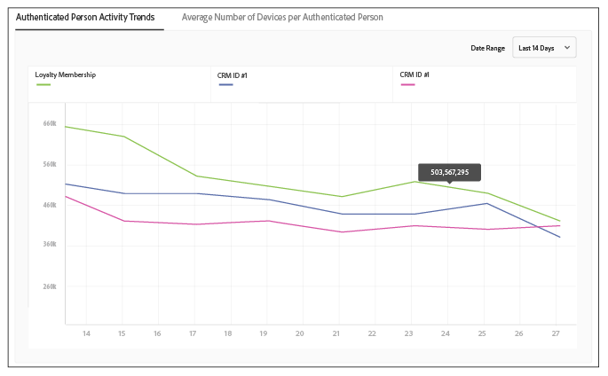

# Report Metrics for Profile Merge Rules {#report-metrics-for-profile-merge-rules}

[!UICONTROL Profile Link] 지표는 사이트를 인증하는 사람 및 장치에 대한 데이터를 제공합니다. The data and graphs in [!UICONTROL Profile Link] update dynamically as you create a merge rules or when you click an existing rule from the [!UICONTROL Profile Merge Rules] dashboard. These metrics can include device graph from the [!DNL Adobe Experience Cloud Device Co-op] or other third-party device graph sources.

## Merge Rule Metrics {#merge-rule-metrics}

Reports return data in side-by-side bar graphs when your merge rules use data from the [Adobe Experience Cloud Device Co-op](https://marketing.adobe.com/resources/help/en_US/mcdc/) or other, third-party device graphs you may have access to in [!DNL Audience Manager]. This lets you compare your authenticated, first-party data with cross-device data provided by the [!UICONTROL Experience Cloud Device Co-op] or another, third-party device graph. For information about data returned by the [!UICONTROL Device Co-op], see [The Device Graph: Internal Processes and Output](https://marketing.adobe.com/resources/help/en_US/mcdc/mcdc-processes.html). 이 데이터는 매일 업데이트됩니다.

<table id="table_A7FB2F9804F84AC8A6DD05C0E6EE7555"> 
 <thead> 
  <tr> 
   <th colname="col1" class="entry"> 지표 </th> 
   <th colname="col2" class="entry"> 설명 </th> 
  </tr> 
 </thead>
 <tbody> 
  <tr> 
   <td colname="col1"> 
 <b> 인증된 활동</b> 
 </td> 
   <td colname="col2"> 
표시: 
 
    <ul id="ul_7F7373919A4A49028EF4BF7B28D9F8E9"> 
     <li id="li_FE2F93C496D64ED8928B3E522C9585EA">  활성 사람: 지난 60 일 동안 사이트에 인증된 사람의 수입니다. </li> 
     <li id="li_60CFD26EE68B442683C0ED5FED1A79C8">  크로스 디바이스: 데이터 소스가 <a href="../../features/profile-merge-rules/merge-rules-start.md#create-data-source"> 존재했던</a> 라이프타임 동안 <a href="../../features/manage-datasources.md#create-data-source"> 선택된 인증된</a> <a href="../../features/profile-merge-rules/merge-rule-definitions.md"> 프로필의</a> 데이터 소스에 저장된 총 크로스 장치 ID 수입니다. </li> 
     <li id="li_F2F07B6A326C4A18B79A0CF2C47D9677">  % 활성 사람:  활성 사람을 %로 표시합니다. </li> 
    </ul> 
  인증된 활동을 사용하면 데이터 소스를 활동, 볼륨 및 비율별로 비교할 수 있습니다. 이렇게 하면 많은 사람과 높은 비율의 활성 사용자가 있는 데이터 소스를 찾을 수 있습니다. 또는 총 고객 규모와 비교하여 활성 사용자의 높은 비율과 데이터 소스를 비교하는 데 가치가 있을 수 있습니다. 예를 들어 총 라이프타임 수와 활동이 높은 데이터 소스가 높은 라이프타임 결과와 낮은 활동 수치를 갖는 데이터보다 더 가치 있는 경우가 있습니다. 
 
 
Note: The  Authenticated Activity metrics contain  Profile Link data only. This report does not include  Device Graph data. 
 
 </td> 
  </tr> 
  <tr> 
   <td colname="col1"> 
 <b> 1 인당 평균 장치</b> 
 </td> 
   <td colname="col2"> 
 선택한 데이터 소스에 대해 사이트에 인증된 방문자가 사용하는 평균 장치 수를 표시합니다. 
 </td> 
  </tr> 
  <tr> 
   <td colname="col1"> 
 <b> 총 장치 수</b> 
 </td> 
   <td colname="col2"> 
선택한 데이터 소스에 대해 사이트를 인증하기 위해 사람들이 사용한 총 장치 수를 표시합니다. 
 </td> 
  </tr> 
  <tr> 
   <td colname="col1"> 
 <b> 총 사용자 수</b> 
 </td> 
   <td colname="col2"> 
선택한 데이터 소스에 대해 결정적으로 식별된 총 사람 수를 표시합니다. 
 </td> 
  </tr> 
 </tbody> 
</table>

## Device Graph Metrics {#device-graph-metrics}

[!UICONTROL Merge Rules] 보고서는 선택한 데이터 소스 및 장치 그래프에 대해 사이트를 방문한 총 사람 및 장치 수에 대한 데이터도 보여줍니다. 이러한 지표는 규칙을 만들 때 선택하는 장치 옵션에 따라 달라지는 사전 설정된 시간 간격 (룩백 기간) 를 기반으로 데이터를 반환합니다. 다음 표에는 각 장치 그래프 옵션에 대한 이러한 보고서 간격이 나와 있습니다.

<table id="table_038983EBC71F4A55BBCA99212AC5DEE6"> 
 <thead> 
  <tr> 
   <th colname="col1" class="entry"> 장치 그래프 옵션 </th> 
   <th colname="col2" class="entry"> 보고서 룩백 간격 </th> 
  </tr>
 </thead>
 <tbody> 
  <tr> 
   <td colname="col1"> 
 프로필 링크 
 </td> 
   <td colname="col2"> 
 
     <ul id="ul_B2FF2341573840549FFB96579F537082"> 
      <li id="li_B37323C2F2434F41B407500AC5C15447">총 사용자 수: 60 일 </li> 
      <li id="li_08D911224A60418BBB3CFB4E70CE73D4">총 장치: 120 일 </li> 
     </ul> 
 </td> 
  </tr> 
  <tr> 
   <td colname="col1"> 
 Co-op 장치 그래프 
 </td> 
   <td colname="col2"> 
 
     <ul id="ul_64AD1DD89DF64703B70B973A463BA020"> 
      <li id="li_D7D3A3871F434CBFA71BE8929EB41648">총 사용자 수: 180 일 </li> 
      <li id="li_125D387986B2463EB310203CE5857EDA">총 장치: 180 일 </li> 
     </ul> 
 </td> 
  </tr> 
  <tr> 
   <td colname="col1"> 
 Liveramp 
 </td> 
   <td colname="col2"> 
 
     <ul id="ul_2772F3AD7E1440789B635794ECDE8DFB"> 
      <li id="li_1432363829D64615B1D349A3722D6268">총 사용자 수: 180 일 </li> 
      <li id="li_D5C0E3CE92524B54BBD36C73A326292B">총 장치: 180 일 </li> 
     </ul> 
 </td> 
  </tr> 
  <tr> 
   <td colname="col1"> 
 Tapad 
 </td> 
   <td colname="col2"> 
 
     <ul id="ul_274529DB58E6442E95C6AD89BECB1362"> 
      <li id="li_67102211A72A4E47AACFE5E369793C17">총 사용자 수: 60 일 </li> 
      <li id="li_3E8F3DA6A7B5487895A626674DA363A5">총 장치 수 60 일 </li> 
     </ul> 
 </td> 
  </tr> 
 </tbody> 
</table>

## Sample Reports {#sample-reports}

### 표준 프로필 링크 보고서

A standard [!UICONTROL Profile Link] report looks like the following example. 여러 데이터 소스 (최대 3, 최대) 를 사용하는 규칙은 각 데이터 소스에 대해 개별 탭에 그래프를 표시합니다. This merge rule does not include [!UICONTROL Device Co-op] data.

### 장치 그래프 데이터가 있는 프로필 링크 보고서

A [!UICONTROL Profile Link] report that includes device graph data from the [!UICONTROL Adobe Experience Cloud Device Co-op] or a third-party device graph shows [!UICONTROL Profile Link] and device graph data with side-by-side bar graphs. Placing these graphs adjacent to each other lets you evaluate the benefits of using the [!UICONTROL Experience Cloud Device Co-op] compared to [!UICONTROL Profile Link] by itself. 여러 데이터 소스 (최대 3, 최대) 를 사용하는 규칙은 각 데이터 소스에 대해 개별 탭에 그래프를 표시합니다. As a reminder, the [!UICONTROL Authenticated Activity] graph and metrics do not return data from the [!DNL Adobe] device graph or other, third-party device graphs you may have access to in [!DNL Audience Manager].

## Profile Link Trend Graphs {#profile-link-trend}

In addition to the other data visualizations, [!UICONTROL Profile Link] reports include a line graph. 라인 그래프는 프로필 규칙에 따른 트렌드를 보여주도록 설계되었습니다. Trend graphs (and the other reports) are available when you click a rule from the [!UICONTROL Profile Merge Rules] landing page ( **[!UICONTROL Audience Data > Profile Merge Rules]**). These graphs include device graph data if you're a member of the [!UICONTROL Device Co-op] or other, third-party device graphs you may have access to in [!DNL Audience Manager]. 트렌드 라인을 클릭하면 기본 데이터가 표시됩니다.

>[!MORE_ like_ this]
>
>* [프로필 병합 규칙 FAQ](../../faq/faq-profile-merge.md)

