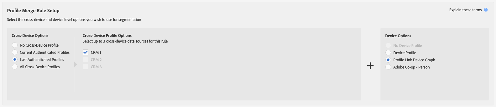

# 프로필 링크 장치 그래프 사용 사례 {#profile-link-device-graph-use-cases}

Recommendations 및 [!UICONTROL Profile Link Device Graph] 을 사용하는 세그먼트 재타겟팅 및 개인화된 세그먼트 자격에 대한 사용 사례

## 권장 사항 {#recommendations}

다음과 같은 캠페인의 [!UICONTROL Profile Link] 장치 그래프를 고려하십시오.

* 디지털 속성에서 높은 수준의 인증을 획득합니다. 인증된 사용자가 적은 경우 [외부 장치 그래프 옵션](merge-rule-definitions.md#device-options)을 사용하십시오.
* 알려진 대상을 정확하게 타깃팅해야 합니다. [!UICONTROL Profile Link Device Graph]은(는) 인증된 자사 데이터를 사용하여 빌드되었습니다.
* Target이 인증된 상태와 인증되지 않은 상태에서 알려진 대상을 실시간으로 표시합니다.

## 교차 장치 타깃팅 {#cross-device-personalization}

예를 들어 John이 휴가 패키지 거래를 검색하는 데 정기적으로 사용하는 세 개의 장치를 보유하고 있다고 가정해 보겠습니다.그의 노트북([!DNL Device 1]), 그의 스마트폰([!DNL Device 2]), 및 그의 태블릿([!DNL Device 3])은 그러나 John은 그의 장치를 사용하여 패키지 거래의 다른 항목을 검색합니다.

* 노트북으로 비행기를 검색합니다.
* 그는 스마트폰을 이용해 호텔을 찾고 있다.
* 그는 자신의 태블릿을 사용하여 가이드 투어를 탐색한다.

John이 위에 언급된 세 장치 모두에서 인증되지 않은 경우에도 **[!UICONTROL Last Authenticated Profiles]** + **[!UICONTROL Profile Link Device Graph]** 규칙을 사용하여 휴일 패키지 공급자가 이러한 장치를 John의 인증된 프로필에 연결할 수 있습니다. 단, 마지막 사람이 세 장치 모두를 인증한 사람이라고 가정할 수 있습니다.

Audience Manager은 프로필 병합에 참여한 모든 장치 프로필을 세그먼트에 대해 자격을 부여하므로 세 개의 장치 프로필은 모두 세그먼트화됩니다. Audience Manager은 [!UICONTROL Profile Link Device Graph]을(를) 통해 세 개의 장치 모두에서 동작을 확인하고 단일 장치 프로필이 그 자체에 대해 자격이 없는 세그먼트에 대한 모든 장치의 자격을 부여할 수 있습니다.

이 [!UICONTROL Profile Merge Rule]을 사용하면 마케터가 개별 장치 활동 대신 사용자 활동을 기반으로 한 개인이 소유한 모든 장치에 일관된 경험을 제공할 수 있습니다.

>[!MORELIKETHIS]
>
>* [외부 장치 그래프 사용 사례](external-graph-use-cases.md)
* [프로필 병합 규칙에 대한 일반 사용 사례](merge-rule-targeting-options.md)
* [프로필 병합 규칙 FAQ](../../faq/faq-profile-merge.md)

