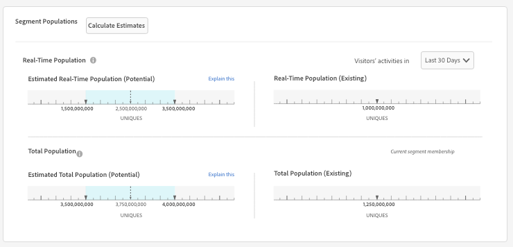

# Trait and Segment Population Data in Segment Builder {#trait-and-segment-population-data-in-segment-builder}

Add and remove traits in [!UICONTROL Segment Builder] to see actual trait populations along with actual and estimated segment population data. 예상 인구 크기 데이터는 캠페인에 적합한 세그먼트를 만드는 데 도움이 됩니다.

## Trait Population Data {#trait-population-data}

[!UICONTROL Segment Builder] 세그먼트에 [!UICONTROL Total Trait Population] 트레이트를 추가할 마지막 날을 보여줍니다. This data appears in the blue field around your selected trait in the [!UICONTROL Basic View] section.

다음 표는 트레이트 모집단 지표를 정의합니다.

<table id="table_9D837CF9ACA04D04BEE5925EC0B4A5D2"> 
 <thead> 
  <tr> 
   <th colname="col1" class="entry"> 지표 </th> 
   <th colname="col2" class="entry"> 설명 </th>
  </tr> 
 </thead>
 <tbody> 
  <tr> 
   <td colname="col1"> 
  총 특성 수 
 </td>
   <td colname="col2"> 
프로필에 선택된 트레이트가 있는 고유한 ID의 수입니다. 
 </td>
  </tr> 
 </tbody> 
</table>

## Calculating Real and Estimated Segment Populations {#calculating-real-estimated-populations}

새 세그먼트를 만들거나 기존 세그먼트를 변경할 때 Audience Manager는 실제 실시간 세그먼트와 총 세그먼트 모집단에 대한 결과를 표시하는 데 최대 24 시간이 걸립니다.

하지만 Audience Manager는 세그먼트의 실시간 및 총 모집단 크기를 즉시 예측할 수 있습니다. 이러한 예상치는 샘플링된 내역 데이터를 기반으로 하며 95% 신뢰 구간의 결과를 반환합니다.

In [!UICONTROL Segment Builder], a blue bar on the estimated population graphs indicates the possible upper and lower ranges for segment size. 이전 성능은 향후 성과를 보장하지는 않지만 예상 데이터를 통해 신규 또는 편집된 세그먼트의 잠재적인 크기를 이해할 수 있습니다.

## Segment Population Data Overview {#segment-populations}

[!UICONTROL Segment Builder] 세그먼트를 만들고 편집할 때 세그먼트 모집단 데이터를 표시합니다.

* For estimated segment population data (real-time and total), [!UICONTROL Segment Builder] does not update the graphs automatically as you add or remove traits in a segment. Click **[!UICONTROL Calculate Estimates]** to see (or refresh) the estimated population numbers.

* For actual (real) segment population data (real-time and total), [!UICONTROL Segment Builder] updates the segment graph automatically when you load an existing segment. 새 세그먼트에 대해, 또는 기존 세그먼트에 새 트레이트를 추가할 때, 실제 모집단 데이터는 세그먼트가 만들어진 후 24 시간 후에 업데이트되지 않습니다.

예상 및 실제 세그먼트 모집단 데이터에 대한 자세한 내용은 아래 정의를 참조하십시오.

## Estimated Segment Population Data Defined {#estimated-segment-population}

다음 표는 예상 인구 지표를 정의합니다.

<table id="table_B24503F372E34B6BBDF5204181701A59"> 
 <thead> 
  <tr> 
   <th colname="col1" class="entry"> 지표 </th> 
   <th colname="col2" class="entry"> 설명 </th> 
  </tr>
 </thead>
 <tbody> 
  <tr> 
   <td colname="col1"> 
  예상 실시간 인구 (잠재적인)  
 </td> 
   <td colname="col2"> 
지정된 시간 범위 동안 실시간으로 본 고유 방문자 수와 Audience Manager가 본 시점에 세그먼트에 대한 자격을 갖춘 고유 방문자 수입니다. 
 
In  Segment Builder, the last 30-day populations for traits ( Total Trait Populations), can be different for traits and segments evaluated in real-times. 
 

     <ul id="ul_CAE803D09913462CAD413A665D85C1A2"> 
      <li id="li_3E64330D6F5B4D2F8F3456730A86894F">트레이트에 대해 마지막 30 일 지표는 마지막 30 일 동안 해당 트레이트를 자격을 부여한 고유 사용자의 수를 카운트합니다. </li>
      <li id="li_FF3CACD0B6C742CDB94D66200D77CE06">실시간으로 평가되는 세그먼트의 경우 마지막 30 일 지표는 과거의 특정 시점에 자격 조건을 충족하는 사용자 수를 계산하며 지난 30 일 이내에 Audience Manager에서 다시 본 사용자 수를 카운트합니다. 예를 들어, 60 일 전 트레이트를 자격을 갖추고 10 일 전에 다시 본 사용자가 있다고 가정해 봅시다. 데이터에서 이 사용자는 30 일 전에 트레이트 트레이트에 처음 자격 조건을 적용했기 때문에 트레이트 카운트에 추가되지 않습니다. 하지만, 실시간으로 평가된 세그먼트에 대한 마지막 30 일 수에 포함됩니다. 이는 30 일 기간 내에 세그먼트에 적용적이기 때문입니다. </li>
     </ul> 
 
 
Note: The  Estimated Real-Time Population metric does not include devices that have qualified for a segment based on connections provided by a  Profile Merge Rule that uses a <a href="../../features/profile-merge-rules/merge-rule-definitions.md#device-options"> device graph option</a>. 
 
 </td> 
  </tr> 
  <tr> 
   <td colname="col1"> 
  예상 총 인구 수 (잠재적인) 
 </td> 
   <td colname="col2"> 
새 세그먼트나 수정된 세그먼트에 있을 수 있는 고유 방문자 수. 거의 모든 예측의 경우처럼 과거의 성과는 미래의 결과를 보장하지는 않지만, 예상 합계를 다음과 같이 사용할 수 있습니다. 
 
 
     <ul id="ul_0490DD08C7C8493DADFB11B5872A73BC"> 
      <li id="li_AE38C8C8A4B24021BAC724B51A4799E2">세그먼트를 빌드할 때 신규 또는 개정된 세그먼트가 도달할 수 있는 사람 수를 확인합니다. </li> 
      <li id="li_E830EC2B12DC46D4B0A4DD807A8936F6">목표에 따라 세그먼트를 조정할 수 있습니다. 예를 들어, 큰 세그먼트는 브랜드 인식 캠페인에서 유용하며, 더 작은 세그먼트는 타깃팅된 타깃팅 또는 캠페인을 타깃팅하는 데 유용합니다. </li> 
     </ul> 
 
 
Note: The  Estimated Total Population metric does not include devices that have qualified for a segment based on connections provided by a  Profile Merge Rule that uses a <a href="../../features/profile-merge-rules/merge-rule-definitions.md#device-options"> device graph option</a>. 
 
 </td> 
  </tr> 
 </tbody> 
</table>

## Existing (Actual) Segment Population Data Defined {#existing-segment-population}

[!UICONTROL Profile Merge Rules] 실제 실시간 및 총 모집단 수에 영향을 줍니다. These totals vary depending on if the [!UICONTROL Profile Merge Rule] a segment belongs to uses a device graph option or not. [프로필 병합 규칙 옵션을 정의했습니다](../../features/profile-merge-rules/merge-rule-definitions.md).

### 장치 그래프 옵션이 없는 병합 규칙의 세그먼트 모집단 데이터

The following table defines the actual real-time and total population metrics when your segments are used by a [!UICONTROL Profile Merge Rule] created without a device graph option. These are the device options settings **[!UICONTROL No Device Options]** and **[!UICONTROL Current Device Proflie]**.

<table id="table_A18C973855DB46A0B39B81F32E0E7540"> 
 <thead> 
  <tr> 
   <th colname="col1" class="entry"> 지표 </th> 
   <th colname="col2" class="entry"> 설명 </th> 
  </tr> 
 </thead>
 <tbody> 
  <tr> 
   <td colname="col1"> 
  실시간 인구 (기존) 
 </td> 
   <td colname="col2"> 
지정된 시간 범위 동안 실시간으로 본 고유 방문자 수와 Audience Manager가 본 시점에 세그먼트에 대한 자격을 갖춘 실제 방문자 수입니다. 
 
In  Segment Builder, the last 30-day populations for traits ( Total Trait Populations), can be different for traits and segments evaluated in real-time. 
 
 
     <ul id="ul_50D1528DDDF347858F17DA3C033B0E3F"> 
      <li id="li_ABA2BFE68FF4430DBB425C4661E1836A">트레이트에 대해 마지막 30 일 지표는 마지막 30 일 동안 해당 트레이트를 자격을 부여한 고유 사용자의 수를 카운트합니다. </li> 
      <li id="li_1519068CBB1445E893657D12E8FE42AC">실시간으로 평가되는 세그먼트의 경우 마지막 30 일 지표는 과거의 특정 시점에 자격 조건을 충족하는 사용자 수를 계산하며 지난 30 일 이내에 Audience Manager에서 다시 본 사용자 수를 카운트합니다. 예를 들어, 60 일 전 트레이트를 자격을 갖추고 10 일 전에 다시 본 사용자가 있다고 가정해 봅시다. 데이터에서 이 사용자는 30 일 전에 트레이트 트레이트에 처음 자격 조건을 적용했기 때문에 트레이트 카운트에 추가되지 않습니다. 하지만, 실시간으로 평가된 세그먼트에 대한 마지막 30 일 수에 포함됩니다. 이는 30 일 기간 내에 세그먼트에 적용적이기 때문입니다. </li> 
     </ul> 
 </td> 
  </tr> 
  <tr> 
   <td colname="col1"> 
  총 인구 수 (기존) 
 </td> 
   <td colname="col2"> 
어제 기준 세그먼트에 대해 자격을 얻은 고유 방문자 수. 
 </td> 
  </tr> 
 </tbody> 
</table>

### 장치 그래프 옵션을 사용하여 병합 규칙에 대한 세그먼트 모집단 데이터

The following table defines the actual real-time and total population metrics when your segments are used by a [!UICONTROL Profile Merge Rule] created with a device graph option. These are the device options settings for the [!UICONTROL Profile Link Device Graph], the [!DNL Adobe] device graph, and other third-party device graph choices that are available to you.

<table id="table_157EC6E5B5C44EB899854CA10B090F60"> 
 <thead> 
  <tr> 
   <th colname="col1" class="entry"> 지표 </th> 
   <th colname="col2" class="entry"> 설명 </th> 
  </tr> 
 </thead>
 <tbody> 
  <tr> 
   <td colname="col1"> 
  실시간 인구 (기존) 
 </td> 
   <td colname="col2"> 
The actual number of devices seen in real-time with current profiles that, when merged with up to 3-other device profiles connected by the device graph, contains the traits to qualify for the segment the moment it was seen by  Audience Manager. 
 </td>
  </tr>
  <tr> 
   <td colname="col1"> 
  총 인구 수 (기존) 
 </td> 
   <td colname="col2"> 
장치 그래프로 연결된 최대 3 개의 다른 장치 프로파일과 병합할 때 세그먼트에 대한 자격이 모두 부여되는 프로파일이 있는 장치의 총 수입니다. 
 </td>
  </tr>
 </tbody>
</table>

### 세그먼트 모집단을 평가할 때 최근 및 빈도 표현식으로 인한 제한 사항

[!UICONTROL Segment Builder] 최대 4 개의 최근 및 빈도 표현식이 포함된 세그먼트 규칙에 대한 세그먼트 크기 추정을 지원합니다. 세그먼트 규칙을 만들 때 최근 4 개 이상의 최근 및 빈도 표현식을 선택하면 모집단에서 모집단을 평가할 때 오류가 표시됩니다.

### 세그먼트 모집단을 평가할 때 병합 규칙으로 인한 제한 사항

현재, 우리의 세그먼트 크기 견적 도구는 프로필 병합 규칙을 고려하지 않으므로 알려진 제한이 있습니다. For example, look at segments with the **No Authenticated Profile + Current Device Profile** [merge rule](../../features/profile-merge-rules/merge-rule-definitions.md). 현재 세그먼트 예측 번호를 계산하는 방식으로 인해 예상 모집단에 인증된 프로필이 포함됩니다. 그러나 기존 세그먼트 모집단은 인증된 프로필을 올바로 무시합니다.

>[!MORE_ like_ this]
>
>* [프로필 병합 규칙 및 장치 그래프 FAQ](../../faq/faq-profile-merge.md)
>* [프로필 링크](../../features/profile-merge-rules/merge-rules-overview.md)

