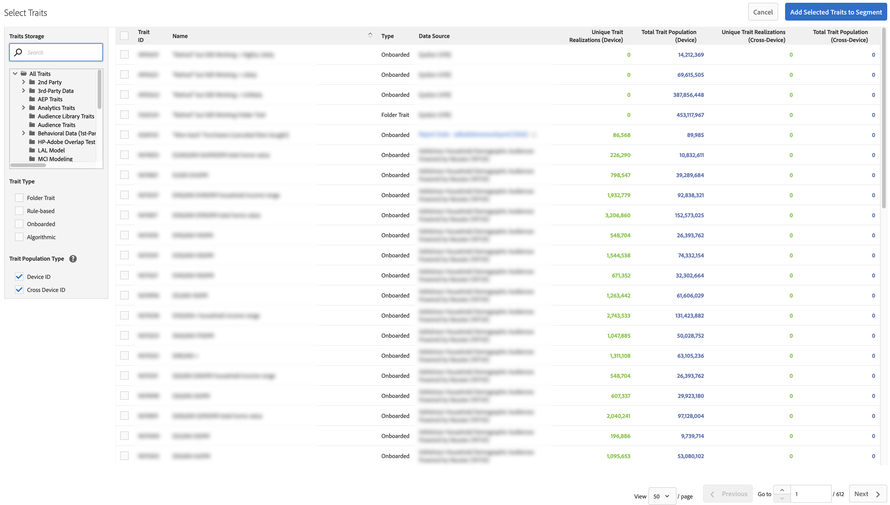

# [!UICONTROL Segment Builder] {#segment-builder}

[!UICONTROL Segment Builder]에서 세그먼트를 만드는 필수 단계 및 선택적 단계를 설명합니다.

## 비디오 데모

[Audience Manager 비디오에서 세그먼트 만들기](https://images-tv.adobe.com/avp/vr/b7f88801-efe0-4786-9d58-554db16b34eb/81b6f004-cec0-452c-9b35-dabdc69ae3b4/9dc8a1d4-350d-46c3-90a6-5197dfb76f40_20180130023449.854x480at800_h264.mp4)를 시청하여 시작하십시오. 이 비디오에서는 세그먼트 만들기 프로세스를 안내합니다. 자세한 내용은 아래 섹션을 참조하십시오.

## [!UICONTROL Segment] 만들기 {#create-segment}

### 세그먼트 빌더 섹션

<!-- t_create_segment.xml -->

[!UICONTROL Segment Builder]은(는) [!UICONTROL Basic Information], [!UICONTROL Traits] 및 [!UICONTROL Destinations Mapping]의 세 개의 개별 섹션으로 구성되어 있습니다. [!UICONTROL segment]을(를) 만들려면 [!UICONTROL Basic Information] 및 [!UICONTROL Traits] 섹션의 필수 필드를 작성합니다. [!UICONTROL Destinations Mapping] 설정은 선택 사항입니다. 추가 도움말은 아래 지침을 참조하십시오.

1. [기본 정보](../../features/segments/segment-builder.md#segment-builder-controls-basics) 섹션에서:

   

   * [!UICONTROL segment] 이름을 지정합니다. [!UICONTROL segment] 이름의 최대 길이는 255자입니다.
   * [!UICONTROL segment] 상태를 설정합니다(활성은 기본값).
   * [!UICONTROL data source] 선택. 첫 번째 드롭다운 메뉴를 사용하여 Audience Manager [!UICONTROL data sources], Adobe Analytics 보고서 세트 또는 둘 다 간에 필터링합니다. 그런 다음 두 번째 드롭다운 메뉴를 사용하여 [!UICONTROL data source]을(를) 선택합니다. Adobe Analytics 보고서 세트를 사용하지 않는 경우 [!UICONTROL data source] 유형 선택기가 비활성화되고 기본값이 Audience Manager 데이터 소스로만 설정됩니다.
   * [!UICONTROL profile merge rule] 자격에 사용할 [!UICONTROL segment]을(를) 선택하십시오.
   * 저장소 폴더에 [!UICONTROL segment]을(를) 할당합니다.

1. [트레이트](../../features/segments/segment-builder.md#segment-builder-controls-traits) 섹션에서:
   
   * 세그먼트에 추가할 [!UICONTROL trait]을(를) 검색하고 **[!UICONTROL Add Trait]**&#x200B;을(를) 클릭합니다. [!UICONTROL trait] 그룹을 만들려면 다른 [!UICONTROL trait]을(를) 추가하십시오.
   * [!UICONTROL Advanced Search]을(를) 클릭하여 **[!UICONTROL Browse All Traits]** 모달을 표시합니다. 이름, ID, 설명 또는 [!UICONTROL traits]별로 [!UICONTROL data source]을(를) 검색합니다. 검색 중에 폴더를 클릭하여 해당 폴더 및 그 하위 폴더로 결과를 제한합니다. [!UICONTROL traits]&#x200B;([!UICONTROL trait type], [!UICONTROL Folder Trait], [!UICONTROL Rule-based] 및 [!UICONTROL Onboarded]) 또는 모집단 유형([!UICONTROL Algorithmic]장치 ID[ 및 ](../../reference/ids-in-aam.md)교차 장치 ID[)별로 ](../../reference/ids-in-aam.md)을(를) 필터링할 수도 있습니다.
     
   * [을(를) 빌드할 때 실시간 ](trait-recommendations.md)트레이트 추천[!UICONTROL segment]을(를) 받습니다.
   * [!UICONTROL traits]을(를) 클릭하고 끌어 별도의 그룹을 만듭니다.
   * 그룹 간에 마우스를 가져가면 부울 [!UICONTROL AND], [!UICONTROL OR], [!UICONTROL AND NOT] 값과의 관계를 설정할 수 있습니다.
   * 시계 아이콘 위로 마우스를 가져가면 [에 ](../../features/segments/recency-and-frequency.md)최신성 및 빈도[!UICONTROL trait] 규칙을 추가할 수 있습니다.
   * [!UICONTROL traits]을(를) 추가하거나 제거할 때 세그먼트 모집단 데이터를 봅니다. 예상 모집단 수를 보거나 새로 고치려면 **[!UICONTROL Calculate Estimates]**&#x200B;을(를) 클릭합니다. [의 ](../../features/segments/segment-builder-data.md#segment-populations)세그먼트 모집단 데이터[!UICONTROL Segment Builder]에 대해 자세히 알아보세요.
   * 완료되면 **[!UICONTROL Save]**&#x200B;을(를) 클릭합니다.

1. *(선택 사항)* [!UICONTROL segment]대상 매핑[!UICONTROL destination] 섹션에서 [을(를) ](../../features/segments/segment-builder.md#segment-builder-controls-destinations)에 매핑합니다.
   * [!UICONTROL destination]을(를) 검색하고 **[!UICONTROL Add Destination]**&#x200B;을(를) 클릭합니다. [!UICONTROL destination]이(가) 이미 있어야 [!UICONTROL segment]에 추가할 수 있습니다.
   * 완료되면 **[!UICONTROL Save]**&#x200B;을(를) 클릭합니다.

크로스 디바이스 지표가 작동하는 방식에 대한 자세한 내용은 아래 비디오를 시청하십시오.

>[!VIDEO](https://video.tv.adobe.com/v/33445)

## [!UICONTROL Segment Builder] 컨트롤: [!UICONTROL Basic Information] 섹션 {#segment-builder-controls-basics}

[!UICONTROL Segment Builder]에서 [!UICONTROL the Basic Information] 설정을 사용하여 새 특성을 만들거나 기존 특성을 편집할 수 있습니다. 새 [!UICONTROL segment]을(를) 만들려면 이름, [!UICONTROL data source]을(를) 입력하고 저장소 폴더를 선택하십시오. 다른 모든 필드는 선택 사항입니다. 완료되면 [!UICONTROL Traits] 섹션으로 이동합니다.

<!-- r_segment_basic_info_section.xml -->

<!--

<table id="table_39DA4BC9470448B48F6654F2774EE0D5"> 
 <thead> 
  <tr> 
   <th colname="col1" class="entry"> Field </th> 
   <th colname="col2" class="entry"> Description </th> 
  </tr> 
 </thead>
 <tbody> 
  <tr> 
   <td colname="col1"> <b>Name</b> </td> 
   <td colname="col2"> 
Give the segment a short, logical name that describes its function or purpose. Avoid abbreviations and special characters. The maximum length of a segment name is 255 characters. 
 </td> 
  </tr> 
  <tr> 
   <td colname="col1"> <b>Description</b> </td> 
   <td colname="col2"> 
A field for additional descriptive information about the segment. 
 </td> 
  </tr> 
  <tr> 
   <td colname="col1"> <b>Integration Code</b> </td> 
   <td colname="col2"> 
A field for a user-defined ID or other company-specific information. 
 </td> 
  </tr> 
  <tr> 
   <td colname="col1"> <b>Data Source</b> </td> 
   <td colname="col2"> 
Associates the segment with a specific data provider. 
Use the first drop-down menu to filter between Audience Manager data sources, Adobe Analytics report suites, or both. Then, use the second drop-down menu to choose your data source.

 If you are not using Adobe Analytics report suites, the data source type selector is disabled and defaulted to Audience Manager data sources only.

 </td> 
  </tr> 
  <tr> 
   <td colname="col1"><b>Profile Merge Rule</b> </td> 
   <td colname="col2"> 
Selects the Profile Merge Rule to use for segment qualification. 
 </td> 
  </tr> 
  <tr> 
   <td colname="col1"> <b>Status</b> </td> 
   <td colname="col2"> 
Activates or deactivates the segment (active by default). 
 </td> 
  </tr> 
  <tr> 
   <td colname="col1"> <b>Folder Storage</b> </td> 
   <td colname="col2"> 
Determines which storage folder the segment belongs to. 
 </td> 
  </tr> 
 </tbody> 
</table>

-->

| 필드 | 설명 |
---------|----------
| **[!UICONTROL Name]** | 세그먼트에 기능 또는 목적을 설명하는 짧은 논리적 이름을 지정합니다. 약어 및 특수 문자를 사용하지 마십시오. 세그먼트 이름의 최대 길이는 255자입니다. |
| **[!UICONTROL Description]** | 세그먼트에 대한 추가 설명 정보를 위한 필드입니다. |
| **[!UICONTROL Integration Code]** | 사용자 정의 ID 또는 기타 특정 회사에 대한 정보를 위한 필드. |
| **[!UICONTROL Data Source]** | 세그먼트를 특정 데이터 공급자와 연결합니다.   첫 번째 드롭다운 메뉴를 사용하여 Audience Manager 데이터 원본, Adobe Analytics 보고서 세트 또는 둘 다 간에 필터링합니다. 그런 다음 두 번째 드롭다운 메뉴를 사용하여 데이터 소스를 선택합니다.   Adobe Analytics 보고서 세트를 사용하지 않는 경우 데이터 소스 유형 선택기가 비활성화되고 기본값이 Audience Manager 데이터 소스로만 설정됩니다. |
| **[!UICONTROL Profile Merge Rule]** | 세그먼트 자격에 사용할 프로필 병합 규칙을 선택합니다. |
| **[!UICONTROL Status]** | 세그먼트를 활성화하거나 비활성화합니다(기본적으로 활성화됨). |
| **폴더 저장소** | 세그먼트가 속한 저장소 폴더를 결정합니다. |

## [!UICONTROL Segment Builder] 컨트롤: [!UICONTROL Traits] 섹션 {#segment-builder-controls-traits}

[!UICONTROL Segment Builder]의 [!UICONTROL Traits] 섹션에서 [!UICONTROL traits]의 [!UICONTROL segment]을(를) 관리하고 [!UICONTROL trait]개의 그룹을 만들고 자격 조건을 설정할 수 있습니다. [!UICONTROL trait]에 [!UICONTROL segment]을(를) 추가하려면 검색 필드에 [!UICONTROL trait] 이름을 입력하고 [!UICONTROL Add Trait]을(를) 클릭하십시오. [!UICONTROL trait]을(를) 저장하거나 [!UICONTROL Destinations Mapping]&#x200B;(으)로 이동합니다.

<!-- r_segment_traits_section.xml-->

**필수 구성 요소:** [!UICONTROL Basic Information] 섹션의 필수 필드를 작성합니다.

| 필드 | 설명 |
|--- |--- |
| **[!UICONTROL Basic View]** | 이 단원에서는 다음과 같은 시각적 컨트롤을 제공합니다. <ul><li>새로 빌드하고 기존 [!UICONTROL segments]을(를) 관리합니다.</li><li>[!UICONTROL traits]에서 [!UICONTROL segment]을(를) 제거합니다.</li><li>[!UICONTROL traits]에 최대 50개(최대) [!UICONTROL segment]을(를) 추가합니다.</li><li>[!UICONTROL traits]을(를) 끌어다 놓아 새 그룹을 만드십시오.</li><li>[!UICONTROL traits]에서 [!UICONTROL trait] 및 [!UICONTROL segment] 그룹을 봅니다.</li><li>부울 표현식, 비교 연산자 및 최신성/빈도 설정을 사용하여 자격 기준을 설정합니다.</li></ul> |
| **[!UICONTROL Code View]** | 시각적 인터페이스 대신 코드를 사용하여 [!UICONTROL traits], 그룹 및 자격 요구 사항을 만들고 관리할 수 있는 개발 환경을 엽니다. 코드 보기는 [!UICONTROL segments]에 유용합니다. <ul><li>개별 [!UICONTROL traits]에 50개 이상의 [!UICONTROL segment]을(를) 포함합니다. 참고: [!UICONTROL Segments]은(는) 5000 [!UICONTROL traits]&#x200B;(최대)로 제한됩니다.</li><li>[!UICONTROL trait]개의 그룹을 포함합니다.</li><li>복잡한 자격 요구 사항이 있습니다.</li></ul> |
| 검색 | [!UICONTROL traits]에 추가할 [!UICONTROL segment]을(를) 찾는 데 도움이 됩니다. |
| 권장 사항 | 구독한 자사 [!UICONTROL traits] 및 [!UICONTROL traits] 데이터 피드에서 유사한 [!UICONTROL Audience Marketplace]에 대한 실시간 권장 사항을 가져옵니다. 대상을 확장하려면 이 권장 사항을 [!UICONTROL segment] 규칙에 추가하십시오. [트레이트 추천](trait-recommendations.md)에서 자세히 알아보세요. |
| **[!UICONTROL Marketplace Recommendations]** | 구독하지 않은 [!UICONTROL traits] 데이터 피드에서 유사한 [!UICONTROL Audience Marketplace]에 대한 실시간 권장 사항을 가져옵니다. [트레이트 추천](trait-recommendations.md)에서 자세히 알아보세요. |
| 실제 및 예상 [!UICONTROL Segment] 크기 데이터 | [세그먼트 빌더의 트레이트 및 세그먼트 인구 데이터](segment-builder-data.md)를 참조하십시오. |

## [!UICONTROL Traits]에서 [!UICONTROL Segment] 제거 {#remove-traits}

[!UICONTROL traits]에서 [!UICONTROL segments]을(를) 관리하는 것은 [!UICONTROL segments]을(를) 실행 가능하게 유지하는 데 중요한 부분입니다. [!UICONTROL traits]에서 [!UICONTROL segment]을(를) 제거해야 하는 경우 다음 단계를 따르십시오.

[!UICONTROL traits]에서 [!UICONTROL segment]을(를) 제거하려면:

1. **[!UICONTROL Audience Data > Segments]**(으)로 이동합니다. 목록을 스크롤하거나 검색 기능을 사용하여 작업하려는 [!UICONTROL segment]을(를) 찾습니다.
2. [!UICONTROL segment] 이름을 클릭하여 [!UICONTROL segment] 세부 정보 화면을 엽니다.
3. **편집**&#x200B;을 클릭하여 [!UICONTROL Segment Builder]을(를) 연 다음 **특성**&#x200B;을(를) 클릭하여 [!UICONTROL traits] 패널을 엽니다.
4. 삭제할 [!UICONTROL trait]을(를) 마우스로 가리킨 다음 X를 클릭합니다. 이 작업은 즉시 [!UICONTROL trait]에서 [!UICONTROL segment]을(를) 제거합니다.

## [!UICONTROL Segment Builder] 컨트롤: [!UICONTROL Destinations Mappings] 섹션 {#segment-builder-controls-destinations}

[!UICONTROL Segment Builder]에서 선택적 [!UICONTROL Destinations Mapping] 섹션을 사용하면 [!UICONTROL segment] 데이터를 타사 [!DNL cookie], [!DNL URL] 또는 [!UICONTROL server-to-server destination]&#x200B;(으)로 보낼 수 있습니다. [!UICONTROL destination]을(를) 추가하려면 [!UICONTROL destination]을(를) 검색하거나 찾아보고 [!UICONTROL destination]개의 특정 정보를 입력한 다음 **[!UICONTROL Add Destination]**&#x200B;을(를) 클릭하십시오.

<!-- r_segment_destinations_map.xml -->

### 사전 요구 사항

[!UICONTROL Basic Information] 및 [!UICONTROL Traits] 섹션의 필수 필드를 작성합니다. 또한 대상이 이미 있어야 합니다.

### [!UICONTROL Destination Mappings] 검색 도구

아래 표에 설명된 대로 **[!UICONTROL Destination Mappings]** 패널에 검색 도구가 있습니다.

| 검색 유형 | 설명 |
|---|---|
| **[!UICONTROL Search by Destination Name]** | 이름별로 특정 [!UICONTROL destination]을(를) 검색할 수 있습니다. 검색하려면 입력을 시작합니다. 필드는 검색어에 따라 자동으로 완성됩니다. 완료되면 **[!UICONTROL Add Destination]**&#x200B;을(를) 클릭합니다. |
| **[!UICONTROL Browse All Destinations]** | 사용 가능한 *모두* [!UICONTROL destinations] 목록을 찾아보세요. 팝업 목록에서 [!UICONTROL destinations]을(를) 선택하여 [!UICONTROL segment]에 추가하십시오. |

## [!UICONTROL Destination Mappings] 팝업 창의 필드 {#fields-in-dest-mappings}

[!UICONTROL Segment Builder]에서 [!UICONTROL Add Destination]을(를) 선택하면 [!UICONTROL destination] 대화 상자가 나타납니다. 이 창에는 [!UICONTROL destination] 유형에 따라 달라지는 [!UICONTROL destination] 및 필드에 대한 정적 정보가 표시됩니다. [!UICONTROL destination mapping]을(를) 설정하는 데 필요한 정보를 빈 필드에 제공하십시오.

>[!NOTE]
>
>게시 날짜는 선택 사항입니다. 비어 있는 경우 대상이 활성화되고 만료되지 않습니다.

<!-- r_add_mappings_pop.xml -->

### [!UICONTROL Cookie Destination]개 필드

[!UICONTROL Destination Mapping] 필드에 데이터를 [!UICONTROL destination]&#x200B;(으)로 보내는 데 사용되는 키-값 쌍을 지정합니다. 첫 번째 필드에 키를 입력하고 두 번째 필드에 값을 입력합니다. [!UICONTROL cookie destination] 팝은 다음과 비슷합니다.

### [!UICONTROL URL Destination]개 필드

[!UICONTROL URL] 및 [!UICONTROL Secure URL] 필드에서 [!UICONTROL destination]&#x200B;(으)로 데이터를 보내는 데 사용되는 전체 표준 또는 보안 주소를 지정합니다.

### [!UICONTROL Server-to-Server Destination]개 필드

[!UICONTROL Destination Value] 필드에서 데이터를 [!UICONTROL destination]&#x200B;(으)로 보내는 데 사용되는 값(키-값 쌍의 일부)을 지정합니다.

>[!MORELIKETHIS]
>
>* [쿠키 대상 만들기](../../features/destinations/create-cookie-destination.md)
>* [URL 대상 만들기](../../features/destinations/create-url-destination.md)
