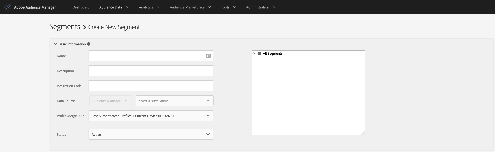
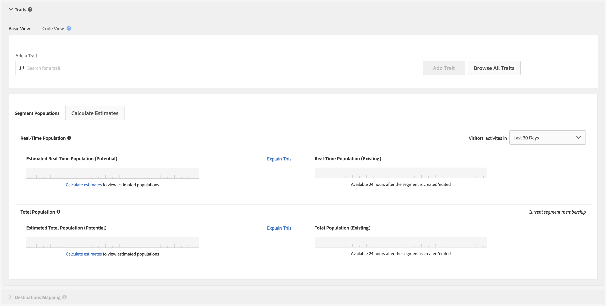
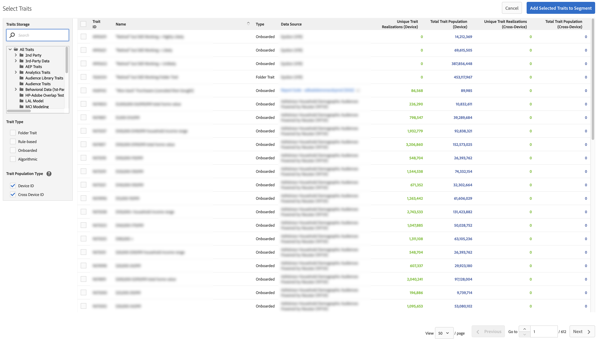
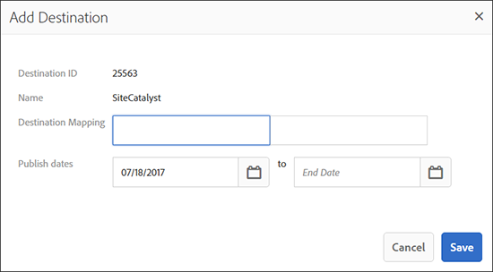
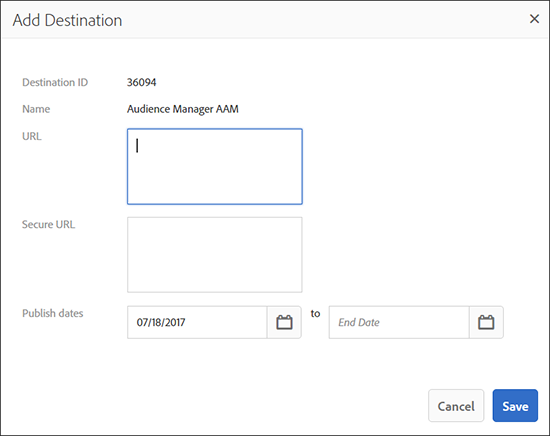
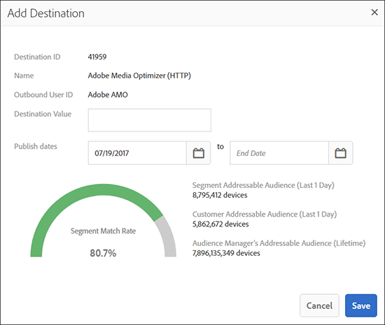

# [!UICONTROL Segment Builder] {#segment-builder}

[!UICONTROL Segment Builder]에서 세그먼트를 만드는 필수 단계 및 선택적 단계를 설명합니다.

## 비디오 데모

[Audience Manager 비디오에서 세그먼트 만들기](https://images-tv.adobe.com/avp/vr/b7f88801-efe0-4786-9d58-554db16b34eb/81b6f004-cec0-452c-9b35-dabdc69ae3b4/9dc8a1d4-350d-46c3-90a6-5197dfb76f40_20180130023449.854x480at800_h264.mp4)를 시청하여 시작하십시오. 이 비디오에서는 세그먼트 만들기 프로세스를 안내합니다. 자세한 내용은 아래 섹션을 참조하십시오.

## [!UICONTROL Segment] 만들기 {#create-segment}

### 세그먼트 빌더 섹션

<!-- t_create_segment.xml -->

[!UICONTROL Segment Builder]은(는) [!UICONTROL Basic Information], [!UICONTROL Traits] 및 [!UICONTROL Destinations Mapping]의 세 개의 개별 섹션으로 구성되어 있습니다. [!UICONTROL segment]을(를) 만들려면 [!UICONTROL Basic Information] 및 [!UICONTROL Traits] 섹션의 필수 필드를 작성합니다. [!UICONTROL Destinations Mapping] 설정은 선택 사항입니다. 추가 도움말은 아래 지침을 참조하십시오.

1. [기본 정보](../../features/segments/segment-builder.md#segment-builder-controls-basics) 섹션에서:

   

   * [!UICONTROL segment] 이름을 지정합니다. [!UICONTROL segment] 이름의 최대 길이는 255자입니다.
   * [!UICONTROL segment] 상태를 설정합니다(활성은 기본값).
   * [!UICONTROL data source] 선택. 첫 번째 드롭다운 메뉴를 사용하여 Audience Manager [!UICONTROL data sources], Adobe Analytics 보고서 세트 또는 둘 다 간에 필터링합니다. 그런 다음 두 번째 드롭다운 메뉴를 사용하여 [!UICONTROL data source]을(를) 선택합니다. Adobe Analytics 보고서 세트를 사용하지 않는 경우 [!UICONTROL data source] 유형 선택기가 비활성화되고 기본값이 Audience Manager 데이터 소스로만 설정됩니다.
   * [!UICONTROL segment] 자격에 사용할 [!UICONTROL profile merge rule]을(를) 선택하십시오.
   * 저장소 폴더에 [!UICONTROL segment]을(를) 할당합니다.

1. [트레이트](../../features/segments/segment-builder.md#segment-builder-controls-traits) 섹션에서:
   
   * Search for the [!UICONTROL trait] you want to add to a segment and click **[!UICONTROL Add Trait]**. Add another [!UICONTROL trait] to create a [!UICONTROL trait] group.
   * Bring up the [!UICONTROL Advanced Search] modal by clicking **[!UICONTROL Browse All Traits]**. Search for [!UICONTROL traits] by name, ID, description or [!UICONTROL data source]. Click on a folder while searching to limit results to that folder and its subfolders. You can also filter [!UICONTROL traits] by [!UICONTROL trait type] ([!UICONTROL Folder Trait], [!UICONTROL Rule-based], [!UICONTROL Onboarded], and [!UICONTROL Algorithmic]) or population type ([Device ID](../../reference/ids-in-aam.md) and [Cross-Device ID](../../reference/ids-in-aam.md)).
     
   * Click and drag [!UICONTROL traits] to create separate groups.
   * Hover between groups to set relationships with Boolean [!UICONTROL AND], [!UICONTROL OR], [!UICONTROL AND NOT] values.
   * Hover over the clock icon to add [recency and frequency](../../features/segments/recency-and-frequency.md) rules to the [!UICONTROL trait].
   * View segment population data as you add or remove [!UICONTROL traits]. Click **[!UICONTROL Calculate Estimates]** to see (or refresh) the estimated population numbers. Read more about [segment population data](../../features/segments/segment-builder-data.md#segment-populations) in the [!UICONTROL Segment Builder].
   * Click **[!UICONTROL Save]** when done.

1. *(Optional)* Map a [!UICONTROL segment] to a [!UICONTROL destination] in the [Destination Mapping](../../features/segments/segment-builder.md#segment-builder-controls-destinations) section:
   * Search for the [!UICONTROL destination] and click **[!UICONTROL Add Destination]**. Note, the [!UICONTROL destination] must already exist before you can add it to a [!UICONTROL segment].
   * Click **[!UICONTROL Save]** when done.

Watch the video below for a detailed look at how cross-device metrics work.

>[!VIDEO](https://video.tv.adobe.com/v/33445)

## [!UICONTROL Segment Builder] Controls: [!UICONTROL Basic Information] Section {#segment-builder-controls-basics}

In [!UICONTROL Segment Builder], [!UICONTROL the Basic Information] settings let you create new, or edit existing traits. To create a new [!UICONTROL segment], provide a name, a [!UICONTROL data source], and select a storage folder. 다른 모든 필드는 선택 사항입니다. Move on to the [!UICONTROL Traits] section when done.

<!-- r_segment_basic_info_section.xml -->

<!--

<table id="table_39DA4BC9470448B48F6654F2774EE0D5"> 
 <thead> 
  <tr> 
   <th colname="col1" class="entry"> Field </th> 
   <th colname="col2" class="entry"> Description </th> 
  </tr> 
 </thead>
 <tbody> 
  <tr> 
   <td colname="col1"> <b>Name</b> </td> 
   <td colname="col2"> 
Give the segment a short, logical name that describes its function or purpose. Avoid abbreviations and special characters. The maximum length of a segment name is 255 characters. 
 </td> 
  </tr> 
  <tr> 
   <td colname="col1"> <b>Description</b> </td> 
   <td colname="col2"> 
A field for additional descriptive information about the segment. 
 </td> 
  </tr> 
  <tr> 
   <td colname="col1"> <b>Integration Code</b> </td> 
   <td colname="col2"> 
A field for a user-defined ID or other company-specific information. 
 </td> 
  </tr> 
  <tr> 
   <td colname="col1"> <b>Data Source</b> </td> 
   <td colname="col2"> 
Associates the segment with a specific data provider. 
Use the first drop-down menu to filter between Audience Manager data sources, Adobe Analytics report suites, or both. Then, use the second drop-down menu to choose your data source.

 If you are not using Adobe Analytics report suites, the data source type selector is disabled and defaulted to Audience Manager data sources only.

 </td> 
  </tr> 
  <tr> 
   <td colname="col1"><b>Profile Merge Rule</b> </td> 
   <td colname="col2"> 
Selects the Profile Merge Rule to use for segment qualification. 
 </td> 
  </tr> 
  <tr> 
   <td colname="col1"> <b>Status</b> </td> 
   <td colname="col2"> 
Activates or deactivates the segment (active by default). 
 </td> 
  </tr> 
  <tr> 
   <td colname="col1"> <b>Folder Storage</b> </td> 
   <td colname="col2"> 
Determines which storage folder the segment belongs to. 
 </td> 
  </tr> 
 </tbody> 
</table>

-->

| 필드 | 설명 |
|---------|----------|
| **[!UICONTROL Name]** | 세그먼트에 기능 또는 목적을 설명하는 짧은 논리적 이름을 지정합니다. 약어 및 특수 문자를 사용하지 마십시오. 세그먼트 이름의 최대 길이는 255자입니다. |
| **[!UICONTROL Description]** | 세그먼트에 대한 추가 설명 정보를 위한 필드입니다. |
| **[!UICONTROL Integration Code]** | 사용자 정의 ID 또는 기타 특정 회사에 대한 정보를 위한 필드. |
| **[!UICONTROL Data Source]** | 세그먼트를 특정 데이터 공급자와 연결합니다.   첫 번째 드롭다운 메뉴를 사용하여 Audience Manager 데이터 소스, Adobe Analytics 보고서 세트 또는 둘 다 간에 필터링합니다. 그런 다음 두 번째 드롭다운 메뉴를 사용하여 데이터 소스를 선택합니다.   Adobe Analytics 보고서 세트를 사용하지 않는 경우 데이터 소스 유형 선택기가 비활성화되고 기본값이 Audience Manager 데이터 소스로만 설정됩니다. |
| **[!UICONTROL Profile Merge Rule]** | 세그먼트 자격에 사용할 프로필 병합 규칙을 선택합니다. |
| **[!UICONTROL Status]** | 세그먼트를 활성화하거나 비활성화합니다(기본적으로 활성화됨). |
| **폴더 저장소** | 세그먼트가 속한 저장소 폴더를 결정합니다. |

## [!UICONTROL Segment Builder] 컨트롤: [!UICONTROL Traits] 섹션 {#segment-builder-controls-traits}

[!UICONTROL Segment Builder]의 [!UICONTROL Traits] 섹션에서 [!UICONTROL segment]의 [!UICONTROL traits]을(를) 관리하고 [!UICONTROL trait]개의 그룹을 만들고 자격 조건을 설정할 수 있습니다. [!UICONTROL segment]에 [!UICONTROL trait]을(를) 추가하려면 검색 필드에 [!UICONTROL trait] 이름을 입력하고 [!UICONTROL Add Trait]을(를) 클릭하십시오. [!UICONTROL trait]을(를) 저장하거나 [!UICONTROL Destinations Mapping]&#x200B;(으)로 이동합니다.

<!-- r_segment_traits_section.xml-->

**필수 구성 요소:** [!UICONTROL Basic Information] 섹션의 필수 필드를 작성합니다.

| 필드 | 설명 |
|--- |--- |
| **[!UICONTROL Basic View]** | 이 단원에서는 다음과 같은 시각적 컨트롤을 제공합니다. <ul><li>새로 빌드하고 기존 [!UICONTROL segments]을(를) 관리합니다.</li><li>[!UICONTROL segment]에서 [!UICONTROL traits]을(를) 제거합니다.</li><li>[!UICONTROL segment]에 최대 50개(최대) [!UICONTROL traits]을(를) 추가합니다.</li><li>[!UICONTROL traits]을(를) 끌어다 놓아 새 그룹을 만드십시오.</li><li>[!UICONTROL segment]에서 [!UICONTROL traits] 및 [!UICONTROL trait] 그룹을 봅니다.</li><li>부울 표현식, 비교 연산자 및 최신성/빈도 설정을 사용하여 자격 기준을 설정합니다.</li></ul> |
| **[!UICONTROL Code View]** | Opens a development environment that lets you create and manage [!UICONTROL traits], groups, and qualification requirements with code instead of the visual interface. The code view is useful if your [!UICONTROL segments]: <ul><li>Contain more than 50 [!UICONTROL traits] in an individual [!UICONTROL segment]. Note: [!UICONTROL Segments] are limited to 5000 [!UICONTROL traits] (maximum).</li><li>Contain many [!UICONTROL trait] groups.</li><li>Have complex qualification requirements.</li></ul> |
| 검색 | Helps you find [!UICONTROL traits] to add to a [!UICONTROL segment]. |
| Real and Estimated [!UICONTROL Segment] Size Data | [세그먼트 빌더의 트레이트 및 세그먼트 인구 데이터](segment-builder-data.md)를 참조하십시오. |

## Remove [!UICONTROL Traits] from a [!UICONTROL Segment] {#remove-traits}

Managing the [!UICONTROL traits] in your [!UICONTROL segments] is an important part of keeping [!UICONTROL segments] viable. Follow these steps if you need to remove [!UICONTROL traits] from a [!UICONTROL segment].

To remove [!UICONTROL traits] from a [!UICONTROL segment]:

1. **[!UICONTROL Audience Data > Segments]**(으)로 이동합니다. Scroll through the list or use the search feature to find the [!UICONTROL segment] you want to work with.
2. Click the [!UICONTROL segment] name to open the [!UICONTROL segment] details screen.
3. Click **Edit** to open [!UICONTROL Segment Builder] and then click **Traits** to open the [!UICONTROL traits] panel.
4. Hover over the [!UICONTROL trait] you want to delete and then click the X. This action immediately removes the [!UICONTROL trait] from your [!UICONTROL segment].

## [!UICONTROL Segment Builder] 컨트롤: [!UICONTROL Destinations Mappings] 섹션 {#segment-builder-controls-destinations}

In [!UICONTROL Segment Builder], the optional [!UICONTROL Destinations Mapping] section lets you send [!UICONTROL segment] data to a third-party [!DNL cookie], [!DNL URL], or [!UICONTROL server-to-server destination]. To add a [!UICONTROL destination], search (or browse) for a [!UICONTROL destination], provide [!UICONTROL destination] specific information, and click **[!UICONTROL Add Destination]**.

<!-- r_segment_destinations_map.xml -->

### 사전 요구 사항

Complete the required fields in the [!UICONTROL Basic Information] and [!UICONTROL Traits] sections. Also, the destination must already exist.

### [!UICONTROL Destination Mappings] Search Tools

The **[!UICONTROL Destination Mappings]** panel contains search tools as described in the table below.

| 검색 유형 | 설명 |
|---|---|
| **[!UICONTROL Search by Destination Name]** | Lets you search for a specific [!UICONTROL destination] by name. To search, start typing. The field will auto-complete based on your search terms. Click **[!UICONTROL Add Destination]** when done. |
| **[!UICONTROL Browse All Destinations]** | Browse a list of *all* [!UICONTROL destinations] available to you. Select and add [!UICONTROL destinations] to your [!UICONTROL segment] from the popup list. |

## Fields in the [!UICONTROL Destination Mappings] Pop-up Windows {#fields-in-dest-mappings}

In [!UICONTROL Segment Builder], the [!UICONTROL Add Destination] dialog appears after you select a [!UICONTROL destination]. This window displays static information about the [!UICONTROL destination] and fields that vary depending on the [!UICONTROL destination] type. Provide the required information in the empty fields to set up a [!UICONTROL destination mapping].

>[!NOTE]
>
>Publication dates are optional. When blank, the destination becomes active and never expires.

<!-- r_add_mappings_pop.xml -->

### [!UICONTROL Cookie Destination] Fields

In the [!UICONTROL Destination Mapping] fields, specify the key-value pairs used to send data to the [!UICONTROL destination]. Enter the key in the first field and the values in the second. Your [!UICONTROL cookie destination] pop could look similar to this:

### [!UICONTROL URL Destination] Fields

In the [!UICONTROL URL] and [!UICONTROL Secure URL] fields, specify the complete standard or secure address used to send data to the [!UICONTROL destination].

### [!UICONTROL Server-to-Server Destination] Fields

In the [!UICONTROL Destination Value] field specify the value (part of a key-value pair) used to send data to the [!UICONTROL destination].

>[!MORELIKETHIS]
>
>* [Create a Cookie Destination](../../features/destinations/create-cookie-destination.md)
>* [Create a URL Destination](../../features/destinations/create-url-destination.md)
