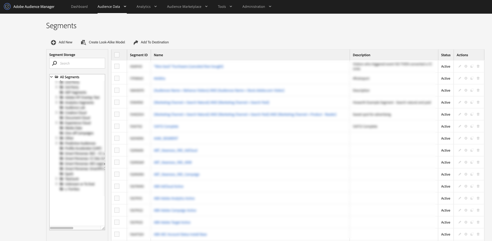

# 세그먼트 목록 보기 {#segments-list-view}

[!UICONTROL Segments dashboard]은(는) 대상 세그먼트를 관리하기 위한 중앙 집중식 작업 영역입니다. [!UICONTROL Segments] > **[!UICONTROL Audience Data]**(으)로 이동하여 **[!UICONTROL Segments]** 대시보드를 볼 수 있습니다.

[!UICONTROL Segments] 페이지에는 다음 작업에 도움이 되는 기능 및 도구가 포함되어 있습니다.

* 새 세그먼트 만들기
* 세그먼트 편집 및 삭제
* 기존 세그먼트 복제(복제)
* 정렬 가능한 열이 있는 표에서 모든 세그먼트를 봅니다.
* 세그먼트 스토리지 관리
* 이름으로 세그먼트를 검색합니다.
