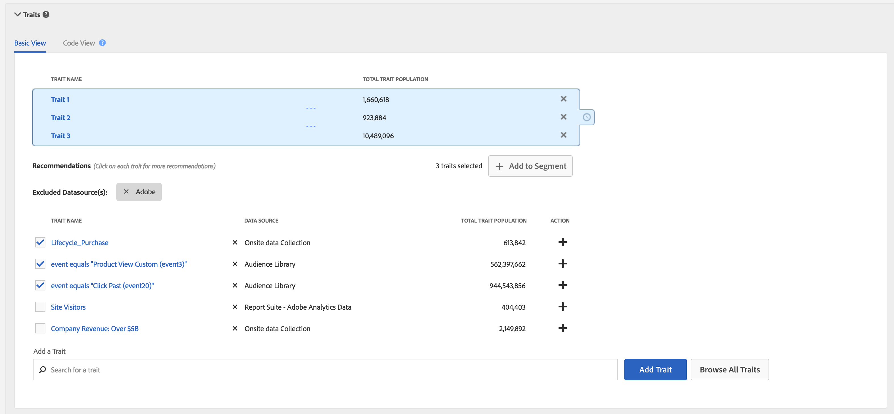

# 트레이트 권장 사항

세그먼트를 만들 때 라이브 트레이트 추천을 얻을 수 있습니다.

## 비디오 데모

트레이트 권장 사항 비디오를 본 다음 계속 읽으면 자세한 내용을 볼 수 있습니다.

>[!VIDEO](https://video.tv.adobe.com/v/26228/?captions=kor)

## 개요

[!UICONTROL Trait Recommendations]데이터 과학을 [!DNL Adobe Sensei]Audience Manager의 일상적인 워크플로우에 접목시킬 수 있습니다.
With [!UICONTROL Trait Recommendations], when you build or edit a segment in [Segment Builder](segment-builder.md), you get recommendations on additional traits you can include, that are similar to the traits in the segment rule. 세그먼트에 권장 트레이트를 추가하여 타겟 대상자를 늘리십시오.

**간단히 말해:**

* Audience Manager는 권장 트레이트에 따라 현재 구독된 데이터 피드의 퍼스트 파티 트레이트와 타사 트레이트를 표시합니다.
* Audience Manager는 세그먼트 규칙의 트레이트와 유사한 최대 50개의 트레이트를 표시합니다.
* 권장 사항을 표시하지 않을 데이터 소스를 필터링할 수 있습니다.
* 유사성을 계산할 때 Audience Manager는 [지난](../../reference/ids-in-aam.md) 30일 동안 트레이트에 자격을 갖춘 UUID를 고려합니다.
* "비슷한 트레이트가 없습니다. 트레이트가 너무 새로운 것일 수 있습니다." 즉, 지난 30일 동안 해당 트레이트에 대한 활동이 없거나 Audience Manager가 아직 해당 트레이트에 대한 권장 사항을 업데이트하지 않았음을 의미합니다. 24시간 후에 다시 시도하십시오.

## 사용 사례

Audience [!UICONTROL Trait Recommendations]Manager 사용 방법에 따라 워크플로우를 향상시킬 수 있습니다.

* 마케터는 유사한 트레이트를 활용하여 보완 제품에 관심 있는 고객을 신속하게 찾을 수 있으므로 도달 범위를 확대할 수 있습니다.
* 게시자로 Audience Manager를 사용하는 경우 [!UICONTROL Trait Recommendations]고객 행동을 파악하고 광고 영업 또는 사용자 확보를 위한 더 나은 세그먼트를 만들 수 있습니다.

## 특성 권장 사항과 알고리즘 모델 간의 차이점

### 알고리즘 모델

[!UICONTROL Algorithmic Models] 가장 영향력 있는 트레이트를 찾을 뿐만 아니라 이러한 트레이트를 기반으로 사용자의 점수를 매기고 각 사용자에게 개별 점수를 지정합니다. 그런 다음 사용자를 타깃팅할 알고리즘 트레이트를 만듭니다. 의 정확도 및 도달 범위 제어를 통해 [!UICONTROL Trait Builder]타깃팅하려는 영향력 있는 트레이트를 가진 모든 사용자 중에서 어떤 사용자를 지정할 수 있습니다.

[!UICONTROL Algorithmic Models] 는 다른 정확도 수준에서 사용자를 선택하고 사용자 그룹이 더 잘 변환되도록 테스트할 [!UICONTROL Audience Lab] 수 있도록 해줍니다. Audience Lab의 모델 [비교에서 자세한 사용 사례를 참조하십시오](../../features/audience-lab/audience-lab-use-cases.md#compare-models).

이 [!UICONTROL Algorithmic Models]모델은 8일마다 실행되며 알고리즘 트레이트에 적합한 사용자를 새로 고칩니다.

### 트레이트 권장 사항

[!UICONTROL Trait Recommendations] 는 세그먼트에서 사용 중인 트레이트와 유사한 다른 트레이트에 대한 통찰력을 얻는 빠른 방법입니다.

다음 [!UICONTROL Trait Recommendations] 경우에 사용해야 합니다.

* 세그먼트를 작성하는 동안 빠른 통찰력이 필요합니다.
* 짧은 캠페인에 세그먼트를 사용하거나 전환한 대상자를 빠르게 표시하지 않으려는 경우
* 도달 범위를 최대화하려고 합니다.

## 워크플로우

세그먼트 빌더에서 세그먼트를 만들거나 편집할 [때](segment-builder.md)세그먼트 규칙의 트레이트와 유사한 트레이트를 탐색할 수 있습니다. 세그먼트 빌더 워크플로우는 새 세그먼트와 기존 세그먼트에 대해 매우 유사합니다.

### 새 세그먼트

1. 대상 **데이터 &gt; 세그먼트에서**&#x200B;새로 **추가를 선택합니다**.
2. 트레이트 **드롭다운** 상자에서 세그먼트 규칙에 트레이트를 하나 이상 추가합니다.
3. 이제 세그먼트 규칙에 추가한 트레이트와 유사한 권장 트레이트를 볼 수 있습니다. 아래로 스크롤하여 모든 권장 트레이트를 확인합니다.
4. (선택 사항) 특정 데이터 소스에서 권장 트레이트를 제외하려면 제외할 **데이터** 소스에 대한 X 기호를 클릭합니다.
   > [!NOTE]
   > 
   >제외된 데이터 소스는 권장 트레이트 목록 바로 위에 표시됩니다. 회색 **상자에서 X** 키를 눌러 제외를 제거하고 각 데이터 소스의 결과를 다시 확인합니다.
5. 권장 트레이트를 세그먼트 규칙에 추가하려면 **+** 기호를 클릭합니다.

### 기존 세그먼트

1. &gt; **[!UICONTROL Audience Data]로[!UICONTROL Segments]**&#x200B;이동하여 편집할 세그먼트를 선택하고 편집을 .
1. 아래로 스크롤하여 [!UICONTROL Traits] 드롭다운 상자로 이동합니다.
1. 세그먼트 규칙에 이미 있는 트레이트와 유사한 권장 트레이트를 볼 수 있습니다. 아래로 스크롤하여 모든 권장 트레이트를 확인합니다.
1. (선택 사항) 특정 데이터 소스에서 권장 트레이트를 제외하려면 제외할 **데이터** 소스에 대한 X 기호를 클릭합니다.
   > [!NOTE]
   > 
   >제외된 데이터 소스는 권장 트레이트 목록 바로 위에 표시됩니다. 회색 **상자에서 X** 키를 눌러 제외를 제거하고 각 데이터 소스의 결과를 다시 확인합니다.
1. 권장 트레이트를 세그먼트 규칙에 추가하려면 **+** 기호를 클릭합니다.

세그먼트를 만들거나 편집하고 세그먼트 규칙에 트레이트를 추가하면 추가한 트레이트와 유사한 최대 50개의 권장 트레이트가 표시됩니다. 세그먼트 규칙에 둘 이상의 트레이트가 포함되어 있는 경우 Audience Manager는 라운드 로빈 방법을 사용하여 각 트레이트에 가장 적합한 일치를 표시한 다음 각 트레이트에 대해 두 번째로 가장 일치하는 항목을 세그먼트 규칙에서 인구 50개 트레이트에 대해 표시합니다.

예를 들어, 다음과 같이 세그먼트 규칙에 세 가지 트레이트가 있을 때 권장되는 트레이트는 다음과 같습니다.

1. 트레이트 3에 가장 적합합니다(인구 수가 가장 많은 트레이트).
2. 트레이트 1에 가장 적합한 일치
3. 트레이트 2에 가장 적합한 일치
4. 트레이트 3의 두 번째 일치
5. 트레이트 1에 대해 두 번째로 가장 잘 맞는 것, 그리고 50가지 트레이트가 나올 때까지 계속됩니다.

특정 트레이트에 대한 권장 사항을 얻으려면 세그먼트 규칙(1) 또는 권장 트레이트 보기(2)에서 트레이트를 클릭할 수 있습니다.

트레이트를 클릭하면 아래 이미지와 같이 팝업 창이 열립니다. 권장 트레이트가 세그먼트의 일부가 아닌 경우 **+**&#x200B;를 눌러 세그먼트에 추가할 수 있습니다.

> [!TIP]
>
>주 페이지에서 제외된 데이터 소스는 트레이트 정보 팝업 창 내에서 권장 사항을 생성하는 동안 고려됩니다. 또한 이 보기에서 데이터 소스를 제외하는 경우 기본 페이지에 제외가 적용됩니다.

> [!NOTE]
>
> 권장 트레이트는 가입한 피드에서 퍼스트 파티 트레이트 또는 타사 트레이트가 될 수 있습니다.

## 작동 방법

특성 권장 사항을 만들기 위해 Audience Manager는 [타겟 트레이트와](https://en.wikipedia.org/wiki/Jaccard_index) 계정에 액세스할 수 있는 다른 모든 트레이트 간 Java 유사성을 계산합니다(타사 데이터 포함). 그러면 Audience Manager는 가장 유사성이 높은 트레이트를 최대 50개까지 표시합니다.

## 트레이트 유사성 점수

Audience Manager는 두 트레이트 [!UICONTROL Trait Similarity Score] 간의 수를 기준으로 교차 및 합집합을 [!UICONTROL UUID]계산한 다음 두 트레이트를 나눕니다. 두 트레이트 A와 B의 경우 계산은 다음과 같습니다.

아래의 두 가지 예를 참조하십시오.

### 예 1 - 낮은 트레이트 유사성 점수

두 가지 특성 A와 B를 고려할 때, 각각의 특성에는 1000,000명의 인구가 있으며, [!UICONTROL UUID]그 중 25,000명의 [!UICONTROL UUID]사람들이 두 가지 특징을 모두 가질 수 있다고 합시다.
위의 공식을 사용하면 다음과 같은 결과가 발생합니다.25,000 / 1,975,000 = 0.012.이것은 낮으며, [!UICONTROL Trait Similarity Score]두 가지 특징은 매우 유사하지 않습니다.

### 예 2 - 트레이트 유사성 점수

동일한 트레이트 A와 B에 [!UICONTRL ]400,000개의 UUID가 있다면, 이는 [!UICONTROL Trait Similarity Score] 훨씬 더 높습니다.400,000 / 1,600,000 = 0.25

### 트레이트 유사성 점수를 해석하는 방법

아래 표를 트레이트 유사성에 대한 대략적인 안내서로 사용하십시오. 이 안내서는 대부분의 트레이트에서 관찰된 유사성 점수를 기반으로 합니다.

| [!UICONTROL Trait Similarity Score] | 중요도 |
---------|----------|
| 0.1 이상 | 트레이트 간 높은 유사성 |
| 0.03 - 0.1 | 트레이트 간 중간 유사성 |
| 0.01 - 0.03 | 트레이트 간 낮은 유사성 |
| 0 - 0.01 | 트레이트 간 매우 낮은 유사성 |

## 역할 기반 액세스 제어(RBAC)

( [!UICONTROL Role-Based Access Controls][!UICONTROL RBAC])를 사용하는 회사의 경우 권장 트레이트를 보려면 세그먼트를 만들고 편집할 권한이 있어야 합니다. 또한 권장 트레이트는 액세스 권한이 있는 데이터 소스의 트레이트일 [!UICONTROL RBAC]뿐입니다. 컨트롤에 대한 자세한 내용을 [!UICONTROL RBAC] 살펴보십시오 .

## 제한

* 현재 Audience Manager에서는 권장되는 트레이트로 폴더 트레이트를 표시하지 않습니다. 폴더 트레이트에 대한 자세한 내용을 [살펴보십시오](../traits/manage-folder-traits.md).
* 특성 권장 사항을 표시할 때 Audience Manager는 세그먼트 규칙에서 [!DNL Boolean] 연산자([!DNL AND], [!DNL OR][!DNL NOT])를 고려하지 않습니다.