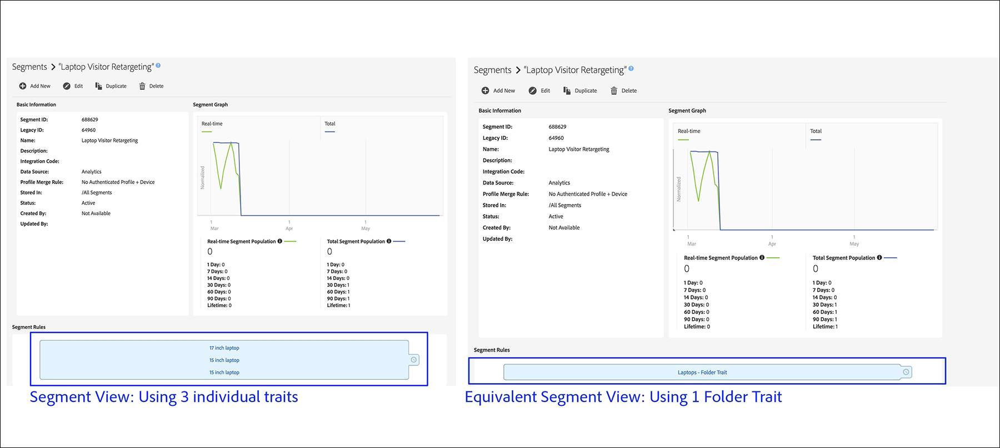

# 폴더 트레이트:정보 {#folder-traits-about}

[!UICONTROL Folder traits] 동일한 폴더 및 모든 하위 폴더에 있는 트레이트를 타깃팅 가능한 세그먼트에 자동으로 집계할 수 있습니다.

## 폴더 트레이트 사용의 이점 {#benefits}

A [!UICONTROL folder trait] 에는 상위 폴더 및 관련 하위 폴더의 모든 트레이트가 포함됩니다. 이렇게 하면 다른 폴더 수준에서 사용자를 자동으로 세그먼트화하고 타깃팅할 수 있습니다. 예를 들어 다음과 같은 폴더 구조가 있다고 가정해 봅시다.

`*` 전자(상위)

    노트북`*` (하위)

        브랜드(`*` 손자녀)

[!UICONTROL Folder traits] 상위 폴더의 이름을 기반으로 자동으로 생성된 폴더의 모든 사용자를 [!DNL Electronics] [!UICONTROL Folder Trait] 분류합니다. 또한 파일 구조 아래로 이동하면 이 프로세스가 자동으로 반복됩니다. 이 경우 폴더 트레이트는 랩톱 및 브랜드 폴더의 모든 사용자를 자동으로 생성된 랩탑에서 캡처합니다 [!UICONTROL Folder Trait].

[!UICONTROL Folder traits] 세그먼트 표현식에서 선택할 수 있습니다. 를 [!UICONTROL folder trait] [!UICONTROL OR] 선택하는 것은 해당 폴더 및 하위 폴더에서 그룹을 사용하여 모든 트레이트를 선택하는 것과 같습니다.

## 폴더 트레이트 구현 - 최근 및 빈도 {#folder-traits-realization}

폴더 트레이트의 빈도 수는 해당 폴더 및 하위 폴더의 트레이트의 합입니다. 아래 그림에서는 Automobile 폴더에 있는 트레이트 A, B 및 C를 보여 줍니다. 각 트레이트에는 다음과 같은 재정의가 있습니다.

* 특성 A:5
* 트레이트 B:1
* 트레이트 C:1

이 경우, 자동차는 7 [!DNL ]개의 [!UICONTROL Folder Trait] 깨달음을 가지고 있다.

## 폴더 특성 보고 {#folder-traits-reporting}

[!UICONTROL Folder traits] 아래 폴더 구조의 트레이트에서 모든 사용자를 캡처합니다. 한 폴더에서 다른 폴더로 트레이트를 이동하는 경우 변경 사항이 트레이트 규칙 변경과 마찬가지로 [데이터 수집 서버로](../../reference/system-components/components-data-collection.md) 전파됩니다. 보고 날짜 범위(1, 7, 14, 30, 60, 90)에서 이 변경 사항을 반영하도록 다음 보고 실행의 보고 업데이트가 업데이트됩니다. 이전 날짜의 이전 보고 번호는 변경되지 않습니다.

## RBAC(역할 기반 액세스 제어) 권한 {#role-based-access-controls}

( [!UICONTROL Role-Based Access Controls] )를 사용하는[!UICONTROL RBAC]회사의 경우 적절한 [!UICONTROL RBAC] 권한이 있는 사용자는 [!UICONTROL folder trait]과 연결된 데이터 소스를 변경할 수 있습니다. 사용자는 다음 중 하나가 있는 그룹에 속해야 합니다.

* `READ` 및 `WRITE` 그룹 권한을 특성 데이터 소스에 연결합니다.
* `VIEW_ALL_TRAITS` 트레이트 데이터 소스에 대한 `EDIT_ALL_TRAITS` 와일드카드 권한을 제공합니다.

Adobe [!UICONTROL RBAC] 관리 문서에서 권한을 할당하는 방법을 알아봅니다.

## 제한 및 기타 고려 사항 {#limits}

| 항목 | 설명 |
|---|---|
| 특성 유형 | [!UICONTROL Onboarded traits] 그리고 [!UICONTROL algorithmic traits] 대부분의 1회 구현 시 [!UICONTROL folder trait]빈도에 기여합니다. |
| 폴더 간 트레이트 이동 | 한 폴더에서 다른 폴더로 트레이트를 이동하면 해당 트레이트가 첫 번째 폴더 트레이트로부터 가려져서 두 번째 폴더로 자격이 [!UICONTROL folder trait]주어집니다. 즉, 폴더에서 트레이트를 삭제하거나 이동하는 경우, 특성 모집단의 사용자는 세그먼트 표현식으로 폴더 트레이트를 사용하여 세그먼트에서 세그먼트화되지 않습니다.   Adobe Analytics 세그먼트 또는 보고서 세트를 Experience Cloud 조직에 매핑하면 Audience Manager는 자동으로 해당 읽기 전용 새 세그먼트 및 트레이트를 만듭니다. Audience Manager에서는 이러한 트레이트의 저장 위치를 편집하거나 변경할 수 없습니다. 그러나 매핑된 Adobe Analytics 세그먼트 또는 보고서 세트에서 수행한 모든 변경 사항은 Audience Manager에 반영됩니다. |
| 시스템 변수 | [!UICONTROL Folder traits] 매개 변수를 사용하여 이벤트 호출에서 구현할 수 `d_sid` 없습니다. |
| 보고 | [!UICONTROL Folder traits] 는 자동 계산되는 트레이트이며 에 나타나지 않습니다 **[!UICONTROL Overlap Reports]**. |