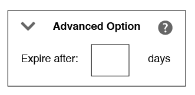

# [!UICONTROL Rules-Based] 또는 [!UICONTROL Onboarded Traits] 만들기 {#create-rules-based-or-onboarded-traits}

[!UICONTROL rules-based] 및 [!UICONTROL onboarded] 특성 만들기 프로세스와 관련된 설정 단계 및 기능에 대해 설명합니다.

<!-- c_tb_rules_traits.xml -->

## 트레이트에 대한 기본 정보 {#basics}

[!UICONTROL Trait Builder]에서 [!UICONTROL Basic Information] 설정을 사용하여 새로 만들거나 기존 [!UICONTROL traits]을(를) 편집할 수 있습니다. [!UICONTROL Basic Information] 설정은 [!UICONTROL rules-based], [!UICONTROL onboarded] 및 [!UICONTROL algorithmic traits]에 대해 동일합니다. 새 [!UICONTROL trait]을(를) 만들려면 이름(특수 문자 제외), [!UICONTROL data source]을(를) 입력하고 [!UICONTROL storage folder]을(를) 선택하십시오. 다른 [!UICONTROL Basic Information] 필드는 선택 사항입니다.

<!-- c_tb_basics.xml -->

### 정의된 기본 정보 필드

<table id="table_42AEC7A5B22346C5BB996D2D36C56229"> 
 <thead> 
  <tr> 
   <th colname="col1" class="entry"> 인터페이스 요소 </th> 
   <th colname="col2" class="entry"> 설명 </th> 
  </tr> 
 </thead>
 <tbody> 
  <tr> 
   <td colname="col1"> <b> 이름</b> </td> 
   <td colname="col2"> 
트레이트 이름. 필수. 
 
최대 길이: 255자. 
 
 
참고: 트레이트 이름을 지정할 때는 다음 특수 문자를 사용하지 마십시오. 
      <ul id="ul_AB38A333F21A4AA9B5656CBA69BA65E3"> 
       <li id="li_0E5033B540BC41E799075845388E85A7">쉼표 </li> 
       <li id="li_B1A6C3E3FB98473A91E4675EE09460F0">대시 </li> 
       <li id="li_579302FE34B64FE0AE3C751012839229">하이픈 </li> 
       <li id="li_44890F738CC64E449CC2545D701ECBC7">탭 </li> 
       <li id="li_C203837501A94342923C99A7DAD1ED61">세로 막대 또는 파이프 기호 </li> 
      </ul> 
 
 
이렇게 하면 <a href="../../integration/sending-audience-data/batch-data-transfer-explained/inbound-file-contents.md"> 인바운드 데이터 파일 전송</a>을 설정할 때 처리 오류를 줄이는 데 도움이 됩니다. 
 </td> 
  </tr> 
  <tr> 
   <td colname="col1"> <b> 설명</b> </td> 
   <td colname="col2"> 트레이트의 목적 또는 기능을 설명하는 데 도움이 되는 몇 가지 단어입니다. 선택 사항입니다. </td> 
  </tr> 
  <tr> 
   <td colname="col1"> <b> 데이터 Source</b> </td> 
   <td colname="col2"> 특정 데이터 공급자와 트레이트를 연결합니다. 필수. 
첫 번째 드롭다운 메뉴를 사용하여 Audience Manager 데이터 소스, Adobe Analytics 보고서 세트 또는 둘 다 간에 필터링합니다. 그런 다음 두 번째 드롭다운 메뉴를 사용하여 데이터 소스를 선택합니다.

 Adobe Analytics 보고서 세트를 사용하지 않는 경우 데이터 소스 유형 선택기가 비활성화되고 기본값이 Audience Manager 데이터 소스로만 설정됩니다.
  </td> 
  </tr>
   <tr> 
   <td colname="col1"> <b> 이벤트 유형</b> </td> 
   <td colname="col2"> 일반적으로 함수(예: 전환, 사이트 방문자, 파트너, 페이지 보기 등)에 따라 유형 또는 카테고리에 트레이트를 할당합니다. 선택 사항입니다. 
 전환 특성을 만드는 방법에 대해 알아보려면 <a href="https://experienceleague.adobe.com/docs/audience-manager-learn/tutorials/build-and-manage-audiences/traits-and-segments/creating-conversion-traits.html">Audience Manager에서 전환 특성 만들기</a>를 참조하십시오. 
</td> 
  </tr> 
  <tr> 
   <td colname="col1"> <b> 통합 코드</b> </td> 
   <td colname="col2"> 내부 비즈니스 프로세스에서 사용하는 ID, SKU 또는 기타값을 위한 필드입니다. 선택 사항입니다. </td> 
  </tr> 
  <tr> 
   <td colname="col1"> <b>개의 댓글</b> </td> 
   <td colname="col2"> 트레이트에 대한 일반 참고 사항. 선택 사항입니다. </td> 
  </tr> 
  <tr> 
   <td colname="col1"> <b>에 </b> 스토어 </td> 
   <td colname="col2"> 트레이트가 속한 저장소 폴더를 결정합니다. 필수. </td> 
  </tr> 
  <tr> 
   <td colname="col1"> <b> 데이터 범주</b> </td> 
   <td colname="col2"> 일반적으로 이해되는 범주에 따라 트레이트를 분류합니다. 
참고: 트레이트는 단일 카테고리에만 속합니다. 선택 사항입니다. 
 </td> 
  </tr> 
 </tbody> 
</table>

## [!UICONTROL Trait] 만료 간격 설정 {#set-expiration-interval}

[!UICONTROL Trait Builder]에서 [!UICONTROL Advanced Options]을(를) 사용하면 [!DNL TTL]에 대한 TTL(Time-to-Live)([!UICONTROL trait]) 간격을 설정할 수 있습니다. [!DNL TTL]은(는) 자격 있는 방문자가 [!UICONTROL trait]에 남아 있는 일 수를 정의합니다(기본값은 120일). 0으로 설정하면 [!UICONTROL trait] 멤버십이 만료되지 않습니다.

<!-- t_tb_ttl.xml -->

### [!UICONTROL trait]에 대한 TTL 설정

1. [!UICONTROL Advanced Options] 섹션을 확장하고 숫자를 입력하여 [!DNL TTL]에 대한 [!UICONTROL trait] 값을 설정합니다.
1. **[!UICONTROL Save]** 아이콘을 클릭합니다.

   

>[!MORELIKETHIS]
>
>* [세그먼트 TTL(Time to Live) 설명](../../features/traits/segment-ttl-explained.md)
