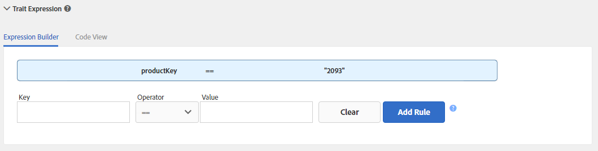

# 트레이트 규칙 관리 {#managing-trait-rules}

[!UICONTROL Trait Builder]에서 [!UICONTROL Expression Builder]을(를) 사용하여 대상 자격 요구 사항을 설정하는 규칙을 만들고 테스트할 수 있습니다. 규칙은 `color == blue` 또는 `price > 100`과(와) 같은 키-값 쌍으로 구성됩니다. 비교 연산자는 키와 값 간의 관계를 설정합니다. [!DNL Boolean] 식이 규칙 그룹 간의 관계를 결정합니다.

<!-- c_tb_rules.xml -->

## 설명된 기본 신호 규칙 기능

1. **[!UICONTROL Expression Builder]** 또는 **[!UICONTROL Code View]** 탭은 트레이트의 규칙에 대한 개요를 제공합니다. **[!UICONTROL Expression Builder]** 탭에서는 필드와 드롭다운 메뉴를 사용하여 규칙을 만들 수 있습니다. **[!UICONTROL Code View]**&#x200B;을(를) 사용하면 이러한 표현식을 코드로 수동으로 작성하여 규칙을 만들 수 있습니다. 위의 그림에서는 제품 키가 특정 값과 같은 자격 조건(이 경우 `color == "blue"`)에 대한 데이터를 평가하는 신호로 구성된 간단한 트레이트를 보여 줍니다.

1. 이 섹션의 필드와 컨트롤을 사용하면 키-값 쌍에서 신호를 만들고 비교 연산자로 이들 간의 관계를 설정할 수 있습니다. 키, 연산자 및 값이 필요합니다.
1. [!UICONTROL Data Explorer Options]을(를) 사용하면 신호에 대한 트레이트 인식을 채울 수 있습니다.

   >[!NOTE]
   >
   >이 옵션은 [!UICONTROL Data Explorer]명의 고객에게만 제공됩니다. 자세한 내용은 Adobe 컨설턴트에게 문의하십시오.

1. 이 섹션에서는 채워진 트레이트와 채워지지 않은 트레이트에 대해 지난 7일 동안 [!UICONTROL Expression Builder]에 정의된 신호에 대한 트레이트 실현 추정치를 보여 줍니다.

   >[!NOTE]
   >
   >이 옵션은 [!UICONTROL Data Explorer]명의 고객에게만 제공됩니다. 자세한 내용은 Adobe 컨설턴트에게 문의하십시오.

1. 테스트 필드를 사용하면 Audience Manager에 데이터를 보낼 때 사용할 신호 규칙 또는 [!DNL URL]의 조합을 확인할 수 있습니다.

## 트레이트 규칙 만들기 {#create-trait-rule}

규칙(또는 표현식)은 키-값 쌍의 개별 또는 그룹으로 구성됩니다. 비교 연산자는 키-값 쌍 간의 관계를 설정합니다. 규칙을 만들려면 키와 값을 제공하고 연산자를 선택한 다음 **[!UICONTROL Add Rule]**&#x200B;을(를) 클릭합니다.

<!-- t_tb_create_rules.xml -->

특성 규칙을 만들기 전에 **[!UICONTROL Basic Information]** 섹션 *이전*&#x200B;에서 필수 필드를 작성합니다.

1. **[!UICONTROL Trait Expression]** 섹션을 확장하고 키 및 값 이름을 입력합니다. *`signal`*&#x200B;이(가) 만들어집니다.

   >[!NOTE]
   >
   >이벤트 호출에서 해당 구문을 사용하여 데이터를 [!DNL Audience Manager]에 전송하는 경우 키 변수에 대한 `c_` 접두사(또는 기타 명명 규칙)를 포함하십시오.

1. **[!UICONTROL Operator]** 드롭다운에서 [비교 연산자](../../features/traits/trait-comparison-operators.md)를 선택합니다. 비교 연산자는 신호에 있는 요소 간의 관계를 평가합니다.

   >[!NOTE]
   >
   >[!DNL Boolean] [!UICONTROL OR] 연산자는 그룹 내의 여러 신호 *within* 간의 관계를 설정하며 변경할 수 없습니다.

1. **[!UICONTROL Add Rule]**&#x200B;을(를) 클릭합니다. 저장된 규칙은 데이터 입력 필드 위의 트레이트 작업 영역에 표시됩니다.

### 예 {#example-trait-rule}

아래 예에서 사용자는 제품 ID를 기반으로 새 트레이트 규칙을 만들었습니다. 이 규칙을 작성하기 위해 사용자가 equals 연산자(`==`)와 연결된 키 `productkey`을(를) 값 `2093`에 제공했습니다.

**[!UICONTROL Add Rule]**&#x200B;을(를) 클릭하면 트레이트가 저장되고 [!UICONTROL Expression Builder] 작업 영역으로 이동합니다.

## 새 규칙 그룹 만들기 {#create-rule-group}

이 절차에서는 새 규칙 그룹을 만드는 방법을 설명합니다.

<!-- t_tb_new_rule_group.xml -->

새 규칙 그룹을 만들려면 트레이트에 규칙이 두 개 이상 있어야 합니다.

1. 이동할 규칙 위로 커서를 이동하여 강조 표시합니다.
1. 강조 표시된 규칙 테두리 위로 마우스를 가져갑니다.

   이렇게 하면 규칙이 현재 그룹에서 자동으로 분리되어 새 그룹으로 이동합니다.

   >[!NOTE]
   >
   >규칙을 실수로 이동하는 경우 원래 그룹으로 다시 드래그합니다.

1. 규칙 그룹 간의 관계를 설정하려면 드롭다운 메뉴에서 [!DNL Boolean] 연산자([!UICONTROL AND], [!UICONTROL OR], [!UICONTROL AND NOT])를 선택하십시오.

## 그룹 간 규칙 이동 {#move-rules-between-groups}

규칙을 이동하려면 을(를) 클릭하고 다른 그룹으로 드래그합니다.

## 트레이트 편집 {#edit-trait}

이 절차에서는 트레이트를 편집하는 방법을 설명합니다.

<!-- t_tb_edit.xml -->

1. [!UICONTROL Traits] 대시보드에서 편집할 트레이트의 **[!UICONTROL Actions]** 열 위로 마우스를 가져갑니다. 그러면 트레이트 관리 아이콘이 표시됩니다.
1. 트레이트를 편집하려면 연필을 클릭합니다.

   

## 트레이트 규칙 삭제 {#delete-trait}

이 절차에서는 트레이트 규칙을 삭제하는 방법을 설명합니다.

<!-- t_tb_delete_rule.xml -->

1. [!UICONTROL Traits] 대시보드에서 편집할 트레이트의 [!UICONTROL Actions] 열을 마우스로 가리킨 다음 연필 아이콘을 클릭합니다. 그러면 트레이트 관리 아이콘이 표시됩니다.
1. [!UICONTROL Trait Expression] 섹션을 확장합니다.
1. 삭제할 규칙을 마우스로 가리킨 다음 X 아이콘을 클릭합니다. 규칙이 즉시 삭제됩니다.

>[!MORELIKETHIS]
>
>* [새 규칙 그룹 만들기](../../features/traits/manage-trait-rules.md#create-rule-group)
>* [그룹 간 규칙 이동](../../features/traits/manage-trait-rules.md#move-rules-between-groups)
>* [특성 규칙 만들기](../../features/traits/manage-trait-rules.md#create-trait-rule)
>* [트레이트 규칙 삭제](../../features/traits/manage-trait-rules.md#delete-trait)
>* [그룹 간 규칙 이동](../../features/traits/manage-trait-rules.md#move-rules-between-groups)
