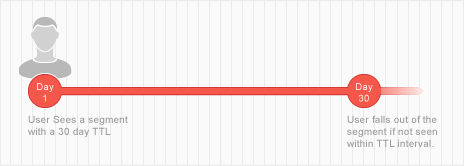

# 세그먼트 및 트레이트 라이브 시간 설명 {#segment-time-to-live-explained}

트레이트 [!UICONTROL time-to-live] ([!DNL TTL]) 간격이 세그먼트 멤버십에 영향을 미치는 방식입니다.

<!-- segment-ttl-explained.xml -->

## Time to Live

[!DNL TTL] 마지막 트레이트 자격 이벤트 이후 사이트 방문자가 세그먼트에 남아 있는 기간을 정의합니다. [!DNL TTL] 는 세그먼트가 아닌 트레이트에 설정됩니다. 방문자가 [!DNL TTL] 간격이 끝나기 전에 적격한 트레이트가 표시되지 않으면 세그먼트에서 제외됩니다. 새 트레이트의 기본값은 [!DNL TTL] 120일입니다. 0일로 설정하면 트레이트가 만료되지 않습니다. [트레이트 생성 인터페이스의](../../features/traits/create-onboarded-rule-based-traits.md#set-expiration-interval) [!UICONTROL Advanced Options] 섹션에서 트레이트를 만들거나 편집할 때 TTL 값을 설정합니다.

## [!DNL TTL] 및 세그먼트 삭제

사용자가 [!DNL TTL] 간격 내에 트레이트가 표시되지 않으면 세그먼트에서 제외됩니다. 예를 들어 30일의 1가지 트레이트 세그먼트가 [!DNL TTL]있는 경우 30일 이내에 트레이트가 다시 표시되지 않으면 사용자가 해당 세그먼트에서 제거됩니다.

## [!DNL TTL] 및 세그먼트 갱신

기간 내에 해당 세그먼트의 트레이트가 표시되는 경우 재설정되고 사용자가 세그먼트에 남아 [!DNL TTL] [!DNL TTL] 있습니다. 또한 대부분의 세그먼트에는 자체 [!DNL TTL] 기간이 있는 여러 트레이트가 포함되어 있으므로 사용자는 세그먼트와 연관된 트레이트가 계속 표시되는 한 세그먼트에 남아 있고 [!DNL TTL] 간격을 재설정할 수 있습니다. 예를 들어, 특성 A(30일)와 트레이트 B(15일)로 구성된 세그먼트 1이 [!DNL TTL]있다고 [!DNL TTL]가정합니다. 사용자가 각 트레이트를 한 번만 본다고 가정할 경우 아래 그림에서는 갱신 프로세스와 총 세그먼트 내 기간에 대한 개요를 [!DNL TTL] 설명합니다.

## [!DNL Audience Manager] TTL은 타사 TTL 설정과 독립적입니다.

픽셀의 [!DNL TTL] 세트는 타사에서 사용하는 다른 픽셀( [!DNL Audience Manager] [!DNL TTL][!DNL DSP]광고 네트워크 등)에 대해 설정된 픽셀과 독립적으로 작동합니다.

>[!MORELIKE_THIS]
>
>* [특성 만료 간격 설정](../../features/traits/create-onboarded-rule-based-traits.md#set-expiration-interval)

