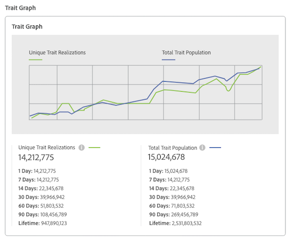

# Trait Details Page {#trait-details-page}

개별 트레이트에 대한 세부 사항 페이지는 트레이트 이름, ID, 성능 지표, 트레이트, 트레이트 및 트레이트 감사 로그에 속하는 표현식의 개요를 제공합니다. To vew these details, go to [!UICONTROL Audience Data > Traits] and click the name of the trait you want to work with.

## 기본 정보 {#basics}

[!UICONTROL Basic Information] 이 섹션에는 트레이트를 빌드할 때 완료한 필수 필드와 선택적 필드에 대한 세부 사항이 표시됩니다. 특성 유형, 특성 ID, 설명, 데이터 소스 및 기타 메타데이터와 같은 것들이 포함됩니다. 이러한 세부 사항은 특성 유형 (폴더, 온보드 또는 규칙 기반) 에 따라 다릅니다.

## Trait Graph {#trait-graph}

The [!UICONTROL Trait Graph] provides at-a-glance performance metrics for your selected trait. 트렌드 라인 위에 커서를 두면 선택한 트레이트에 대한 추가 데이터가 표시됩니다.

[!UICONTROL Unique Trait Realizations] 주어진 시간 범위에서 프로필에 이 트레이트를 추가한 고유한 사용자의 수를 나타냅니다. The [!UICONTROL Total Trait Population] indicates the number of unique users currently qualified for this trait.

* 규칙 기반의 트레이트에 대해 사용자가 브라우저에서 트레이트를 적용받을 수 있으므로 트레이트 자격 조건은 실시간으로 발생합니다.
* For onboarded traits, trait qualification happens after an inbound file is processed, i.e. the inbound file is [fed into Audience Manager](../../faq/faq-inbound-data-ingestion.md) and that is when the trait qualification happens.
* **고유한 특성: 주어진 시간 범위에서 프로필에 이 트레이트를 추가한 고유한 사용자의 수입니다.**
* **총 특성 수: 이 트레이트에 대해 현재 자격 조건을 갖춘 고유한 사용자 수입니다.**

## Trait Expression {#trait-expression}

[!UICONTROL Trait Expression] 이 섹션에서는 사용자가 트레이트를 사용할 수 있도록 충족해야 하는 기준을 보여 줍니다. These rules are set when you [create or edit a trait](../../features/traits/about-trait-builder.md).

## Trait Segments {#trait-segments}

[!UICONTROL Segments with this Trait] 섹션에는 선택한 속성이 속하는 모든 세그먼트가 나열됩니다. 세그먼트 이름을 클릭하여 해당 세그먼트에 대한 세부 사항을 볼 수 있습니다.

## Trait Audit/History Log {#trait-audit-history}

For rule-based and onboarded traits, the [!UICONTROL Trait Expression Change History] shows you the last 10 changes made to trait expression rules and who made them. If your trait has more than 10 changes, click **[!UICONTROL Export to CSV]** to download the entire audit log. 감사 로그는 폴더 또는 알고리즘 특성에 사용할 수 없습니다.

>[!NOTE]
>
>[!UICONTROL Not Available][!UICONTROL By User] 열에 해당 사용자에 대한 계정이 삭제되었음을 의미합니다.

