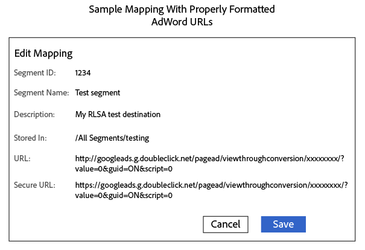

# Google 광고 리마케팅 목록에 세그먼트 보내기 {#send-segments-to-a-google-adwords-remarketing-list}

이 절차에는 [!DNL Google Ads] 리마케팅 목록, 픽셀 코드 및 Audience Manager [!DNL URL] [!DNL destination]이(가) 필요합니다. 검색 광고([!DNL RLSA]) 통합을 위한 리마케팅 목록이라고도 합니다. 유료 검색에만 적용됩니다.

>[!IMPORTANT]
>이는 두 시스템의 제품화된 통합이 아닙니다.

[!DNL Google Ads] 리마케팅 목록을 [!DNL Audience Manager] [!DNL URL destination]&#x200B;(으)로 설정하려면:

1. [!DNL Google Ads] 계정에서 [웹 사이트 리마케팅 목록을 만들고](https://support.google.com/tagmanager/answer/6106960?hl=en) 전환 ID를 기록하세요.
1. 다음 URL을 기본 URL 및 보안 URL의 템플릿으로 사용합니다. xxxxxxxx 섹션을 전환 ID로 바꿉니다.

   ```
    //googleads.g.doubleclick.net/pagead/viewthroughconversion/xxxxxxxx/?value=0&guid=ON&script=0&data=%ALIAS%
   ```

1. Audience Manager에서 [만들기 [!DNL URL destination]](../../features/destinations/create-url-destination.md)하거나 기존 [!DNL destination]을(를) 편집하세요. [!DNL destination]을(를) 만들 때 다음 설정을 사용하십시오.
   * 유형: URL
   * 직렬화: 활성화됨
   * 구분 기호: 세미콜론( &amp;semi; )

1. [!DNL URL] [!DNL destination]의 [!UICONTROL Segment Mappings] 섹션에서 2단계의 코드를 [!DNL URL] 및 [!DNL Secure URL] 필드에 추가합니다. [!DNL URL] 및 [!DNL Secure URL] 필드에 각각 `http:` 및 `https:`을(를) 사용하여 코드 접두사를 지정합니다.

   >[!IMPORTANT]
   >
   >인코딩된 앰퍼샌드 `&`을(를) 인코딩되지 않은 앰퍼샌드 `&`(으)로 바꾸기

   [!DNL URL] 코드 보안 해제:

   ```
    http://googleads.g.doubleclick.net/pagead/viewthroughconversion/xxxxxxxx/?
    value=0&guid=ON&script=0&data=%ALIAS%
   ```

   보안 [!DNL URL] 코드:

   ```
    https://googleads.g.doubleclick.net/pagead/viewthroughconversion/xxxxxxxx/?
    value=0&guid=ON&script=0&data=%ALIAS%
   ```

1. **[!UICONTROL Save]** 아이콘을 클릭합니다.

   >[!NOTE]
   >
   >여러 세그먼트를 사용하여 작업하는 경우 [!DNL Google Ads] [!DNL destination]에 매핑할 각 세그먼트에 대해 새 픽셀을 가져옵니다. 이렇게 하면 데이터가 적절한 리마케팅 목록에 적용됩니다.

1. Audience Manager에서 이 [!DNL destination]에 새 세그먼트를 매핑할 때 매핑을 `aam=segmentID`(으)로 정의하고 `segmentID`을(를) 세그먼트 ID로 바꾸십시오.
1. [!DNL Google Ads]에서 버킷을 정의할 때 6단계에서 정의된 매핑과 일치하는 규칙을 만듭니다.

완료된 매핑은 다음과 유사할 수 있습니다.



>[!MORELIKETHIS]
>
>* [[!DNL Destinations]](../../features/destinations/destinations.md)
>* [만들기 [!DNL URL Destination]](../../features/destinations/create-url-destination.md)
>* [AdWords 리마케팅 목록 정보](https://support.google.com/adwords/answer/2472738)
>* [AdWords 리마케팅 작동 방식](https://support.google.com/adwords/answer/2454000)
