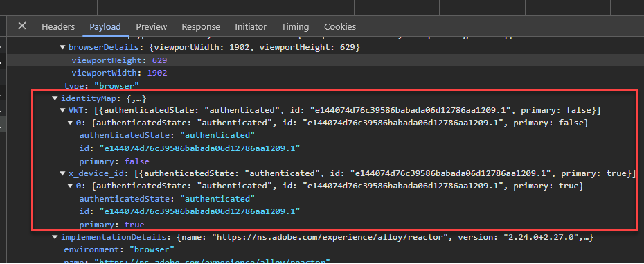

# AppMeasurement에서 Web SDK으로 Audience Manager용 데이터 수집 라이브러리 업데이트

## 의도한 대상 {#intended-audience}

이 페이지는 [!DNL AppMeasurement] JavaScript 라이브러리를 사용하여 웹 데이터를 Audience Manager으로 보내는 Audience Manager 및 Adobe Analytics 고객을 위한 페이지입니다.

현재 데이터 수집 방법에 따라 아래 표를 참조하여 Web SDK으로 마이그레이션하는 방법에 대해 알아보십시오.

| 기존 데이터 수집 방법 | 웹 SDK 마이그레이션 지침 |
|---------|----------|
| AudienceManagement 모듈이 포함된 [!DNL AppMeasurement] JavaScript 라이브러리 | 이 안내서의 지침을 따르십시오. |
| [!DNL Audience Manager] [태그 확장](https://experienceleague.adobe.com/en/docs/experience-platform/tags/extensions/client/audience-manager/overview) | [데이터 수집 라이브러리를 Audience Manager 태그 확장에서 웹 SDK 태그 확장으로 업데이트](dil-extension-to-web-sdk.md)의 지침을 따릅니다. |
| [!DNL AppMeasurement] JavaScript 라이브러리 + 독립 실행형 [!DNL Audience Manager] [DIL 라이브러리](../dil/dil-overview.md) | [데이터 수집 라이브러리를 Audience Manager 태그 확장에서 웹 SDK 태그 확장으로 업데이트](dil-extension-to-web-sdk.md)의 지침을 따릅니다. |

## 마이그레이션 개요 {#overview}

[!DNL AppMeasurement]에서 [웹 SDK](https://experienceleague.adobe.com/en/docs/experience-platform/web-sdk/home)&#x200B;(으)로의 마이그레이션은 주로 Adobe Analytics 마이그레이션입니다. Audience Manager 고객의 경우 이 마이그레이션에 Audience Manager도 포함됩니다. 둘 다 함께 마이그레이션해야 합니다. 주로 Audience Manager을 사용하는 경우 이 마이그레이션에 Analytics 팀이 참여하도록 하십시오.

Audience Manager 데이터 수집에 [!DNL AppMeasurement]을(를) 사용하는 경우 현재 [!DNL Server-side Forwarding (SSF)] 접근 방식을 사용하여 Analytics 데이터를 Audience Manager으로 보냅니다. 이 설정에서는 Analytics 데이터 수집 요청이 Audience Manager으로 전달되며, 이 요청은 페이지에 대한 Audience Manager 응답도 처리합니다.

이는 수년 동안 표준 접근 방식이었으며 현재 설정일 가능성이 높습니다. [!DNL AppMeasurement] 라이브러리에 `AudienceManagement` 모듈이 있고 데이터 수집 호출에 요청(`/b/ss/examplereportsuite/10/`)의 `/10/` 경로가 포함된 경우 이 안내서는 사용자를 위한 것입니다.

## SSF(서버 측 전달) 대 웹 SDK 데이터 흐름 {#data-flows}

Web SDK(및 Audience Manager)로 이동할 때 Analytics와 Edge Network 간의 데이터 흐름 차이를 이해하는 것은 아래 지침에 중요합니다.

서버측 전달을 통해 Analytics 지역 데이터 수집 노드는 데이터를 수집하여 Audience Manager에서 허용하는 신호로 변환한 다음 Audience Manager으로 전송하고 Audience Manager 응답을 페이지로 반환합니다. 그런 다음 [!DNL AppMeasurement] 라이브러리의 [!DNL AudienceManagement] 모듈이 응답을 처리합니다(예: 쿠키 삭제, URL 대상 전송). 이 프로세스를 서버측 전달이라고 하는 이유는 Analytics가 Adobe 서버를 사용하여 데이터를 Audience Manager에 전달하기 때문입니다.

Web SDK을 사용하면 Edge Network이 데이터를 별도의 작업으로 Analytics와 Audience Manager에 전송합니다. 웹 SDK은 모든 솔루션에 데이터를 전송하는 단일 라이브러리이며, Edge Network은 솔루션에 관계없는 데이터 포인트를 솔루션별 형식으로 변환합니다.

이 새로운 데이터 흐름에서는 모든 데이터가 Edge Network [데이터스트림](https://experienceleague.adobe.com/en/docs/experience-platform/datastreams/overview)&#x200B;(으)로 전송되며, 필요에 따라 Adobe 솔루션으로 데이터를 전송하기 위해 [구성](https://experienceleague.adobe.com/en/docs/experience-platform/datastreams/configure)할 수 있습니다. Audience Manager의 경우 데이터 스트림에서 Audience Manager 서비스를 활성화하면 [!DNL XDM] 및 Analytics 데이터가 Audience Manager에서 허용하는 신호로 변환됩니다. 또한 Edge Network은 웹 SDK이 응답을 처리하는 페이지에 Audience Manager 응답을 반환합니다. 이는 [!DNL AppMeasurement] 및 [!DNL AudienceManagement] 모듈이 수행한 방식과 유사합니다.

## 태그와 비 태그 마이그레이션 {#tags-vs-non-tags}

다른 태그 관리 시스템에 있는 [!DNL AppMeasurement] 라이브러리, [!DNL AppMeasurement] 확장과 함께 태그를 사용하거나 [!DNL AppMeasurement]을(를) 페이지에 직접 배치하든 간에 Audience Manager을 웹 SDK으로 마이그레이션하는 단계는 동일합니다. Audience Manager 마이그레이션은 Analytics 마이그레이션에 따라 다르므로 Analytics 마이그레이션 중에 [!DNL AppMeasurement]에서 Web SDK으로 마이그레이션하는 단계가 결정됩니다.

해당 정보는 Analytics 설명서에서 [Tags](https://experienceleague.adobe.com/en/docs/analytics/implementation/aep-edge/web-sdk/analytics-extension-to-web-sdk) 또는 [JavaScript](https://experienceleague.adobe.com/en/docs/analytics/implementation/aep-edge/web-sdk/appmeasurement-to-web-sdk) 기반 구현에 대해 다룹니다.

## XDM 및 `data.__adobe.` 노드 {#xdm-data-nodes}

[Web SDK](https://experienceleague.adobe.com/en/docs/experience-platform/web-sdk/home)의 기본 함수 중 하나는 [Real-Time Customer Data Platform(RTCDP)](https://experienceleague.adobe.com/en/docs/experience-platform/rtcdp/home)에 데이터를 보내는 것입니다. 이를 실현하고 전체 다시 구현 없이 다른 Experience Cloud 솔루션에 대한 데이터를 계속 수집하려면 솔루션별 데이터가 데이터 수집 서버 호출 내에서 구분됩니다. 이 호출에서는 [XDM(경험 데이터 모델)](https://experienceleague.adobe.com/en/docs/experience-platform/xdm/home)이라는 표준화된 JSON 스키마를 사용합니다

브라우저 및 장치에 대한 정보와 같은 솔루션과 관계없는 요소는 사전 결정된 XDM 구조로 Edge Network으로 전송됩니다. Edge Network은 이 데이터를 솔루션별 형식으로 변환합니다. 그러나 Target, Analytics 및 Audience Manager에 고유한 데이터는 XDM 페이로드 내의 전용 `data.__adobe` 노드에 저장됩니다.

예:

* Analytics 변수 `s.eVar1`이(가) XDM 페이로드에 `data.__adobe.analytics.evar1`(으)로 표시됩니다.
* 고객 충성도 상태와 관련된 Target 매개 변수는 `data.__adobe.target.loyaltyStatus`(으)로 저장됩니다.

데이터 스트림에서 Experience Platform 서비스가 활성화되어 있더라도 `__adobe` 노드의 데이터는 Experience Platform으로 전송되지 않고 각 솔루션(예: Analytics 및 Audience Manager)으로 전송됩니다. 즉, [데이터 수집을 위한 데이터 준비](https://experienceleague.adobe.com/en/docs/experience-platform/datastreams/data-prep)를 사용하여 Experience Platform에서 실시간 사용 사례를 위해 필요한 데이터 요소를 XDM 스키마 요소에 매핑할 수 있는 유연성을 가지면서 Analytics 및 Audience Manager에 대한 현재 구성을 유지할 수 있습니다.

예를 들어 체크아웃 중에 장바구니 컨텐츠를 보고하는 데 사용되는 Analytics `s.products` 문자열은 여전히 원래 형식으로 Analytics 및 Audience Manager에 보낼 수 있습니다. 동시에 이 문자열의 요소를 사용하여 Experience Platform 사용 사례에 대한 보다 직관적인 XDM 장바구니 스키마를 만들 수 있습니다.

대부분의 Audience Manager 구현은 Audience Manager으로 전달된 Analytics 데이터에 의존하므로 대부분의 Audience Manager 트레이트 표현식은 Analytics 변수(`c_evar#`, `c_prop#` 및 `c_events`)를 기반으로 할 수 있습니다. 마이그레이션 중에 XDM 형식을 사용하여 트레이트 식을 다시 작성하지 않도록 하기 위해 기본적으로 Edge Network은 `data.__adobe.analytics` 노드에 있는 모든 Analytics 변수를 Audience Manager 신호로 변환하도록 구성됩니다. 서버측 전달 워크플로에서 유사한 변환 프로세스가 발생합니다.

페이지의 단일 데이터 수집 호출이 여러 Adobe 솔루션을 피드하는 단일 데이터 스트림으로 전송되므로 Edge Network에서 이 변환을 수행할 수 있습니다. 따라서 Analytics와 Audience Manager의 [!DNL AppMeasurement]에서 웹 SDK으로 마이그레이션하는 대부분의 경우 주로 `data.__adobe.analytics` 노드를 사용합니다.

Edge Network은 XDM 페이로드 및 패킷 헤더에서 장치 및 브라우저 데이터를 Audience Manager 신호로 변환합니다. 이렇게 하면 Audience Manager 트레이트 식에서 `h_` 및 `d_` 플랫폼 키를 계속 사용할 수 있습니다.

## `data.__adobe.audiencemanager` 노드 {#data-note}

`data.__adobe.audiencemanager` 노드는 Analytics에 의존하지 않는 Audience Manager 구현에 사용됩니다. [태그 확장 마이그레이션 안내서](dil-extension-to-web-sdk.md)에 설명된 대로 이전에 [DIL 라이브러리](../dil/dil-overview.md) 라이브러리를 통해 전송된 사용자 지정 Audience Manager 키/값 쌍을 저장합니다.

이 안내서에 요약된 마이그레이션에 `data.__adobe.audiencemanager` 노드가 필요하지 않지만 여기에 설명된 새로운 데이터 흐름을 사용하면 Analytics에 기록되지 않고 데이터를 Audience Manager으로 보낼 수 있습니다.

사용자 지정 키/값 쌍을 Analytics에 포함하지 않고 Audience Manager으로 보내야 하는 경우 `data.__adobe.audiencemanager` 노드를 사용할 수 있습니다. 이 노드의 모든 데이터 세트는 데이터 수집 서버 호출에서 Audience Manager으로 변환된 Analytics 데이터에 추가됩니다.

## 이 구현 경로의 장단점

이러한 마이그레이션 접근 방식을 사용하면 장점과 단점이 모두 있습니다. 각 옵션을 신중히 평가하여 조직에 가장 적합한 접근 방식을 결정하십시오.

| 장점 | 단점 |
| --- | --- |
| <ul><li>**기존 구현을 사용**: 이 방법을 사용하려면 일부 구현을 변경해야 하지만 처음부터 완전히 새로운 구현이 필요하지 않습니다. 구현 논리를 최소한으로 변경하여 기존 데이터 레이어 및 코드를 사용할 수 있습니다.</li><li>**스키마가 필요하지 않습니다**: Web SDK으로 마이그레이션하는 이 단계에서는 XDM 스키마가 필요하지 않습니다. 대신 Audience Manager으로 직접 데이터를 보내는 `data` 개체를 채울 수 있습니다. 웹 SDK으로의 마이그레이션이 완료되면 조직에 대한 스키마를 만들고 데이터스트림 매핑을 사용하여 적용 가능한 XDM 필드를 채울 수 있습니다. 마이그레이션 프로세스의 이 단계에서 스키마가 필요한 경우 조직에서 Audience Manager XDM 스키마를 사용해야 합니다. 이 스키마를 사용하면 향후 조직에서 자체 스키마를 사용하는 것이 더 어려워집니다.</li></ul> | <ul><li>**구현 기술 부채**: 이 방법은 기존 구현의 수정된 형식을 사용하므로 구현 논리를 추적하고 필요한 경우 나중에 변경을 수행하는 것이 더 어려울 수 있습니다.</li><li>**데이터를 플랫폼에 보내려면 매핑이 필요합니다**: 조직에서 Real-Time CDP을 사용할 준비가 되면 Adobe Experience Platform의 데이터 세트로 데이터를 보내야 합니다. 이 작업을 수행하려면 `data` 개체의 모든 필드가 XDM 스키마 필드에 할당하는 데이터 스트림 매핑 도구의 항목이어야 합니다. 매핑은 이 워크플로우에 대해 한 번만 수행하면 되며 구현 변경을 수반하지 않습니다. 그러나 XDM 개체에서 데이터를 전송할 때는 필요하지 않은 추가 단계입니다.</li></ul> |

Adobe은 다음 시나리오에서 이 구현 경로를 따를 것을 권장합니다.

* Adobe Analytics AppMeasurement JavaScript 라이브러리를 사용하는 기존 구현이 있습니다. Audience Manager 태그 확장을 사용하는 구현이 있는 경우 대신 [Audience Manager 태그 확장에서 웹 SDK 태그 확장으로 마이그레이션](dil-extension-to-web-sdk.md)을 따르십시오.
* 나중에 Real-Time CDP을 사용할 계획이지만 Audience Manager 구현을 처음부터 웹 SDK 구현으로 바꾸지는 않을 것입니다. 구현을 처음부터 웹 SDK으로 대체하려면 XDM 형식 데이터를 찾기 위해 모든 Audience Manager 트레이트를 다시 빌드해야 하므로 가장 많은 노력이 필요합니다. 그러나 가장 실행 가능한 장기 구현 아키텍처이기도 합니다. 조직에서 깔끔한 웹 SDK 구현을 수행하려는 경우 자세한 내용은 이 안내서를 사용하지 않고 [웹 SDK 설명서](https://experienceleague.adobe.com/en/docs/experience-platform/web-sdk/home)를 참조하십시오.

## 웹 SDK으로 마이그레이션하는 데 필요한 단계

데이터 수집 통합을 웹 SDK으로 마이그레이션하려면 아래 단계를 따르십시오.

+++**1. Analytics 마이그레이션을 계획하십시오**.

Analytics 팀과 함께 [Tags](https://experienceleague.adobe.com/en/docs/analytics/implementation/aep-edge/web-sdk/analytics-extension-to-web-sdk) 또는 [JavaScript](https://experienceleague.adobe.com/en/docs/analytics/implementation/aep-edge/web-sdk/appmeasurement-to-web-sdk) 기반 구현에서 Analytics 마이그레이션 단계를 따릅니다. Analytics 마이그레이션을 계획한 후 이 안내서로 돌아가서 Audience Manager 단계를 계속 진행하여 Analytics와 Audience Manager 마이그레이션을 함께 배포할 수 있도록 Audience Manager에 대해 수행해야 할 작업을 결정합니다.

+++

+++**2. 데이터 스트림에 Audience Manager 서비스 추가**

1단계에서 언급된 Analytics 마이그레이션에서 사용 중인 데이터 스트림에 Audience Manager 서비스를 추가합니다.

1. [experience.adobe.com](https://experience.adobe.com)&#x200B;(으)로 이동한 다음 자격 증명을 사용하여 로그인합니다.
1. **[!UICONTROL Data Collection]**(으)로 이동하려면 오른쪽 상단의 홈 페이지 또는 제품 선택기를 사용하십시오.
1. 왼쪽 탐색에서 **[!UICONTROL Datastreams]**&#x200B;을(를) 선택합니다.
1. 1단계에서 Analytics 마이그레이션의 일부로 만든 데이터 스트림을 선택합니다.
1. **[!UICONTROL Add Service]**&#x200B;을(를) 선택합니다.
1. 서비스 드롭다운 메뉴에서 **[!UICONTROL Audience Manager]**&#x200B;을(를) 선택합니다.
1. **[!UICONTROL Cookie Destinations Enabled]** 및 **[!UICONTROL URL Destinations Enabled]** 옵션을 확인하십시오. Edge Network은 이러한 옵션을 사용하여 해당 Audience Manager 대상 유형을 페이지에 반환할 수 있습니다.
1. **[!UICONTROL Enable XDM Flattened Fields]**&#x200B;이(가) 비활성화되어 있는지 확인하십시오. 이 옵션은 Analytics 변수를 Audience Manager 신호로 자동 변환하는 기능을 비활성화합니다. 이 옵션은 Edge NetworkAudience Manager 에서 Analytics 데이터를 SDK 신호로 자동 변환하기 전에 Web Analytics로 마이그레이션한 사용자에 대한 이전 버전과의 호환성을 유지하도록 설계되었습니다.

   >[!NOTE]
   >
   >**[!UICONTROL Enabled XDM Flattened Fields]** 옵션이 활성화된 Web SDK으로 마이그레이션하려면 XDM 형식의 Audience Manager에 필요한 모든 데이터와 prop, eVar 또는 이벤트를 사용하는 모든 Audience Manager 트레이트를 대신 업데이트하여 XDM 형식의 데이터를 찾아야 합니다. Adobe에서는 이 옵션을 비활성화하는 것이 좋습니다.

    {style="border:1px solid lightslategray"}

1. 데이터 스트림 구성을 저장하려면 **[!UICONTROL Save]**&#x200B;을(를) 선택하십시오.

이제 데이터 스트림이 데이터를 받아서 Audience Manager에 전달할 준비가 되었습니다. 코드에서 웹 SDK을 구성할 때 이 ID가 필요하므로 데이터 스트림 ID를 참고하십시오.

+++

+++**3. 타사 ID 동기화를 활성화하고 Audience Manager 컨테이너 ID**&#x200B;을(를) 설정합니다.

1. [experience.adobe.com](https://experience.adobe.com)&#x200B;(으)로 이동한 다음 자격 증명을 사용하여 로그인합니다.
1. **[!UICONTROL Data Collection]**(으)로 이동하려면 오른쪽 상단의 홈 페이지 또는 제품 선택기를 사용하십시오.
1. 왼쪽 탐색에서 **[!UICONTROL Datastreams]**&#x200B;을(를) 선택합니다.
1. 1단계에서 Analytics 마이그레이션의 일부로 만든 데이터 스트림을 선택합니다.
1. 데이터 스트림 구성 페이지의 오른쪽 상단 모서리에서 **[!UICONTROL Edit]**&#x200B;을(를) 선택합니다.
1. **[!UICONTROL Advanced Options]** 드롭다운 메뉴를 확장하고 아직 활성화되지 않은 경우 **[!UICONTROL Third Party ID Sync]** 기능을 활성화합니다. 이 옵션은 Edge Network에 Audience Manager 및 Experience Platform 데이터 파트너에 대한 파트너 ID 동기화를 반환하도록 지시합니다.

    {style="border:1px solid lightslategray"}

1. 대부분의 경우 **[!UICONTROL Third Party ID Sync Container ID]** 필드를 비워 둘 수 있습니다. 기본적으로 `0`(으)로 설정됩니다. 그러나 올바른 컨테이너 ID가 사용되도록 하려면 다음 단계를 따르십시오.
   * 시크릿 또는 비공개 모드로 브라우저 창을 열고 마이그레이션에 포함된 페이지로 이동합니다.
   * 브라우저의 개발자 도구를 사용하여 `dpm.demdex.net/id`에 대한 네트워크 호출을 필터링합니다. 이 호출은 첫 번째 방문의 첫 페이지에서만 실행되므로 시크릿 또는 비공개 브라우저가 필요합니다.
   * 요청의 페이로드를 확인합니다. `d_nsid` 매개 변수가 0이 아니면 **[!UICONTROL Third Party ID Sync Container ID]** 필드에 복사하십시오.

1. **[!UICONTROL Save]**&#x200B;을(를) 선택합니다.

이제 데이터 스트림이 Audience Manager으로 데이터를 전송하고 Audience Manager 응답을 웹 SDK에 전달할 준비가 되었습니다.

+++

+++**4. ID 맵에 고객 ID 추가**

대부분의 Audience Manager 구현에서는 장치 간 개인화 시나리오에서 [프로필 병합 규칙](../features/profile-merge-rules/merge-rules-overview.md)을 사용하여 방문자가 인증 상태(로그인 또는 로그아웃)에 따라 자격을 부여할 수 있는 세그먼트를 제어할 수 있습니다. 프로필 병합 규칙을 사용하려면 인증 후 모든 데이터 수집 호출에서 고객 소유 식별자(CRM ID, 계정 번호 등)를 Audience Manager으로 보내야 합니다. 이전에는 방문자 ID 서비스([!DNL visitor.js])의 `setCustomerIDs` 함수를 사용하여 고객 ID를 각 Analytics 데이터 수집 호출에 추가한 다음 Audience Manager으로 전달했습니다.

웹 SDK을 사용하면 이제 [IdentityMap](https://experienceleague.adobe.com/en/docs/experience-platform/xdm/field-groups/profile/identitymap)이라는 특수한 XDM 구문을 사용하여 이러한 ID를 Edge Network으로 전송해야 합니다.

ID 맵에서 ID를 올바르게 전달하려면 [ID 네임스페이스](https://experienceleague.adobe.com/ko/docs/experience-platform/identity/features/namespaces)를 이해하고 전달할 ID를 신중하게 고려해야 합니다. 특히 Experience Platform 샌드박스로 데이터를 전송할 때 더욱 그렇습니다. [이 문서](https://experienceleague.adobe.com/en/docs/experience-cloud-kcs/kbarticles/ka-21305)에서는 이러한 고려 사항과 지침을 간략하게 설명합니다.

전달할 ID와 시기를 결정했으면 Tags 내에서 [!UICONTROL Identity map] **[!UICONTROL Identity map]** [데이터 요소](https://experienceleague.adobe.com/en/docs/experience-platform/tags/extensions/client/web-sdk/data-element-types#identity-map)를 사용하기 위한 안내서를 따르거나 [ID 데이터 개요](https://experienceleague.adobe.com/en/docs/experience-platform/web-sdk/identity/overview)에 설명된 대로 수동으로 설정하여 웹 SDK 배포 전략에 맞게 조정하십시오.

+++

+++**5. (선택 사항) 자사 `aam_uuid` 쿠키 설정**

수년 동안 표준 방법은 Audience Manager UUID(타사 demdex 쿠키의 값)를 일반적으로 이름이 `aam_uuid`인 자사 쿠키에 배치하는 것이었습니다.

쿠키를 설정하려면 `audienceManagementModule`을(를) 구성할 때 Analytics 태그 확장 **[!UICONTROL Unique User ID Cookie]** 섹션의 **[!UICONTROL Name]** 필드 또는 `uuidCookie` 필드에 쿠키 이름을 입력해야 합니다. Audience Manager UUID 값은 광고 플랫폼에서 사용하는 디바이스별 교차 도메인 식별자이며 자사 식별자로 거의 값을 제공하지 않기 때문에 코드에서 일반적으로 구성되었지만 쿠키는 거의 사용되지 않았습니다.

Web SDK으로 마이그레이션한 후 이 `aam_uuid` 쿠키를 계속 설정해야 하는 구현에서 필요한 경우 두 가지 방법으로 Audience Manager UUID를 검색할 수 있습니다.

1. [Edge Network 상호 작용 끝점](https://developer.adobe.com/data-collection-apis/docs/endpoints/interact/)의 모든 응답에 `id`개의 노드가 있는 페이로드가 포함되어 있습니다. `CORE` 네임스페이스 페이로드의 `id` 노드에 Audience Manager UUID가 포함되어 있습니다.

2. 웹 SDK의 [getIdentity](https://experienceleague.adobe.com/en/docs/experience-platform/web-sdk/commands/getidentity) 명령을 사용하여 검색합니다. 설명서에 설명된 대로 `CORE` 네임스페이스를 사용하고 응답의 `identity.CORE` 필드에서 값을 검색합니다.

Audience Manager UUID를 검색하는 데 사용되는 방법에 관계없이 응답을 구문 분석하고, UUID를 검색하고, 쿠키를 설정하는 것은 개발 팀에 따라 다릅니다. 웹 SDK을 통해 이 쿠키를 설정하는 자동 방법은 없습니다.

+++

## Analytics 보고서 세트 관리자 UI에서 서버측 전달 및 Audience Analytics 구성 {#configure-ssf-analytics}

Analytics [서버측 전달](https://experienceleague.adobe.com/en/docs/analytics/admin/admin-tools/manage-report-suites/edit-report-suite/report-suite-general/server-side-forwarding/ssf) 기능을 잘 알고 있다면 &quot;*Analytics 데이터를 Audience Manager에 두 번 보내지 않도록 Analytics 보고서 세트 관리자 UI에서 서버측 전달 설정을 비활성화해야 합니까?*&quot; 같은 질문을 할 수 있습니다.

대답은 아니오입니다. 다음과 같은 이유로 이 설정을 비활성화해서는 안 됩니다.

1. Audience Manager 서비스가 데이터 스트림에서 활성화되면 Edge Network은 Analytics로 전송된 모든 데이터 수집 요청에 `cm.ssf` 변수를 추가합니다. 이렇게 하면 Analytics 데이터가 Audience Manager으로 전송되지 않습니다. Analytics 마이그레이션의 유효성을 검사하는 데 사용되는 모든 Assurance 로그에는 데이터 스트림에서 Audience Manager 서비스가 활성화될 때 `cm.ssf=1` 변수가 표시됩니다. 자세한 내용은 [서버 측 전달에 초점을 맞춘 Analytics 및 GDPR 준수 페이지](https://experienceleague.adobe.com/en/docs/analytics/admin/admin-tools/manage-report-suites/edit-report-suite/report-suite-general/server-side-forwarding/ssf-gdpr)를 참조하십시오.

1. 이 설정을 사용하면 [!DNL Audience Analytics] 통합을 위한 데이터 흐름도 사용할 수 있습니다. [Audience Analytics 개요](https://experienceleague.adobe.com/en/docs/analytics/integration/audience-analytics/mc-audiences-aam)에 설명된 대로 이 통합에는 서버 측 전달이 필요합니다. 처리 전에 Analytics 데이터 수집 서버에 대한 Audience Manager 응답이 Analytics 히트에 추가되기 때문입니다. Edge Network 내에서도 유사한 프로세스가 발생합니다. 서버측 전달이 활성화되면 Edge Network은 Analytics로 전송된 데이터에 Audience Manager 응답에서 필요한 세그먼트를 추가합니다.

요약하면, Audience Analytics이 웹 SDK 구현에서 계속 작동하고 Audience Manager에서 데이터가 두 번 계산되지 않도록 이 설정을 활성 상태로 유지하는 것이 중요합니다.

## 마이그레이션 유효성 검사 {#validation}

이제 모든 Adobe 솔루션이 단일 웹 SDK 호출에서 서비스되므로 웹 SDK에서 제공하는 솔루션에 따라 유효성 검사 단계가 변경될 수 있습니다.

Adobe Target 또는 Adobe Journey Optimizer([!DNL Decisioning] 포함)가 구현에서 서비스하는 솔루션 스택에 포함된 경우 페이지의 Edge Network에 대한 여러 네트워크 호출이 발생합니다. 이러한 기능 중 일부는 개인화 및 오퍼 검색을 위한 것이며 다른 일부는 데이터 수집 및 보고를 위한 것입니다.

구현과 관계없이 아래의 일반 원칙은 데이터가 웹 SDK을 통해 Audience Manager으로 및 에서 올바르게 이동하는지 확인하기 위해 적용됩니다.

1. 첫 번째 페이지의 첫 번째 방문자에 대한 첫 번째 네트워크 호출은 `adobedc.demdex.net` 도메인 및 `/interact` 끝점에 연결됩니다. 웹 브라우저에서 개발자 탭을 열고 네트워크 탭을 클릭한 다음 `/interact`을(를) 필터링하여 웹 SDK에서 수행하는 네트워크 호출을 볼 수 있습니다.
다른 유형의 웹 SDK 호출이 있지만 `interact`개의 호출만 데이터를 Edge Network에 보내고 응답 페이로드를 받습니다.

   

1. 제1 네트워크 호출에 대한 응답은 복수의 페이로드를 갖는다. 이러한 페이로드 노드 중 하나에는 `url` 유형의 하위 노드가 여러 개 포함되어 있습니다. 이러한 `url` 노드는 이전에 [!DNL Visitor ID] 서비스에서 실행된 타사 ID 동기화입니다. 컨테이너에 구성된 각 타사 ID 동기화에 대해 하나의 `url` 노드가 있어야 합니다(위의 3단계 참조).

   

   또한 `demdex`을(를) 기준으로 필터링하여 페이로드에서 참조된 각 URL이 [!DNL Visitor ID] 서비스와 마찬가지로 ID 동기화를 위한 자체 네트워크 요청을 실행했음을 확인할 수 있습니다. 이러한 ID 동기화는 처음 방문자의 첫 페이지에서만 실행되고, 그 후 14일마다 한 번만 실행됩니다.

1. Analytics 및 Audience Manager 데이터 수집에 사용된 이후 `/interact` 요청에는 페이로드에 `data.__adobe.analytics` 노드가 포함되어야 합니다.

   

   이러한 Analytics 변수에 의존하는 Audience Manager 트레이트와 `h_` 또는 `d_` 플랫폼 키를 사용하는 트레이트는 계속 채워야 합니다.

   >[!TIP]
   >
   >웹 SDK 데이터가 수집되는 경우에만 표현할 수 있는 규칙 표현식으로 테스트 트레이트를 만들 수 있습니다. 개발 Audience Manager 환경이 없으며 여러 사이트에서 동일한 Audience Manager 인스턴스로 데이터를 전송할 수 있으므로 전체 모집단 수를 확인해도 필요한 유효성 검사가 없을 수 있습니다.

1. Analytics 변수가 전달된 동일한 `/interact` 호출에서는 응답의 페이로드 노드에서 쿠키 또는 URL 대상을 찾을 수 있습니다. URL 대상은 타사 ID 동기화에서와 같이 `url` 유형의 페이로드에 있으며 쿠키 대상은 `cookie` 유형의 페이로드에 있습니다.

   

   또한 브라우저의 쿠키 저장소에 쿠키가 저장되어 있는지 확인해야 합니다.

   >[!TIP]
   >
   >이전 유효성 검사 단계와 마찬가지로, 쿠키 대상을 반환해야 하는 세그먼트에 대해 자격을 부여하는 것은 데이터가 Audience Manager으로 오가도록 하는 특정 방법입니다.

1. ID 맵을 통해 추가 고객 ID를 전달해야 하는 경우 사이트를 인증하고 ID 및 관련 매개 변수가 요청 페이로드의 ID 맵 노드에 전달되었는지 확인합니다.

   

   >[!TIP]
   >
   >Adobe Target이 수신 솔루션 중 하나이고 전달할 올바른 ID가 필요한 Audience Manager 세그먼트를 사용하는 Target 활동이 있는 경우 데이터 수집 호출뿐만 아니라 개인화를 검색하는 데 사용되는 `/interact` 호출에서 ID 맵이 전달되는지 확인하십시오. Adobe Target은 세그먼트 정보를 검색할 때 Audience Manager에 대한 서버측 호출에서 이러한 ID를 사용합니다.

