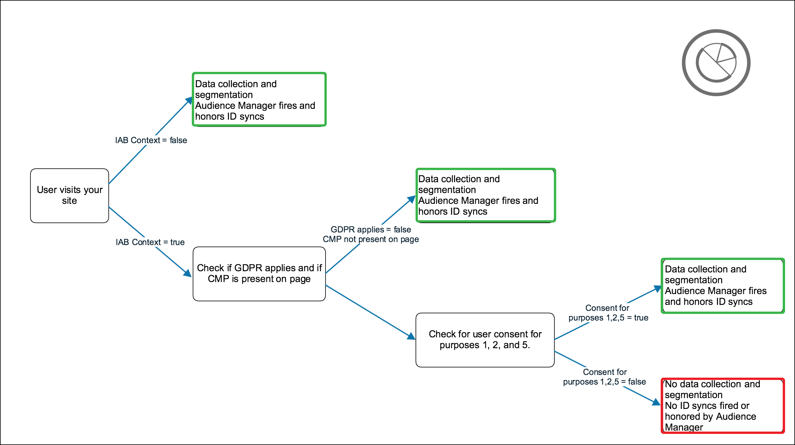

# IAB TCF를 위한 Audience Manager 플러그인 {#aam-iab-plugin}

## 개요

사용자와 관련된 개인 정보 보호 의무의 중요한 측면은 개인 데이터가 사용되는 방법(즉, "목적") 및 사용되는 대상(즉, "회사")에 대한 사용자의 선택을 획득 및 제공하는 것입니다. 

Adobe는 [옵트인 기능](https://marketing.adobe.com/resources/help/en_US/mcvid/overview.html) 및 [IAB 투명성 및 동의 프레임워크(TCF)](https://iabtechlab.com/standards/gdpr-transparency-and-consent-framework/) 지원을 통해 사용자의 개인 정보 보호 선택을 관리 및 소통할 수 있는 수단을 제공합니다.

이 문서에서는 IAB TCF를 지원하는 Audience Manager 사용 사례 및 Audience Manager에서 IAB TCF 지원을 구현하는 방법에 대해 설명합니다. Audience Manager는 공급업체 ID 565와 함께 IAB TCF에 등록됩니다.

IAB TCF 용 Audience Manager 플러그인은 [Adobe](https://marketing.adobe.com/resources/help/en_US/mcvid/iab.html)[Experience Cloud ID 서비스](https://marketing.adobe.com/resources/help/en_US/mcvid/) 라이브러리의 일부인 옵트인 기능을 활용합니다.

## 범위 및 제한 사항 {#scope-and-limitations}

Audience Manager를 사용하는 게시자 또는 광고업체로, IAB TCF 별로 Audience Manager에 사용자 선택 사항을 전달할 수 있습니다. 이를 통해 사용자와 함께 작업하고 있는 모든 파트너에게 사용자 선택을 전달할 수 있는 간편하고 일관성 있는 방법을 제공할 수 있으며, Audience Manager는 사용자의 개인 정보 선택을 존중할 수 있습니다.

이 문서에 설명된 IAB TCF 지원은 Audience Manager에서 IAB 프레임워크에 대한 계획된 지원의 첫 번째 단계를 나타냅니다. 현재 Audience Manager는 다음을 지원하지 않습니다.

* 모바일 장치 워크플로우;
* 크로스 디바이스 동의 관리;
* URL 대상으로 전송된 URL에 [대한 동의 추가](/help/using/features/destinations/create-url-destination.md);
* 세그먼트에 동의 추가.

## 전제 조건 {#prerequisites}

Audience Manager와 함께 IAB TCF를 사용하려면 다음 전제 조건을 충족해야 합니다.

1. Experience Cloud ID 서비스 (ECID) 버전 4.1 이상을 사용하고 있어야 합니다. [최신](https://github.com/Adobe-Marketing-Cloud/id-service/releases) ECID 릴리스를 다운로드하십시오.
2. 
   1. 여기에서 다운로드할 수 있는 Audience Manager 데이터 통합 라이브러리 (DIL) 버전 9.0 이상을 사용해야 [](https://github.com/Adobe-Marketing-Cloud/dil/releases)합니다. Audience Manager 설명서의 [DIL에](/help/using/dil/dil-overview.md)대해 알아봅니다.
   2. 또는 SSF (서버 측 포워딩) 를 사용하여 데이터를 Audience Manager로 가져오는 경우 appmeasurement의 최신 버전으로 업그레이드해야 합니다. Analytics 코드 관리자를 사용하여 [appmeasurement를 다운로드합니다](https://marketing.adobe.com/resources/help/en_US/reference/code_manager_admin.html).
3. IAB를 지원하고 IAB TCF에 등록된 상업용 또는 사용자 자체 동의 관리 플랫폼 (CMP) 를 사용해야 합니다. IAB 프레임워크 내에 등록된 [CMPS 목록을 참조하십시오](https://advertisingconsent.eu/cmp-list/).

## 권장 사항 및 구현 방법 {#recommendations}

Audience Manager에서 IAB TCF 지원을 활성화하려면 동의 시 IAB 설정 방법에 대한 [설명서를 참조하십시오](https://marketing.adobe.com/resources/help/en_US/mcvid/iab.html).

Adobe Launch를 사용하여 [속성에서 ECID](https://docs.adobelaunch.com/) 옵트인을 구현하면 가장 쉽습니다. Read the documentation for the [ECID Opt-in extension](https://docs.adobelaunch.com/extension-reference/web/experience-cloud-id-service-extension#opt-in) to learn how to set up the Launch extension.

## IAB 프레임워크를 사용할 때의 사용자 선택 워크플로우 {#user-choice-workflow}

웹 속성을 방문할 때 사용자는 게시자 및 게시자가 작업하는 타사 공급업체의 데이터 사용 방법과 관련된 선택 사항을 제공할 수 있습니다. 사용자는 글로벌 공급업체 목록에 *등록된* *서드 파티 업체에* 표준 목적과 권한 형태로 선택할 수 있습니다. 아래 이미지는 웹 사이트의 첫 번째 방문자에게 표시되는 CMP 대화 상자의 예입니다. 이 대화 상자는 고객 구현에 따라 매우 다르게 보일 수 있습니다.


IAB 프레임워크의 표준 목적은 다음과 같습니다.

* 정보 저장 및 액세스
* 개인화
* 광고 선택, 전달 및 보고
* 컨텐츠 선택, 전달 및 보고
* 측정

5 가지 표준 용도에 대한 설명은 [IAB Framework 사양 페이지를](https://github.com/InteractiveAdvertisingBureau/GDPR-Transparency-and-Consent-Framework/blob/master/Consent%20string%20and%20vendor%20list%20formats%20v1.1%20Final.md#purposes-features) 참조하십시오.

사용자는 표준 목적과 벤더의 조합에 대한 동의를 부여할 수 있습니다. 예를 들어, 사용자는 스토리지, 개인화 및 측정에 대한 동의를 부여하고 CMP에 의해 표시되는 모든 제 3 자 업체에 대한 동의를 부여할 수 있습니다. 또는 또 다른 예로, 5 가지 표준 목적에 대한 동의를 부여하고 CMP에 의해 표시되는 일부 벤더에 대한 동의를 부여할 수 있습니다.

사용자가 개인 정보 선택을 선택하면 사용자가 선택한 내용이 IAB TCF 동의 문자열에 기록됩니다. IAB TCF 동의 문자열은 다른 메타데이터 정보와 함께 승인된 목적 및 공급업체의 조합을 저장합니다 (자세한 내용은 [IAB 페이지](https://github.com/InteractiveAdvertisingBureau/GDPR-Transparency-and-Consent-Framework/blob/master/Consent%20string%20and%20vendor%20list%20formats%20v1.1%20Final.md#Consent-string-and-vendor-list-format) 참조). IAB TCF에 등록된 모든 공급업체는 IAB TCF 동의 문자열을 평가하고 사용자의 개인정보 보호 선택 사항을 기반으로 결정을 합니다. 사용자의 개인정보 보호 선택 사항은 승인된 모든 벤더에서 유효하다는 점을 염두에 두십시오.

## Audience Manager에 필요한 표준 목적 {#aam-standard-purposes}

Audience Manager는 다음 목적을 위해 IAB TFC 동의 문자열에 저장된 사용자의 선택을 평가합니다.

* 정보 저장 및 액세스 ( [전역 공급업체 목록의 목적 ID 1](https://vendorlist.consensu.org/vendorlist.json))
* 개인화 (목적 ID 2)
* 측정 (목적 ID 5)
* Audience Manager 공급업체의 동의를 통해 게시자에 대한 데이터를 저장, 처리 또는 활성화할 수 있습니다.

>[!IMPORTANT]
>
>Audience Manager needs consent for *all three purposes, plus vendor consent* in order to deploy cookies and initiate or honor ID syncs.

## Audience Manager 행동은 사용자가 동의 허용을 여부에 따라 달라집니다. {#aam-behavior-consent}

Audience Manager는 사용자가 3 가지 목적 (스토리지, 개인화, 측정) 에 대한 동의를 제공한 IAB TCF 동의 문자열에서 감지하는지 여부에 따라 다르게 작동합니다.

| 사용자가 *동의를*&#x200B;제공하면 Audience Manager: | 사용자가 *동의하지 않으면* Audience Manager: |
|---|---|
| <ul><li>요청한 모든 Audience Manager 사용 사례를 수행합니다.</li><li>ID 동기화 시 제 3 자에 대한 동의 (gdpr = 1를 전달하여 ID 동기화 호출에 gdpr_ consent로 동의 문자열을 전달함) 를 전달합니다.</li><li>광고 서버 픽셀에서 전달된 동의를 평가하고 적용합니다.</li><li>파트너가 시작한 ID 동기화를 준수합니다.</li></ul> | <ul><li>에는 새 사용자 데이터가 인스턴스에 저장되지 않습니다. 여기에는 파트너 ID, 신호, 특성 또는 픽셀 데이터가 포함됩니다.</li><li>타사 ID 동기화를 시작하지 않습니다.</li><li>파트너가 시작한 ID 동기화를 준수하지 않습니다.</li></ul> |


## 게시자 사용 사례 {#publisher-use-case}

IAB TCF를 구현하면 Adobe 또는 기타 타사 공급업체와의 다른 메커니즘을 통해 웹 속성에서 동의 관리를 위해 사용자 정의 코드를 유지할 필요가 없습니다. 사용 사례는 이미지 및 아래 단계에서 설명합니다. 이미지 왼쪽에서 시작합니다.

1. 사용자가 웹 속성 중 하나를 방문합니다. 최신 버전의 ECID 및 DIL 라이브러리를 사용하는 한 ( [전제 조건](/help/using/overview/aam-gdpr/aam-iab-plugin.md#prerequisites)참조) 옵트인 흐름이 트리거됩니다.
2. Audience Manager는 IAB 흐름이 적용되는지 여부를 확인합니다 (`isIabContext=true`). [권장 사항 및 구현 방법을 참조하십시오](/help/using/overview/aam-gdpr/aam-iab-plugin.md#recommendations).
3. Audience Manager는 GDPR 이 적용되는지 여부`gdpr = 1`및 웹 속성에 IAB에 등록된 CMP가 있는지 여부를 확인합니다. 예를 들어, 유럽 연합 영역을 방문하는 사용자에게 적용됩니다. GDPR 플래그를 설정하는 것은 게시자로서의 책임입니다.
4. GDPR 이 적용되는 경우 Audience Manager는 필요한 권한에 대해 매개 변수로 `gdpr_consent`전달된 IAB TCF 동의 문자열을 확인합니다. Audience Manager의 스토리지, 개인화, 측정 및 Audience Manager 벤더 동의에 대한 권한이 있어야 데이터를 저장, 처리 또는 활성화할 수 있습니다.
5. IAB TCF 동의 문자열이 있고 필수 권한을 포함하는 경우 Audience Manager는 IAB TCF 동의 문자열을 Adobe [DCS (데이터 수집 서버](/help/using/reference/system-components/components-data-collection.md) ) 에 전달합니다.
6. Audience Manager는 브라우저에서 [demdex 쿠키를](https://marketing.adobe.com/resources/help/en_US/whitepapers/cookies/cookies_am.html) 설정하여 응답합니다. 또한 Audience Manager는 타사 ID 동기화 시작 및 명예를 적용합니다.
7. 또는 5 단계에서 전달된 IAB TCF 동의 문자열에 필요한 권한이 모두 포함되어 있지 않을 경우, Audience Manager는 데이터를 수집, 처리 또는 활성화하지 않고 ID 동기화 또는 시작을 수행하지 않습니다.



## 광고주 사용 사례 {#advertiser-use-case}

Audience Manager는 IAB TCF에 따라 픽셀 호출에서 [](/help/using/integration/sending-audience-data/real-time-data-integration/pixel-based-data-transfer.md)전달된 동의를 평가하고 처리합니다.

픽셀은 일반적으로 Audience Manager 고객이 파트너 페이지에 배치하거나 광고 응답에 포함할 광고 서버에 배치됩니다. 첫 번째 경우 파트너는 프로그래밍 방식으로 동의 매개 변수를 검색하여 시작하기 전에 픽셀에 추가해야 합니다. 두 번째 경우에 보다 일반적이며 아래에 자세히 설명된 광고 서버는 공급측 플랫폼 (SSP) 또는 게시자 광고 서버에서 모든 픽셀에 받는 동의 매개 변수를 추가합니다.

Audience Manager는 두 매개 변수를 사용하여 픽셀 호출에서 사용자 동의를 전달합니다.

* `gdpr` 0 (GDPR는 적용되지 않음) 또는 1 (GDPR 적용) 일 수 있습니다.
* `gdpr_consent` URL-safe base 64로 인코딩된 GDPR 동의 문자열입니다 ( [사양](https://github.com/InteractiveAdvertisingBureau/GDPR-Transparency-and-Consent-Framework/blob/master/URL-based%20Consent%20Passing_%20Framework%20Guidance.md#specifications)참조). 노출 픽셀에 대한 샘플 호출은 다음과 같이 두 매개 변수가 표시될 수 있습니다.

```
http://yourcompany.demdex.net/event?d_event=imp&gdpr=1&gdpr_consent=consentstring&d_src=datasource_id&d_site=siteID&d_creative=creative_id&d_adgroup=adgroup_id&d_placement=placement_id
```

사용 사례는 이미지 및 아래 단계에서 설명합니다. 이미지 왼쪽에서 시작합니다.

1. 광고 서버를 통해 사용자에게 노출이 제공됩니다. 이것은 DCS (데이터 수집 서버) 에 대한 픽셀 호출로 해석됩니다.
1. Audience Manager는 GDPR 플래그가 적용되는지 여부를 확인합니다. 그렇지 않을 경우 Audience Manager는 픽셀 호출에서 매크로 변수로 전달된 데이터를 저장합니다.
1. 동의 문자열이 존재하고 필수 권한이 포함된 경우 Audience Manager는 픽셀 호출에서 매크로 변수로 전달된 데이터를 저장합니다.
1. 동의 문자열이 누락되거나 필요한 권한이 없는 경우 Audience Manager는 픽셀 호출에서 매크로 변수로 전달된 데이터를 삭제합니다.


## IAB TCF를 지원하는 정품 인증 파트너 {#aam-activation-partners}

IAB TCF 용 Audience Manager 플러그인을 사용하면 사용자의 개인정보 보호 선택 사항을 준수하면서 IAB TCF 동의 문자열을 활성화 파트너로 전달할 수 있습니다. IAB TCF (2019 년 7 월 7 일 기준) 를 지원하는 활성화 파트너에 대한 자세한 내용은 **[파트너 Excel 시트를 참조하십시오](/help/using/overview/aam-gdpr/assets/AAM-Partners-July2019.xlsx)**.

## IAB 구현 테스트 {#test-iab-implementation}

IAB TCF 용 Audience Manager 플러그인을 올바르게 구현했는지 테스트하려면, 옵트인 및 IAB 구현을 위한 검증 방법에서 [활용 사례 4를 읽어](https://marketing.adobe.com/resources/help/en_US/mcvid/testing-optin-and-iab-plugin.html)보십시오.

## Audience Manager의 IAB 및 옵트아웃 우선 순위. {#iab-and-optout}

사용자의 판단에 따라 다른 개인정보 보호 옵션은 모든 데이터 수집을 거부할 수 있는 기능입니다. Adobe는 사용자에게 개인정보 [보호 옵션](https://www.adobe.com/privacy/opt-out.html#customeruse) 내에서 이렇게 할 수 있는 방법을 제공합니다.

Audience Manager는 문서에 있는 [별도의 아티클에서 옵트아웃 관리를 처리합니다](/help/using/overview/data-security-and-privacy/opt-out-management.md).

>[!NOTE]
>
>**우선 순위** - 사용자가 위의 링크에 설명된 대로 전역 옵트아웃 도구를 사용하여 데이터 수집을 옵트아웃하면 옵트인 및 IAB 확인보다 우선합니다.

## 추가 리소스 {#additional-resources}

* [Experience Cloud ID 서비스 옵트인](https://marketing.adobe.com/resources/help/en_US/mcvid/overview.html)
* [IAB Europe GDPR 투명도 및 동의 프레임워크](https://iabtechlab.com/standards/gdpr-transparency-and-consent-framework/)
* [IAB Europe GDPR Transparency and Consent Framework 기술 사양](https://github.com/InteractiveAdvertisingBureau/GDPR-Transparency-and-Consent-Framework/blob/master/Consent%20string%20and%20vendor%20list%20formats%20v1.1%20Final.md)
* [IAB TCF 플러그인 - 비디오 데모](https://helpx.adobe.com/audience-manager/kt/using/iab-tcf-support-audience-manager-technical-video-implement.html)