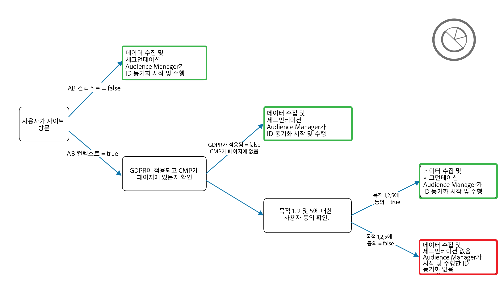

# [!DNL Audience Manager Plug-in for IAB TCF] {#aam-iab-plugin}

## 개요

개인 정보 보호 의무의 중요한 측면은 사용자에 대한 개인 데이터가 사용되는 방법(즉, &quot;목적&quot;) 및 사용되는 대상(즉, &quot;회사&quot;)에 대한 사용자 선택의 획득 및 양도입니다.

Adobe는 [옵트인 기능](https://experienceleague.adobe.com/docs/id-service/using/implementation/opt-in-service/optin-overview.html) 및 [IAB 투명성 및 동의 프레임워크(TCF)](https://iabtechlab.com/standards/gdpr-transparency-and-consent-framework/) 지원을 통해 사용자의 개인 정보 보호 선택을 관리 및 소통할 수 있는 수단을 제공합니다.

이 문서에서는 IAB TCF를 지원하는 Audience Manager 사용 사례 및 Audience Manager에서 IAB TCF 지원을 구현하는 방법에 대해 설명합니다.

>[!IMPORTANT]
>
>Audience Manager은에 등록됩니다. [IAB TCF](https://iabeurope.eu/tcf-for-vendors/) 공급업체 ID 565와 함께

IAB TCF용 Audience Manager 플러그인은 [옵트인 기능](https://experienceleague.adobe.com/docs/id-service/using/implementation/opt-in-service/iab.html)을 활용하며, 이 기능은 결과적으로 [ ECID(Experience Platform Identity Service)](https://experienceleague.adobe.com/docs/id-service/using/home.html) 라이브러리의 일부입니다.

## 범위 및 제한 사항 {#scope-and-limitations}

Audience Manager를 사용하는 게시자 또는 광고주는 IAB TCF에 따라 Audience Manager에 사용자 선택 사항을 전달할 수 있습니다.

>[!IMPORTANT]
>
>IAB TCF 규정은 유럽 경제 지역에 위치한 방문자에게만 적용됩니다.

Audience Manager은 사용자의 개인 정보 보호 선택 사항을 준수하는 데 도움이 되며, 함께 일하는 모든 파트너에게 이러한 선택 사항을 쉽게 전달할 수 있는 방법을 제공합니다.

현재 Audience Manager는 다음 사항을 지원하지 않습니다.

* 모바일 장치 워크플로우
* 세그먼트 내보내기에 동의 추가.

## Insight [!DNL IAB TCF v2.2] {#upgrading}

을(를) 업그레이드하는 고객 [!DNL Audience Manager Plug-in for IAB TCF] 구현 위치 [!DNL IAB TCF] v1.1 ~ [!DNL IAB TCF] v2.2 또는 활성화 [!DNL IAB TCF] v2.2에서는 처음으로 아래 설명된 대로 사전 요구 사항 및 구현에 대한 동일한 지침을 따라야 합니다.

## 사전 요구 사항 {#prerequisites}

>[!IMPORTANT]
>
>Audience Manager은 IAB TCF v2.2를 지원합니다.
>
>IAB TCF v1.1 지원은 2020년 8월 15일에 종료됩니다.
>
> 동의 관리를 위해 IAB TCF용 Audience Manager 플러그인을 계속 사용하려는 고객은 의 최신 버전으로 업그레이드해야 합니다. [ECID](https://github.com/Adobe-Marketing-Cloud/id-service/releases) 지속적인 지원을 위해.
>
> 최신 버전으로 업그레이드 한 후 [ECID](https://github.com/Adobe-Marketing-Cloud/id-service/releases) 버전, IAB TCF v1.1 동의 문자열은 더 이상 지원되지 않으므로 최신 ECID 버전으로 업그레이드하기 전에 CMP를 업데이트해야 합니다.

Audience Manager에서 IAB TCF용 Audience Manager 플러그인을 사용하려면 다음 전제 조건을 충족해야 합니다.

1. Adobe ECID(Experience Platform Identity Service) 버전 5 이상을 사용해야 합니다. 최신 ECID 릴리스를 [다운로드](https://github.com/Adobe-Marketing-Cloud/id-service/releases)하십시오.
2. Audience Manager을 사용해야 합니다. [!DNL Data Integration Library] (DIL) 버전 9.0 이상, 다운로드 가능 [여기](https://github.com/Adobe-Marketing-Cloud/dil/releases). [Audience Manager 설명서에서 DIL](../../dil/dil-overview.md)에 대해 알아보십시오. 다음을 사용하는 것이 좋습니다. [Adobe Audience Manager 태그 확장](https://experienceleague.adobe.com/docs/experience-platform/tags/extensions/adobe/audience-manager/overview.html) Audience Manager의 가장 쉬운 DIL 구현
3. 또는 다음을 사용하는 경우 [!DNL Server-Side Forwarding] (SSF) 데이터를 Audience Manager으로 가져오려면 최신 버전의 AppMeasurement으로 업그레이드해야 합니다. [Analytics 코드 관리자](https://experienceleague.adobe.com/docs/analytics/admin/admin-tools/code-manager-admin.html)를 사용하여 AppMeasurement를 다운로드합니다.
4. IAB TCF v2.2와 통합되고 IAB TCF에 등록된 상업용이거나 본인 소유의 CMP(동의 관리 플랫폼)를 사용하고 있어야 합니다. [IAB 프레임워크 내에 등록된 CMP](https://iabeurope.eu/cmp-list/) 목록을 참조하십시오.

>[!WARNING]
>
>IAB TCF v2.2를 지원하지 않는 CMP(동의 관리 플랫폼)를 사용하는 경우, Audience Manager이 자동으로 `gdpr=0` 방문자가 유럽 연합에 있는 경우에도 ID 동기화의 매개 변수입니다. GDPR 유효성 검사가 활성 상태인지 확인하려면 IAB TCF v2.2를 지원하는지 CMP(동의 관리 플랫폼)를 확인하는 것이 좋습니다.

## 권장 사항 및 구현 방법 {#recommendations}

Audience Manager에서 IAB TCF 지원을 활성화하려면 [옵트인으로 IAB를 설정하는 방법](https://experienceleague.adobe.com/docs/id-service/using/implementation/opt-in-service/iab.html)에 대한 설명서를 참조하십시오.

이 작업을 수행하는 가장 쉬운 방법은 를 사용하는 것입니다 [Adobe Experience Platform 태그](https://experienceleague.adobe.com/docs/experience-platform/tags/home.html?lang=en) 추가하려면 [!DNL ECID Opt-in] 속성. 에 대한 설명서를 참조하십시오. [ECID 옵트인 확장](https://experienceleague.adobe.com/docs/experience-platform/tags/extensions/adobe/id-service/overview.html) 태그 확장을 설정하는 방법을 알아봅니다.

## IAB 프레임워크 사용 시 사용자 선택 워크플로우 {#user-choice-workflow}

웹 자산을 방문할 때 사용자는 게시자 및 게시자가 작업에 사용하는 타사 공급업체의 데이터 사용 방법에 대한 선택 사항을 제공할 수 있습니다.

사용자는 다음과 같은 형식으로 자신의 선택 사항을 제공합니다. *동의* 의 IAB 목적으로 *서드파티 공급업체* 글로벌 공급업체 목록에 등록되었습니다.

아래 이미지는 어떤 웹 사이트를 처음 방문하는 사람에게 표시되는 CMP 대화 상자의 예를 나타냅니다. 고객 구현에 따라 이 대화 상자가 매우 다르게 보일 수 있음을 명심하십시오.


IAB TCF v2.2에 포함된 다양한 목적 및 권한에 대한 자세한 내용은 [IAB 유럽 투명성 및 동의 프레임워크 정책](https://iabeurope.eu/iab-europe-transparency-consent-framework-policies/#A_Purposes).

사용자는 목적과 공급업체의 조합에 동의할 수 있습니다. 예를 들어, 사용자는 디바이스에 대한 정보 저장, 제품 개발 및 개선에 동의하고 CMP가 표시하는 모든 타사 공급업체에 동의할 수 있습니다.

또는 다른 예로, 모든 목적을 위해 동의할 수 있지만 CMP가 표시하는 공급업체에 대해서는 일부에만 동의할 수 있습니다.

사용자가 개인 정보 보호 선택 사항을 선택하면 사용자 선택 사항이 IAB TC 문자열에 기록됩니다. IAB TC 문자열은 승인된 목적과 공급업체의 조합과 기타 메타데이터 정보를 저장합니다( [IAB 페이지](https://github.com/InteractiveAdvertisingBureau/GDPR-Transparency-and-Consent-Framework/blob/master/TCFv2/IAB%20Tech%20Lab%20-%20Consent%20string%20and%20vendor%20list%20formats%20v2.md#about-the-transparency--consent-string-tc-string) 을 참조하십시오.

IAB TCF에 등록된 모든 공급업체는 IAB TC 문자열을 평가하고 사용자의 개인 정보 보호 선택 사항을 기반으로 결정을 내립니다. 사용자의 개인 정보 보호 선택 사항은 IAB TCF에 등록된 모든 공급업체에서 유효합니다.

## Audience Manager에 필요한 용도 {#aam-standard-purposes}

Audience Manager은 IAB TC 문자열에 저장된 사용자의 선택 사항을 다음에 정의된 목적에 따라 평가합니다. [IAB 유럽 투명성 및 동의 프레임워크 정책](https://iabeurope.eu/iab-europe-transparency-consent-framework-policies/#Appendix_A_Purposes_and_Features_Definitions).

* **목적 1**: 장치에 대한 저장 및/또는 액세스 정보
* **목적 10**: 제품 개발 및 개선
* **특수 목적 1**: 보안을 보장하고, 사기를 방지하고, 디버그를 수행할 수 있습니다.

>[!IMPORTANT]
>
>Audience Manager은 쿠키를 배포하고 ID 동기화를 시작하거나 처리하려면 purpose 1, 10에 대한 동의와 공급업체 동의 가 필요합니다.
>
>마다 [IAB 규정](https://iabeurope.eu/iab-europe-transparency-consent-framework-policies/#Special_Purpose_1__Ensure_security_prevent_fraud_and_debug_), 특수 목적 1(보안 보장, 사기 방지 및 디버그)은 항상 동의하며 사용자가 이의를 제기할 수 없습니다.

## Audience Manager 행동은 사용자가 동의하는지 여부에 따라 달라집니다 {#aam-behavior-consent}

Audience Manager은 IAB TC 문자열에 두 가지 목적(장치에 대한 정보 저장 및/또는 액세스, 제품 개발 및 개선)에 대한 사용자 동의가 포함되어 있는지 여부에 따라 다르게 작동합니다.

또한 사용자가 Audience Manager에서 작업하는 모든 대상에 대해 IAB TCF에 등록된 대상에 대해서만 사용자 동의를 확인합니다.

| 사용자가 *동의하면* Audience Manager는 | 사용자의 동의를 *거부하면* Audience Manager는 |
|---|---|
| <ul><li>요청하신 모든 Audience Manager 사용 사례를 수행합니다.</li><li>ID 동기화 시 서드파티에게 동의 전달(전달) `gdpr = 1` 및 동의 문자열 `gdpr_consent` (ID 동기화 호출 시).</li><li>광고 서버 픽셀에서 전달된 동의를 평가하고 적용합니다.</li><li>파트너가 시작한 ID 동기화를 수행합니다.</li></ul> | <ul><li>인스턴스에서 새 사용자 데이터를 저장하지 않습니다. 여기에는 파트너 ID, 신호, 트레이트 또는 픽셀 데이터가 포함됩니다.</li><li>타사 ID 동기화를 시작하지 않습니다.</li><li>파트너가 시작한 ID 동기화를 수행하지 않습니다.</li><li>추가 데이터 수집에서 사용자를 옵트아웃합니다.</li></ul> |

## 게시자 사용 사례 {#publisher-use-case}

IAB TCF용 Audience Manager 플러그인을 구현하면 Adobe 또는 기타 타사 공급업체의 다른 메커니즘을 통해 웹 속성에서 동의 관리를 위한 사용자 지정 코드를 유지 관리할 필요가 없습니다. 사용 사례는 이미지와 아래 단계에 설명되어 있습니다. 이미지의 왼쪽에서 시작하십시오.

1. 사용자가 웹 자산 중 하나를 방문합니다. 최신 버전의 ECID 및 DIL 라이브러리([사전 요구 사항](/help/using/overview/data-security-and-privacy/aam-iab-plugin.md#prerequisites) 참조)를 사용하는 한 옵트인 플로우가 트리거됩니다.
2. Audience Manager가 IAB 플로우가 적용되는지(`isIabContext=true`) 확인합니다. [권장 사항 및 구현 방법](aam-iab-plugin.md#recommendations)을 참조하십시오.
3. Audience Manager이 GDPR 적용 여부를 확인합니다(`gdpr = 1`) 및 웹 자산에서 IAB TCF에 등록된 CMP가 있는지 여부를 나타냅니다. 예를 들어, 유럽 연합에서 방문하는 사용자에게 적용됩니다. GDPR 플래그를 설정하는 것은 게시자로서의 책임입니다.
4. GDPR이 적용되는 경우 Audience Manager은 `gdpr_consent` 매개 변수(필요한 동의에 대해)를 참조하십시오. Audience Manager은 장치의 정보를 저장 및/또는 액세스하기 위해 동의해야 함([IAB TCF 목적 1](https://iabeurope.eu/iab-europe-transparency-consent-framework-policies/#A_Purposes)), 제품 개발 및 개선([IAB TCF 목적 10](https://iabeurope.eu/iab-europe-transparency-consent-framework-policies/#A_Purposes))와 데이터를 저장, 처리 또는 활성화하기 위한 Audience Manager 공급업체 동의.
5. IAB TC 문자열이 있고 여기에 필수 동의가 포함되어 있으면 Audience Manager은 IAB TC 문자열을 로 전달합니다. [데이터 수집 서버](../../reference/system-components/components-data-collection.md) (DCS)
6. Audience Manager이 다음 설정으로 응답함: [demdex 쿠키](https://experienceleague.adobe.com/docs/core-services/interface/ec-cookies/cookies-am.html) 브라우저에서 및 은 서드파티 ID 동기화를 시작하고 수행합니다.
7. 또는 4단계에서 전달된 IAB TC 문자열에 필요한 모든 권한이 포함되어 있지 않은 경우 Audience Manager은 사용자 데이터를 수집, 처리 또는 활성화하지 않으며 ID 동기화를 수행하거나 시작하지 않습니다. 또한 함께 작업하는 대상에서 사용자를 옵트아웃합니다.

>[!IMPORTANT]
>
>IAB TCF 매개 변수가 필요한 Audience Manager 대상 파트너와 함께 작업하지만 웹 사이트에 IAB TCF를 지원하는 CMP가 없는 경우, Audience Manager이 다음을 전송합니다 `gdpr=0` ID 동기화 이는 해당 사용자에게는 GDPR이 적용되지 않음을 의미합니다.
>
> 원하지 않는 경우 Audience Manager에서 IAB TCF 기능을 활성화하여 적절한 IAB TC 문자열을 대상 파트너에게 보내야 합니다.




## 광고주 사용 사례 {#advertiser-use-case}

Audience Manager는 IAB TCF에 따라 [픽셀 호출](../../integration/sending-audience-data/real-time-data-integration/pixel-based-data-transfer.md)에서 전달된 동의를 평가하고 수행합니다.

픽셀은 Audience Manager 고객이 파트너 페이지에 배치하거나 광고 응답에 포함할 광고 서버에 배치할 수 있습니다. 첫 번째 경우, 파트너는 실행 전에 프로그래밍 방식으로 동의 매개 변수를 검색하고 픽셀에 추가해야 합니다. 보다 일반적이며 아래에 자세히 설명되어 있는 두 번째 경우에는 광고 서버가 SSP(공급측 플랫폼)나 게시자 광고 서버로부터 받는 동의 매개 변수를 모든 픽셀에 추가합니다.

Audience Manager는 두 개의 매개 변수를 사용하여 픽셀 호출로 사용자 동의를 전달합니다.

* `gdpr`은 0(GDPR이 적용되지 않음) 또는 1(GDPR이 적용됨)일 수 있습니다.
* `gdpr_consent`는 URL이 안전한 base64로 인코딩된 GDPR 동의 문자열입니다([사양](https://github.com/InteractiveAdvertisingBureau/GDPR-Transparency-and-Consent-Framework/blob/master/TCFv2/IAB%20Tech%20Lab%20-%20Consent%20string%20and%20vendor%20list%20formats%20v2.md#about-the-transparency--consent-string-tc-string) 참조). 두 매개 변수가 있는 노출 픽셀에 대한 샘플 호출의 모습은 다음과 같을 수 있습니다.

```
https://yourcompany.demdex.net/event?d_event=imp&gdpr=1&gdpr_consent=consentstring&d_src=datasource_id&d_site=siteID&d_creative=creative_id&d_adgroup=adgroup_id&d_placement=placement_id
```

사용 사례는 이미지와 아래 단계에 설명되어 있습니다. 이미지의 왼쪽에서 시작하십시오.

1. 사용자는 광고 서버를 통해 광고에 노출됩니다. 로 변환됩니다. [픽셀 호출](../../integration/media-data-integration/impression-data-pixels.md) (데이터 수집 서버(DCS)로).
2. Audience Manager가 GDPR 플래그가 적용되는지 확인합니다. 그렇지 않으면 Audience Manager은 전달된 데이터를 `gdpr` 및 `gdpr_consent` 픽셀 호출의 변수입니다.
3. IAB TC 문자열이 있고 이 문자열에 필요한 권한이 포함되어 있으면 Audience Manager은 `gdpr` 및 `gdpr_consent` 픽셀 호출의 변수입니다.
4. IAB TC 문자열이 없거나 필요한 권한이 부족하면 Audience Manager은 `gdpr` 및 `gdpr_consent` 픽셀 호출의 변수입니다.


## IAB TCF를 지원하는 활성화 파트너 {#aam-activation-partners}

IAB TCF용 Audience Manager 플러그인을 사용하면 사용자의 개인 정보 보호 선택 사항을 준수하면서 활성화 파트너에게 IAB TC 문자열을 전달할 수 있습니다. IAB TCF를 지원하는 활성화 파트너에 대한 자세한 내용은 [장치 기반 대상 목록](/help/using/features/destinations/device-based-destinations-list.md)을 참조하십시오.

## URL 대상에 전송된 URL에 동의 추가

IAB TCF v2.2와의 Audience Manager 통합은 로 전송된 정보에 대한 동의 추가를 지원합니다. [URL 대상](../../features/destinations/create-url-destination.md) IAB TCF v2.2와 통합됩니다. 그러나 특정 URL 형식이 손상되는 것을 방지하기 위해 이 프로세스는 자동으로 Audience Manager에 의해 수행되지 않습니다.

(으)로 전송된 데이터에 동의를 추가하려는 고객 [!DNL URL destinations] 을(를) 수동으로 추가해야 합니다. `${GDPR}` 및 `${GDPR_CONSENT_XXXX}` 매크로를 해당 URL 형식으로 변환 `XXXX` 대상 파트너 ID와 함께 사용할 수 있습니다.

예: `https://yourdomain.com?gdpr=${GDPR}&gdpr_consent=${GDPR_CONSENT_1234}`.

다음을 참조하십시오 [정의된 대상 매크로](../../features/destinations/destination-macros.md) 지원되는 대상 매크로에 대한 자세한 내용을 보려면 여기를 클릭하십시오.

## 크로스 디바이스 동의 관리

사이트 방문자가 적절한 권한을 제공하지 않으면 IAB TCF용 Audience Manager 플러그인은 요청에 있는 ID를 자동으로 옵트아웃합니다. 요청에 다음이 포함된 경우: [교차 장치 ID(CRM ID)](../../reference/ids-in-aam.md), Audience Manager은 연결된 마지막 장치와 함께 ID를 옵트아웃합니다 [교차 장치 ID(CRM ID)](../../reference/ids-in-aam.md).

## IAB 구현 테스트 {#test-iab-implementation}

IAB TCF용 Audience Manager 플러그인을 올바로 구현했는지 테스트하려면 다음을 참조하십시오. [옵트인 서비스 확인의 사용 사례 4](https://experienceleague.adobe.com/docs/id-service/using/implementation/opt-in-service/testing-optin-and-iab-plugin.html#section-64331998954d4892960dcecd744a6d88).

## Audience Manager의 IAB 및 옵트아웃. 우선순위. {#iab-and-optout}

사용자가 원하는 대로 선택할 수 있는 또 다른 개인 정보 보호 옵션은 모든 데이터 수집을 옵트아웃하는 기능입니다. Adobe에서는 [개인 정보 보호 선택 사항](https://www.adobe.com/kr/privacy/opt-out.html#customeruse) 페이지 내에서 사용자에게 그렇게 하는 방법을 제공합니다.

Audience Manager는 [설명서의 별도 문서](data-privacy-requests.md#opt-out-requests)에서 옵트아웃 요청을 해결합니다.

>[!IMPORTANT]
>
>동의를 거부한 후 모든 데이터 수집에서 옵트아웃된 사용자는 다시 옵트인할 수 없습니다.

>[!NOTE]
>
>**우선순위** - 사용자가 위의 링크에 설명된 대로 글로벌 옵트아웃 도구를 사용하여 데이터 수집을 옵트아웃하는 경우 이것은 옵트인 및 IAB 유효성 확인보다 우선합니다.

## 추가 리소스 {#additional-resources}

* [Adobe Experience Platform ID 서비스 옵트인](https://experienceleague.adobe.com/docs/id-service/using/implementation/opt-in-service/optin-overview.html)
* [IAB 유럽 GDPR 투명성 및 동의 프레임워크](https://iabtechlab.com/standards/gdpr-transparency-and-consent-framework/)
* [IAB 유럽 GDPR 투명성 및 동의 프레임워크 기술 사양](https://github.com/InteractiveAdvertisingBureau/GDPR-Transparency-and-Consent-Framework/blob/master/Consent%20string%20and%20vendor%20list%20formats%20v1.1%20Final.md)
* [IAB TCF 플러그인 - 비디오 데모](https://helpx.adobe.com/kr/audience-manager/kt/using/iab-tcf-support-audience-manager-technical-video-implement.html)
