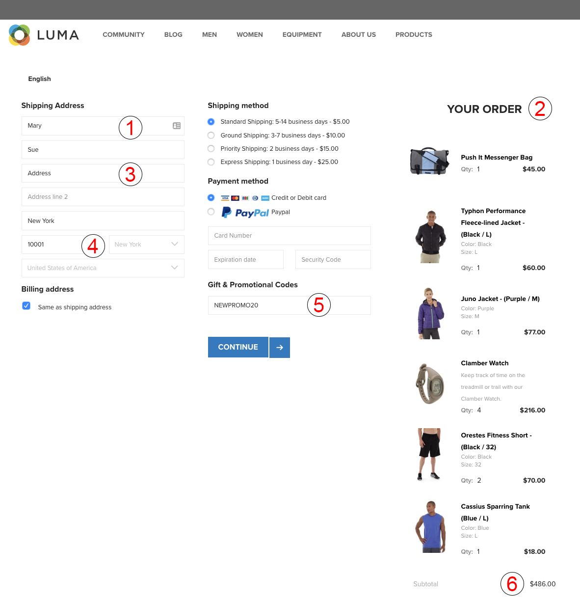

# 수집한 데이터 유형 {#types-of-data-collected}

[!DNL Audience Manager] 퍼스트 파티, 제2자 및 제3자 데이터를 수집 및 관리하는 데 도움이 됩니다.

여러 사일로에 저장되어 있는 고객 정보 자산에 대한 잠금을 해제하는 것은 오늘날 기업이 직면한 가장 큰 데이터 문제 중 하나입니다. [!DNL CRM] 데이터베이스에서 등록 시스템, 광고 서버 등에 이르기까지 회사는 중요한 데이터를 중앙에서 관리하고 고객/대상 정보를 하나의 전략적 데이터 자산으로 관리하는 데 도움이 되는 툴을 필요로 합니다. [!DNL Audience Manager] 분리된 고객 정보를 잠금 해제하고 여러 소스에서 데이터 수집을 관리하는 데 도움이 됩니다. 수집된 데이터는 데이터 요소 시간별([!DNL TTL]) 값을 기반으로 관리되므로 게시자가 모든 소스의 데이터 만료일을 제어할 수 있습니다. [!DNL Audience Manager] 는 다음 유형의 데이터를 관리하는 데 도움이 되도록 설계되었습니다.

| 데이터 유형 | 데이터 출처 |
|---|---|
| **자사** | 고객. 데이터는 온라인(웹 사이트의 소비자 상호 작용) 또는 오프라인에서 수집됩니다. |
| **제2자** | 전략적 파트너 및 광고업체 |
| **타사** | 데이터 공급자 및/또는 교환. 데이터에는 의도, 인구 통계학, 소셜/라이프스타일, 사이코그래프 등과 같은 정보가 포함될 수 있습니다. |

## 자사 데이터 수집 {#first-party-data}

자사 데이터 수집은 기본 [!DNL Audience Manager] 기능입니다. 이 핵심 기능은 자산 데이터를 마케팅 프로그램의 초석으로 사용하거나 다른 데이터 소스와 비교하여 타겟팅 및 모델링에 사용하려는 고객(게시자 또는 광고주)의 요구 사항을 해결합니다.

[!DNL Audience Manager] 고객과 협력하여 데이터 전략을 파악한 다음 이 전략을 사용자 지정 데이터 수집 계획에 다시 매핑합니다. Adobe의 파트너 솔루션팀은 귀사와 협력하여 웹 사이트에서 사이트, 원시 데이터 신호 및 기타 사용자 상호 작용을 평가합니다. Adobe는 이러한 정보를 바탕으로 귀사가 인벤토리의 다양한 페이지에서 사용자 수준 데이터 신호를 캡처하는 맞춤형 데이터 수집 전략을 작성하는 것을 지원하게 됩니다. 캡처된 데이터는 저장되며, 비즈니스 요구 사항이 변경될 때 언제든지 업데이트할 수 있는 사전 정의된 분류법에 다시 매핑됩니다.

다음 예는 샘플 쇼핑 페이지에서 잠재적 데이터 요소를 캡처할 수 있는 방법을 보여줍니다.

| 항목 | 설명 |
|---|---|
| 1 | **성별**. 쇼핑객의 이름은 보통 쇼핑객의 성별을 나타냅니다. 이 예에서, 쇼핑객의 이름은 Mary이고, 따라서 쇼핑객이 여성이라는 것을 알 수 있습니다. 이름은 Audience Manager가 저장하지 않습니다. |
| 2 | **관심**. 장바구니에 있는 품목들은 다양한 관심사를 나타낼 수 있습니다. 이 예에서, Mary는 운동 장비에 많은 돈을 지출합니다. |
| 3 | **주택 유형**. 배송 및/또는 청구 주소를 기반으로, Mary가 운동 장비를 자신을 위해 구입하는지 아니면 회사를 위해 구입하는지 유추할 수 있습니다. |
| 4 | **위치**. [!DNL ZIP] 위치를 가리키는  [!DNL IP] 데 있어서 코드는 주소보다 더 안정적입니다. |
| 5 | **프로모션 관련성**. 쇼핑객이 프로모션 코드나 기프트 카드를 사용한다면 이 쇼핑객은 싸고 질 좋은 물건을 찾아다니는 사람일 수 있습니다. |
| 6 | **소비 능력**. 가격 데이터가 [!DNL ZIP+4] 코드와 상관관계가 있는 경우 해당 위치의 비용 파워를 나타냅니다. |

원시 데이터가 수집되면 [!DNL Audience Manager] 플랫폼 내에서 고객이 정의한 트레이트에 다시 매핑됩니다. 분류법 및 데이터 매핑은 모두 데이터 수집 코드를 변경하지 않고 언제든지 조정할 수 있습니다.

## 제2자 데이터 수집 {#second-party-data}

제2자 데이터는 전략적 비즈니스 파트너로부터 나옵니다(게시자 데이터가 아님). 이 정보는 자사 데이터처럼 수집 및 관리됩니다.

제2자 데이터 시나리오에서, 광고주는 자체 데이터 자산을 게시자에게 보내어 해당 정보를 게시자의 데이터와 결합한 다음 더 잘 타겟팅된 광고 프로그램을 실행할 수 있도록 합니다. 뿐만 아니라 게시자는 광고주와 파트너 관계를 맺어 대상 풀을 확장할 수 있습니다. 대부분의 경우 이러한 계약은 데이터 수집 및 공유를 용이하게 하기 위해 [!DNL Audience Manager] 컨테이너 태그를 파트너 사이트에 추가하는 것으로 제한된 계약 관계를 포함합니다.

제2자 데이터 수집 및 리마케팅의 한 예에는 의류 소매 업체가 자사 제품에 대한 데이터를 수집한 다음 이 정보를 주요 파트너와 공유하는 것이 있을 수 있습니다. 이 경우, 리테일 광고는 다양한 재킷 색상 및 크기를 선택한 소비자를 위해 [!DNL Audience Manager] 파트너 사이트에서 다양한 광고를 제공할 수 있습니다.

## 타사 데이터 수집 {#third-party-data}

제3자 데이터는 [!DNL Audience Manager] 외부의 공급업체가 수집하고 공유하는 정보입니다.

제3자 데이터를 사용하여 기존 데이터 [!UICONTROL segments](예: 연령, 가구 소득 등)의 자격을 평가하고, 요구되었지만 다른 방법으로 사용할 수 없는 데이터를 제공하거나, 자사 데이터와 제2자 데이터의 알려진 사용자 기반을 대상으로 유사 모델링에 사용될 수 있습니다. [!DNL Audience Manager] 많은 제3자 데이터 제공업체와 협력하여 데이터 제공자가 수집하는 데이터의 유형을 이해함으로써 각 제공업체와 적절한 전략적 거래를 할 수 있습니다.

>[!NOTE]
>
>[!DNL Audience Manager]가 지원하는 타사 데이터 공급자에 대한 전체 목록이 필요하면 [Adobe Audience Finder](https://www.adobe-audience-finder.com/)를 참조하십시오.

[!DNL Audience Manager] 사용 가능한 데이터 세트  [!DNL APIs] 및 데이터 세트를 기반으로 다른 데이터 공급자와 통합됩니다. 데이터 수집은 사용자가 사이트를 탐색함에 따라 실시간으로, 또는 파트너 간에 ID가 동기화되고 사용자가 사이트를 떠난 후 서버 간에 데이터가 전송되는 대역 외 방법론을 통해 작동합니다. 두 경우 모두 [!DNL Audience Manager] 클라이언트는 자체 동기화를 수행하지 않아도 되는 제3자 데이터를 우리 플랫폼에서 동기화할 수 있습니다. 즉, 각 클라이언트 또는 도메인을 의미합니다. 이것은 도달 범위를 늘리는 데 도움이 되며 페이지의 서버 호출을 줄입니다.

## 파트너 일치 {#match-partners}

많은 클라이언트가 타사 데이터 일치 파트너와 협력하는 것을 선택합니다. 이러한 조직은 등록 요구 사항이 있는 사이트와 관계를 맺고 있으며 등록 네트워크를 기반으로 고객 데이터 파일을 실시간으로 일치시켜 처리할 수 있습니다.

