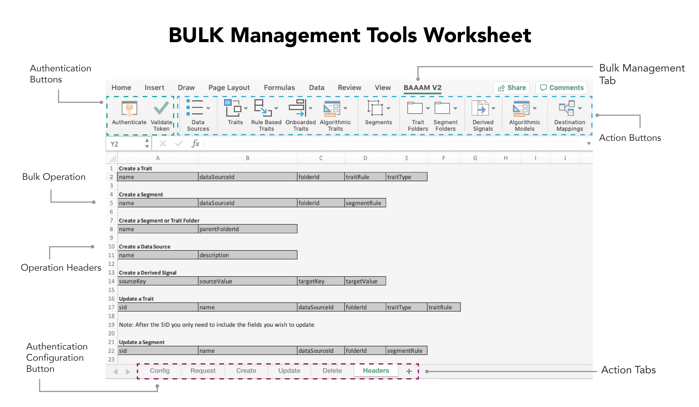

# 벌크 관리 시작{#getting-started-with-bulk-management}

[!DNL Bulk Management Tools]을(를) 사용하면 한 번의 작업으로 여러 개체를 한 번에 만들고 관리할 수 있습니다. [!DNL Bulk Management Tools]을(를) 사용하여 [!UICONTROL data sources], [!UICONTROL derived signals], [!UICONTROL destinations], [!UICONTROL folders], [!UICONTROL models], [!UICONTROL segments] 및 [!UICONTROL traits](으)로 작업할 수 있습니다.

>[!IMPORTANT]
>
>Bulk Management Tools는 공식적으로 지원되는 Adobe 제품이 아닙니다. 고객 지원 센터를 통한 문제 해결 및 지원은 사안별로 처리됩니다.

<!-- 

c_bulk_start.xml

 -->

>[!NOTE]
>
>[!DNL Audience Manager] 사용자 인터페이스에 할당된 [RBAC 그룹 권한](../../features/administration/administration-overview.md)이(가) [!UICONTROL Bulk Management Tools]에서 적용됩니다.

## 개요 {#overview}

이 기능은 [!DNL Audience Manager] API에 대한 안전하고 인증된 호출을 수행하는 매크로가 포함된 [!DNL Microsoft Excel] 스프레드시트를 사용합니다. API는 대량으로 변경할 수 있는 메서드 및 서비스를 제공합니다. 사용하기 위해 API를 코딩하거나 작업하는 방법을 알 필요가 없습니다. 이 워크시트에는 특정 일괄 변경 기능을 수행하는 열 머리글과 탭이 있습니다. 일괄 변경을 수행하려면 사전 정의된 헤더를 특정 워크시트에 추가하고, 일괄 변경할 정보를 제공하고 작업 버튼을 클릭하기만 하면 됩니다. 워크시트와 API가 나머지 작업을 수행합니다.

## 다운로드 {#download}

최신 워크시트 **[여기](assets/BAAAM_V2_20210609.xlsm)**(2021년 6월에 마지막으로 업데이트됨)를 다운로드합니다.

## 전제 조건 {#prereqs}

[!DNL Bulk Management Tools]을(를) 사용하려면 다음이 필요합니다.

* [!DNL Experience Cloud] 로그인입니다. 고객은 이미 이러한 자격 증명을 가지고 있어야 합니다.
* [!DNL Bulk Management Tools] 워크시트. [워크시트를 다운로드](assets/BAAAM_V2_20210609.xlsm)하여 최신 버전을 다운로드하세요.
* [!DNL Microsoft Excel]이(가) [!DNL macOS] 또는 64비트 [!DNL Microsoft Windows]에서 실행 중입니다. 최신 버전의 [!DNL Microsoft Excel]을(를) 사용하는 것이 좋습니다.
* 워크시트를 열 때 [!DNL Bulk Management Tools]이(가) 작동하려면 **매크로를 사용**&#x200B;해야 합니다.

## 인증 요구 사항 및 옵션 {#auth-reqs}

벌크 변경에는 인증이 필요합니다. 작업을 수행하기 전에 로그인해야 합니다. 워크시트가 API를 호출하므로 사용자 계정을 인증하도록 구성해야 합니다.

**API 인증 요구 사항**

2019년 10월에 릴리스된 [!DNL Bulk Management Tools]의 두 번째 버전은 인증 프로세스를 간소화합니다. 이 버전의 인증 단계는 아래에 요약되어 있습니다.

1. 스프레드시트를 열고 **[!UICONTROL Config]** 시트로 이동합니다.
2. 시트에 설명된 단계를 수행합니다.
   
3. 단계를 완료한 후 일괄 변경할 권한이 있습니다.

일괄 변경 시 변경할 권한이 있는지 확인해야 하지만 API 인증은 자동으로 수행됩니다.

**도메인 인증 옵션**

도메인 인증은 대량 요청을 테스트하거나 프로덕션 계정에 직접 적용할 수 있는 옵션을 제공합니다. Beta 환경을 대량으로 변경해도 프로덕션 계정에는 영향을 주지 않습니다. 프로덕션 변경 사항은 즉시 적용됩니다. 벌크 관리 시트를 사용하여 다음 환경에서 작업할 수 있습니다.

* Beta
* 프로덕션

## 작업 및 작업 {#actions-ops}

[!UICONTROL Bulk Management Tools] 워크시트는 인증 단추, 작업 탭, 작업 단추 및 **[!UICONTROL Headers]** 탭으로 구성되어 있습니다. **[!UICONTROL Headers]** 탭에는 작업 탭에서 사용하는 미리 서식이 지정된 열 헤더가 있습니다. 작업 탭에는 선택한 일괄 작업을 수행하는 매크로가 포함되어 있습니다. 대량 작업을 수행하려면 헤더 집합을 해당 작업 탭에 복사하고 헤더 데이터를 입력한 다음 작업 단추를 누릅니다.

[인증](#auth-reqs) 후 시작하려면 작업 단추를 클릭하세요.

아래 표에는 [!UICONTROL Bulk Management Tools] 워크시트로 수행할 수 있는 작업과 조작할 수 있는 항목이 나와 있습니다.

<table id="table_B9B3E09B692E42BAA52FB32C18B00709"> 
 <thead> 
  <tr> 
   <th colname="col1" class="entry"> 작업 </th> 
   <th colname="col2" class="entry"> 오브젝트 </th> 
  </tr> 
 </thead>
 <tbody> 
  <tr> 
   <td colname="col1"> 
대량 작업은 워크시트 하단의 탭에 표시되며 다음을 포함합니다. 
 
 
     <ul id="ul_49F46B9E00C045D29E40258EB7BDCFBB"> 
      <li id="li_193C41EA19EF4D738FBA037D2BF9B05C">요청 </li> 
      <li id="li_5BE2E13D839F4958AAA5C01B7EFC5096">업데이트 </li> 
      <li id="li_4CCCC739795945DF8C89787F9A67EB88">선택 사항에서 </li> 
      <li id="li_C7D36D2BDF0448CEAF3A5EABE41038E8">예상 </li> 
      <li id="li_07A3E94326124A3092362D9896EB7732">삭제 </li> 
     </ul> 
 </td> 
   <td colname="col2"> 
대량으로 변경할 수 있는 개체는 <b> Headers</b> 탭 아래에 있으며 다음을 포함합니다. 
 
 
     <ul id="ul_A7A96F2B1B63430B9A1E1184AC5FA8F2"> 
      <li id="li_E3D9E2E190B04BE685337AC6140C371C"> <a href="../../features/datasources-list-and-settings.md#data-sources-list-and-settings"> 데이터 원본</a> </li> 
      <li id="li_B645385E40684FA28770913EAF18CB2C"> <a href="../../features/derived-signals.md">개의 파생 신호</a> </li> 
      <li id="li_9059F8C4A41A410899BDEFC76D3F5949"> <a href="../../features/destinations/destinations.md">개 대상</a> </li> 
      <li> <a href="../../features/algorithmic-models/understanding-models.md">개 모델</a> </li> 
      <li id="li_BB5A445150754E53AA38C78461326932"> <a href="../../features/traits/trait-storage.md#trait-storage">개 트레이트 폴더</a> 및 세그먼트 폴더 </li> 
      <li id="li_7A27DBF64E0945CF8AE8C96E8C6EDA09"> <a href="../../features/segments/segments-purpose.md">개 세그먼트</a> </li> 
      <li id="li_A4640A34930040DEA8555EAF0AE2A702"> <a href="../../features/traits/trait-details-page.md">개 트레이트</a> </li> 
     </ul> 
 </td> 
  </tr> 
 </tbody> 
</table>

**대량 작업 예**

예를 들어 한 번에 여러 트레이트를 만드는 방법을 살펴보겠습니다. 일괄 작업으로 여러 트레이트를 생성하려면 다음을 수행합니다.

1. **[!UICONTROL Headers]** 탭을 클릭하고 [!UICONTROL Create a Trait] 옵션 아래의 모든 레이블을 복사합니다.
2. **[!UICONTROL Create]** 탭을 클릭하고 1행, A열에서 시작하는 레이블을 붙여 넣습니다.
3. 각 열 헤더와 관련된 정보를 입력하고 **[!UICONTROL Create Traits]**&#x200B;을(를) 클릭합니다. 이 작업은 인증을 확인하라는 메시지를 표시합니다. 인증을 확인한 후 벌크 작업이 실행됩니다. 작업 상태 알림에 대한 워크시트의 왼쪽 아래 모서리를 확인합니다.

>[!NOTE]
>
>큰 요청으로 작업할 때 워크시트가 응답하지 않고 비활성 상태로 표시될 수 있습니다. 이런 경우에는 그냥 내버려둬. 벌크 요청이 완료되면 워크시트가 응답합니다. 워크시트가 오랫동안 응답하지 않으면 [문제 해결 섹션](../../reference/bulk-management-tools/bulk-troubleshooting.md)을 참조하세요.
