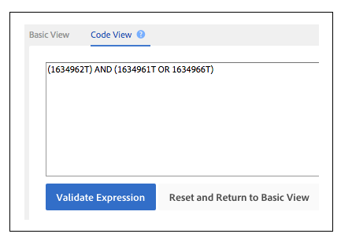

# 트레이트 규칙 및 세그먼트 규칙 만들기 또는 업데이트{#create-or-update-trait-rules-and-segment-rules}

생성 및 업데이트 워크시트에는 한 번의 작업으로 여러 규칙을 적용할 수 있는 traitRule 헤더가 적용됩니다. 다음 지침에 따라 벌크 규칙 요청을 수행합니다.

>[!IMPORTANT]
>
>Bulk Management Tools는 공식적으로 지원되는 Adobe 제품이 아닙니다. 고객 지원 센터를 통한 문제 해결 및 지원은 사안별로 처리됩니다.

<!-- 

c_bulk_rules.xml 

 -->

>[!NOTE]
>
>[RBAC 그룹 권한](../../features/administration/administration-overview.md) 에 할당됨 [!DNL Audience Manager] UI는 [!UICONTROL Bulk Management Tools].

## 트레이트 규칙 작업 {#trait-rules}

워크시트에서 트레이트 규칙 열은 부울 표현식, 비교 연산자 및 정규 표현식으로 구성된 규칙을 반환하고 수락합니다. 에서 트레이트 또는 세그먼트 빌더를 사용하여 규칙을 만들 수 있습니다 [!DNL Audience Manager] 워크시트에 복사합니다. 또는 규칙 구문에 익숙하다면 워크시트에 표현식을 직접 작성할 수도 있습니다.

## 규칙 빌더 예 {#rule-builder-example}

사용 방법을 보여 주는 예를 살펴보겠습니다 [!UICONTROL Segment Builder] 규칙을 만들려면 벌크 워크시트에 액세스할 수 있습니다. 그러나 이러한 도구에 대한 단계별 지침이 아닙니다. 대신 이미 만들어진 간단한 규칙으로 시작하겠습니다. 규칙 빌더를 사용하는 방법에 대한 지침은 다음을 참조하십시오. [세그먼트 빌더](../../features/segments/segment-builder.md) 및 [트레이트 빌더](../../features/traits/about-trait-builder.md).

시각적 규칙 빌더를 사용하여 3개의 트레이트와 부울을 사용하는 세그먼트 규칙을 만들었습니다 [!UICONTROL AND] 연산자.

클릭 **[!UICONTROL Code View]** 을 클릭하여 이 규칙의 텍스트 버전을 가져옵니다.

>[!TIP]
>
>클릭 **[!UICONTROL Validate Expression]** 규칙 논리를 확인합니다. 이렇게 하면 잘못된 규칙을 업로드하지 못하게 됩니다.

규칙에 붙여넣기 [!UICONTROL Bulk Management Tools] 변경 사항을 워크시트로 지정하고 커밋하여 세그먼트 규칙을 일괄적으로 갱신합니다.

## 나만의 규칙 만들기 {#create-rules}

의 외부에서 자신만의 규칙을 작성할 수 있습니다. [!UICONTROL Rule Builder]. 시작하기 전에 연산자, 표현식 및 필수 변수와 같은 요소를 다루는 설명서를 읽어 보십시오. 다음 사항을 검토하는 것이 좋습니다.

* [트레이트 빌더에서 비교 연산자 사용](../../features/traits/trait-comparison-operators.md)
* [작업 순서](../../features/traits/trait-operator-precedence.md)
* [주요 변수의 접두사 요구 사항](../../features/traits/trait-variable-prefixes.md)
* [부울 및 비교 연산자가 있는 샘플 표현식](../../features/traits/trait-expression-samples.md)
