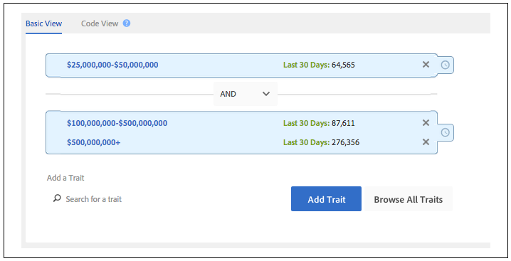

# Create or Update Trait Rules and Segment Rules{#create-or-update-trait-rules-and-segment-rules}

만들기 및 업데이트 워크시트는 단일 작업에 여러 규칙을 적용할 수 있는 Traitrule 헤더를 수락합니다. 다음 지침에 따라 일괄 규칙 요청을 만듭니다.

<!-- 

c_bulk_rules.xml 

 -->

>[!NOTE]
>
>[!UICONTROL Bulk Management Tools]*는에서* 지원되지 [!DNL Audience Manager]않습니다. 이 도구는 편의를 위해 제공되며 편의를 위해 제공됩니다. For bulk changes, we recommend that you work with the [Audience Manager APIs](../../api/rest-api-main/aam-api-getting-started.md) instead. [UI에](../../features/administration/administration-overview.md) 할당된 RBAC 그룹 권한이 [!DNL Audience Manager] 에서 [!UICONTROL Bulk Management Tools]인정됩니다.

## Working with trait rules {#trait-rules}

워크시트에서 트레이트 규칙 열은 부울 표현식, 비교 연산자 및 정규 표현식으로 구성된 규칙을 반환하고 받습니다. You can create rules with trait or segment builder in [!DNL Audience Manager] and copy them to your worksheet. 규칙 구문에 익숙한 경우 워크시트에 표현식을 직접 작성할 수 있습니다.

## Rule builder example {#rule-builder-example}

Let&#39;s take a look at an example that demonstrates how to use [!UICONTROL Segment Builder] to create a rule you can to the bulk worksheet. 그러나 이러한 툴에 대한 단계별 지침은 아닙니다. 대신 이미 만들어진 간단한 규칙으로 시작합니다. For instructions about how to use the rule builders see [Segment Builder](../../features/segments/segment-builder.md) and [Trait Builder](../../features/traits/about-trait-builder.md).

With the visual rule builder, we&#39;ve created a segment rule with 3 traits and a Boolean [!UICONTROL AND] operator.

Click **[!UICONTROL Code View]** to get the text version of this rule.

>[!TIP]
>
>Click **[!UICONTROL Validate Expression]** to check your rule logic. 이렇게 하면 잘못된 규칙을 업로드할 수 없습니다.

Paste the rule into the [!UICONTROL Bulk Management Tools] worksheet and commit your changes to update segment rules in bulk.

## Creating your own rules {#create-rules}

You can write your own rules outside of [!UICONTROL Rule Builder]. 시작하기 전에 연산자, 표현식 및 필수 변수와 같은 내용을 다루는 설명서를 읽으십시오. 다음 사항을 검토하십시오.

* [특성 빌더에서 비교 연산자를 사용한 작업](../../features/traits/trait-comparison-operators.md)
* [작업 순서](../../features/traits/trait-operator-precedence.md)
* [주요 변수의 접두사 요구 사항](../../features/traits/trait-variable-prefixes.md)
* [부울 및 비교 연산자를 사용한 표현식 표현식](../../features/traits/trait-expression-samples.md)

