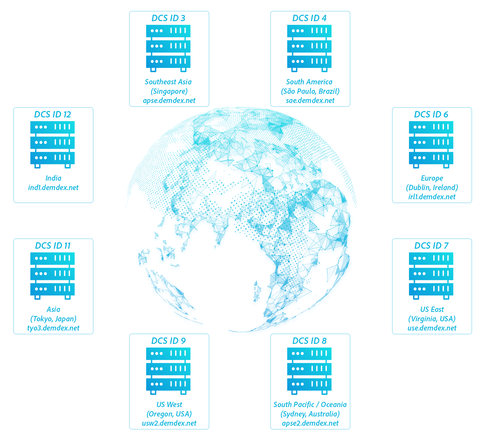

# 데이터 수집 구성 요소{#data-collection-components}

데이터 수집 구성 요소에는 데이터 수집 서버, DIL API, 인바운드 서버 간 데이터 전송 및 로그 파일이 포함됩니다.

<!-- 

c_compcollect.xml

 -->

Audience Manager에는 다음 데이터 수집 구성 요소가 포함되어 있습니다.

* [DCS(데이터 수집 서버) 및 PCS(프로필 캐시 서버)](../../reference/system-components/components-data-collection.md#dcs-pcs)
* [DIL(데이터 통합 라이브러리)](../../reference/system-components/components-data-collection.md#dil)
* [인바운드 서버 간](../../reference/system-components/components-data-collection.md#inbound-outbound-server)
* [로그 파일](../../reference/system-components/components-data-collection.md#log-files)

## DCS(데이터 수집 서버) 및 PCS(프로필 캐시 서버) {#dcs-pcs}

DCS와 PCS는 함께 작동하며 트레이트 실현, 대상자 세분화 및 데이터 저장과 관련된 서비스를 별도로 제공합니다.

**[!UICONTROL Data Collection Servers (DCS)]함수**

[!DNL Audience Manager]에서 DCS:

* 이벤트 호출에서 트레이트 데이터를 수신하고 평가합니다. 여기에는 실시간 세분화에 사용되는 정보와 서버 간 전송에 의해 예약된 간격으로 전달되는 데이터가 포함됩니다.
* [세그먼트 빌더](../../features/segments/segment-builder.md)로 만든 자격 규칙과 실현된 특성을 기준으로 사용자를 세그먼트화합니다.
* 장치 ID 및 인증된 프로필 ID를 만들고 관리합니다. 여기에는 데이터 공급자 ID, 사용자 ID, 선언된 ID, 통합 코드 등과 같은 식별자가 포함됩니다.
* PCS에서 실시간 이벤트 호출 전에 사용자가 이미 실현한 추가 트레이트를 확인합니다. 이렇게 하면 DCS가 실시간 데이터 및 내역 데이터를 기반으로 사용자를 평가할 수 있습니다.
* 로그 파일을 작성하여 저장 및 처리를 위해 분석 시스템으로 전송합니다.

**[!DNL DCS]에서[!UICONTROL Global Server Load Balancing (GSLB)]**&#x200B;을(를) 통해 수요 관리

[!DNL DCS]은(는) 지리적으로 분산된 부하 분산 시스템입니다. 즉, [!DNL Audience Manager]이(가) 사이트 방문자의 지리적 위치에 따라 지역 데이터 센터에 대한 요청을 보낼 수 있습니다. [!DNL DCS] 응답이 해당 방문자에 대한 정보가 포함된 데이터 센터로 직접 이동하므로 이 전략은 응답 시간을 개선하는 데 도움이 됩니다. [!UICONTROL GSLB]은(는) 관련 데이터가 사용자와 가장 가까운 서버에 캐시되므로 시스템을 효율적으로 사용할 수 있습니다.

>[!IMPORTANT]
>
>[!DNL DCS]은(는) IPv4를 사용하는 장치에서 시작된 웹 트래픽만 감지합니다.

이벤트 호출에서 지리적 위치는 JSON 데이터의 더 큰 본문에 반환된 키-값 쌍으로 캡처됩니다. 이 키-값 쌍은 `"dcs_region": region ID` 매개 변수입니다.

고객은 데이터 수집 코드를 통해 간접적으로 [!DNL DCS]에 참여합니다. API 집합을 통해 [!DNL DCS](으)로 직접 작업할 수도 있습니다. [DCS(데이터 수집 서버) API 메서드 및 코드](../../api/dcs-intro/dcs-event-calls/dcs-event-calls.md)를 참조하십시오.

**[!UICONTROL Profile Cache Servers (PCS)]**

[!UICONTROL PCS]은(는) 큰 데이터베이스(기본적으로 큰 서버측 쿠키)입니다. 서버 간 전송 및 [!DNL DCS]에서 활성 사용자에 대해 받은 데이터를 저장합니다. [!UICONTROL PCS] 데이터는 장치 ID, 인증된 프로필 ID 및 연결된 트레이트로 구성됩니다. [!DNL DCS]이(가) 실시간 호출을 받으면 [!UICONTROL PCS]에서 사용자가 속하거나 자격을 부여할 수 있는 다른 특성이 있는지 확인합니다. 또한 나중에 트레이트가 세그먼트에 추가되면 해당 트레이트 ID가 [!UICONTROL PCS]에 추가되고 사용자는 특정 사이트나 앱을 방문하지 않고도 해당 세그먼트를 자동으로 사용할 수 있습니다. [!UICONTROL PCS]은(는) 실시간으로 또는 새로운 트레이트 데이터와 화면 뒤에서 사용자를 일치시키고 세그먼트화할 수 있으므로 [!DNL Audience Manager]의 사용자 이해를 심화시키는 데 도움이 됩니다. 이 비헤이비어는 실시간 자격으로만 보는 것보다 더 완벽하고 정확한 사용자 사진을 제공합니다.

고객이 [!UICONTROL PCS](으)로 직접 작업할 수 있도록 하는 UI 컨트롤이 없습니다. [!UICONTROL PCS]에 대한 고객 액세스는 데이터 저장소 및 데이터 전송으로서의 역할을 통해 간접적으로 수행됩니다. [!UICONTROL PCS]은(는) Apache Cassandra에서 실행됩니다.

**비활성 ID를[!UICONTROL PCS]**&#x200B;에서 제거하는 중

앞에서 설명한 대로 [!UICONTROL PCS]은(는) 활성 사용자에 대한 트레이트 ID를 저장합니다. 활성 사용자는 지난 14일 동안 모든 도메인에서 [Edge 데이터 서버](../../reference/system-components/components-edge.md)에 표시된 모든 사용자입니다. [!UICONTROL PCS]에 대한 이러한 호출은 사용자를 활성 상태로 유지합니다.

* [!DNL /event]개 호출
* [!DNL /ibs]개 호출(ID 동기화)

<!-- 

Removed /dpm calls from the bulleted list. /dpm calls have been deprecated.

 -->

[!UICONTROL PCS]은(는) 17일 동안 비활성 상태인 경우 트레이트를 플러시합니다. 그러나 이러한 트레이트는 손실되지 않습니다. hadoop에 저장되어 있습니다. 사용자가 다른 시간에 다시 표시되면 Hadoop은 일반적으로 24시간 이내에 모든 특성을 [!UICONTROL PCS](으)로 다시 푸시합니다.

**기타 [!UICONTROL DCS/PCS] 프로세스: 개인 정보 옵트아웃**

이러한 서버 시스템은 개인 정보 및 사용자 옵트아웃 요청을 처리합니다. 사용자가 데이터 수집을 옵트아웃한 경우 사용자 쿠키 정보가 로그 파일에 수집되지 않습니다. 개인정보 처리방침에 대한 자세한 내용은 [Adobe 개인 정보 보호 센터](https://www.adobe.com/kr/privacy/advertising-services.html)를 참조하세요.

## DIL(데이터 통합 라이브러리) {#dil}

[!UICONTROL DIL]은(는) 데이터 수집을 위해 페이지에 배치하는 코드입니다. 사용 가능한 서비스 및 메서드에 대한 자세한 내용은 [DIL API](../../dil/dil-overview.md)를 참조하십시오.

## 인바운드 서버 간 {#inbound-outbound-server}

이러한 시스템은 클라이언트와 다양한 서버 간 통합으로 전송되는 데이터를 수신합니다. 자세한 내용은 [대상 데이터 보내기](/help/using/integration/sending-audience-data/real-time-data-integration/real-time-tech-specs.md)에 대한 설명서를 참조하십시오.

## 로그 파일 {#log-files}

[!UICONTROL PCS]이(가) 로그 파일에 데이터를 만들고 씁니다. 이러한 파일은 처리, 보고 및 저장을 위해 다른 데이터베이스 시스템으로 전송됩니다.

>[!MORELIKETHIS]
>
>* [Adobe 개인 정보 보호 센터](https://www.adobe.com/kr/privacy.html)
