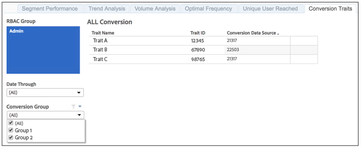

# 보고된 전환 특성{#reported-conversion-traits}

전환 트레이트 보고서는 특정 날짜에 전환 그룹에 대한 전환 트레이트로 레이블이 지정된 모든 트레이트를 표시합니다.

전환 그룹에 대한 전환 트레이트는 보고 실행에서 보고 실행으로 변경될 수 있습니다. 보고서는 선택한 보고 날짜에 대한 전환 그룹별 전환 트레이트를 표시합니다.

Audience Manager에서 전환 트레이트를 만드는 방법을 알아보려면 아래 비디오를 참조하십시오.

>[!VIDEO](https://video.tv.adobe.com/v/30932?captions=kor)

## 샘플 보고서

[!UICONTROL Reported Conversion Traits] 보고서는 아래 보고서와 유사합니다.

