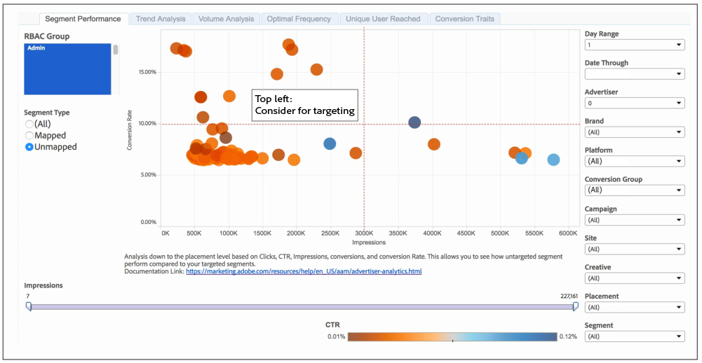

# 세그먼트 성과 보고서{#segment-performance-report}

[!UICONTROL Segment Performance] 보고서는 매핑된 세그먼트와 매핑되지 않은 세그먼트를 노출 수 및 전환율에 따라 비교합니다. 매핑된 세그먼트는 타깃팅을 위해 만들고 대상에 보내는 세그먼트입니다. 매핑되지 않은 세그먼트는 사용자가 만들었지만 타깃팅을 위해 대상에 전송하지 않은 세그먼트입니다. 보고서 내 및 보고서 간 이러한 서로 다른 세그먼트 유형을 비교하면 기존 캠페인을 최적화하고 타깃팅을 위해 대상에 보낼 수 있는 간과된 세그먼트를 찾을 수 있습니다.

## 매핑된 세그먼트 결과를 읽는 방법 {#read-mapped-segment-results}

매핑된 [!UICONTROL Segment Performance] 보고서는 타깃팅을 위해 만들고 대상에 보낸 모든 세그먼트를 표시합니다.보고서에서 매핑된 세그먼트의 위치는 어느 세그먼트가 제대로 수행되고 있으며 어떤 부분을 조정해야 하는지 파악할 수 있습니다.

보고서를 읽기 위해, 아래 샘플 보고서에 표시된 카테고리와 함께 4개의 섹션(빨간색)으로 결과를 나누는 데 도움이 됩니다.

예제 및 다음 표의 레이블은 세그먼트 성능과 이러한 결과에 응답하는 방법을 이해하는 데 도움이 될 수 있습니다.

<table id="table_A29253B30DFA4CD7B3B7C320DE0BDEA4"> 
 <thead> 
  <tr> 
   <th colname="col1" class="entry"> 위치 </th> 
   <th colname="col2" class="entry"> 배치 표시 </th> 
  </tr> 
 </thead>
 <tbody> 
  <tr> 
   <td colname="col1"> 
 <b>왼쪽 위</b> 
 </td> 
   <td colname="col2"> 
전환율 향상 
 
노출 횟수를 늘리면 더 많은 전환을 얻을 수 있습니다. 
 </td> 
  </tr> 
  <tr> 
   <td colname="col1"> 
 <b>왼쪽 아래</b> 
 </td> 
   <td colname="col2"> 
낮은 전환율 
 
이러한 세그먼트를 타깃팅하지 않을 수 있습니다. 이 섹션의 세그먼트는 매핑되지 않은 세그먼트 결과의 세그먼트와 비교할 훌륭한 후보입니다. 매핑되지 않은 세그먼트 중 일부는 이미 타깃팅한 세그먼트보다 더 나은 결과를 얻을 수 있습니다. 
 </td> 
  </tr> 
  <tr> 
   <td colname="col1"> 
 <b>오른쪽 위</b> 
 </td> 
   <td colname="col2"> 
강력한 성능. 이러한 세그먼트는 그대로 두십시오. 
 </td> 
  </tr> 
  <tr> 
   <td colname="col1"> 
 <b>오른쪽 아래</b> 
 </td> 
   <td colname="col2"> 
낮은 전환율 및 높은 노출 횟수 
 
이 섹션의 세그먼트가 성과가 좋지 않습니다. 예산을 이러한 세그먼트에서 벗어나 보고서의 왼쪽 상단 쿼드런트에 있는 세그먼트로 전환할 수 있습니다. 이렇게 하면 노출 횟수를 줄일 수 있고 오른쪽 아래 섹션에 있는 세그먼트의 전환율을 향상시킬 수 있습니다. 또한 이러한 매핑된 세그먼트를 매핑되지 않은 세그먼트와 비교합니다. 매핑되지 않은 세그먼트 중 일부는 이미 타깃팅한 세그먼트보다 더 나은 결과를 얻을 수 있습니다. 
 </td> 
  </tr> 
 </tbody> 
</table>

## 매핑되지 않은 세그먼트 결과를 읽는 방법 {#read-unmapped-segment-results}

[!UICONTROL Segment Performance] 보고서에서 매핑되지 않은 세그먼트를 보는 것은 타깃팅을 고려하지 않은 새 세그먼트를 찾는 좋은 방법입니다. 실제로 이러한 세그먼트 중 일부는 매핑된 세그먼트보다 성과가 높을 수 있습니다. 매핑되지 않은 세그먼트가 이 보고서에 포함할 자격 조건 세트를 충족해야 하기 때문입니다. 이 보고서에 포함하려면 매핑되지 않은 세그먼트가 다음을 수행해야 합니다.

* 매핑된 모든 세그먼트의 평균보다 높은 전환이 있습니다.
* 전환율에 따라 매핑되지 않은 상위 100개의 세그먼트에 있어야 합니다.

이 보고서를 읽으려면 아래 샘플 보고서에 표시된 가상의 선(빨간색)과 카테고리가 있는 4개의 섹션으로 결과를 나눌 수 있습니다.

이 보고서에서는 왼쪽 위 섹션에 있는 매핑되지 않은 세그먼트에 초점을 맞출 수 있습니다. 매핑되지 않은 이러한 세그먼트는 다른 3개 섹션의 세그먼트와 비교할 때 낮은 수준의 노출 횟수에 대해 높은 전환율을 제공합니다.

>[!NOTE]
>
>7일 및 30일 룩백 기간은 일요일 **[!UICONTROL Date Through]** 날짜에만 사용할 수 있습니다.
