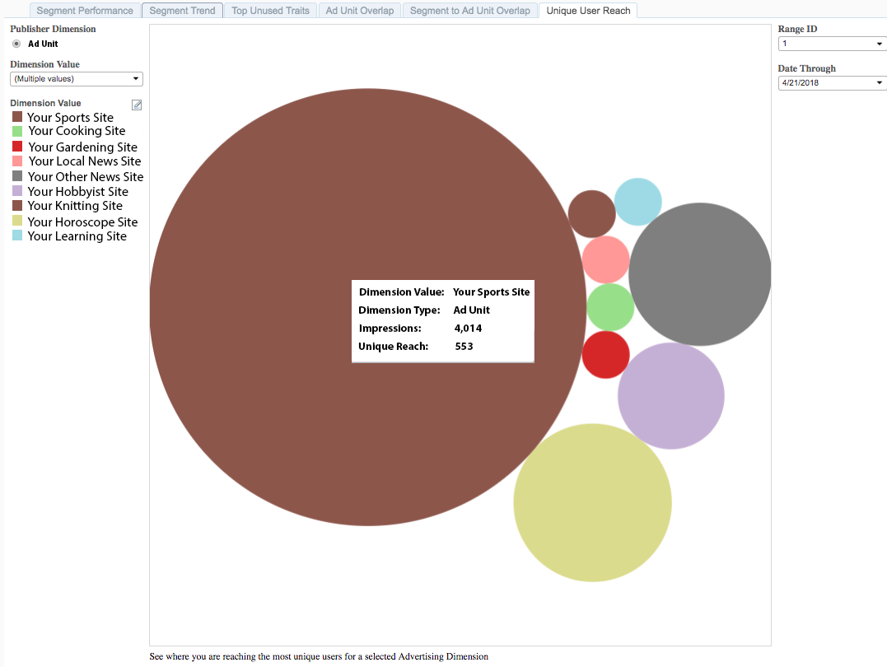

# 고유 사용자 도달 범위{#unique-user-reach}

고유 사용자 도달 수 보고서는 버블 차트에 있는 데이터를 반환합니다. 각 버블의 크기는 선택한 광고 단위에 대한 고유 사용자 수에 직접 비례하여 조정됩니다. 거품이 클수록 작은 거품보다 더 큰 도달 범위를 나타냅니다. 고유 사용자 도달 범위 보고서는 타겟팅된 사용자에 대해 가장 광범위한 도달 범위를 제공하는 광고 단위를 찾는 데 도움이 됩니다.

## 사용 사례 {#use-cases}

[!UICONTROL Unique User Reach] 보고서를 사용하면 포트폴리오에서 많은 고유 사용자를 끌어들이는 속성을 식별할 수 있습니다.

## 고유 도달 범위 보고서 사용 {#using-the-report}

**[!UICONTROL Dimension Value]** 상자를 사용하여 보고서에 표시할 광고 단위를 선택합니다. **[!UICONTROL All]**&#x200B;을(를) 클릭하여 거품형 차트에 있는 모든 속성을 표시합니다.

**일 범위** 및 **날짜 범위** 컨트롤을 사용하여 전환 확인 범위를 조정하세요.

## 결과 해석 {#interpreting-results}

**샘플 보고서**

[!UICONTROL Unique User Reach] 보고서는 아래 보고서와 유사할 수 있습니다. 보고서에서 버블을 클릭하여 기본 데이터를 봅니다. 아래 표에서 추가 정보는 설명을 참조하십시오.

| 항목 | 설명 |
|--- |--- |
| Dimension 값 | 웹 속성의 이름입니다. |
| Dimension 유형 | 게시자 차원의 유형입니다. 현재는 광고 단위만 차원 유형으로 지원합니다. |
| 노출 횟수 | 지정된 전환 확인 범위 내에서 웹 속성에 제공된 노출 횟수입니다. |
| 고유 범위 | 웹 속성의 노출 횟수에 도달한 고유 사용자 수입니다. |
