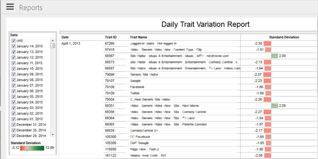

# 일별 트레이트 변형 보고서 {#daily-trait-variation-report}

이 보고서는 선택한 날짜로부터 30일 전에 최소 10,000번 실현되고, 같은 시간 간격 동안 두 방향에서 1.7 이상의 표준 편차를 갖는 트레이트 목록을 반환합니다. 이 보고서는 트레이트의 고유 사용자 노출 수가 시간에 따라 어떻게 변동하는지를 평가하는 데 도움이 됩니다.

>[!NOTE]
>
>Audience Manager의 일별 트레이트 변형 보고서는 RBAC 원칙을 준수합니다. 를 기반으로 액세스 권한이 있는 데이터 소스의 트레이트만 볼 수 있습니다. [RBAC 사용자 그룹](/help/using/features/administration/administration-overview.md) 귀하가 속한 회사입니다.

표준 편차는 평균(또는 평균/기대값)으로부터의 변동량 또는 분산량을 측정한다. 낮은 표준 편차는 데이터 포인트가 평균에 매우 가까운 경향이 있음을 나타냅니다. 높은 표준 편차는 데이터 포인트가 큰 범위의 값에 걸쳐 분산되었음을 나타냅니다.

사용 [!UICONTROL Date] 목록에 추가하여 보고서에 사용할 날짜를 한 개 이상 선택하십시오. 목록 맨 아래에 색상으로 구분된 막대 차트가 표시되어 선택한 모든 날짜의 모든 트레이트에 대한 표준 편차 범위를 시각적으로 나타냅니다. 검정색 세로선은 평균을 나타냅니다.

가운데 열에는 다음으로 식별되는 트레이트 목록이 포함되어 있습니다. [!UICONTROL Trait ID] 및 [!UICONTROL Trait Name]. 다음 옵션 중 하나를 선택할 수 있는 팝업 대화 상자에 액세스하려면 트레이트를 클릭합니다.

* **선택한 항목만 유지:** 보고서에서 다른 모든 트레이트를 제거하고 이 트레이트에 대한 데이터만 표시합니다.
* **제외:** 보고서에서 이 트레이트를 제거하고 다른 모든 트레이트에 대한 데이터를 표시합니다. 여러 트레이트를 제외할 수 있습니다.
* **데이터 보기:** 해당 행에 대한 데이터를 표시할 수 있습니다. 모든 행을 텍스트 파일로 다운로드할 수도 있습니다.

다음 [!UICONTROL Standard Deviation] 열에는 선택한 간격 동안의 각 트레이트에 대한 표준 편차를 표시하는 색상으로 구분된 막대 차트가 표시됩니다. 빨간색 막대는 표준 편차가 음수인 트레이트를 나타냅니다(데이터 포인트는 평균 미만인 경향이 있음). 녹색 막대는 양의 표준 편차를 갖는 트레이트를 나타냅니다(데이터 포인트는 평균 이상인 경향이 있음). 해당 트레이트를 유지 또는 제외하고 추가 정보를 보기 위한 추가 정보 및 옵션이 있는 팝업 대화 상자를 표시하려면 마우스를 막대 위에 놓습니다.

아이콘은 보고서 하단에 표시되어 데이터를 다양한 형식으로 내보내고, 보고서에 적용한 변경 사항을 모두 되돌립니다(예: 트레이트 제외). 자동 업데이트를 활성화 또는 비활성화하고, 보고서 데이터를 새로 고칠 수 있습니다. 다음을 참조하십시오 [보고서 아이콘 및 도구 설명](../../reporting/dynamic-reports/interactive-report-technology.md#icons-tools-explained).

## 사용 사례 {#use-cases}

**예 #1**: 이 보고서는 계절성 수준이 높은 특성이 있는 상황에서 매우 유용할 수 있습니다. 예를 들어 온라인 스토어에서 다양한 유형과 가격의 시즌 프로모션을 테스트한다고 가정해 보겠습니다. 에 정의된 트레이트는 다음과 같습니다 [!DNL Audience Manager]:

* `productPage == "December Promotion"`
* `price > "500"`

다음을 실행한다고 가정합니다. [!UICONTROL Daily Trait Variation] 12월 20일에 보고하면 지난 30일 동안 위에 언급된 트레이트에 대해 강한 양의 편차가 있음을 알 수 있습니다. 이는 방문자가 시즌 프로모션에서 언급된 제품을 찾고 있음을 시사합니다. 이러한 트렌드를 활용하기 위해 해당 특정 제품 카테고리에 대한 크리에이티브를 관심이 있는 방문자에게 타기팅하는 데 더 많은 노력을 투자할 수 있습니다.

**예 #2**: 이 보고서를 통해 태그 지정 문제 또는 트레이트 잘못 구성과 관련된 타겟팅 예외 항목을 식별할 수 있습니다. 온라인 스토어의 범주에 따라 다음 트레이트를 정의했다고 가정해 보십시오.

* `productPage == "smartphones"`

스토어의 재구성으로 인해 스마트 폰 페이지를 브랜드 이름을 기반으로 여러 페이지로 분할하게 됩니다. 하지만,에 정의된 트레이트를 업데이트하는 것을 잊었습니다 [!DNL Audience Manager].

한 달 후, [!UICONTROL Daily Trait Variation] 에 대해 큰 음의 편차를 보고하고 확인합니다. `productPage == "smartphones"` 사이트 분석에 따르면 방문자 수가 증가하긴 했지만 트레이트입니다. 이 정보를 기반으로에서 트레이트를 업데이트하지 않았다는 것을 알 수 있습니다 [!DNL Audience Manager] 새 제품 페이지를 만들 때 다음과 같은 트레이트를 만들어야 합니다.

* productPage == &quot;samsung&quot;
* productPage == &quot;apple&quot;
* productPage == &quot;huawei&quot;

이렇게 하면 대상자가 새로 만든 트레이트에 대해 자격이 있는 것을 볼 수 있습니다.
