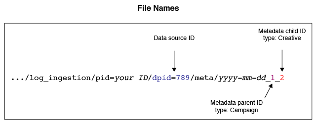

# Overview and Mappings for Metadata Files{#overview-and-mappings-for-metadata-files}

메타데이터 파일은 읽고 이해할 수 있는 이름과 숫자 ID를 연결합니다. 대상 최적화 보고서는 다양한 보고서 옵션 메뉴에서 읽을 수 있는 이름을 표시합니다.

## 개요 {#overview}

메타데이터에 대한 검토와 사용 방법을 살펴봅니다. 메타데이터 파일은 데이터 파일과 함께 있어야 합니다. 메타데이터 파일 컨텐츠는 보고서 메뉴에서 사용자가 읽을 수 있는 관련 레이블을 데이터 파일 정보와 일치시킵니다. For more information, see [Data Files for Audience Optimization Reports](../../../reporting/audience-optimization-reports/metadata-files-intro/datafiles-intro.md).

### 메타데이터 파일에는 다른 데이터에 대한 데이터가 포함됩니다.

메타데이터 파일에는 다른 데이터 유형에 대한 정보가 들어 있습니다. To help you understand how this works, let’s review how [!DNL Audience Manager] receives data.

During an impression or click event, [!DNL Audience Manager] receives data in an URL string known as an *event call*.

이벤트 호출은 정보를 정의된 키-값 쌍 세트로 구성합니다. 키-값 쌍의 값에는 숫자 데이터가 포함됩니다. 메타데이터 파일에는 각 키-값 쌍의 ID에 해당하는 이름 및 기타 읽기 가능한 정보가 포함되어 있습니다.

### 메타데이터 링크 ID를 읽을 수 있는 이름으로 연결

메타데이터 파일은 숫자 ID를 읽을 수 있는 이름에 연결하는 데 필요합니다. As an example, say an event call contains a creative ID in a key-value pair like this: `d_creative:1234`. 메타데이터 파일이 없으면 이 크리에이티브는 옵션 메뉴에 1234로 표시됩니다.

그러나 형식이 적절하게 지정된 메타데이터 파일은 이 크리에이티브를 "광고주 Creative A" 와 같은 실제 이름으로 다시 연결할 수 있습니다. 이 이름은 보고서에서 읽고 인식할 수 있습니다.

### 메타데이터 파일이 필요한 시기

First, a metadata file, and all of the parameters listed below, are required in an event call when you want to use the [Audience Optimization Reports](../../../reporting/audience-optimization-reports/audience-optimization-reports.md).

Second, you need a metadata file if you’re sending your own data to [!DNL Audience Manager] or if you want to see data in the reports from other providers we’re not integrated with. For example, [!DNL Audience Manager] has an integration with Google’s [Double-click Campaign Manager](../../../reporting/audience-optimization-reports/aor-advertisers/import-dcm.md) (DCM). Because of this relationship, [!DNL Audience Manager] can associate IDs with names and descriptions used by the report options. 통합이 없으면 데이터를 인제스트할 수 있지만 보고서 옵션에 설명적인 이름 대신 숫자 ID가 표시됩니다.

## File Mappings {#file-mappings}

The following table lists the key-value pairs that hold data used by the [!UICONTROL Audience Optimization] reports. 메타데이터 파일을 사용해야 하는 경우, 이 키-값 쌍의 값에 해당하는 사람이 읽을 수 있는 정보가 들어 있습니다. 이러한 키에 대한 값은 정수만 허용합니다 (데이터 유형 int). *기울임꼴은* 변수 자리 표시자를 나타냅니다. 다른 요소는 상수 또는 키이며 변경되지 않습니다.

>[!IMPORTANT]
>
>[!UICONTROL Audience Optimization] 보고서를 사용하는 경우 *이* 모든 값은 이벤트 호출에 필요합니다.

<table id="table_B2C8C493080E449CA71C4EF07D9476BD"> 
 <thead> 
  <tr> 
   <th colname="col1" class="entry"> 보고서 옵션 </th> 
   <th colname="col2" class="entry"> 메타데이터 키-값 쌍 </th> 
  </tr> 
 </thead>
 <tbody> 
  <tr> 
   <td colname="col1"> 
광고주 
 </td> 
   <td colname="col2"> 
 <code>d_ adsrc = <i>데이터 소스 ID 또는 통합 코드</i></code> 
 
데이터 소스를 만들 때 제공되는 광고주의 데이터 소스 ID 또는 통합 코드입니다. See <a href="../../../features/manage-datasources.md#create-data-source"> Create a Data Source</a>. 
 </td> 
  </tr> 
  <tr> 
   <td colname="col1"> 
사업부 (BU) 
 </td> 
   <td colname="col2"> 
 <code>d_ bu = <i>Business Unit ID</i></code> 
 </td> 
  </tr> 
  <tr> 
   <td colname="col1"> 
캠페인 
 </td> 
   <td colname="col2"> 
 <code>d_ campaign = <i>캠페인 ID</i></code> 
 </td> 
  </tr> 
  <tr> 
   <td colname="col1"> 
크리에이티브 
 </td> 
   <td colname="col2"> 
 <code>d_ creative = <i>Creative ID</i></code> 
 </td> 
  </tr> 
  <tr> 
   <td colname="col1"> 
Exchange 
 </td> 
   <td colname="col2"> 
2 개의 서로 다른 키-값 쌍을 수락합니다. 
 
    <ul id="ul_3B3B751A8A134096B0912E81A0983B9D"> 
     <li id="li_57BAC45A7B274AB695945E174A4D8A35"> <code>d_ exchange = <i>광고를 제공하는 Exchange의 ID</i></code> </li> 
     <li id="li_CCDF00DE59D3451C8EF590DD3E1A806D"> <code>d_ site <i>=</i></code> </li> 
    </ul> </td> 
  </tr> 
  <tr> 
   <td colname="col1"> 
삽입 순서 (IO) 
 </td> 
   <td colname="col2"> 
 <code>d_ io = <i>삽입 순서 ID</i></code> 
 </td> 
  </tr> 
  <tr> 
   <td colname="col1"> 
플랫폼 
 </td> 
   <td colname="col2"> 
 <code>d_ src = <i>데이터 소스 ID</i></code> 
 
This is the <a href="../../../features/datasources-list-and-settings.md#data-sources-list-and-settings"> data source</a> ID for the platform providing metadata information (e.g., DFA, Atlas, GBM, MediaMath, etc.). 
 </td> 
  </tr> 
  <tr> 
   <td colname="col1"> 
전술 
 </td> 
   <td colname="col2"> 
 <code>d_ tactic = <i>tactic ID</i></code> 
 </td> 
  </tr> 
  <tr> 
   <td colname="col1"> 
수직 
 </td> 
   <td colname="col2"> 
 <code>d_ vert = <i>세로 ID</i></code> 
 </td> 
  </tr> 
 </tbody> 
</table>

## How Event Call IDs Shape File Names, Contents, and Delivery Paths {#how-ids-shape-file-names}

이러한 키-값 쌍으로 전달된 ID는 메타데이터 파일 이름 및 해당 컨텐츠를 만드는 데 도움이 됩니다. 다음 섹션과 그림은 작동 방식을 보여줍니다. 이러한 예에서는 캠페인에서 크리에이티브 이름이 포함된 파일을 작성하지만 다른 조합은 가능합니다.

### 이벤트 호출

In this example we'll create a metadata file that brings creative names in to an [!UICONTROL Audience Optimization] report. 이렇게 하려면 이벤트 호출에서 크리에이티브, 캠페인 및 데이터 소스 ID를 추출해야 합니다.

### 파일 이름

파일 이름은 크리에이티브, 캠페인 및 데이터 소스 ID를 기반으로 합니다. 이 경우 이벤트 호출의 키-값 데이터와 파일 이름에서 사용되는 방법 간의 차이점을 비교하십시오.

파일 이름:

* The data source key changes to `dpid` from `d_src`.

* 크리에이티브 ID와 캠페인 ID는 실제 식별자가 아닌 카테고리를 나타냅니다.

See [Naming Conventions for Metadata Files](../../../reporting/audience-optimization-reports/metadata-files-intro/metadata-file-names.md).

### 파일 컨텐츠

이 예에서 파일 콘텐트는 이벤트 호출에서 전달된 Creative 및 Campaign ID를 반영합니다. 여기에서 새 요소는 읽을 수 있는 이름입니다. Once processed, the name in this file will appear as an option in the Creative menu of an [!UICONTROL Audience Optimization] report.

See [Content Format for Metadata Files](../../../reporting/audience-optimization-reports/metadata-files-intro/metadata-file-contents.md).

### 파일 배달

After you name and add data to a file, you send it to an Amazon S3 storage directory provided by [!DNL Audience Manager]. See [Delivery Methods for Metadata Files](../../../reporting/audience-optimization-reports/metadata-files-intro/metadata-delivery-methods.md) and [Status Updates for Metadata Files](../../../reporting/audience-optimization-reports/metadata-files-intro/metadata-update-status.md).

>[!MORE_ like_ this]
>
>* [대상 최적화 보고서용 데이터 파일](../../../reporting/audience-optimization-reports/metadata-files-intro/datafiles-intro.md)
>* [픽셀 호출을 통해 캠페인 클릭 데이터 캡처](../../../integration/media-data-integration/click-data-pixels.md)
>* [픽셀 호출을 통해 캠페인 노출 횟수 데이터 캡처](../../../integration/media-data-integration/impression-data-pixels.md)

