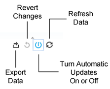

# Report Technology{#report-technology}

대화형 보고서와 데이터 업데이트 일정을 강화하는 기본 소프트웨어에 대해 설명합니다.

<!-- 

c_report_technology.xml

 -->

## 대화형 보고서는 타블로 기술을 사용합니다.

[!DNL Audience Manager][타블로](https://www.tableausoftware.com/) 소프트웨어를 사용하여 대화형 보고서에 데이터를 표시합니다. With [!DNL Tableau], the [!UICONTROL Delivery and Overlap] reports use visual cues and symbols that help you:

* 높은 성능과 낮은 성능의 특성을 찾을 수 있습니다.
* 낮은 고유 방문자 겹쳐 있는 트레이트 및 세그먼트 집중
* 중복 데이터를 사용하여 타깃팅된 세그먼트를 만듭니다.
* 겹쳐 있는 관련 트레이트를 식별하여 도달 범위를 확대할 수 있습니다.

## 데이터 업데이트 일정

보고서 데이터는 매주 매주 매주 매주 업데이트됩니다. 이 업데이트는 이전 일요일까지 토요일 (전날) 의 데이터를 처리합니다.

## Shapes, Colors, and Sizes Used in Interactive Reports {#shapes-colors-sizes}

대부분의 대화형 보고서는 서로 다른 크기 및 색상의 모양을 사용하여 결과를 표시합니다. 이 디스플레이 포맷은 행 및 열의 열을 가리지 않고도 시각적으로 데이터를 이해할 수 있도록 고안되었습니다.

<!-- 

r_legend.xml

 -->

### 보고서 범례

다음 표에서는 동적 보고서에서 사용되는 모양, 크기 및 색상을 정의합니다.

<table id="table_EC180A96E3784FC6B81FCFB546C4A3FA"> 
 <thead> 
  <tr> 
   <th colname="col1" class="entry"> 데이터 요소 </th> 
   <th colname="col2" class="entry"> 설명 </th> 
  </tr> 
 </thead>
 <tbody> 
  <tr> 
   <td colname="col1"> <b>shapes</b> </td> 
   <td colname="col2"> 
    <ul id="ul_076773ABD0BB4CE6834ACFA8B3D6AC2E"> 
     <li id="li_BBAB37A6EC1549B48C0E4D3BFAF7062C">서클은 사용자의 고유 트레이트를 나타냅니다. </li> 
     <li id="li_371331AE984A4A999CE0596EA13987E0">사각형은 타사 트레이트를 나타냅니다. </li> 
    </ul> </td> 
  </tr> 
  <tr> 
   <td colname="col1"> <b>색상</b> </td> 
   <td colname="col2"> 
    <ul id="ul_F5D243297F0C4E5A8EDCBD28A548869E"> 
     <li id="li_332EB873A35440E6BB6093E36A0FAC3D">Red shades indicate <i>low</i> overlap. </li> 
     <li id="li_29DFDB1218DF4069B5DCFF841D48EF56"><i>녹색</i> 음영은 겹쳐 있음을 나타냅니다. </li> 
    </ul> </td> 
  </tr> 
  <tr> 
   <td colname="col1"> <b>크기</b> </td> 
   <td colname="col2"> 크기가 도달 범위를 직접 비례하도록 늘리거나 줄어듭니다 (트레이트 또는 세그먼트의 클릭 수 또는 고유 사용자 수). </td> 
  </tr> 
 </tbody> 
</table>

## Report Icons and Tools Explained {#icons-tools-explained}

동적 보고서에 사용된 다양한 아이콘을 검색하고 사용하는 방법에 대해 설명합니다.

<!-- 

r_icons.xml

 -->

### 데이터 아이콘 및 도구

다음 아이콘은 각 동적 보고서 창 하단에 있습니다. 다음 그림은 이러한 도구에 대한 자세한 정보를 제공합니다.

### 데이터 내보내기

이 도구를 사용하면 보고서의 데이터를 4 개의 다른 형식으로 내보낼 수 있습니다.

| 내보내기 옵션 | 데이터 내보내기 |
|---|---|
| **[!UICONTROL Image]** | 이미지 (. png) 파일로 사용할 수 있습니다. 보고서 데이터를 원래 그래픽 형식으로 다운로드하고 공유할 때 유용합니다. |
| **[!UICONTROL PDF]** | PDF 파일로 변환 |
| **[!UICONTROL Data]** | 를 열 및 행에 숫자 데이터로 새 브라우저 창에서 추가했습니다. |
| **[!UICONTROL Crosstab]** | 로 설정합니다. |

### 변경 내용 되돌리기

보고서에서 수행한 대화형 클릭 변경을 실행 취소하려면 이 도구를 선택합니다.

### 자동 업데이트

[!UICONTROL Delivery-Performance] AND [!UICONTROL Trait-to-Trait Overlap] 보고서는 사용자 클릭 동작을 기반으로 응답하고 변경하는 동적 보고서입니다.

For example, say you want to select several advertisers in the [!UICONTROL Overlap] report. 활성화되면 확인란을 선택하는 즉시 자동 업데이트가 데이터를 반환하기 시작합니다. 다른 광고주를 선택하기 전에 보고서가 처리를 마칠 때까지 기다려야 하므로 이 동적 행동은 워크플로우를 방해할 수 있습니다. 이 도구를 사용하여 필요에 따라 해당 기능을 다시 활성화합니다.

### 데이터 새로 고침

새로 고침 아이콘을 클릭하여 보고서를 실행하거나 데이터 세트를 다시 로드하십시오. 자동 업데이트가 꺼지면 새로 고침을 클릭하여 보고서를 실행하거나 업데이트합니다.

### 검색 도구

검색은 일반 확대경 아이콘 (표시되지 않음) 로 표시됩니다. 검색 필드는 화면 왼쪽의 선택 레이블을 클릭할 때까지 숨겨집니다. 아래 표는 각 보고서에 대한 검색 도구의 위치를 설명합니다.

| 보고서 | 검색을 찾으려면 마우스를 |
|---|---|
| [!UICONTROL Delivery and Performance] 보고서에 표시됩니다 | &quot; 광고주 이름 &quot;레이블. |
| [!UICONTROL Overlap] 보고서 | &quot; SID 이름 &quot;레이블입니다. |
