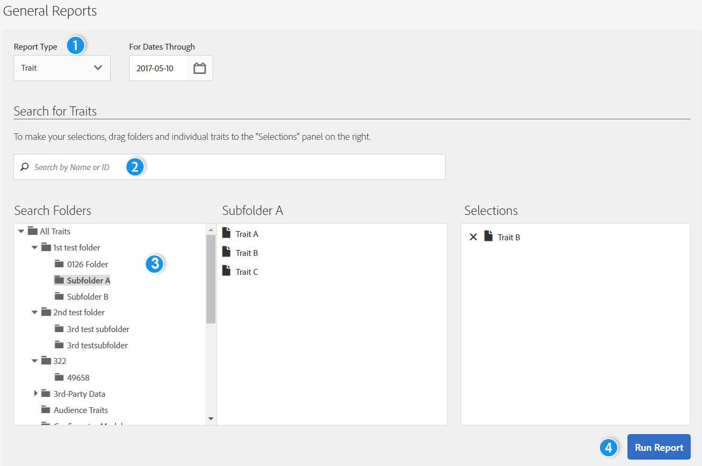
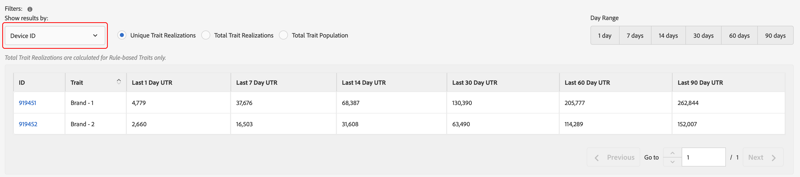
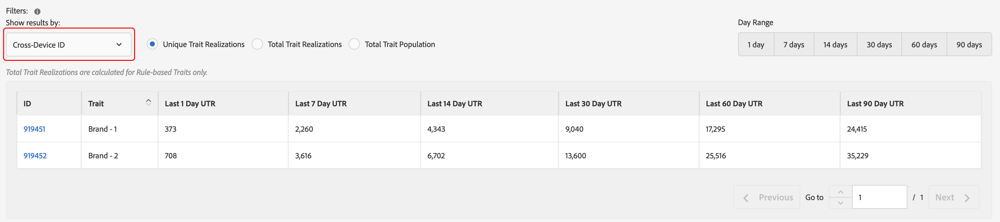
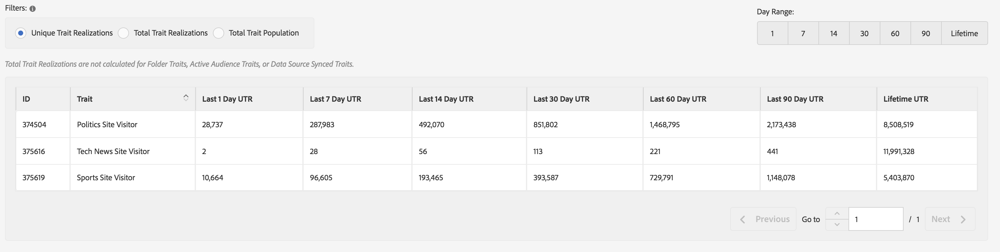
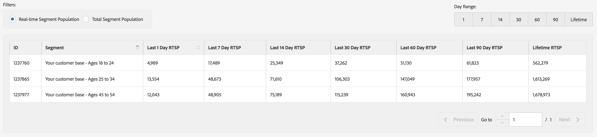
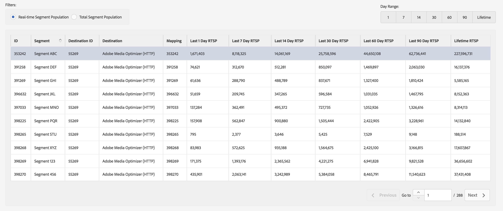

# 일반 보고서{#general-reports}

A [!UICONTROL General] report returns performance data on traits, segments, and destinations.

## 개요 {#general-reports-overview}

<!-- 

c_general_reports.xml

-->

[!DNL Audience Manager]은(는) [!UICONTROL Role Based Access Control]&#x200B;([!UICONTROL RBAC])을(를) 사용하여 사용자 그룹 권한을 [!UICONTROL General] 보고서로 확장합니다. 사용자는 볼 수 있는 권한이 있는 보고에서 이러한 트레이트와 세그먼트만 볼 수 있습니다. [!UICONTROL RBAC] 기능을 사용하면 내부 팀에서 볼 수 있는 보고 데이터를 제어할 수 있습니다. 예를 들어 다른 광고주 계정을 관리하는 기관은 광고주 A의 계정을 관리하는 팀이 광고주 B의 보고 데이터를 볼 수 없도록 사용자 그룹 권한을 구성할 수 있습니다.

필요한 경우 [!UICONTROL General] 보고서 실행:

* 트레이트, 세그먼트 또는 대상별로 성능을 검토합니다.
* 1, 7, 14, 30, 60 및 90일 간격으로 노출 횟수(합계 및 고유)를 추적합니다.
* Review total and unique load counts.
* Compare trait and segment performance.
* Identify strong or poor performance traits and segments, analyze demand, or compare load/fire data with third-party reports.
* Export data (.csv format) for further analysis and sharing.

The following illustration provides a high-level overview of key elements in the [!UICONTROL General] report.

1. 다음 옵션을 구성합니다.

   * **Report Type:** Select the desired report type (Trait, Segment, or Destination).

   * **For Dates Through:** Specify the date range for the report.

2. 이름 또는 ID로 트레이트, 세그먼트 또는 대상을 검색합니다.
3. 폴더 목록에서 보고할 트레이트, 세그먼트 또는 대상을 오른쪽의 [!UICONTROL Selections] 패널로 끌어서 놓습니다.
4. Generate the report to display in an exportable table.

## 일반 보고서 실행 {#run-general-report}

이 섹션에서는 [!UICONTROL General] 보고서를 실행하고 시간 및 기타 성능 옵션을 설정하는 방법에 대해 설명합니다.

<!-- 

t_run_general_report.xml

-->

1. **[!UICONTROL Analytics]** 대시보드에서 **[!UICONTROL General Reports]**&#x200B;을(를) 클릭합니다.
1. From the **[!UICONTROL Report Type]** drop-down list, select the desired type: Trait, Segment, or Destination.
1. *Conditional* Click the date box to display a calendar, then select the ending date for your report if you want to specify a date other than today.
1. 이름 또는 ID로 트레이트, 세그먼트 또는 대상을 검색합니다.
1. 폴더 목록에서 보고할 트레이트, 세그먼트 또는 대상을 오른쪽의 [!UICONTROL Selections] 패널로 끌어서 놓습니다.
1. **[!UICONTROL Run Report]** 아이콘을 클릭합니다.

   내보내기가 가능한 테이블에 결과가 표시됩니다. 열 헤더를 클릭하여 결과를 오름차순 또는 내림차순으로 정렬합니다.
1. 성능([!UICONTROL Unique Trait Realizations], [!UICONTROL Total Trait Realizations] 또는 [!UICONTROL Total Trait Population]) 또는 시간(1, 7, 14, 30, 60 또는 90일 범위)별로 데이터를 필터링하려면 보고서 맨 위에서 원하는 옵션 단추를 선택하십시오.

   >[!NOTE]
   >
   >[!UICONTROL Total Trait Realizations] are calculated for [!UICONTROL Rule-based Traits] only.

1. *Optional* Click **[!UICONTROL Export to CSV]**. This exports the [!UICONTROL Unique Trait Realizations], [!UICONTROL Total Trait Realizations], and [!UICONTROL Total Trait Population] for all day ranges.

## General Reports Results Explained {#general-reports-explained}

The numbers in the [!UICONTROL General Reports] are generated directly from our [!UICONTROL User Profile Store]. The results reflect the number of users that [!DNL Audience Manager] contained in the backend at the time these reporting numbers were generated.

* These numbers do not include visitor IDs with excessive traffic. Traffic from bots is filtered prior to reaching our backend system. Also, some bot traffic is discarded during a weekly cleanup job run in the backend.
* If you onboard data via inbound processing keyed off the [!DNL Audience Manager] UUID, and these IDs include users that are no longer active in our system, these inactive [!DNL Audience Manager] UUIDs never reach the [!UICONTROL User Profile Store] and are not reported.
* [!UICONTROL Total Trait Realizations] are calculated for [!UICONTROL Rule-based Traits] only.

## General Reports Results for Traits {#general-report-results-traits}

The filters below are available when you run a General report and select **[!UICONTROL Trait]** as the report type.

결과를 [!UICONTROL Device ID]&#x200B;(으)로 필터링하는 경우:

* [!UICONTROL Unique Trait Realizations] is the number of your anonymous device visitors that have added the trait to their profile within the selected time range.
* [!UICONTROL Total Trait Realization] is the total number of anonymous trait realizations within the selected time range.
* [!UICONTROL Total Trait Population] is the number of your anonymous device visitors that have this trait on their profile.

결과를 [!UICONTROL Cross-Device ID]&#x200B;(으)로 필터링하는 경우:

* [!UICONTROL Unique Trait Realizations] is the number of your authenticated visitors that have added the trait to their profile, within the selected time range.
* [!UICONTROL Total Trait Realization] is the total number of authenticated trait realizations within the selected time range.
* [!UICONTROL Total Trait Population] is the number of your authenticated visitors that have this trait on their profile.

<!-- 
### Unique Trait Realizations

This metric represents the unique number of [Audience Manager Unique User IDs (UUID)](../reference/ids-in-aam.md) that qualified for the trait in your selected time range. For example, if a user visited your homepage three times on 10/1, you would see one Unique Trait Realization.

### Total Trait Realizations

This metric represents the total amount of trait fires for the trait in your selected time range. For example, if a user visited your homepage, then navigated to your tech news and your sports news sections, they would appear in the General Report as three total trait realizations, and one unique trait realization.

### Total Trait Population

This metric represents the total amount of Audience Manager UUIDs that are currently qualified for the trait. Use this number to understand the total amount of users you could use for segmentation and targeting. Typically, users remain part of a trait for [120 days](../features/traits/create-onboarded-rule-based-traits.md#set-expiration-interval). For example, a user visiting your homepage three times today and never returning afterwards, would remain as a user in this population every day until 120 days from now. At the 120 day mark, they would be removed from the population. Read our [Trait and Segment Qualification Reference](../features/traits/trait-and-segment-qualification-reference.md) for more examples on the difference between Unique Trait Realizations and Total Trait Population.

The illustration below shows the results of running a general report for the Trait report type. 

-->

## General Reports Results for Segments {#general-report-results-segments}

The metrics below are available when you run a General report and select **[!UICONTROL Segment]** as the report type:

### Real-time Segment Population

This metric represents the actual number of unique visitors seen in real-time for the specified time range and who were qualified for the segment at the moment they were seen by Audience Manager.

### Total Segment Population

This metric represents the total number of Audience Manager UUIDs that are qualified for the segment within the look-back period you selected. Your 1 day Total Segment Population represents your most accurate user base for targeting.

>[!NOTE]
>
>활성화된 대상에 대한 세그먼트 모집단 분류를 보려면 **[!UICONTROL Include Destination Mappings]**&#x200B;을(를) 선택하십시오.

아래 그림은 세그먼트 보고서 유형에 대한 일반 보고서를 실행한 결과를 보여 줍니다.

## 대상에 대한 일반 보고서 결과 {#general-report-results-destinations}

The metrics below are available when you run a General report and select **[!UICONTROL Destination]** as the report type:

**Real-time Segment Population**

This metric represents the actual number of unique visitors seen in real-time for the specified time range and who were qualified for the segment at the moment they were seen by Audience Manager.

**총 세그먼트 채우기**

이 지표는 전환 확인 기간 내의 세그먼트에 속한, 대상으로 전송된 총 Audience Manager UUID 수를 나타냅니다.

아래 그림은 대상 보고서 유형에 대한 일반 보고서를 실행한 결과를 보여 줍니다.

