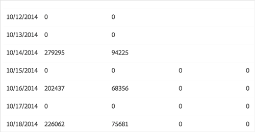

# Trend Reports{#trend-reports}

트렌드 보고서는 트레이트 및 세그먼트에 대한 트렌드 데이터를 반환합니다.

## 개요 {#trend-report-overview}

<!-- 

c_trend_reports.xml

 -->

[!DNL Audience Manager][!UICONTROL Role Based Access Control] ([!UICONTROL RBAC]) 를 사용하여 사용자 그룹 권한을 [!UICONTROL Trend] 보고서로 확장합니다. 사용자는 볼 권한이 있다는 보고에 해당 트레이트 및 세그먼트만 볼 수 있습니다. [!UICONTROL RBAC] 기능을 사용하면 내부 팀이 볼 수 있는 보고 데이터를 제어할 수 있습니다.

예를 들어, 다른 광고주 계정을 관리하는 에이전시는 광고주 A의 계정을 관리하는 팀이 광고주 B의 보고 데이터를 볼 수 없도록 사용자 그룹 권한을 구성할 수 있습니다.

Run a [!UICONTROL Trend] report when you need to:

* 트렌드 및 세그먼트별로 트렌드 데이터를 검토합니다.
* 트렌드를 1, 7, 14, 30, 60 및 90 일 간격으로 추적합니다.
* 시간 경과에 따른 특성 및 세그먼트 트렌드를 비교할 수 있습니다.
* 강력하거나 낮은 성능 트레이트와 세그먼트를 식별합니다.
* 추가 분석 및 공유를 위해 데이터 (. csv 형식) 를 내보낼 수 있습니다.

The following illustration provides a high-level overview of key elements in the [!UICONTROL Trend] report.

1. 다음 옵션을 구성합니다.

   **보고서 유형:** 원하는 보고서 유형 (트레이트 또는 세그먼트) 를 선택합니다.

   **날짜 범위:** 보고서의 날짜 범위를 지정합니다 (시작 날짜 및 종료 날짜).

   **표시 간격:** 표시 간격 (1, 7, 14, 30, 60 및 90 일 간격) 를 지정합니다.

2. 이름이나 ID 별로 트레이트 또는 세그먼트를 검색합니다.
3. From the folder list, drag and drop the traits or segments you want to report to the [!UICONTROL Selections] panel on the right side.
4. 데이터를 그래픽 형식으로 표시하거나 보고서를 CSV 형식으로 내보내도록 보고서를 생성합니다.

## Run a Trend Report {#run-trend-report}

This procedure describes how to run a [!UICONTROL Trend] report.

<!-- 

t_working_with_trend_reports.xml

 -->

1. **[!UICONTROL Analytics]** 대시보드에서 **[!UICONTROL Trend Reports]** 를 클릭합니다.
1. From the **[!UICONTROL Report Type]** drop-down list, select the desired type: **[!UICONTROL Trait]** or **[!UICONTROL Segment]**.
1. 날짜 상자를 클릭하여 달력을 표시한 다음 보고서의 시작 및 종료 날짜를 선택합니다.
1. 표시 간격을 지정합니다. 1, 7, 14, 30, 60 또는 90 일 기준.
1. 이름이나 ID 별로 트레이트 또는 세그먼트를 검색합니다.
1. From the folder list, drag and drop the traits or segments you want to report to the [!UICONTROL Selections] panel on the right side.

   For best performance, run a [!UICONTROL Trend] report on fewer than 20 traits or segments at a time.
1. Click **[!UICONTROL Graph Traits]** or **[!UICONTROL Graph Segments]**, depending on which type of report you are viewing (Traits or Segments).

   이러한 옵션은 모든 폴더 및 그래프를 무시하고 개별 특성이나 세그먼트만 선택합니다.

   또는

   Click **[!UICONTROL Export to CSV]** to export the trait or segment data and all folders in CSV format for further analysis and sharing. This exports the [!UICONTROL Unique Trait Realizations], [!UICONTROL Total Trait Realizations], and [!UICONTROL Total Trait Population] for all day ranges.

   >[!NOTE]
   >
   >[!UICONTROL Total Trait Realizations] 에 대해서만 [!UICONTROL Rule-based Traits] 계산됩니다.

1. (선택 사항) 개별 특성이나 세그먼트에 마우스를 올려 놓아 방문 횟수와 각 데이터 포인트의 날짜를 표시합니다.

   표에서 열 헤더를 클릭하여 결과를 오름차순이나 내림차순으로 정렬할 수 있습니다.

For [!UICONTROL Trended Trait] reports, zeroes indicate that [!DNL Audience Manager] did not collect data for that day. 빈 항목은 트레이트가 존재하지 않음을 나타냅니다. 다음 예제는 두 유형의 항목 예입니다.

